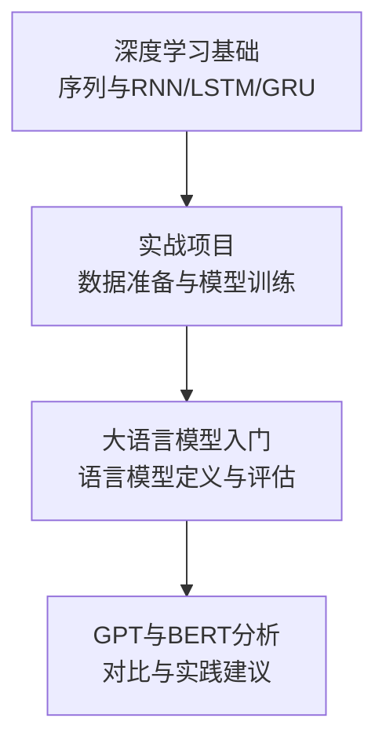
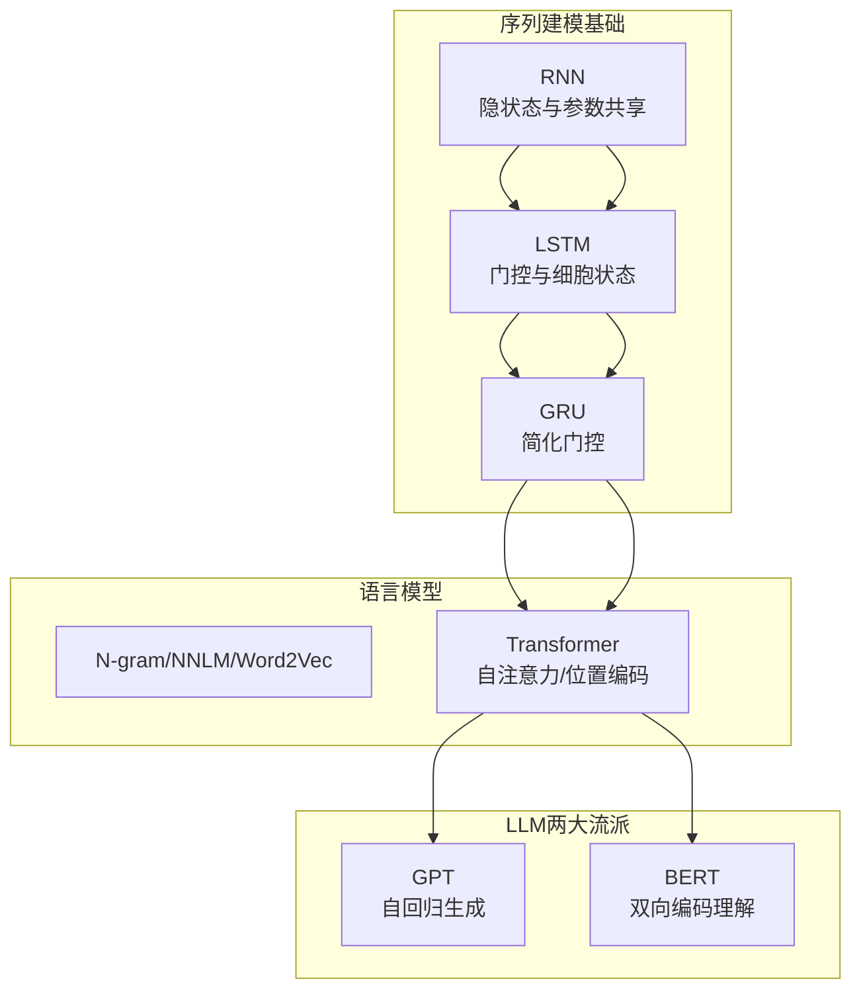
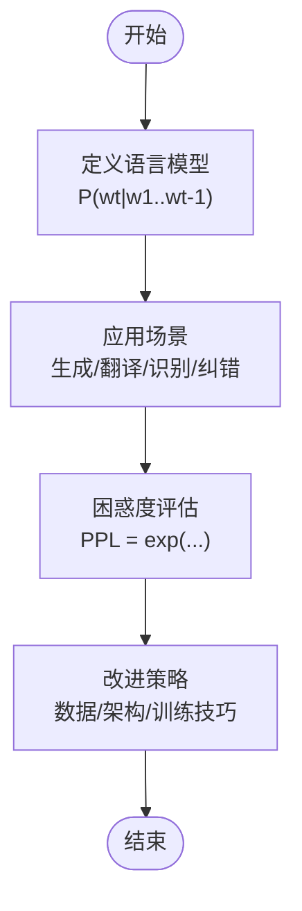
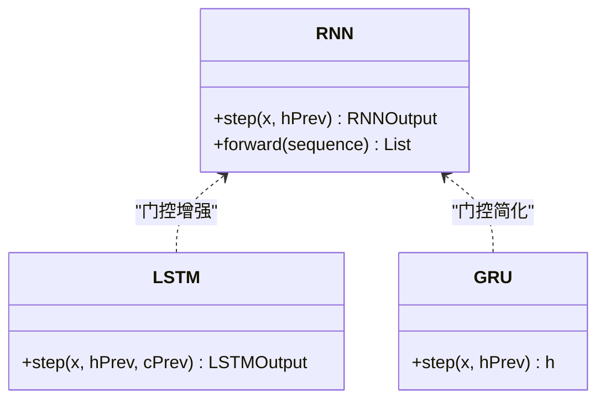
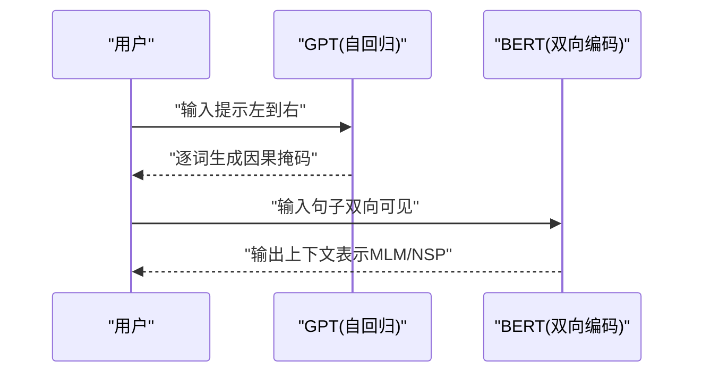
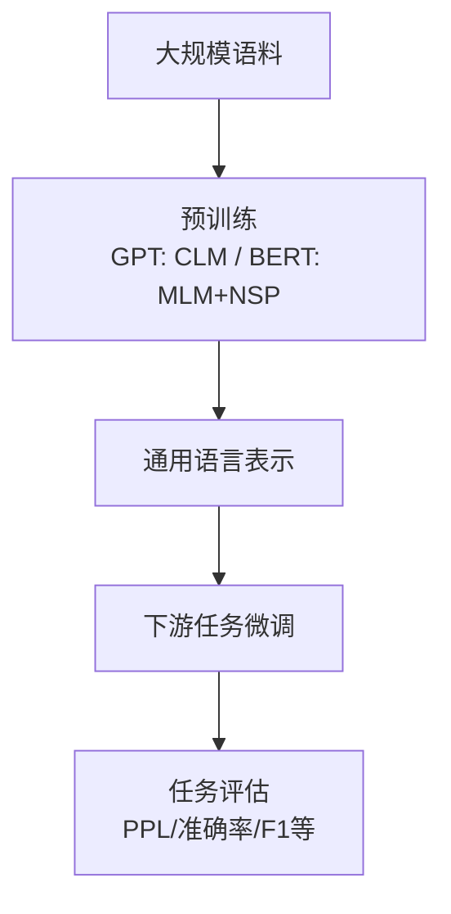
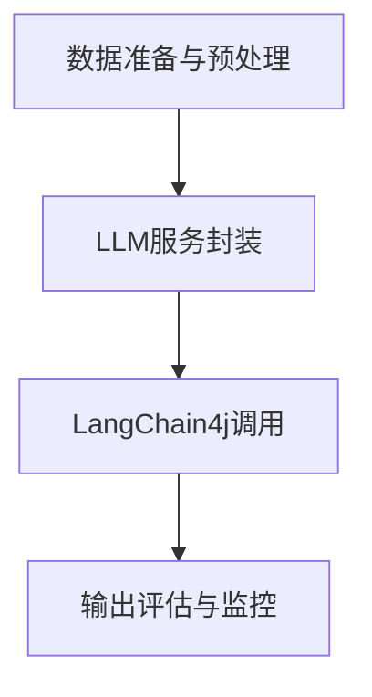
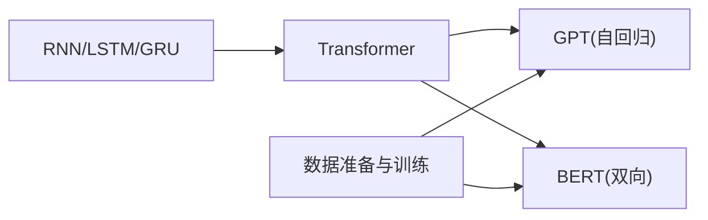

# GPT与BERT分析

<cite>
**本文引用的文件**
- [book/README.md](file://book/README.md)
- [book/part1-deep-learning/chapter-04/01-sequence-data-challenge.md](file://book/part1-deep-learning/chapter-04/01-sequence-data-challenge.md)
- [book/part1-deep-learning/chapter-04/02-rnn-memory-and-forgetting.md](file://book/part1-deep-learning/chapter-04/02-rnn-memory-and-forgetting.md)
- [book/part1-deep-learning/chapter-04/03-lstm-and-gru.md](file://book/part1-deep-learning/chapter-04/03-lstm-and-gru.md)
- [book/part1-deep-learning/chapter-05/01-project-overview.md](file://book/part1-deep-learning/chapter-05/01-project-overview.md)
- [book/part1-deep-learning/chapter-05/02-data-preparation.md](file://book/part1-deep-learning/chapter-05/02-data-preparation.md)
- [book/part1-deep-learning/chapter-05/03-model-design-training.md](file://book/part1-deep-learning/chapter-05/03-model-design-training.md)
- [book/part2-llm/chapter-06/01-what-is-language-model.md](file://book/part2-llm/chapter-06/01-what-is-language-model.md)
</cite>

## 目录
1. [引言](#引言)
2. [项目结构](#项目结构)
3. [核心组件](#核心组件)
4. [架构总览](#架构总览)
5. [详细组件分析](#详细组件分析)
6. [依赖分析](#依赖分析)
7. [性能考虑](#性能考虑)
8. [故障排查指南](#故障排查指南)
9. [结论](#结论)
10. [附录](#附录)

## 引言
本章节围绕“GPT与BERT分析”的目标，系统梳理两类大语言模型（LLM）的设计理念、架构差异与适用场景，并结合仓库中已有的序列建模与语言模型基础内容，给出可操作的实践建议与决策参考。同时，针对Java生态与LangChain4j的集成实践，提供可落地的调用路径与注意事项。

## 项目结构
该仓库以“从深度学习基础到大语言模型再到智能体”的渐进式结构组织，其中与本主题直接相关的知识分布在以下位置：
- 第一部分：深度学习基础，涵盖序列数据与RNN/LSTM/GRU等序列建模基础，为理解LLM的上下文建模能力奠定基础
- 第五章：实战项目（手写数字识别），展示了数据准备、模型设计与训练的工程化流程，体现了从数据到模型再到部署的完整闭环
- 第二部分：大语言模型（LLM）入门，包含语言模型定义、发展历程与评估指标等，为GPT/BERT的对比分析提供理论支撑

**章节来源**
- [book/README.md:30-111](file://book/README.md#L30-L111)

## 核心组件
- 语言模型基础：定义、应用场景、发展历程与困惑度评估
- 序列建模基础：RNN、LSTM、GRU及其在上下文记忆与长期依赖方面的差异
- 实战项目：数据准备、模型设计与训练流程，体现工程化落地能力
- LLM评估与实践：困惑度、涌现能力与工程落地

**章节来源**
- [book/part2-llm/chapter-06/01-what-is-language-model.md:11-269](file://book/part2-llm/chapter-06/01-what-is-language-model.md#L11-L269)
- [book/part1-deep-learning/chapter-04/01-sequence-data-challenge.md:117-350](file://book/part1-deep-learning/chapter-04/01-sequence-data-challenge.md#L117-L350)
- [book/part1-deep-learning/chapter-04/02-rnn-memory-and-forgetting.md:22-375](file://book/part1-deep-learning/chapter-04/02-rnn-memory-and-forgetting.md#L22-L375)
- [book/part1-deep-learning/chapter-04/03-lstm-and-gru.md:40-365](file://book/part1-deep-learning/chapter-04/03-lstm-and-gru.md#L40-L365)
- [book/part1-deep-learning/chapter-05/01-project-overview.md:1-222](file://book/part1-deep-learning/chapter-05/01-project-overview.md#L1-L222)
- [book/part1-deep-learning/chapter-05/02-data-preparation.md:1-332](file://book/part1-deep-learning/chapter-05/02-data-preparation.md#L1-L332)
- [book/part1-deep-learning/chapter-05/03-model-design-training.md:1-393](file://book/part1-deep-learning/chapter-05/03-model-design-training.md#L1-L393)

## 架构总览
本节从“序列建模”到“语言模型”，再到“LLM”的演进视角，帮助理解GPT与BERT的共同基础与差异：

**图示来源**
- [book/part1-deep-learning/chapter-04/01-sequence-data-challenge.md:117-139](file://book/part1-deep-learning/chapter-04/01-sequence-data-challenge.md#L117-L139)
- [book/part1-deep-learning/chapter-04/02-rnn-memory-and-forgetting.md:46-79](file://book/part1-deep-learning/chapter-04/02-rnn-memory-and-forgetting.md#L46-L79)
- [book/part1-deep-learning/chapter-04/03-lstm-and-gru.md:81-133](file://book/part1-deep-learning/chapter-04/03-lstm-and-gru.md#L81-L133)
- [book/part2-llm/chapter-06/01-what-is-language-model.md:82-97](file://book/part2-llm/chapter-06/01-what-is-language-model.md#L82-L97)

## 详细组件分析

### 语言模型与困惑度
- 定义：语言模型通过条件概率建模词序列，衡量“下一个词”的可预测性
- 应用：文本生成、翻译、语音识别、拼写纠错、输入法预测
- 评估：困惑度（PPL）越低，模型越稳定；直观理解为“每次预测的候选数”
- 发展：从N-gram到NNLM/Word2Vec，再到Transformer，最终形成GPT/BERT两大流派

**图示来源**
- [book/part2-llm/chapter-06/01-what-is-language-model.md:11-269](file://book/part2-llm/chapter-06/01-what-is-language-model.md#L11-L269)

**章节来源**
- [book/part2-llm/chapter-06/01-what-is-language-model.md:11-269](file://book/part2-llm/chapter-06/01-what-is-language-model.md#L11-L269)

### 序列建模基础：RNN/LSTM/GRU
- RNN：通过隐状态“记忆”历史信息，参数共享，但存在梯度消失与长期依赖问题
- LSTM：引入遗忘门、输入门、输出门与细胞状态，形成“直通通道”，缓解长期依赖
- GRU：简化为重置门与更新门，计算更快，仍具备选择性记忆能力

**图示来源**
- [book/part1-deep-learning/chapter-04/01-sequence-data-challenge.md:140-232](file://book/part1-deep-learning/chapter-04/01-sequence-data-challenge.md#L140-L232)
- [book/part1-deep-learning/chapter-04/02-rnn-memory-and-forgetting.md:48-79](file://book/part1-deep-learning/chapter-04/02-rnn-memory-and-forgetting.md#L48-L79)
- [book/part1-deep-learning/chapter-04/03-lstm-and-gru.md:84-133](file://book/part1-deep-learning/chapter-04/03-lstm-and-gru.md#L84-L133)

**章节来源**
- [book/part1-deep-learning/chapter-04/01-sequence-data-challenge.md:117-232](file://book/part1-deep-learning/chapter-04/01-sequence-data-challenge.md#L117-L232)
- [book/part1-deep-learning/chapter-04/02-rnn-memory-and-forgetting.md:22-130](file://book/part1-deep-learning/chapter-04/02-rnn-memory-and-forgetting.md#L22-L130)
- [book/part1-deep-learning/chapter-04/03-lstm-and-gru.md:40-133](file://book/part1-deep-learning/chapter-04/03-lstm-and-gru.md#L40-L133)

### GPT与BERT：设计理念与架构差异
- GPT（生成式预训练）：基于自回归语言建模，利用因果掩码（仅使用左侧上下文）进行逐词预测，擅长生成类任务
- BERT（双向编码）：基于双向上下文编码，通过遮蔽语言建模（MLM）与NSP等预训练任务，强调对上下文的理解，擅长理解类任务
- 预训练任务设计：
  - GPT：因果语言建模（CLM），最大化P(wt|w≤t)，强调“从左到右”的生成
  - BERT：掩码语言建模（MLM）+下一句预测（NSP），强调“同时看到左右上下文”的理解
- 适用场景：
  - GPT：文本续写、创意写作、对话生成、代码生成
  - BERT：文本分类、命名实体识别（NER）、问答抽取、语义相似度

**图示来源**
- [book/part2-llm/chapter-06/01-what-is-language-model.md:82-97](file://book/part2-llm/chapter-06/01-what-is-language-model.md#L82-L97)

**章节来源**
- [book/part2-llm/chapter-06/01-what-is-language-model.md:82-97](file://book/part2-llm/chapter-06/01-what-is-language-model.md#L82-L97)

### 预训练与微调：迁移学习在NLP的应用
- 预训练：在大规模语料上学习通用语言表示（GPT的自回归、BERT的MLM）
- 微调：在特定下游任务（分类、抽取、生成）上进行少量数据训练
- 评估：困惑度（PPL）作为统一指标，也可结合任务特定指标（如准确率）

**图示来源**
- [book/part2-llm/chapter-06/01-what-is-language-model.md:111-147](file://book/part2-llm/chapter-06/01-what-is-language-model.md#L111-L147)

**章节来源**
- [book/part2-llm/chapter-06/01-what-is-language-model.md:111-147](file://book/part2-llm/chapter-06/01-what-is-language-model.md#L111-L147)

### 实战：用Java调用LLM（LangChain4j）
- 仓库技术栈明确包含LangChain4j，可用于在Java中调用LLM
- 实践建议：
  - 选择合适的模型：生成任务倾向GPT，理解任务倾向BERT或类似编码器
  - 配置提示（Prompt）与温度、采样策略，控制生成稳定性与多样性
  - 使用缓存与限流，避免API调用抖动
  - 结合RAG（检索增强生成）提升事实性与上下文召回
- 代码调用路径（以仓库现有结构为参考）：
  - 数据准备与预处理：参考“数据准备与预处理”章节，确保输入文本清洗与分词一致
  - 模型封装与调用：参考“模型设计与训练”章节的工程化封装思路，将LLM调用抽象为服务组件
  - 评估与监控：参考“模型评估与优化”章节的评估与早停策略，对LLM输出质量进行监控

**图示来源**
- [book/part1-deep-learning/chapter-05/02-data-preparation.md:95-332](file://book/part1-deep-learning/chapter-05/02-data-preparation.md#L95-L332)
- [book/part1-deep-learning/chapter-05/03-model-design-training.md:144-393](file://book/part1-deep-learning/chapter-05/03-model-design-training.md#L144-L393)

**章节来源**
- [book/part1-deep-learning/chapter-05/02-data-preparation.md:95-332](file://book/part1-deep-learning/chapter-05/02-data-preparation.md#L95-L332)
- [book/part1-deep-learning/chapter-05/03-model-design-training.md:144-393](file://book/part1-deep-learning/chapter-05/03-model-design-training.md#L144-L393)

## 依赖分析
- 从序列建模到语言模型：RNN/LSTM/GRU为Transformer的上下文记忆与长期依赖问题提供了先验解决方案
- 从语言模型到LLM：Transformer的自注意力与位置编码为GPT/BERT的双向/自回归建模提供了统一框架
- 工程落地：数据准备、模型训练与评估流程为LLM的微调与部署提供工程化支撑

**图示来源**
- [book/part1-deep-learning/chapter-04/01-sequence-data-challenge.md:117-139](file://book/part1-deep-learning/chapter-04/01-sequence-data-challenge.md#L117-L139)
- [book/part1-deep-learning/chapter-04/03-lstm-and-gru.md:81-133](file://book/part1-deep-learning/chapter-04/03-lstm-and-gru.md#L81-L133)
- [book/part2-llm/chapter-06/01-what-is-language-model.md:82-97](file://book/part2-llm/chapter-06/01-what-is-language-model.md#L82-L97)

**章节来源**
- [book/part1-deep-learning/chapter-04/01-sequence-data-challenge.md:117-139](file://book/part1-deep-learning/chapter-04/01-sequence-data-challenge.md#L117-L139)
- [book/part1-deep-learning/chapter-04/03-lstm-and-gru.md:81-133](file://book/part1-deep-learning/chapter-04/03-lstm-and-gru.md#L81-L133)
- [book/part2-llm/chapter-06/01-what-is-language-model.md:82-97](file://book/part2-llm/chapter-06/01-what-is-language-model.md#L82-L97)

## 性能考虑
- 困惑度（PPL）：统一的模型评估指标，越低越好
- 生成稳定性：通过温度、top-p/top-k采样与提示工程平衡创造性与一致性
- 计算效率：在Java侧进行批量请求、缓存热点查询、限流与重试
- 数据质量：清洗与标准化、数据增强与可视化有助于提升下游任务效果

**章节来源**
- [book/part2-llm/chapter-06/01-what-is-language-model.md:111-159](file://book/part2-llm/chapter-06/01-what-is-language-model.md#L111-L159)
- [book/part1-deep-learning/chapter-05/02-data-preparation.md:95-170](file://book/part1-deep-learning/chapter-05/02-data-preparation.md#L95-L170)

## 故障排查指南
- 生成质量不稳定：检查提示工程、采样参数与上下文长度
- 评估指标异常：确认困惑度计算逻辑与数据划分
- 工程集成问题：对照数据准备与模型训练流程，核对输入格式与预处理一致性

**章节来源**
- [book/part2-llm/chapter-06/01-what-is-language-model.md:121-147](file://book/part2-llm/chapter-06/01-what-is-language-model.md#L121-L147)
- [book/part1-deep-learning/chapter-05/02-data-preparation.md:272-332](file://book/part1-deep-learning/chapter-05/02-data-preparation.md#L272-L332)
- [book/part1-deep-learning/chapter-05/03-model-design-training.md:144-242](file://book/part1-deep-learning/chapter-05/03-model-design-training.md#L144-L242)

## 结论
- GPT与BERT分别代表“生成式预训练”与“理解式预训练”的两条路径，前者强调自回归与因果建模，后者强调双向上下文与掩码建模
- 在Java工程实践中，应结合序列建模基础与语言模型评估指标，选择合适的模型与提示策略，并通过工程化流程保障质量与性能
- LangChain4j为在Java中集成LLM提供了良好入口，建议结合仓库中的数据准备与模型训练经验，构建稳健的生产级应用

## 附录
- 术语：语言模型、困惑度（PPL）、掩码语言建模（MLM）、自回归语言建模（CLM）、双向编码、上下文理解、涌现能力
- 参考路径：从“序列数据挑战”到“RNN/LSTM/GRU”，再到“语言模型定义与评估”，最后到“LLM两大流派”的演进脉络

**章节来源**
- [book/part2-llm/chapter-06/01-what-is-language-model.md:193-269](file://book/part2-llm/chapter-06/01-what-is-language-model.md#L193-L269)