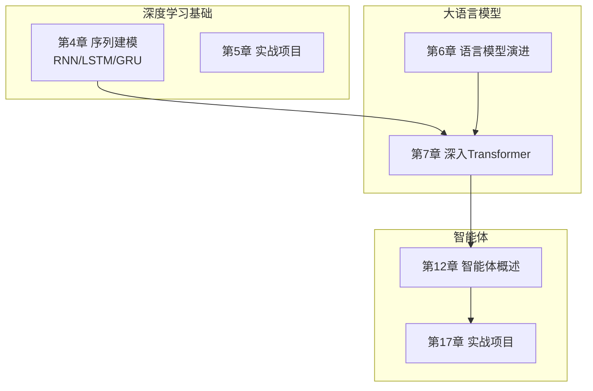
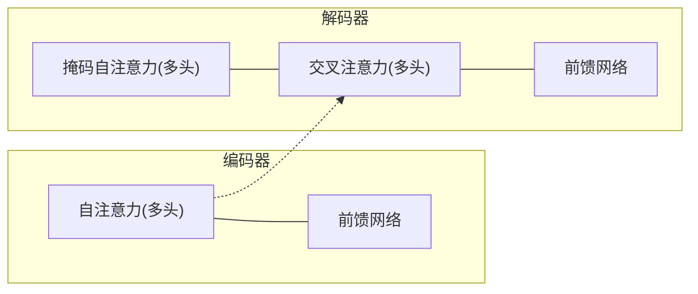
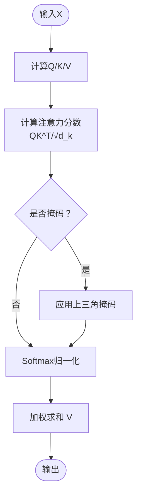
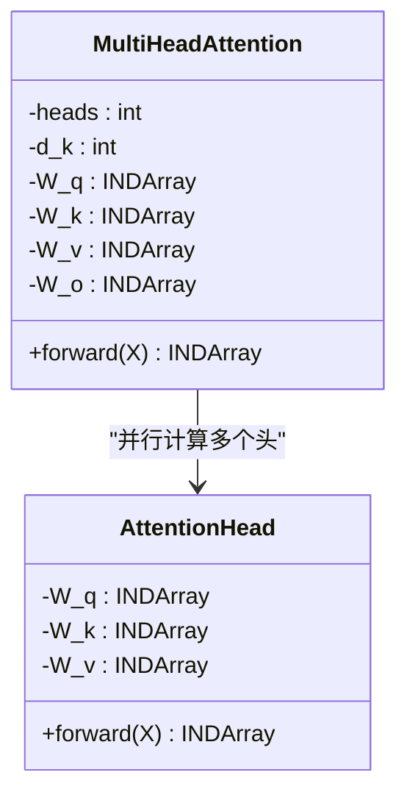
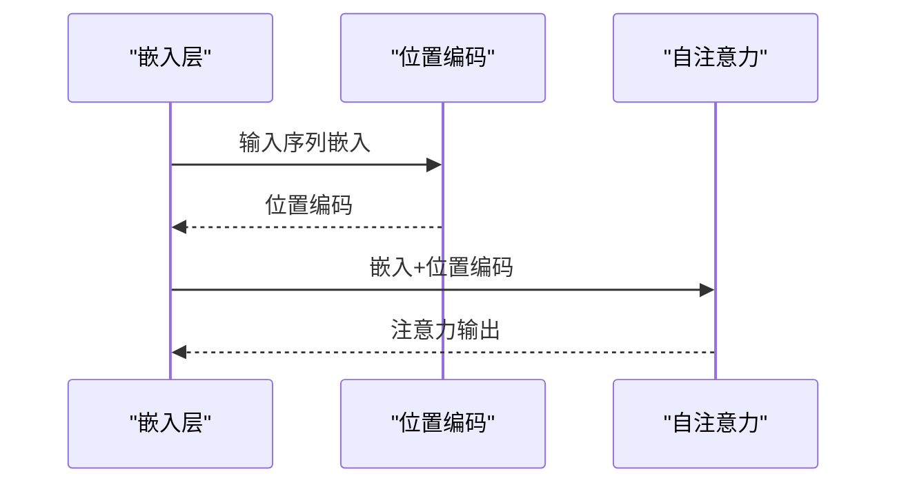
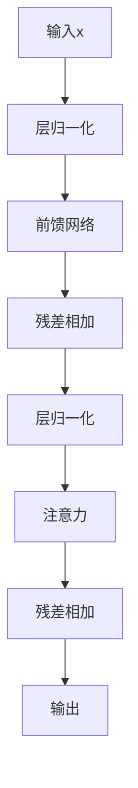
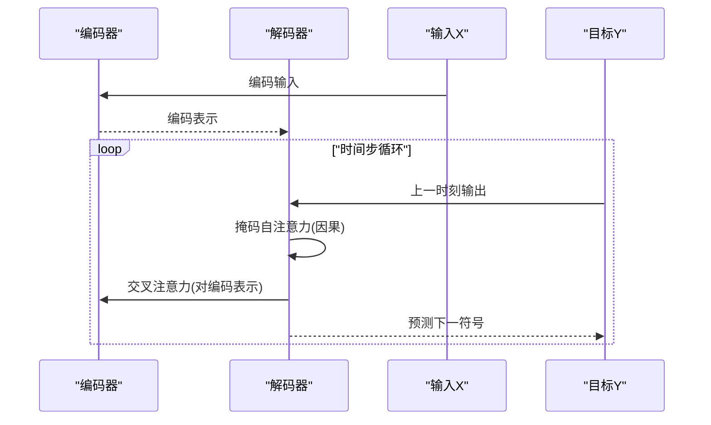
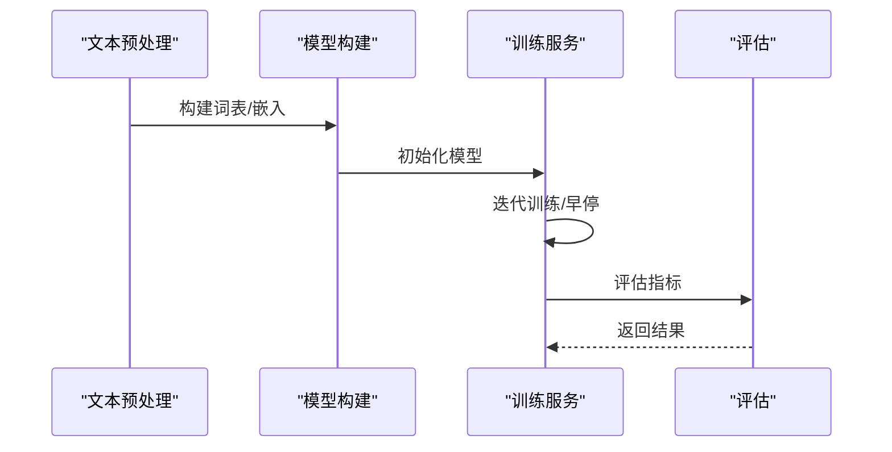
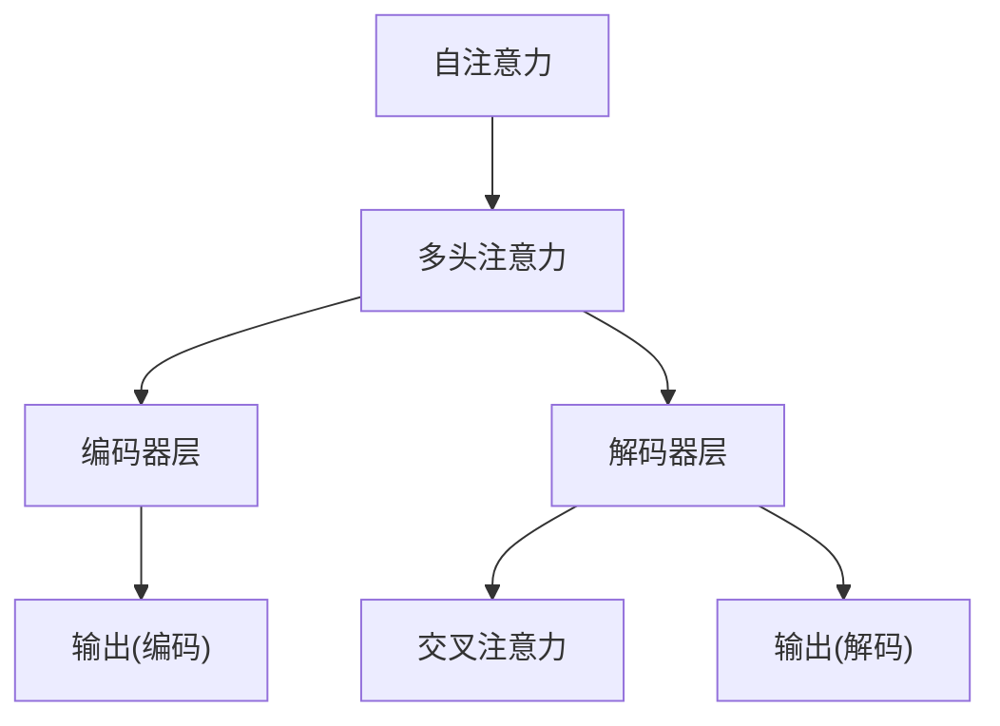

# Transformer架构

<cite>
**本文引用的文件**
- [01-自注意力机制：让词与词对话](file://book/part2-llm/chapter-07/01-self-attention.md)
- [4.1 序列数据的挑战：时间维度的引入](file://book/part1-deep-learning/chapter-04/01-sequence-data-challenge.md)
- [4.2 RNN的核心思想：记忆与遗忘](file://book/part1-deep-learning/chapter-04/02-rnn-memory-and-forgetting.md)
- [4.3 LSTM与GRU：解决长期依赖的钥匙](file://book/part1-deep-learning/chapter-04/03-lstm-and-gru.md)
- [4.4 实战：用Java实现文本生成](file://book/part1-deep-learning/chapter-04/04-text-generation-practice.md)
- [4.5 设计思考：时序建模的本质](file://book/part1-deep-learning/chapter-04/05-design-thinking-sequential-modeling.md)
- [README.md](file://book/README.md)
</cite>

## 目录
1. [简介](#简介)
2. [项目结构](#项目结构)
3. [核心组件](#核心组件)
4. [架构总览](#架构总览)
5. [详细组件分析](#详细组件分析)
6. [依赖分析](#依赖分析)
7. [性能考虑](#性能考虑)
8. [故障排查指南](#故障排查指南)
9. [结论](#结论)
10. [附录](#附录)

## 简介
本章节围绕Transformer架构展开，系统讲解其核心设计理念与技术创新，重点覆盖：
- 自注意力机制的数学与实现，含查询（Query）、键（Key）、值（Value）的投影与注意力权重的归一化
- 多头注意力的设计思想与并行计算优势
- 位置编码的作用与实现方式，解决序列顺序信息
- 前馈神经网络、残差连接与层归一化的组合效果
- 编码器与解码器结构差异及掩码自注意力的因果性保障
- 基于Java与ND4J的实现思路与训练流程

## 项目结构
本仓库以“深度学习基础—大语言模型—智能体”为主线组织内容，Transformer相关内容位于“大语言模型”部分，同时与“循环神经网络”章节形成从RNN到Transformer的演进脉络。

**图表来源**
- [README.md:30-97](file://book/README.md#L30-L97)

**章节来源**
- [README.md:30-97](file://book/README.md#L30-L97)

## 核心组件
- 自注意力模块：负责序列内任意位置之间的直接交互，计算Query/Key/Value并产出加权聚合表示
- 掩码自注意力模块：在解码器侧屏蔽未来位置，确保因果性
- 多头注意力：并行执行多个注意力头，拼接后经线性变换得到丰富语义表示
- 前馈网络：两层全连接网络，提供非线性变换
- 残差连接与层归一化：稳定深层网络训练，加速收敛
- 位置编码：为序列注入顺序信息，弥补注意力对位置不敏感的缺陷

**章节来源**
- [01-自注意力机制：让词与词对话:40-130](file://book/part2-llm/chapter-07/01-self-attention.md#L40-L130)
- [4.5 设计思考：时序建模的本质:70-97](file://book/part1-deep-learning/chapter-04/05-design-thinking-sequential-modeling.md#L70-L97)

## 架构总览
Transformer以“编码器-解码器”堆叠构成，每层包含：
- 编码器层：自注意力（多头）+ 前馈网络；两路均含残差与层归一化
- 解码器层：掩码自注意力（多头）+ 编码器-解码器交叉注意力（多头）+ 前馈网络；同样含残差与层归一化

**图表来源**
- [01-自注意力机制：让词与词对话:222-277](file://book/part2-llm/chapter-07/01-self-attention.md#L222-L277)
- [4.5 设计思考：时序建模的本质:228-244](file://book/part1-deep-learning/chapter-04/05-design-thinking-sequential-modeling.md#L228-L244)

## 详细组件分析

### 自注意力机制
- 数学公式与步骤
  - 投影：Q = XWq，K = XK，V = XV
  - 注意力分数：scores = QK^T / √d_k
  - 归一化：softmax(scores)
  - 加权求和：output = softmax(scores) × V
- 缩放因子√d_k的作用：控制点积方差，避免softmax饱和与梯度消失
- 掩码自注意力：在scores上叠加上三角负无穷掩码，确保解码器仅关注历史位置
- 复杂度：时间O(seqLen² × dModel)，空间O(seqLen²)

**图表来源**
- [01-自注意力机制：让词与词对话:89-109](file://book/part2-llm/chapter-07/01-self-attention.md#L89-L109)
- [01-自注意力机制：让词与词对话:244-262](file://book/part2-llm/chapter-07/01-self-attention.md#L244-L262)

**章节来源**
- [01-自注意力机制：让词与词对话:40-130](file://book/part2-llm/chapter-07/01-self-attention.md#L40-L130)
- [01-自注意力机制：让词与词对话:170-221](file://book/part2-llm/chapter-07/01-self-attention.md#L170-L221)
- [01-自注意力机制：让词与词对话:222-277](file://book/part2-llm/chapter-07/01-self-attention.md#L222-L277)
- [01-自注意力机制：让词与词对话:279-303](file://book/part2-llm/chapter-07/01-self-attention.md#L279-L303)

### 多头注意力
- 设计思想：并行计算多个注意力头，捕获不同子空间的语义关系，提升表达能力
- 实现要点：每个头独立投影与计算注意力，随后拼接（concat）并通过线性层整合
- 优势：并行计算提升吞吐，丰富语义表征

**图表来源**
- [01-自注意力机制：让词与词对话:222-277](file://book/part2-llm/chapter-07/01-self-attention.md#L222-L277)

**章节来源**
- [01-自注意力机制：让词与词对话:222-277](file://book/part2-llm/chapter-07/01-self-attention.md#L222-L277)

### 位置编码
- 作用：为序列注入顺序信息，使模型具备对位置的感知
- 实现方式：常见为可学习参数或固定正弦/余弦编码，与输入嵌入相加后送入网络
- 与自注意力的关系：自注意力本身不区分位置，需位置编码显式提供顺序信息

**图表来源**
- [01-自注意力机制：让词与词对话:222-277](file://book/part2-llm/chapter-07/01-self-attention.md#L222-L277)

**章节来源**
- [01-自注意力机制：让词与词对话:222-277](file://book/part2-llm/chapter-07/01-self-attention.md#L222-L277)

### 前馈网络、残差连接与层归一化
- 前馈网络：两层全连接+激活，提供非线性变换
- 残差连接：将子层输入与输出相加，缓解梯度消失
- 层归一化：对每个样本在特征维上归一化，稳定训练

**图表来源**
- [4.5 设计思考：时序建模的本质:228-244](file://book/part1-deep-learning/chapter-04/05-design-thinking-sequential-modeling.md#L228-L244)

**章节来源**
- [4.5 设计思考：时序建模的本质:228-244](file://book/part1-deep-learning/chapter-04/05-design-thinking-sequential-modeling.md#L228-L244)

### 编码器与解码器结构差异
- 编码器：仅自注意力（全注意力），用于全局建模输入序列
- 解码器：掩码自注意力（因果）+ 编码器-解码器交叉注意力，前者保证生成时只依赖历史，后者关注上下文

**图表来源**
- [01-自注意力机制：让词与词对话:222-277](file://book/part2-llm/chapter-07/01-self-attention.md#L222-L277)
- [4.5 设计思考：时序建模的本质:228-244](file://book/part1-deep-learning/chapter-04/05-design-thinking-sequential-modeling.md#L228-L244)

**章节来源**
- [01-自注意力机制：让词与词对话:222-277](file://book/part2-llm/chapter-07/01-self-attention.md#L222-L277)
- [4.5 设计思考：时序建模的本质:228-244](file://book/part1-deep-learning/chapter-04/05-design-thinking-sequential-modeling.md#L228-L244)

### 从RNN到Transformer的演进
- RNN：顺序计算、隐状态携带历史、存在长期依赖与信息瓶颈
- Transformer：并行计算、注意力直接建模全局依赖、通过位置编码注入顺序信息

**图表来源**
- [4.5 设计思考：时序建模的本质:83-97](file://book/part1-deep-learning/chapter-04/05-design-thinking-sequential-modeling.md#L83-L97)

**章节来源**
- [4.5 设计思考：时序建模的本质:60-97](file://book/part1-deep-learning/chapter-04/05-design-thinking-sequential-modeling.md#L60-L97)

### Java实现与训练流程（基于仓库现有RNN/LSTM实现思路）
虽然仓库未直接给出Transformer的Java实现，但可借鉴其中的序列建模与训练经验：
- 文本预处理与词表管理：字符级或词级编码，One-Hot或Embedding
- 模型构建：多层LSTM/GRU堆叠，配合输出层与损失函数
- 训练流程：早停、学习率调度、评估与持久化

**图表来源**
- [4.4 实战：用Java实现文本生成:148-281](file://book/part1-deep-learning/chapter-04/04-text-generation-practice.md#L148-L281)
- [4.4 实战：用Java实现文本生成:284-370](file://book/part1-deep-learning/chapter-04/04-text-generation-practice.md#L284-L370)

**章节来源**
- [4.4 实战：用Java实现文本生成:148-281](file://book/part1-deep-learning/chapter-04/04-text-generation-practice.md#L148-L281)
- [4.4 实战：用Java实现文本生成:284-370](file://book/part1-deep-learning/chapter-04/04-text-generation-practice.md#L284-L370)

## 依赖分析
- 模块耦合
  - 编码器与解码器通过交叉注意力耦合，解码器内部通过掩码自注意力耦合
  - 多头注意力内部各头相互独立，通过拼接与线性层耦合
- 外部依赖
  - ND4J张量运算库支撑矩阵乘、softmax、归一化等操作
  - DL4J（在其他章节示例中）提供高层网络配置与训练接口

**图表来源**
- [01-自注意力机制：让词与词对话:222-277](file://book/part2-llm/chapter-07/01-self-attention.md#L222-L277)
- [4.5 设计思考：时序建模的本质:228-244](file://book/part1-deep-learning/chapter-04/05-design-thinking-sequential-modeling.md#L228-L244)

**章节来源**
- [01-自注意力机制：让词与词对话:222-277](file://book/part2-llm/chapter-07/01-self-attention.md#L222-L277)
- [4.5 设计思考：时序建模的本质:228-244](file://book/part1-deep-learning/chapter-04/05-design-thinking-sequential-modeling.md#L228-L244)

## 性能考虑
- 计算复杂度
  - 自注意力时间复杂度O(seqLen² × dModel)，序列越长，计算与内存开销越大
  - 多头注意力通过并行头提升吞吐，但整体复杂度仍受序列长度平方影响
- 内存占用
  - 注意力权重矩阵大小为O(seqLen²)，长序列可能导致显著内存压力
- 优化方向
  - 使用稀疏注意力、局部窗口注意力或线性化注意力降低复杂度
  - 模型并行与流水并行提升吞吐
  - 量化与混合精度训练降低显存与带宽消耗

**章节来源**
- [01-自注意力机制：让词与词对话:279-303](file://book/part2-llm/chapter-07/01-self-attention.md#L279-L303)

## 故障排查指南
- 梯度消失/爆炸
  - 自注意力通过缩放因子与残差连接缓解梯度问题；若仍出现，检查学习率与初始化
- 注意力权重退化
  - softmax输入过大导致退化为one-hot，应确保缩放因子与数值稳定性
- 掩码错误
  - 解码器因果性依赖掩码，需确认上三角是否正确置为负无穷
- 训练不稳定
  - 引入层归一化、残差连接与适当正则；早停与学习率调度有助于稳定收敛

**章节来源**
- [01-自注意力机制：让词与词对话:170-221](file://book/part2-llm/chapter-07/01-self-attention.md#L170-L221)
- [01-自注意力机制：让词与词对话:232-277](file://book/part2-llm/chapter-07/01-self-attention.md#L232-L277)

## 结论
Transformer以自注意力为核心，突破了RNN顺序计算与信息瓶颈的限制，通过多头并行与位置编码实现对全局依赖的高效建模。尽管存在O(n²)复杂度与内存开销，其并行化潜力与强大的表达能力使其成为现代NLP与序列建模的主流架构。结合仓库中的序列建模与训练经验，可进一步将Transformer理念迁移到工程实践中。

## 附录
- 相关章节与文件路径
  - [01-自注意力机制：让词与词对话](file://book/part2-llm/chapter-07/01-self-attention.md)
  - [4.1 序列数据的挑战：时间维度的引入](file://book/part1-deep-learning/chapter-04/01-sequence-data-challenge.md)
  - [4.2 RNN的核心思想：记忆与遗忘](file://book/part1-deep-learning/chapter-04/02-rnn-memory-and-forgetting.md)
  - [4.3 LSTM与GRU：解决长期依赖的钥匙](file://book/part1-deep-learning/chapter-04/03-lstm-and-gru.md)
  - [4.4 实战：用Java实现文本生成](file://book/part1-deep-learning/chapter-04/04-text-generation-practice.md)
  - [4.5 设计思考：时序建模的本质](file://book/part1-deep-learning/chapter-04/05-design-thinking-sequential-modeling.md)
  - [README.md](file://book/README.md)