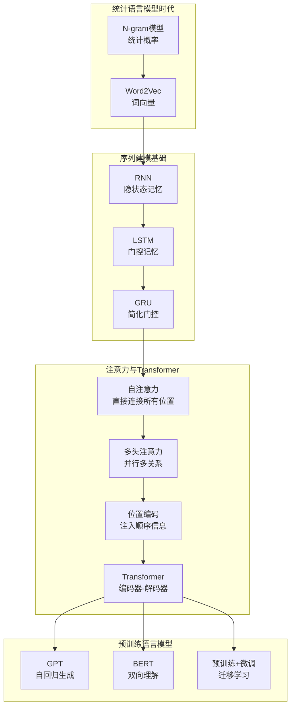
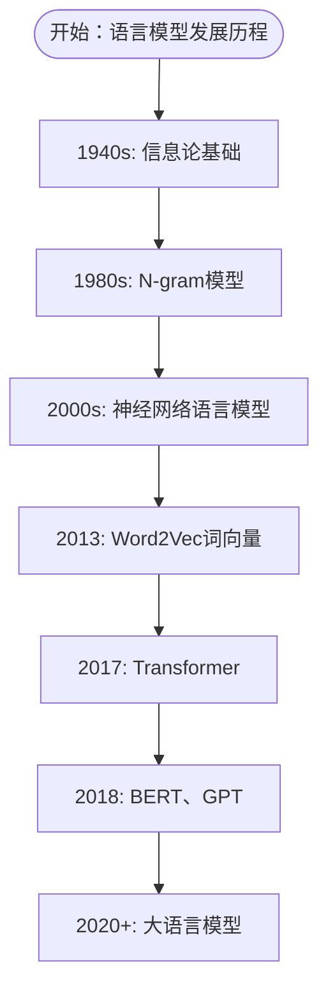
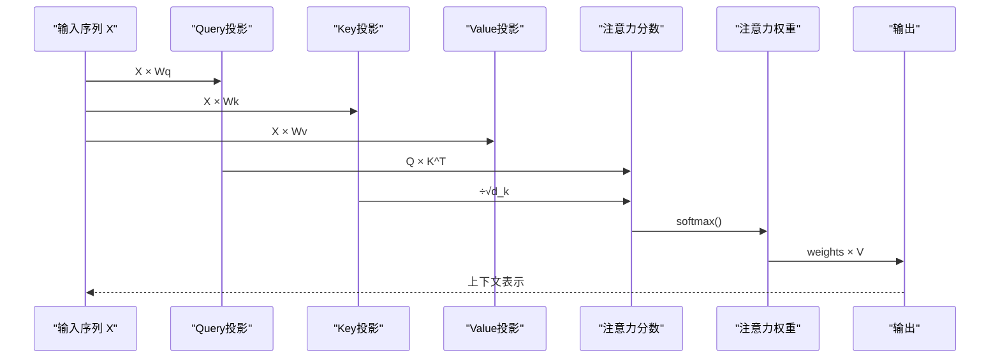
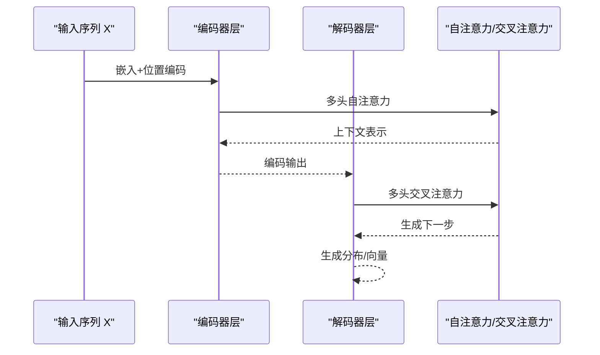
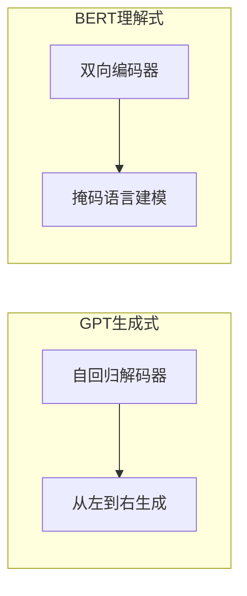
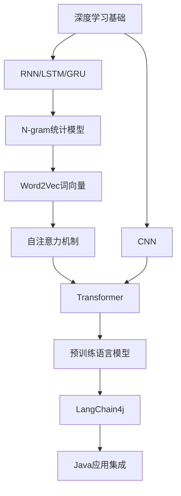

# 大语言模型系统

<cite>
**本文引用的文件**
- [README.md](file://book/README.md)
- [01-what-is-language-model.md](file://book/part2-llm/chapter-06/01-what-is-language-model.md)
- [02-ngram-to-word2vec.md](file://book/part2-llm/chapter-06/02-ngram-to-word2vec.md)
- [01-self-attention.md](file://book/part2-llm/chapter-07/01-self-attention.md)
- [01-why-java-ai.md](file://book/part1-deep-learning/chapter-01/01-why-java-ai.md)
- [02-what-is-deep-learning.md](file://book/part1-deep-learning/chapter-01/02-what-is-deep-learning.md)
- [03-first-ai-environment.md](file://book/part1-deep-learning/chapter-01/03-first-ai-environment.md)
- [02-forward-propagation.md](file://book/part1-deep-learning/chapter-02/02-forward-propagation.md)
- [03-backpropagation.md](file://book/part1-deep-learning/chapter-02/03-backpropagation.md)
- [04-first-neural-network-dl4j.md](file://book/part1-deep-learning/chapter-02/04-first-neural-network-dl4j.md)
- [05-why-deep-learning-needs-depth.md](file://book/part1-deep-learning/chapter-02/05-why-deep-learning-needs-depth.md)
- [01-image-recognition-problem.md](file://book/part1-deep-learning/chapter-03/01-image-recognition-problem.md)
- [04-classic-cnn-architectures.md](file://book/part1-deep-learning/chapter-03/04-classic-cnn-architectures.md)
- [05-build-image-classifier.md](file://book/part1-deep-learning/chapter-03/05-build-image-classifier.md)
- [01-sequence-data-challenge.md](file://book/part1-deep-learning/chapter-04/01-sequence-data-challenge.md)
- [02-rnn-memory-and-forgetting.md](file://book/part1-deep-learning/chapter-04/02-rnn-memory-and-forgetting.md)
- [03-lstm-and-gru.md](file://book/part1-deep-learning/chapter-04/03-lstm-and-gru.md)
- [04-text-generation-practice.md](file://book/part1-deep-learning/chapter-04/04-text-generation-practice.md)
- [05-design-thinking-sequential-modeling.md](file://book/part1-deep-learning/chapter-04/05-design-thinking-sequential-modeling.md)
</cite>

## 更新摘要
**变更内容**
- 新增大语言模型系统章节，涵盖语言模型定义、发展历程和核心技术
- 添加从N-gram到Word2Vec的演进历程，包括统计语言模型和词向量技术
- 新增自注意力机制的详细解析，包括数学原理和Java实现
- 扩展了语言模型评估指标和核心挑战的讨论
- 增强了从传统统计方法到现代深度学习的完整发展脉络

## 目录
1. [引言](#引言)
2. [项目结构](#项目结构)
3. [核心组件](#核心组件)
4. [架构总览](#架构总览)
5. [详细组件分析](#详细组件分析)
6. [依赖关系分析](#依赖关系分析)
7. [性能考量](#性能考量)
8. [故障排查指南](#故障排查指南)
9. [结论](#结论)
10. [附录](#附录)

## 引言
本文件围绕"大语言模型系统"的主题，基于仓库中的深度学习与序列建模内容，系统梳理从统计语言模型到神经网络语言模型的演进脉络，深入解析Transformer架构的核心机制（自注意力、多头注意力、位置编码），并结合GPT与BERT两大主流架构的设计思想与应用场景，介绍开源大模型生态与本地部署方案，重点讲解提示工程的理论基础与实践技巧，并结合LangChain4j框架展示Java程序员如何开发与集成大语言模型应用。

**更新** 新增了从N-gram到Word2Vec的发展历程，以及自注意力机制的详细解析，完善了语言模型系统的技术基础。

## 项目结构
该仓库以"深度学习基础"为主线，逐步推进到"序列建模"，并扩展到"大语言模型系统"，为后续的语言模型与大模型应用打下坚实基础。整体结构如下：

```mermaid
graph TB
A["第一部分：深度学习基础"] --> B["第1章：AI世界的大门"]
A --> C["第2章：神经网络的本质"]
A --> D["第3章：卷积神经网络"]
A --> E["第4章：循环神经网络"]
B --> B1["1.1 为什么Java程序员需要学习AI"]
B --> B2["1.2 深度学习是什么：用Java思维理解神经网络"]
B --> B3["1.3 搭建你的第一个AI开发环境"]
C --> C1["2.2 前向传播：数据流动的艺术"]
C --> C2["2.3 反向传播：学习的数学之美"]
C --> C3["2.4 用Deeplearning4j实现你的第一个神经网络"]
C --> C4["2.5 设计思考：为什么深度学习需要'深'"]
D --> D1["3.1 图像识别问题：从像素到语义"]
D --> D2["3.4 经典CNN架构解析：LeNet、AlexNet、ResNet"]
D --> D3["3.5 实战：用Java构建图像分类器"]
E --> E1["4.1 序列数据的挑战：时间维度的引入"]
E --> E2["4.2 RNN的核心思想：记忆与遗忘"]
E --> E3["4.3 LSTM与GRU：解决长期依赖的钥匙"]
E --> E4["4.4 实战：用Java实现文本生成"]
E --> E5["4.5 设计思考：时序建模的本质"]
F["第二部分：大语言模型系统"] --> G["第6章：语言模型基础"]
F --> H["第7章：自注意力机制"]
F --> I["第8章：多头注意力"]
F --> J["第9章：Transformer架构"]
F --> K["第10章：GPT与BERT"]
F --> L["第11章：大模型应用实践"]
G --> G1["6.1 语言模型是什么"]
G --> G2["6.2 从N-gram到Word2Vec"]
H --> H1["7.1 自注意力机制"]
I --> I1["7.2 多头注意力"]
J --> J1["7.3 Transformer编码器"]
J --> J2["7.4 Transformer解码器"]
K --> K1["7.5 GPT架构"]
K --> K2["7.6 BERT架构"]
```

**图表来源**
- [README.md:30-111](file://book/README.md#L30-L111)
- [01-what-is-language-model.md:1-289](file://book/part2-llm/chapter-06/01-what-is-language-model.md#L1-L289)
- [02-ngram-to-word2vec.md:1-485](file://book/part2-llm/chapter-06/02-ngram-to-word2vec.md#L1-L485)
- [01-self-attention.md:1-352](file://book/part2-llm/chapter-07/01-self-attention.md#L1-L352)

**章节来源**
- [README.md:30-111](file://book/README.md#L30-L111)
- [01-what-is-language-model.md:1-289](file://book/part2-llm/chapter-06/01-what-is-language-model.md#L1-L289)
- [02-ngram-to-word2vec.md:1-485](file://book/part2-llm/chapter-06/02-ngram-to-word2vec.md#L1-L485)
- [01-self-attention.md:1-352](file://book/part2-llm/chapter-07/01-self-attention.md#L1-L352)

## 核心组件
本节从"语言模型发展""Transformer核心机制""GPT与BERT""开源生态与本地部署""提示工程""LangChain4j集成"六个方面，系统梳理大语言模型系统的关键组成。

**更新** 新增了语言模型发展历程的详细内容，包括统计语言模型到词向量的重要演进。

- 语言模型发展
  - 从统计语言模型（N-gram）到神经语言模型（Word2Vec、RNN/LSTM/GRU），再到Transformer与预训练语言模型（GPT/BERT）。
  - 序列建模本质：学习条件概率 P(x_t | x_1..x_{t-1})，并解决长期依赖、并行性与信息瓶颈等问题。
  - 发展历程：1940s信息论基础 → 1980s N-gram模型 → 2000s神经网络语言模型 → 2013 Word2Vec → 2017 Transformer → 2018+ 大语言模型。

- Transformer核心机制
  - 自注意力：让每个位置直接关注所有位置，突破RNN顺序计算限制。
  - 多头注意力：并行捕捉多种关系，增强表达能力。
  - 位置编码：为序列注入顺序信息，弥补自注意力的无序性。

- GPT与BERT两大流派
  - GPT：自回归生成，擅长文本生成与补全。
  - BERT：双向编码，擅长理解与抽取式问答等理解任务。
  - 预训练与微调：迁移学习在NLP中的应用。

- 开源生态与本地部署
  - 开源大模型生态（LLaMA、Mistral、Qwen等）。
  - 模型量化与蒸馏，降低资源占用。
  - LangChain4j：Java生态的LLM开发框架，支持工具调用、RAG、对话管理等。

- 提示工程
  - 基础：输入决定输出；提示质量直接影响LLM表现。
  - 模式：少样本、思维链（CoT）、角色扮演等。
  - 结构化输出：引导LLM返回Java对象，便于工程化集成。
  - 高质量提示模板设计：明确目标、约束与格式。

- LangChain4j实战
  - Java视角的LLM应用开发与集成，涵盖API调用、本地模型接入、RAG与对话系统。

**章节来源**
- [01-what-is-language-model.md:1-289](file://book/part2-llm/chapter-06/01-what-is-language-model.md#L1-L289)
- [02-ngram-to-word2vec.md:1-485](file://book/part2-llm/chapter-06/02-ngram-to-word2vec.md#L1-L485)
- [01-self-attention.md:1-352](file://book/part2-llm/chapter-07/01-self-attention.md#L1-L352)
- [01-sequence-data-challenge.md:1-350](file://book/part1-deep-learning/chapter-04/01-sequence-data-challenge.md#L1-L350)
- [02-rnn-memory-and-forgetting.md:1-375](file://book/part1-deep-learning/chapter-04/02-rnn-memory-and-forgetting.md#L1-L375)
- [03-lstm-and-gru.md:1-365](file://book/part1-deep-learning/chapter-04/03-lstm-and-gru.md#L1-L365)
- [04-text-generation-practice.md:1-533](file://book/part1-deep-learning/chapter-04/04-text-generation-practice.md#L1-L533)
- [05-design-thinking-sequential-modeling.md:1-290](file://book/part1-deep-learning/chapter-04/05-design-thinking-sequential-modeling.md#L1-L290)

## 架构总览
下图展示了从序列建模到大语言模型的演进路径，以及Transformer与预训练范式的引入：

**图表来源**
- [01-what-is-language-model.md:94-107](file://book/part2-llm/chapter-06/01-what-is-language-model.md#L94-L107)
- [02-ngram-to-word2vec.md:15-25](file://book/part2-llm/chapter-06/02-ngram-to-word2vec.md#L15-L25)
- [01-sequence-data-challenge.md:118-139](file://book/part1-deep-learning/chapter-04/01-sequence-data-challenge.md#L118-L139)
- [02-rnn-memory-and-forgetting.md:46-79](file://book/part1-deep-learning/chapter-04/02-rnn-memory-and-forgetting.md#L46-L79)
- [03-lstm-and-gru.md:40-133](file://book/part1-deep-learning/chapter-04/03-lstm-and-gru.md#L40-L133)
- [05-design-thinking-sequential-modeling.md:60-97](file://book/part1-deep-learning/chapter-04/05-design-thinking-sequential-modeling.md#L60-L97)

## 详细组件分析

### 语言模型的演进与序列建模
**更新** 新增了从N-gram到Word2Vec的完整发展历程，以及语言模型的核心挑战和评估指标。

- 语言模型的定义与数学基础
  - 数学定义：P(w1, w2, w3, ..., wn) 或 P(wt | w1, w2, ..., wt-1)
  - 抽象接口设计：predictNext()和sentenceProbability()方法
  - 应用场景：文本生成、机器翻译、语音识别、拼写纠错、智能输入法

- 从N-gram到Word2Vec的发展历程
  - N-gram模型：Unigram、Bigram、Trigram的基本思想
  - Word2Vec：CBOW和Skip-gram两种架构
  - 词向量的优势：低维连续表示、相似词向量相近、可进行语义运算

- 困惑度评估指标
  - PPL = exp(-1/N × Σlog P(wi|w1,...,wi-1))
  - 困惑度越低，模型越好
  - 困惑度的直观理解：模型在预测时的"困惑程度"

- 语言模型的核心挑战
  - 稀疏性问题：语言组合是无限的，大多数词组合在训练数据中从未出现
  - 长距离依赖：句子开头的词可能影响结尾
  - 上下文理解：同一个词在不同上下文中含义不同

**图表来源**
- [01-what-is-language-model.md:94-107](file://book/part2-llm/chapter-06/01-what-is-language-model.md#L94-L107)
- [02-ngram-to-word2vec.md:15-25](file://book/part2-llm/chapter-06/02-ngram-to-word2vec.md#L15-L25)

**章节来源**
- [01-what-is-language-model.md:1-289](file://book/part2-llm/chapter-06/01-what-is-language-model.md#L1-L289)
- [02-ngram-to-word2vec.md:1-485](file://book/part2-llm/chapter-06/02-ngram-to-word2vec.md#L1-L485)
- [01-sequence-data-challenge.md:1-350](file://book/part1-deep-learning/chapter-04/01-sequence-data-challenge.md#L1-L350)
- [02-rnn-memory-and-forgetting.md:1-375](file://book/part1-deep-learning/chapter-04/02-rnn-memory-and-forgetting.md#L1-L375)
- [03-lstm-and-gru.md:1-365](file://book/part1-deep-learning/chapter-04/03-lstm-and-gru.md#L1-L365)
- [04-text-generation-practice.md:1-533](file://book/part1-deep-learning/chapter-04/04-text-generation-practice.md#L1-L533)
- [05-design-thinking-sequential-modeling.md:1-290](file://book/part1-deep-learning/chapter-04/05-design-thinking-sequential-modeling.md#L1-L290)

### 自注意力机制：让词与词对话
**新增** 详细解析了自注意力机制的数学原理、实现细节和哲学思考。

- 自注意力的直觉理解
  - 通过Query、Key、Value三者的相互作用实现动态权重计算
  - 每个位置都能直接关注到所有其他位置的信息
  - 类比图书馆检索系统：Query匹配Key，得到匹配程度，然后取Value的加权和

- 数学原理与实现
  - 核心公式：Attention(Q,K,V) = softmax(QK^T / √d_k) V
  - 逐步计算：Q = XWq, K = XWk, V = XWv
  - 缩放因子√d_k的作用：防止梯度消失，保持softmax输入范围合理

- 掩码自注意力
  - 用于解码器的因果约束，确保预测时只能看到前面的词
  - 通过上三角矩阵设置负无穷值，实现时间上的因果关系

- 复杂度分析
  - 时间复杂度：O(seqLen² × dModel)，序列长度增加时计算量平方增长
  - 空间复杂度：注意力权重矩阵大小为seqLen × seqLen

**图表来源**
- [01-self-attention.md:44-53](file://book/part2-llm/chapter-07/01-self-attention.md#L44-L53)
- [01-self-attention.md:89-109](file://book/part2-llm/chapter-07/01-self-attention.md#L89-L109)

**章节来源**
- [01-self-attention.md:1-352](file://book/part2-llm/chapter-07/01-self-attention.md#L1-L352)

### Transformer架构与注意力机制
- 多头注意力：并行计算多个子空间的注意力，捕获不同类型的依赖关系。
- 位置编码：通过可学习或固定的正弦/余弦编码，为序列注入顺序信息。
- 编码器-解码器：编码器提取上下文表示，解码器在注意力中关注编码器输出，实现如翻译等任务。

**图表来源**
- [05-design-thinking-sequential-modeling.md:70-97](file://book/part1-deep-learning/chapter-04/05-design-thinking-sequential-modeling.md#L70-L97)

**章节来源**
- [05-design-thinking-sequential-modeling.md:1-290](file://book/part1-deep-learning/chapter-04/05-design-thinking-sequential-modeling.md#L1-L290)

### GPT与BERT：两大主流架构
- GPT（生成式预训练）
  - 单向自回归：从左到右建模，擅长生成类任务（文本生成、补全）。
  - 预训练+微调：在大规模语料上预训练，针对下游任务微调。
- BERT（理解式预训练）
  - 双向编码：掩码语言建模，擅长理解类任务（问答、抽取、分类）。
  - 预训练+微调：迁移学习范式在NLP中的成功实践。

**图表来源**
- [05-design-thinking-sequential-modeling.md:136-142](file://book/part1-deep-learning/chapter-04/05-design-thinking-sequential-modeling.md#L136-L142)

**章节来源**
- [05-design-thinking-sequential-modeling.md:134-152](file://book/part1-deep-learning/chapter-04/05-design-thinking-sequential-modeling.md#L134-L152)

### 开源大模型生态与本地部署
- 生态概览：LLaMA、Mistral、Qwen等开源模型，覆盖多语言与多任务。
- 本地部署：通过量化（INT4/FP4）、蒸馏与分片等技术，降低显存与存储压力。
- LangChain4j：Java生态的LLM框架，支持工具调用、RAG、对话管理与向量数据库集成。

**章节来源**
- [README.md:91-96](file://book/README.md#L91-L96)

### 提示工程：理论与实践
- 基础：提示质量决定输出质量；明确目标、约束与格式。
- 模式：少样本示例、思维链（CoT）、角色扮演（Roleplay）。
- 结构化输出：引导LLM返回JSON/Java对象，便于工程化落地。
- 模板设计：清晰指令、上下文注入、约束与校验。

**章节来源**
- [README.md:98-104](file://book/README.md#L98-L104)

### LangChain4j实战：Java视角的LLM应用
- 环境与依赖：基于Deeplearning4j与LangChain4j，结合ND4J矩阵运算与日志框架。
- API调用与本地模型：OpenAI API与本地模型接入，统一抽象。
- RAG与对话：向量化、检索、上下文注入与对话历史管理。
- 工具调用：函数调用与外部系统集成，保障安全性与可控性。

**章节来源**
- [03-first-ai-environment.md:1-426](file://book/part1-deep-learning/chapter-01/03-first-ai-environment.md#L1-L426)
- [04-first-neural-network-dl4j.md:1-498](file://book/part1-deep-learning/chapter-02/04-first-neural-network-dl4j.md#L1-L498)
- [README.md:170-177](file://book/README.md#L170-L177)

## 依赖关系分析
**更新** 新增了语言模型发展历程对后续技术的影响关系。

- 深度学习基础
  - 前向传播与反向传播：为理解神经网络训练提供数学基础。
  - CNN：图像识别的代表性架构，体现特征层次化与参数共享。
  - RNN/LSTM/GRU：序列建模的核心，解决长期依赖与变长序列问题。
- 语言模型发展历程
  - N-gram统计模型：奠定语言模型的基础概念
  - Word2Vec词向量：解决稀疏性和泛化问题
  - 自注意力机制：突破序列建模的时间限制
  - Transformer架构：实现并行化与全局依赖建模
- 语言模型与Transformer
  - 从RNN到Transformer的演进，注意力机制替代顺序计算，实现并行化与全局依赖。
- Java生态集成
  - Deeplearning4j：纯Java深度学习框架，适合企业级集成与生产部署。
  - LangChain4j：Java生态的LLM开发框架，支持RAG、工具调用与对话管理。

**图表来源**
- [02-forward-propagation.md:1-538](file://book/part1-deep-learning/chapter-02/02-forward-propagation.md#L1-L538)
- [03-backpropagation.md:1-537](file://book/part1-deep-learning/chapter-02/03-backpropagation.md#L1-L537)
- [04-classic-cnn-architectures.md:1-449](file://book/part1-deep-learning/chapter-03/04-classic-cnn-architectures.md#L1-L449)
- [05-design-thinking-sequential-modeling.md:60-97](file://book/part1-deep-learning/chapter-04/05-design-thinking-sequential-modeling.md#L60-L97)
- [01-what-is-language-model.md:94-107](file://book/part2-llm/chapter-06/01-what-is-language-model.md#L94-L107)
- [02-ngram-to-word2vec.md:15-25](file://book/part2-llm/chapter-06/02-ngram-to-word2vec.md#L15-L25)
- [README.md:170-177](file://book/README.md#L170-L177)

**章节来源**
- [02-forward-propagation.md:1-538](file://book/part1-deep-learning/chapter-02/02-forward-propagation.md#L1-L538)
- [03-backpropagation.md:1-537](file://book/part1-deep-learning/chapter-02/03-backpropagation.md#L1-L537)
- [04-classic-cnn-architectures.md:1-449](file://book/part1-deep-learning/chapter-03/04-classic-cnn-architectures.md#L1-L449)
- [05-design-thinking-sequential-modeling.md:1-290](file://book/part1-deep-learning/chapter-04/05-design-thinking-sequential-modeling.md#L1-L290)
- [01-what-is-language-model.md:1-289](file://book/part2-llm/chapter-06/01-what-is-language-model.md#L1-L289)
- [02-ngram-to-word2vec.md:1-485](file://book/part2-llm/chapter-06/02-ngram-to-word2vec.md#L1-L485)
- [01-self-attention.md:1-352](file://book/part2-llm/chapter-07/01-self-attention.md#L1-L352)
- [README.md:170-177](file://book/README.md#L170-L177)

## 性能考量
**更新** 新增了词向量和自注意力机制的性能考量。

- 计算效率
  - RNN顺序计算，Transformer并行化；长序列时Transformer内存与计算开销更高。
  - LSTM/GRU通过门控缓解梯度消失，但计算复杂度高于简单RNN。
  - 自注意力机制：时间复杂度O(n²)，空间复杂度O(n²)，需要考虑序列长度限制。
  - 词向量：维度通常为100-300，相比one-hot编码大幅减少维度。

- 记忆容量与信息瓶颈
  - RNN隐状态容量有限，难以长期记忆；Transformer注意力可关注全部位置，但需注意计算与内存。
  - N-gram模型面临稀疏性问题，大部分N-gram组合从未出现。
  - 词向量通过分布式表示解决稀疏性问题，但无法区分同词异义。

- 量化与蒸馏
  - 通过INT4/FP4量化、LoRA微调与知识蒸馏，降低资源占用，提升部署效率。
  - 词向量模型相对轻量，适合大规模部署。

- 工程化要点
  - 批处理与并行化、早停与学习率调度、正则化与数据增强。
  - 自注意力的数值稳定性：缩放因子√d_k防止softmax饱和。
  - 词向量的相似度计算：余弦相似度避免维度影响。

**章节来源**
- [05-why-deep-learning-needs-depth.md:162-247](file://book/part1-deep-learning/chapter-02/05-why-deep-learning-needs-depth.md#L162-L247)
- [05-design-thinking-sequential-modeling.md:185-225](file://book/part1-deep-learning/chapter-04/05-design-thinking-sequential-modeling.md#L185-L225)
- [01-self-attention.md:170-303](file://book/part2-llm/chapter-07/01-self-attention.md#L170-L303)
- [02-ngram-to-word2vec.md:147-155](file://book/part2-llm/chapter-06/02-ngram-to-word2vec.md#L147-L155)

## 故障排查指南
**更新** 新增了词向量和自注意力机制相关的故障排查建议。

- 训练不稳定
  - 检查学习率、优化器与正则化；使用早停与学习率调度。
  - 自注意力：检查缩放因子设置，确保数值稳定性。
  - 词向量：检查维度设置，避免过小导致信息不足。

- 梯度消失/爆炸
  - 使用LSTM/GRU、梯度裁剪、合适的初始化与归一化。
  - 自注意力：通过缩放因子和残差连接缓解梯度问题。
  - 词向量：使用适当的初始化方法，如Xavier初始化。

- 过拟合
  - 增大数据增强、Dropout、L2正则化；检查训练/测试指标差距。
  - 词向量：使用预训练模型，避免从零开始训练。

- 环境与依赖
  - 确认JDK版本、Maven依赖与GPU/CUDA配置；必要时切换ND4J平台依赖。
  - 词向量：确保预训练模型文件完整，内存充足。

**章节来源**
- [03-first-ai-environment.md:385-407](file://book/part1-deep-learning/chapter-01/03-first-ai-environment.md#L385-L407)
- [03-backpropagation.md:205-291](file://book/part1-deep-learning/chapter-02/03-backpropagation.md#L205-L291)
- [05-why-deep-learning-needs-depth.md:162-247](file://book/part1-deep-learning/chapter-02/05-why-deep-learning-needs-depth.md#L162-L247)
- [01-self-attention.md:114-120](file://book/part2-llm/chapter-07/01-self-attention.md#L114-L120)

## 结论
**更新** 新增了对大语言模型系统完整发展历程的总结。

本文件从深度学习基础出发，系统梳理了从RNN到Transformer的语言模型演进路径，深入解析了注意力机制与预训练范式，并结合Java生态的Deeplearning4j与LangChain4j，给出了大语言模型系统的设计与工程化实践建议。

**新增内容总结**：
- 语言模型发展历程：从N-gram统计模型到Word2Vec词向量，再到Transformer架构的完整演进
- 自注意力机制：数学原理、实现细节和性能考量的深入解析
- 核心挑战：稀疏性、长距离依赖、上下文理解等关键问题的解决方案
- 评估指标：困惑度等核心指标的理论基础和实践应用

通过提示工程与结构化输出，可将LLM能力稳定地融入Java应用，实现从API到本地部署的多样化落地路径。大语言模型系统的发展体现了从统计方法到深度学习、从静态表示到动态建模的技术进步。

## 附录
- 术语表与参考资料：参见书籍附录与各章节"思考题"与"练习题"。

**章节来源**
- [README.md:155-187](file://book/README.md#L155-L187)