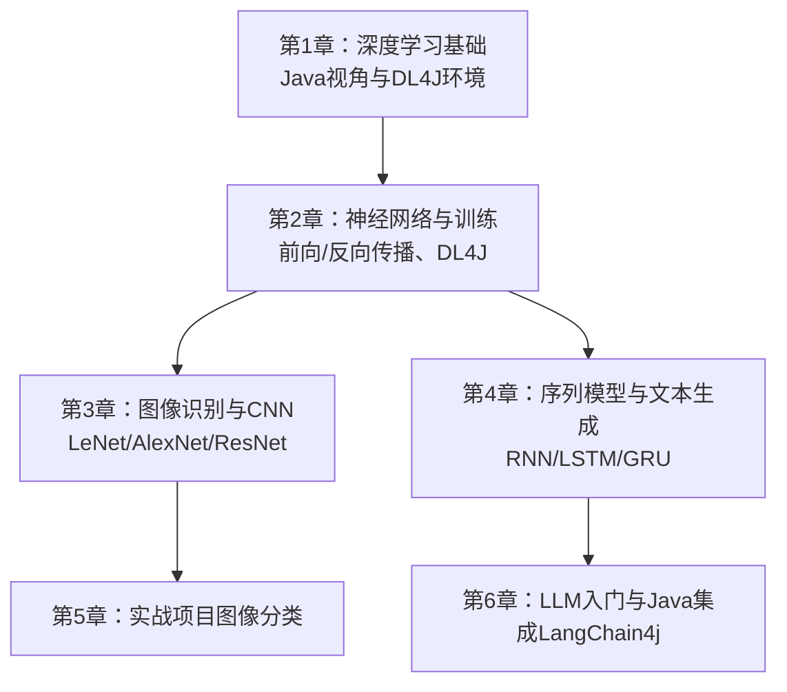
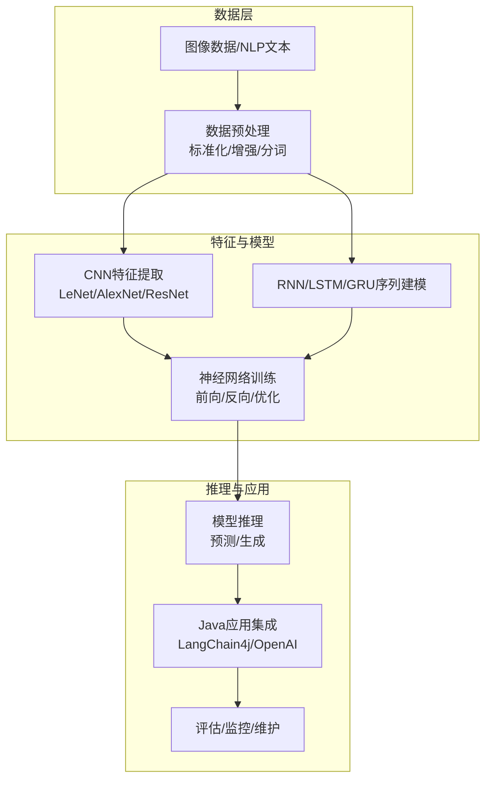
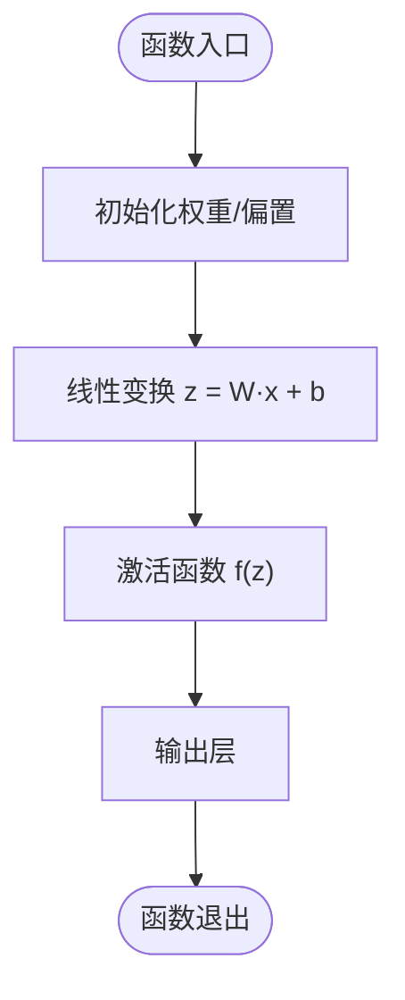
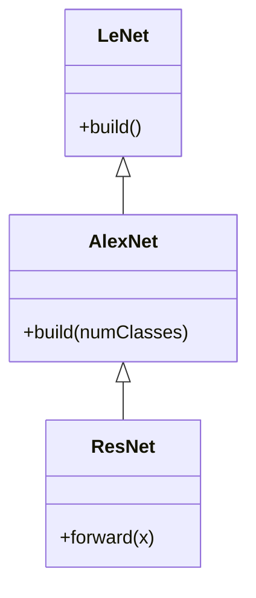
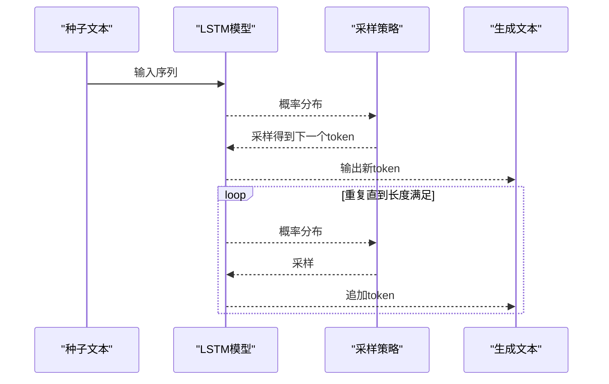
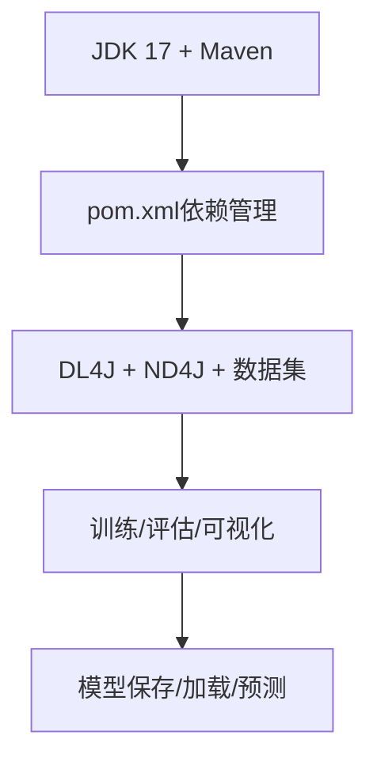
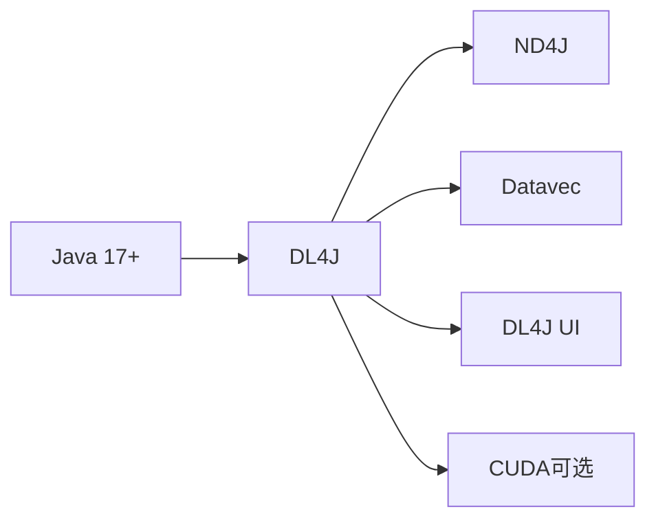

# 开源大模型

<cite>
**本文引用的文件**
- [book/README.md](file://book/README.md)
- [chapter-01/01-why-java-ai.md](file://book/part1-deep-learning/chapter-01/01-why-java-ai.md)
- [chapter-01/02-what-is-deep-learning.md](file://book/part1-deep-learning/chapter-01/02-what-is-deep-learning.md)
- [chapter-01/03-first-ai-environment.md](file://book/part1-deep-learning/chapter-01/03-first-ai-environment.md)
- [chapter-02/02-forward-propagation.md](file://book/part1-deep-learning/chapter-02/02-forward-propagation.md)
- [chapter-02/03-backpropagation.md](file://book/part1-deep-learning/chapter-02/03-backpropagation.md)
- [chapter-02/04-first-neural-network-dl4j.md](file://book/part1-deep-learning/chapter-02/04-first-neural-network-dl4j.md)
- [chapter-02/05-why-deep-learning-needs-depth.md](file://book/part1-deep-learning/chapter-02/05-why-deep-learning-needs-depth.md)
- [chapter-03/01-image-recognition-problem.md](file://book/part1-deep-learning/chapter-03/01-image-recognition-problem.md)
- [chapter-03/04-classic-cnn-architectures.md](file://book/part1-deep-learning/chapter-03/04-classic-cnn-architectures.md)
- [chapter-03/05-build-image-classifier.md](file://book/part1-deep-learning/chapter-03/05-build-image-classifier.md)
- [chapter-04/01-sequence-data-challenge.md](file://book/part1-deep-learning/chapter-04/01-sequence-data-challenge.md)
- [chapter-04/02-rnn-memory-and-forgetting.md](file://book/part1-deep-learning/chapter-04/02-rnn-memory-and-forgetting.md)
- [chapter-04/03-lstm-and-gru.md](file://book/part1-deep-learning/chapter-04/03-lstm-and-gru.md)
- [chapter-04/04-text-generation-practice.md](file://book/part1-deep-learning/chapter-04/04-text-generation-practice.md)
</cite>

## 目录
1. [引言](#引言)
2. [项目结构](#项目结构)
3. [核心组件](#核心组件)
4. [架构总览](#架构总览)
5. [详细组件分析](#详细组件分析)
6. [依赖分析](#依赖分析)
7. [性能考量](#性能考量)
8. [故障排查指南](#故障排查指南)
9. [结论](#结论)
10. [附录](#附录)

## 引言
本技术文档围绕“开源大模型”主题，结合仓库中已有的深度学习与大语言模型相关内容，系统梳理从基础神经网络到序列模型、再到LLM相关实践的工程化路径。文档重点覆盖：
- 开源大模型生态概览与选择策略（从小模型到超大规模）
- 模型下载、安装与本地部署流程
- 配置参数与性能优化建议
- 量化与推理加速技术（含LoRA适配器思路）
- 在Java应用中集成与调用LLM的工程实践
- 模型评估、监控与维护最佳实践

为便于不同背景读者理解，文档采用渐进式结构，先回顾深度学习基础，再过渡到序列模型与文本生成，最后落点到LLM生态与工程实践。

## 项目结构
本仓库以“深度学习基础—序列模型—图像与视觉—LLM入门”为主线组织内容，形成从理论到实践的完整路径。核心章节如下：
- 第1章：AI与深度学习入门，强调Java视角与工程落地
- 第2章：神经网络与训练（前向/反向传播、DL4J实战）
- 第3章：图像识别与CNN架构演进
- 第4章：序列数据与RNN/LSTM/GRU，以及文本生成实践



**图表来源**
- [book/README.md:30-111](file://book/README.md#L30-L111)

**章节来源**
- [book/README.md:30-111](file://book/README.md#L30-L111)

## 核心组件
本节从工程化视角提炼支撑“开源大模型”的关键能力与组件，涵盖数据处理、模型训练、推理与部署等环节。

- 数据与特征工程
  - 图像张量与数据格式（NCHW/NHWC）、标准化与数据增强
  - 文本预处理（词表、One-Hot、序列切片）
- 模型架构与训练
  - 前向传播与向量化、激活函数、批处理
  - 反向传播与梯度下降、优化器（Adam/Momentum）
  - 深度网络设计（残差连接、批归一化、Dropout）
- 序列与文本建模
  - RNN隐状态与长期依赖、双向RNN、深层RNN
  - LSTM/GRU门控机制与直通通道
  - 文本生成（自回归、采样策略）
- LLM生态与Java集成
  - LLM框架（LangChain4j）与API调用
  - 本地部署与端到端问答系统

**章节来源**
- [chapter-03/01-image-recognition-problem.md:93-228](file://book/part1-deep-learning/chapter-03/01-image-recognition-problem.md#L93-L228)
- [chapter-02/02-forward-propagation.md:214-379](file://book/part1-deep-learning/chapter-02/02-forward-propagation.md#L214-L379)
- [chapter-02/03-backpropagation.md:185-369](file://book/part1-deep-learning/chapter-02/03-backpropagation.md#L185-L369)
- [chapter-02/05-why-deep-learning-needs-depth.md:162-246](file://book/part1-deep-learning/chapter-02/05-why-deep-learning-needs-depth.md#L162-L246)
- [chapter-04/01-sequence-data-challenge.md:117-232](file://book/part1-deep-learning/chapter-04/01-sequence-data-challenge.md#L117-L232)
- [chapter-04/02-rnn-memory-and-forgetting.md:46-121](file://book/part1-deep-learning/chapter-04/02-rnn-memory-and-forgetting.md#L46-L121)
- [chapter-04/03-lstm-and-gru.md:81-133](file://book/part1-deep-learning/chapter-04/03-lstm-and-gru.md#L81-L133)
- [chapter-04/04-text-generation-practice.md:146-281](file://book/part1-deep-learning/chapter-04/04-text-generation-practice.md#L146-L281)

## 架构总览
下图展示了从数据到模型再到推理的整体架构，体现“数据→特征→模型→推理→应用”的闭环。



**图表来源**
- [chapter-03/04-classic-cnn-architectures.md:17-104](file://book/part1-deep-learning/chapter-03/04-classic-cnn-architectures.md#L17-L104)
- [chapter-04/03-lstm-and-gru.md:226-281](file://book/part1-deep-learning/chapter-04/03-lstm-and-gru.md#L226-L281)
- [chapter-02/04-first-neural-network-dl4j.md:55-149](file://book/part1-deep-learning/chapter-02/04-first-neural-network-dl4j.md#L55-L149)

## 详细组件分析

### 组件A：前向传播与向量化
- 核心要点
  - 单神经元与矩阵运算的向量化实现
  - 激活函数（Sigmoid/Tanh/ReLU/Softmax）的选择与适用场景
  - 批处理提升计算效率，支持并行化
- 性能与复杂度
  - 向量化相较循环可显著提速；批处理进一步提升吞吐
- 工程实践
  - 使用ND4J进行矩阵运算与变换，配合DL4J层配置



**图表来源**
- [chapter-02/02-forward-propagation.md:177-212](file://book/part1-deep-learning/chapter-02/02-forward-propagation.md#L177-L212)

**章节来源**
- [chapter-02/02-forward-propagation.md:214-379](file://book/part1-deep-learning/chapter-02/02-forward-propagation.md#L214-L379)

### 组件B：反向传播与优化
- 核心要点
  - 链式法则推导误差项，逐层回传
  - 梯度下降与优化器（SGD/Momentum/Adam）对比
  - 损失函数（MSE/交叉熵）与适用场景
- 工程实践
  - DL4J内置优化器与监听器，便于训练过程监控

```mermaid
sequenceDiagram
participant Data as "数据"
participant Net as "神经网络"
participant Loss as "损失函数"
participant Opt as "优化器"
Data->>Net : 前向传播
Net-->>Data : 预测输出
Data->>Loss : 计算损失
Loss-->>Net : 梯度
Net->>Opt : 更新参数
Opt-->>Net : 新参数
```

**图表来源**
- [chapter-02/03-backpropagation.md:110-183](file://book/part1-deep-learning/chapter-02/03-backpropagation.md#L110-L183)

**章节来源**
- [chapter-02/03-backpropagation.md:185-369](file://book/part1-deep-learning/chapter-02/03-backpropagation.md#L185-L369)

### 组件C：CNN架构与图像处理
- 核心要点
  - LeNet/AlexNet/ResNet的演进与关键创新
  - 卷积+池化交替、批归一化、Dropout、残差连接
- 工程实践
  - 使用DL4J构建CNN，加载预训练模型进行迁移学习



**图表来源**
- [chapter-03/04-classic-cnn-architectures.md:41-104](file://book/part1-deep-learning/chapter-03/04-classic-cnn-architectures.md#L41-L104)
- [chapter-03/04-classic-cnn-architectures.md:169-251](file://book/part1-deep-learning/chapter-03/04-classic-cnn-architectures.md#L169-L251)
- [chapter-03/04-classic-cnn-architectures.md:309-327](file://book/part1-deep-learning/chapter-03/04-classic-cnn-architectures.md#L309-L327)

**章节来源**
- [chapter-03/04-classic-cnn-architectures.md:106-379](file://book/part1-deep-learning/chapter-03/04-classic-cnn-architectures.md#L106-L379)

### 组件D：序列建模与文本生成
- 核心要点
  - RNN隐状态与长期依赖问题、双向RNN、深层RNN
  - LSTM/GRU门控机制与直通通道
  - 文本生成（自回归、贪心/温度/Top-K/Nucleus采样）
- 工程实践
  - 使用DL4J的LSTM层与LastTimeStep输出层



**图表来源**
- [chapter-04/04-text-generation-practice.md:283-370](file://book/part1-deep-learning/chapter-04/04-text-generation-practice.md#L283-L370)
- [chapter-04/03-lstm-and-gru.md:226-281](file://book/part1-deep-learning/chapter-04/03-lstm-and-gru.md#L226-L281)

**章节来源**
- [chapter-04/01-sequence-data-challenge.md:117-232](file://book/part1-deep-learning/chapter-04/01-sequence-data-challenge.md#L117-L232)
- [chapter-04/02-rnn-memory-and-forgetting.md:46-121](file://book/part1-deep-learning/chapter-04/02-rnn-memory-and-forgetting.md#L46-L121)
- [chapter-04/03-lstm-and-gru.md:81-133](file://book/part1-deep-learning/chapter-04/03-lstm-and-gru.md#L81-L133)
- [chapter-04/04-text-generation-practice.md:146-281](file://book/part1-deep-learning/chapter-04/04-text-generation-practice.md#L146-L281)

### 组件E：Java环境与DL4J/DL生态
- 核心要点
  - JDK 17、Maven、ND4J、DL4J、数据处理与评估工具
  - GPU加速（CUDA平台）与内存配置
- 工程实践
  - 通过pom.xml引入DL4J与LangChain4j，验证ND4J矩阵运算



**图表来源**
- [chapter-01/03-first-ai-environment.md:82-189](file://book/part1-deep-learning/chapter-01/03-first-ai-environment.md#L82-L189)
- [chapter-02/04-first-neural-network-dl4j.md:20-53](file://book/part1-deep-learning/chapter-02/04-first-neural-network-dl4j.md#L20-L53)

**章节来源**
- [chapter-01/03-first-ai-environment.md:17-426](file://book/part1-deep-learning/chapter-01/03-first-ai-environment.md#L17-L426)
- [chapter-02/04-first-neural-network-dl4j.md:16-53](file://book/part1-deep-learning/chapter-02/04-first-neural-network-dl4j.md#L16-L53)

## 依赖分析
- 框架与库
  - DL4J：神经网络与训练
  - ND4J：高性能数值计算（替代NumPy）
  - 数据处理：Datavec（图像/文本）
  - 可视化：DL4J UI（训练监控）
- 环境与硬件
  - CPU/GPU（CUDA）与内存配置
  - Java 17+与Maven



**图表来源**
- [chapter-01/03-first-ai-environment.md:82-189](file://book/part1-deep-learning/chapter-01/03-first-ai-environment.md#L82-L189)
- [chapter-02/04-first-neural-network-dl4j.md:20-53](file://book/part1-deep-learning/chapter-02/04-first-neural-network-dl4j.md#L20-L53)

**章节来源**
- [chapter-01/03-first-ai-environment.md:82-189](file://book/part1-deep-learning/chapter-01/03-first-ai-environment.md#L82-L189)
- [chapter-02/04-first-neural-network-dl4j.md:20-53](file://book/part1-deep-learning/chapter-02/04-first-neural-network-dl4j.md#L20-L53)

## 性能考量
- 计算效率
  - 向量化与批处理：显著提升吞吐
  - 激活函数选择：ReLU/LeakyReLU缓解梯度消失
  - 优化器：Adam在大多数场景表现稳定
- 训练稳定性
  - 残差连接、批归一化、Dropout缓解梯度问题与过拟合
  - 学习率调度与早停
- 硬件与内存
  - GPU加速（CUDA）与内存上限设置
  - 模型参数规模与显存占用权衡

**章节来源**
- [chapter-02/02-forward-propagation.md:326-379](file://book/part1-deep-learning/chapter-02/02-forward-propagation.md#L326-L379)
- [chapter-02/03-backpropagation.md:205-285](file://book/part1-deep-learning/chapter-02/03-backpropagation.md#L205-L285)
- [chapter-02/05-why-deep-learning-needs-depth.md:162-246](file://book/part1-deep-learning/chapter-02/05-why-deep-learning-needs-depth.md#L162-L246)
- [chapter-01/03-first-ai-environment.md:372-407](file://book/part1-deep-learning/chapter-01/03-first-ai-environment.md#L372-L407)

## 故障排查指南
- 常见问题
  - 内存不足：调整JavaCPP内存上限
  - 找不到本地库：检查依赖解析与平台匹配
  - 训练缓慢：确认是否使用GPU版本、适当减小batch或增大学习率
- 检查清单
  - 环境变量与JDK版本
  - Maven依赖完整性
  - GPU驱动与CUDA版本兼容性

**章节来源**
- [chapter-01/03-first-ai-environment.md:385-407](file://book/part1-deep-learning/chapter-01/03-first-ai-environment.md#L385-L407)

## 结论
本仓库提供了从深度学习基础到序列模型与文本生成的完整工程化路径，结合DL4J与ND4J，为在Java生态中落地AI能力奠定了坚实基础。面向开源大模型，建议：
- 以小模型起步，逐步扩大规模并引入量化与蒸馏
- 在Java应用中采用LangChain4j等框架进行集成
- 注重评估、监控与维护，保障生产可用性

## 附录
- 术语表与参考资源请参阅书末附录
- 实践建议：按章节顺序学习，边学边练，逐步完成端到端项目

**章节来源**
- [book/README.md:155-187](file://book/README.md#L155-L187)