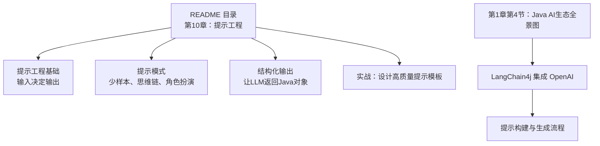
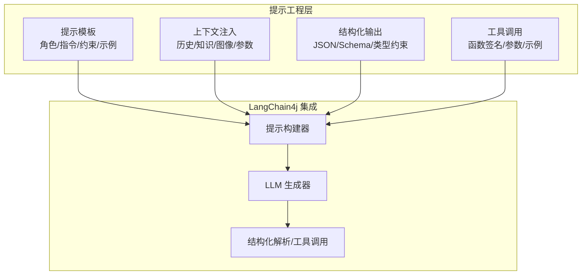
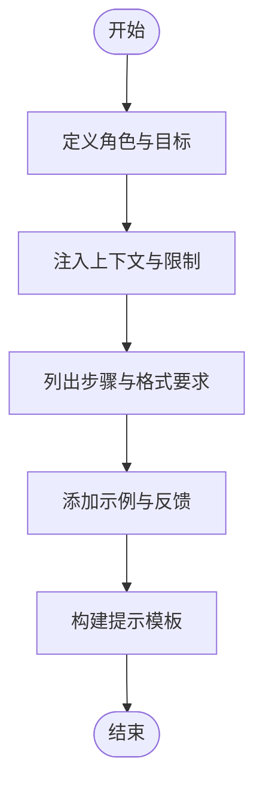
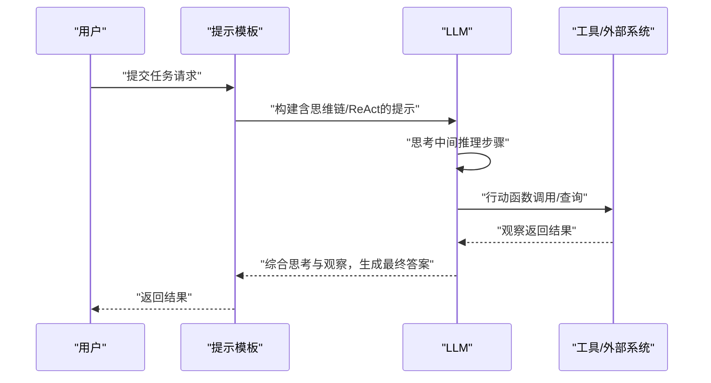
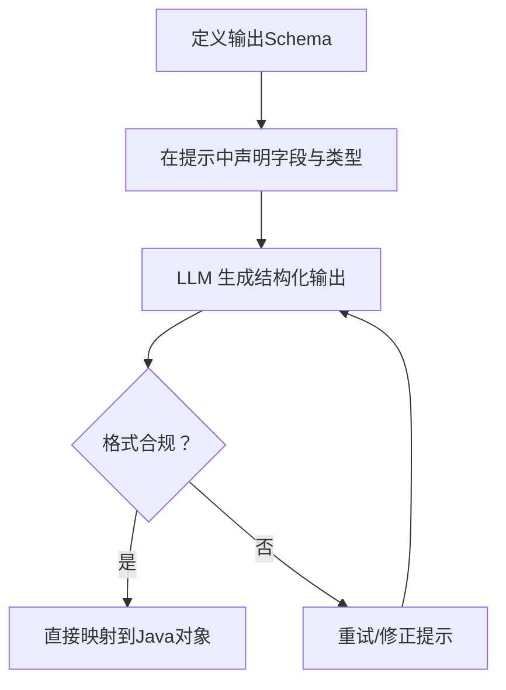
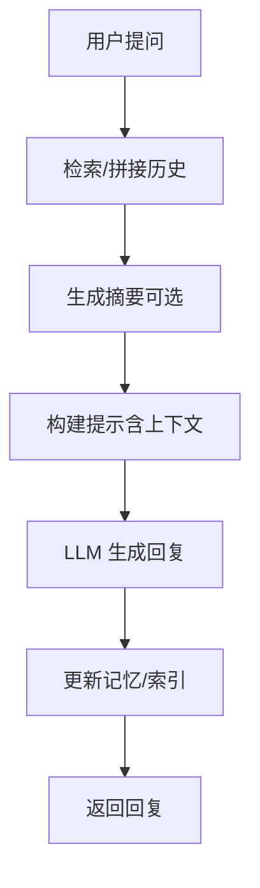
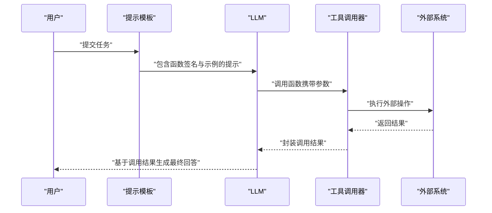
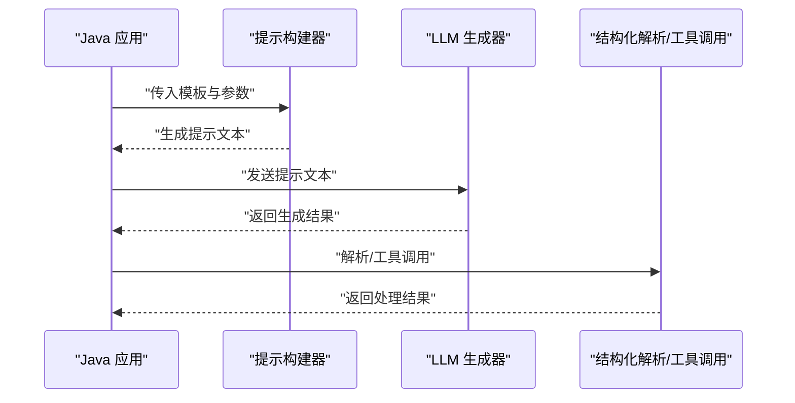
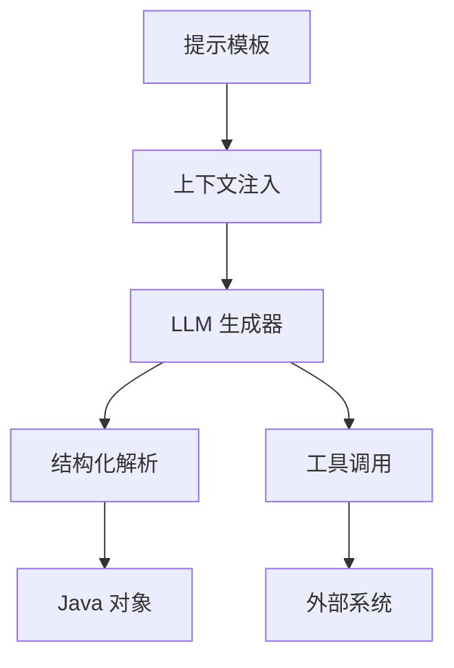

# 提示工程

<cite>
**本文引用的文件**
- [README.md](file://book/README.md)
- [03-first-ai-environment.md](file://book/part1-deep-learning/chapter-01/03-first-ai-environment.md)
- [04-java-ai-ecosystem.md](file://book/part1-deep-learning/chapter-01/04-java-ai-ecosystem.md)
</cite>

## 目录
1. [引言](#引言)
2. [项目结构](#项目结构)
3. [核心组件](#核心组件)
4. [架构总览](#架构总览)
5. [详细组件分析](#详细组件分析)
6. [依赖分析](#依赖分析)
7. [性能考量](#性能考量)
8. [故障排查指南](#故障排查指南)
9. [结论](#结论)
10. [附录](#附录)

## 引言
本章节围绕“提示工程”展开，系统阐述提示设计的原则、结构化模板与高质量提示的构建方法，并结合LangChain4j在Java中的应用，给出可落地的实践路径。内容覆盖：
- 提示设计原则与结构化模板
- 分类、生成、推理、编程等任务的提示策略
- 高阶提示技术：思维链（Chain-of-Thought）、推理-行动（ReAct）
- 结构化输出与类型安全
- 多轮对话、工具调用与记忆增强的提示设计
- 提示效果评估、迭代优化与调试技巧

## 项目结构
该仓库以“书稿”形式组织内容，提示工程相关内容在目录中明确指向第10章“提示工程——与AI有效沟通的艺术”。同时，第1章第4节“Java AI生态全景图”展示了LangChain4j在项目中的定位与使用方式。

图表来源
- [README.md:97-104](file://book/README.md#L97-L104)
- [04-java-ai-ecosystem.md:339-340](file://book/part1-deep-learning/chapter-01/04-java-ai-ecosystem.md#L339-L340)

章节来源
- [README.md:97-104](file://book/README.md#L97-L104)

## 核心组件
- 提示模板与结构化提示
  - 通过明确的角色、上下文、指令与约束，形成稳定可复用的提示模板，提升一致性与可维护性。
  - 结合少样本示例，引导模型遵循期望的输出格式与风格。
- 高阶提示技术
  - 思维链（Chain-of-Thought）：鼓励模型输出推理中间步骤，提高复杂推理任务的准确性。
  - 推理-行动（ReAct）：在提示中嵌入“思考-行动-观察”的循环，结合工具调用与外部状态更新，实现复杂任务的分步执行。
- 结构化输出
  - 通过JSON Schema、类型约束与格式指令，使LLM输出符合Java对象结构，便于后续解析与处理。
- 多轮对话与记忆
  - 在提示中注入对话历史与上下文摘要，配合记忆模块，维持连贯的交互体验。
- 工具调用与外部系统
  - 将函数签名、参数说明与调用示例纳入提示，使模型能够正确地进行函数调用（Function Calling）。

章节来源
- [README.md:97-104](file://book/README.md#L97-L104)

## 架构总览
下图展示了提示工程在Java应用中的整体流程：从提示模板构建、上下文注入、模型调用，到结构化输出与工具调用的闭环。

图表来源
- [04-java-ai-ecosystem.md:339-340](file://book/part1-deep-learning/chapter-01/04-java-ai-ecosystem.md#L339-L340)

## 详细组件分析

### 组件A：提示模板与结构化提示
- 设计原则
  - 明确角色与职责，减少歧义
  - 清晰指令与约束，避免开放式回答
  - 提供高质量示例，尤其是少样本
  - 对输出格式进行约束（如JSON、列表、固定字段）
- 结构化提示模板
  - 角色与目标：定义模型身份与任务目标
  - 上下文与限制：提供背景信息与边界条件
  - 步骤与格式：分步说明与输出格式要求
  - 示例与反馈：正反示例与修正建议
- 复杂度与性能
  - 模板越大，上下文开销越高；需平衡信息密度与长度
  - 结构化约束可降低后处理成本，提升下游稳定性

图表来源
- [README.md:97-104](file://book/README.md#L97-L104)

章节来源
- [README.md:97-104](file://book/README.md#L97-L104)

### 组件B：高阶提示技术（思维链与ReAct）
- 思维链（Chain-of-Thought）
  - 在推理类任务中，要求模型先输出推理中间步骤，再给出最终答案
  - 适用于数学、逻辑、事实推理等复杂任务
- 推理-行动（ReAct）
  - 在提示中加入“思考-行动-观察-反思”的循环
  - 将工具调用与外部状态更新纳入提示，形成可执行的计划
  - 适合需要多步操作与外部查询的任务

图表来源
- [README.md:129-131](file://book/README.md#L129-L131)

章节来源
- [README.md:129-131](file://book/README.md#L129-L131)

### 组件C：结构化输出与类型安全
- 目标
  - 通过格式约束与Schema，确保LLM输出可被稳定解析为Java对象
- 方法
  - 在提示中声明输出结构（字段、类型、取值范围）
  - 使用JSON Schema或类似约束，限定输出格式
  - 对异常输出进行回退与重试
- 复杂度与性能
  - 结构化约束会增加提示长度，但显著降低解析与校验成本

图表来源
- [README.md:100-102](file://book/README.md#L100-L102)

章节来源
- [README.md:100-102](file://book/README.md#L100-L102)

### 组件D：多轮对话与记忆增强
- 设计要点
  - 在提示中注入对话历史摘要与关键上下文
  - 控制历史长度，避免上下文溢出
  - 使用记忆模块存储重要信息，减少重复注入
- 复杂度与性能
  - 历史越长，上下文开销越大；需定期摘要与清理

图表来源
- [README.md:136-139](file://book/README.md#L136-L139)

章节来源
- [README.md:136-139](file://book/README.md#L136-L139)

### 组件E：工具调用与外部系统集成
- 设计要点
  - 在提示中提供函数签名、参数说明与调用示例
  - 明确错误处理与回退策略
  - 对工具调用结果进行二次提示与验证
- 复杂度与性能
  - 工具调用会增加往返延迟；应尽量合并调用与缓存结果

图表来源
- [README.md:121-125](file://book/README.md#L121-L125)

章节来源
- [README.md:121-125](file://book/README.md#L121-L125)

### 组件F：LangChain4j 在Java中的应用
- 核心能力
  - 提示构建与模板化
  - LLM生成器与响应解析
  - 工具调用与外部系统集成
- 典型流程
  - 通过提示构建器组装角色、上下文、指令与约束
  - 调用LLM生成器获取响应
  - 对结构化输出进行解析或触发工具调用

图表来源
- [04-java-ai-ecosystem.md:339-340](file://book/part1-deep-learning/chapter-01/04-java-ai-ecosystem.md#L339-L340)

章节来源
- [04-java-ai-ecosystem.md:339-340](file://book/part1-deep-learning/chapter-01/04-java-ai-ecosystem.md#L339-L340)

## 依赖分析
- 模块耦合
  - 提示模板与上下文注入紧密耦合，共同决定输出质量
  - 结构化输出与解析器存在强依赖，需保持Schema与实现一致
  - 工具调用与外部系统存在间接依赖，需关注可用性与稳定性
- 外部依赖
  - LLM服务（如OpenAI）的可用性与速率限制
  - LangChain4j版本与功能兼容性
- 潜在风险
  - 上下文过长导致性能下降
  - 结构化输出失败引发的回退与重试风暴

图表来源
- [04-java-ai-ecosystem.md:339-340](file://book/part1-deep-learning/chapter-01/04-java-ai-ecosystem.md#L339-L340)

章节来源
- [04-java-ai-ecosystem.md:339-340](file://book/part1-deep-learning/chapter-01/04-java-ai-ecosystem.md#L339-L340)

## 性能考量
- 上下文长度控制
  - 通过摘要与分段减少上下文长度，避免超出模型上下文窗口
- 输出格式约束
  - 结构化输出可减少后处理与重试次数，提升吞吐
- 工具调用优化
  - 合并调用、缓存结果、降级策略，降低端到端延迟
- 批量与并发
  - 合理批处理与并发度，避免LLM服务限流

## 故障排查指南
- 提示无响应或响应异常
  - 检查提示长度与格式，确认上下文未超限
  - 校验结构化输出Schema与解析逻辑
- 工具调用失败
  - 核对外部系统可用性与鉴权
  - 检查函数签名与参数类型
- 输出不稳定
  - 固定随机种子，统一提示模板
  - 引入回退与重试机制，记录失败样本

## 结论
提示工程是将人类意图转化为机器可执行指令的关键桥梁。通过结构化模板、高阶提示技术与LangChain4j的集成，可在Java应用中实现稳定、可复用且高性能的提示系统。建议以任务为导向，逐步完善模板、评估与优化流程，持续迭代以获得更优效果。

## 附录
- 任务类型与提示策略概览
  - 分类：明确类别与判别标准，提供正反示例
  - 生成：设定风格、长度与格式约束
  - 推理：使用思维链，要求中间步骤
  - 编程：提供语言规范、错误处理与样例
- 最佳实践清单
  - 明确角色与目标
  - 提供高质量示例
  - 约束输出格式
  - 控制上下文长度
  - 建立评估与回退机制
  - 持续迭代与监控