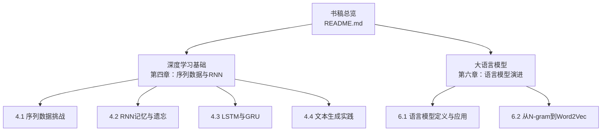
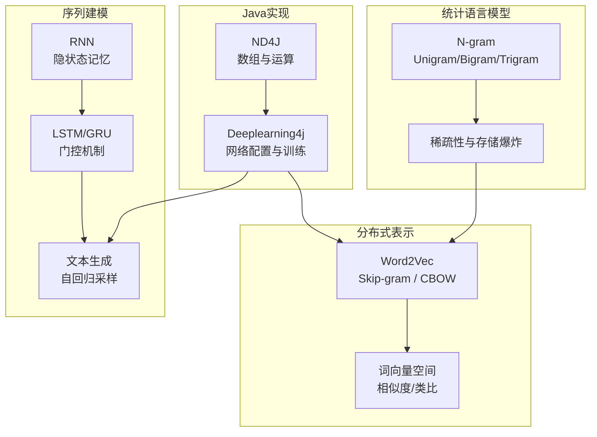
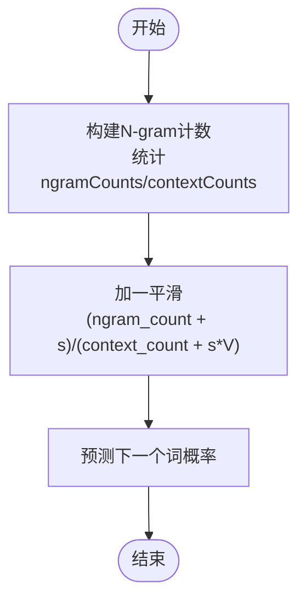
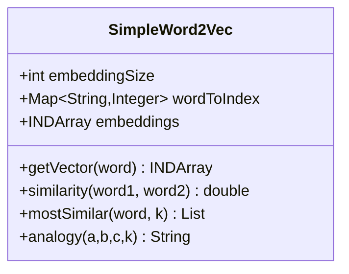
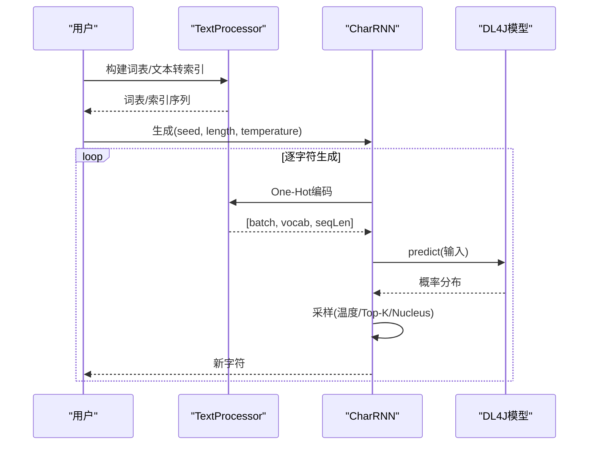
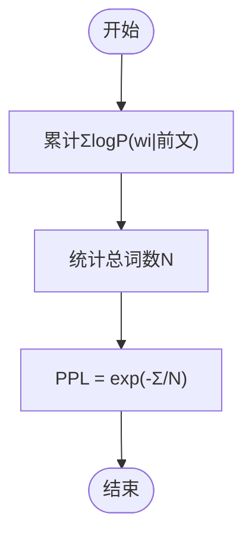
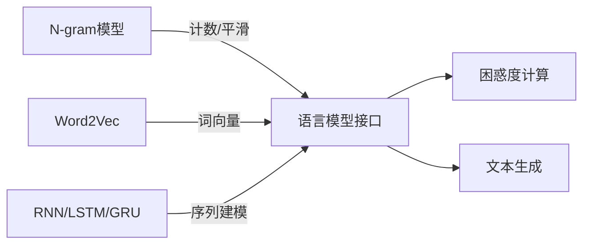

# 语言模型演进

<cite>
**本文引用的文件**
- [README.md](file://book/README.md)
- [01-what-is-language-model.md](file://book/part2-llm/chapter-06/01-what-is-language-model.md)
- [02-ngram-to-word2vec.md](file://book/part2-llm/chapter-06/02-ngram-to-word2vec.md)
- [01-sequence-data-challenge.md](file://book/part1-deep-learning/chapter-04/01-sequence-data-challenge.md)
- [02-rnn-memory-and-forgetting.md](file://book/part1-deep-learning/chapter-04/02-rnn-memory-and-forgetting.md)
- [03-lstm-and-gru.md](file://book/part1-deep-learning/chapter-04/03-lstm-and-gru.md)
- [04-text-generation-practice.md](file://book/part1-deep-learning/chapter-04/04-text-generation-practice.md)
</cite>

## 目录
1. 引言
2. 项目结构
3. 核心组件
4. 架构总览
5. 详细组件分析
6. 依赖分析
7. 性能考虑
8. 故障排查指南
9. 结论
10. 附录

## 引言
本章节围绕“语言模型演进”主题，系统梳理从统计语言模型到分布式表示与上下文感知语言表示的发展脉络，重点涵盖：
- 传统统计语言模型（N-gram）的原理、局限与评估指标
- 神经网络语言模型（NNLM）与词嵌入（Word2Vec）的引入
- Skip-gram与CBOW两种架构及其实现要点
- 从静态词向量到动态上下文相关表示的演进趋势
- 在Java生态（Deeplearning4j、ND4J）中实现与使用语言模型技术的实践路径

## 项目结构
该仓库以“书稿章节”的形式组织内容，语言模型演进相关内容主要分布在两部分：
- 第一部分“深度学习基础”中的第四章，系统讲解序列数据与RNN/LSTM/GRU的建模思想与实现
- 第二部分“大语言模型”中的第六章，聚焦语言模型定义、发展历程、评估指标与词嵌入技术

图表来源
- [README.md:30-111](file://book/README.md#L30-L111)
- [01-sequence-data-challenge.md:1-350](file://book/part1-deep-learning/chapter-04/01-sequence-data-challenge.md#L1-L350)
- [02-rnn-memory-and-forgetting.md:1-375](file://book/part1-deep-learning/chapter-04/02-rnn-memory-and-forgetting.md#L1-L375)
- [03-lstm-and-gru.md:1-365](file://book/part1-deep-learning/chapter-04/03-lstm-and-gru.md#L1-L365)
- [04-text-generation-practice.md:1-533](file://book/part1-deep-learning/chapter-04/04-text-generation-practice.md#L1-L533)
- [01-what-is-language-model.md:1-263](file://book/part2-llm/chapter-06/01-what-is-language-model.md#L1-L263)
- [02-ngram-to-word2vec.md:1-465](file://book/part2-llm/chapter-06/02-ngram-to-word2vec.md#L1-L465)

章节来源
- [README.md:30-111](file://book/README.md#L30-L111)

## 核心组件
- 语言模型定义与评估：困惑度（Perplexity）、句子概率计算、预测接口抽象
- 统计语言模型：N-gram（Unigram/Bigram/Trigram）及其平滑与稀疏性问题
- 分布式表示与词嵌入：分布式假设、Word2Vec（Skip-gram/CBOW）、相似度与类比
- 序列建模基础：RNN/LSTM/GRU的结构与实现要点，文本生成流水线
- Java实现要点：ND4J数组、Deeplearning4j网络配置、One-Hot编码、采样策略

章节来源
- [01-what-is-language-model.md:11-263](file://book/part2-llm/chapter-06/01-what-is-language-model.md#L11-L263)
- [02-ngram-to-word2vec.md:19-135](file://book/part2-llm/chapter-06/02-ngram-to-word2vec.md#L19-L135)
- [02-ngram-to-word2vec.md:206-329](file://book/part2-llm/chapter-06/02-ngram-to-word2vec.md#L206-L329)
- [01-sequence-data-challenge.md:140-232](file://book/part1-deep-learning/chapter-04/01-sequence-data-challenge.md#L140-L232)
- [02-rnn-memory-and-forgetting.md:48-79](file://book/part1-deep-learning/chapter-04/02-rnn-memory-and-forgetting.md#L48-L79)
- [03-lstm-and-gru.md:87-133](file://book/part1-deep-learning/chapter-04/03-lstm-and-gru.md#L87-L133)
- [04-text-generation-practice.md:56-144](file://book/part1-deep-learning/chapter-04/04-text-generation-practice.md#L56-L144)

## 架构总览
语言模型演进的总体路线：从N-gram统计模型到分布式表示（Word2Vec），再到基于注意力机制的上下文感知模型（Transformer）。在Java环境下，可通过ND4J进行数值计算，通过Deeplearning4j构建与训练序列模型与词嵌入模型。

图表来源
- [01-what-is-language-model.md:79-108](file://book/part2-llm/chapter-06/01-what-is-language-model.md#L79-L108)
- [02-ngram-to-word2vec.md:137-145](file://book/part2-llm/chapter-06/02-ngram-to-word2vec.md#L137-L145)
- [02-ngram-to-word2vec.md:183-194](file://book/part2-llm/chapter-06/02-ngram-to-word2vec.md#L183-L194)
- [01-sequence-data-challenge.md:117-139](file://book/part1-deep-learning/chapter-04/01-sequence-data-challenge.md#L117-L139)
- [02-rnn-memory-and-forgetting.md:48-79](file://book/part1-deep-learning/chapter-04/02-rnn-memory-and-forgetting.md#L48-L79)
- [03-lstm-and-gru.md:87-133](file://book/part1-deep-learning/chapter-04/03-lstm-and-gru.md#L87-L133)
- [04-text-generation-practice.md:283-370](file://book/part1-deep-learning/chapter-04/04-text-generation-practice.md#L283-L370)

## 详细组件分析

### 组件A：N-gram统计语言模型
- 核心思想：基于前N-1个词预测第N个词，链式分解联合概率
- 实现要点：统计N-gram与上下文计数、加一平滑（Laplace Smoothing）缓解稀疏性
- 局限性：存储与计算复杂度随N指数增长；无法泛化未见组合；上下文无关的静态表示

图表来源
- [02-ngram-to-word2vec.md:44-77](file://book/part2-llm/chapter-06/02-ngram-to-word2vec.md#L44-L77)

章节来源
- [02-ngram-to-word2vec.md:19-135](file://book/part2-llm/chapter-06/02-ngram-to-word2vec.md#L19-L135)
- [02-ngram-to-word2vec.md:137-145](file://book/part2-llm/chapter-06/02-ngram-to-word2vec.md#L137-L145)

### 组件B：词向量与Word2Vec
- 分布式假设：出现在相似上下文中的词具有相似含义
- 两种架构：
  - Skip-gram：以中心词预测上下文，适合高频词与细粒度语义
  - CBOW：以上下文预测中心词，适合稳定语义与快速训练
- 实现要点：词嵌入矩阵、余弦相似度、词类比（向量运算）

图表来源
- [02-ngram-to-word2vec.md:218-329](file://book/part2-llm/chapter-06/02-ngram-to-word2vec.md#L218-L329)

章节来源
- [02-ngram-to-word2vec.md:183-194](file://book/part2-llm/chapter-06/02-ngram-to-word2vec.md#L183-L194)
- [02-ngram-to-word2vec.md:206-329](file://book/part2-llm/chapter-06/02-ngram-to-word2vec.md#L206-L329)

### 组件C：序列建模与文本生成（RNN/LSTM/GRU）
- RNN：通过隐状态记忆历史信息，参数共享，适合变长序列
- LSTM/GRU：引入门控机制，缓解梯度消失，更好建模长期依赖
- 文本生成：字符级RNN，One-Hot编码，自回归采样（贪婪/温度/Top-K/Nucleus）

图表来源
- [04-text-generation-practice.md:56-144](file://book/part1-deep-learning/chapter-04/04-text-generation-practice.md#L56-L144)
- [04-text-generation-practice.md:148-281](file://book/part1-deep-learning/chapter-04/04-text-generation-practice.md#L148-L281)
- [04-text-generation-practice.md:283-370](file://book/part1-deep-learning/chapter-04/04-text-generation-practice.md#L283-L370)

章节来源
- [01-sequence-data-challenge.md:140-232](file://book/part1-deep-learning/chapter-04/01-sequence-data-challenge.md#L140-L232)
- [02-rnn-memory-and-forgetting.md:48-79](file://book/part1-deep-learning/chapter-04/02-rnn-memory-and-forgetting.md#L48-L79)
- [03-lstm-and-gru.md:87-133](file://book/part1-deep-learning/chapter-04/03-lstm-and-gru.md#L87-L133)
- [04-text-generation-practice.md:56-144](file://book/part1-deep-learning/chapter-04/04-text-generation-practice.md#L56-L144)

### 组件D：语言模型评估与困惑度
- 困惑度（Perplexity）：衡量模型预测的“困惑程度”，越低越好
- 计算流程：对句子逐词计算对数概率，取指数平均

图表来源
- [01-what-is-language-model.md:125-147](file://book/part2-llm/chapter-06/01-what-is-language-model.md#L125-L147)

章节来源
- [01-what-is-language-model.md:111-159](file://book/part2-llm/chapter-06/01-what-is-language-model.md#L111-L159)

## 依赖分析
- 统计模型依赖：N-gram计数、平滑策略
- 分布式表示依赖：上下文窗口、词嵌入矩阵、相似度计算
- 序列模型依赖：ND4J数组、DL4J层配置（Embedding/LSTM/RNNOutput）
- 评估指标依赖：语言模型接口（predictNext/sentenceProbability）

图表来源
- [02-ngram-to-word2vec.md:44-77](file://book/part2-llm/chapter-06/02-ngram-to-word2vec.md#L44-L77)
- [01-what-is-language-model.md:34-49](file://book/part2-llm/chapter-06/01-what-is-language-model.md#L34-L49)
- [04-text-generation-practice.md:212-226](file://book/part1-deep-learning/chapter-04/04-text-generation-practice.md#L212-L226)

章节来源
- [01-what-is-language-model.md:34-49](file://book/part2-llm/chapter-06/01-what-is-language-model.md#L34-L49)
- [04-text-generation-practice.md:212-226](file://book/part1-deep-learning/chapter-04/04-text-generation-practice.md#L212-L226)

## 性能考虑
- N-gram稀疏性与存储爆炸：通过平滑与降N缓解，但泛化能力有限
- 词向量维度与相似度计算：合理维度（100-300）兼顾表达力与效率
- 序列模型的长期依赖：LSTM/GRU优于RNN，注意梯度裁剪与优化器选择
- 文本生成采样策略：温度采样控制创造性，Top-K/Nucleus提升多样性与质量

## 故障排查指南
- 训练不稳定或发散
  - 检查学习率与优化器配置
  - 确认One-Hot编码与输入形状一致
  - 参考序列建模章节的训练流程与采样策略
- 生成内容质量差
  - 调整温度参数或尝试Top-K/Nucleus采样
  - 增加训练轮次与数据规模
- 词向量无意义或相似度异常
  - 检查词表构建与OOV处理
  - 确认向量维度与归一化

章节来源
- [04-text-generation-practice.md:470-508](file://book/part1-deep-learning/chapter-04/04-text-generation-practice.md#L470-L508)
- [02-ngram-to-word2vec.md:386-415](file://book/part2-llm/chapter-06/02-ngram-to-word2vec.md#L386-L415)

## 结论
语言模型从N-gram的统计经验走向分布式表示与上下文感知的神经网络，体现了从“规则”到“学习”的范式转移。词嵌入（尤其是Word2Vec）为后续预训练语言模型奠定了基础；而RNN/LSTM/GRU则提供了序列数据的建模骨架。在Java生态中，ND4J与Deeplearning4j为实现与工程化落地提供了坚实支撑。

## 附录
- 评估指标：困惑度（Perplexity）的直观理解与计算
- 应用场景：生成、翻译、识别、输入法预测等
- 发展时间线：从N-gram到Transformer再到大语言模型

章节来源
- [01-what-is-language-model.md:79-108](file://book/part2-llm/chapter-06/01-what-is-language-model.md#L79-L108)
- [01-what-is-language-model.md:149-159](file://book/part2-llm/chapter-06/01-what-is-language-model.md#L149-L159)