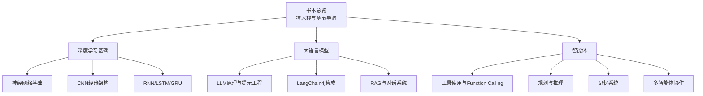
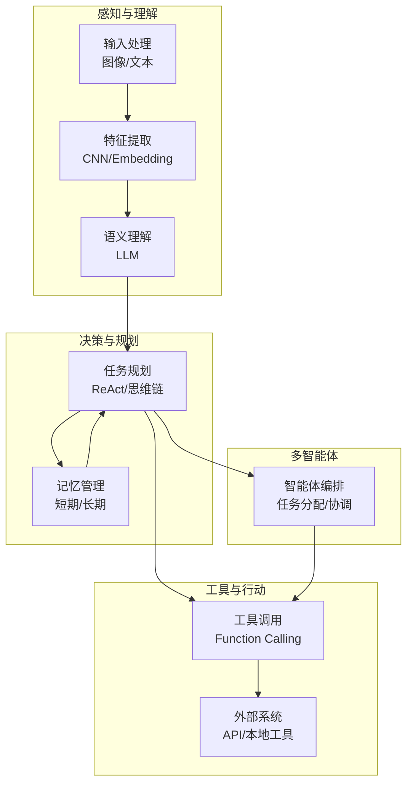
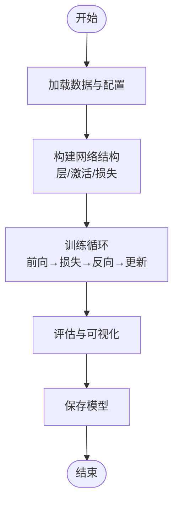
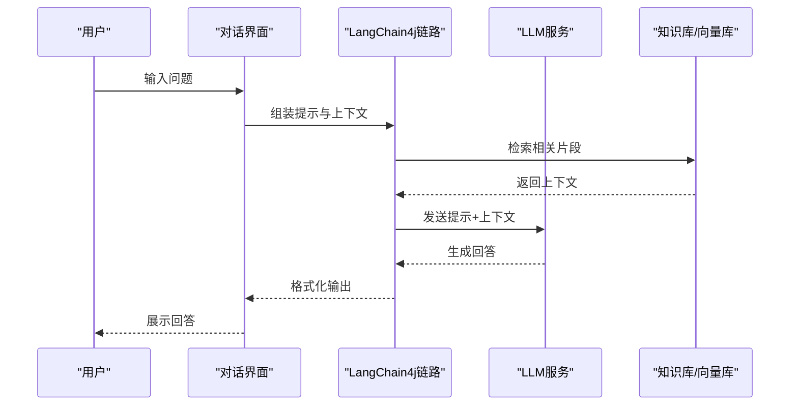
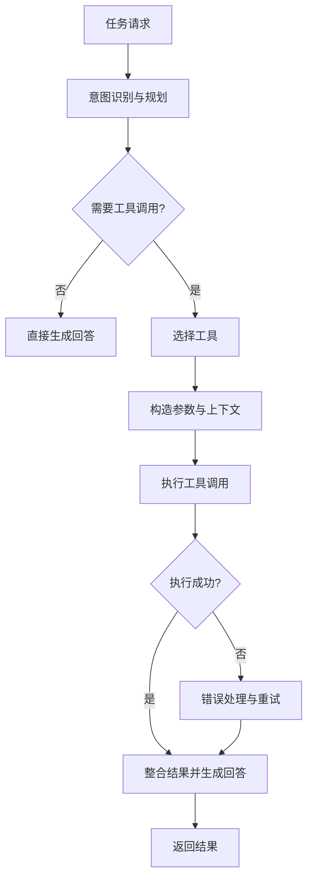
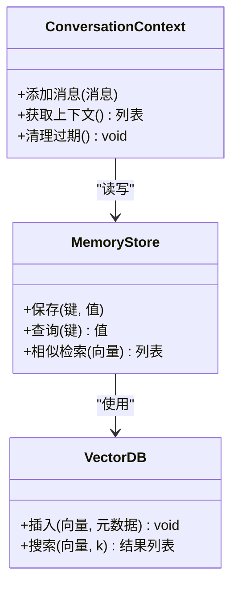
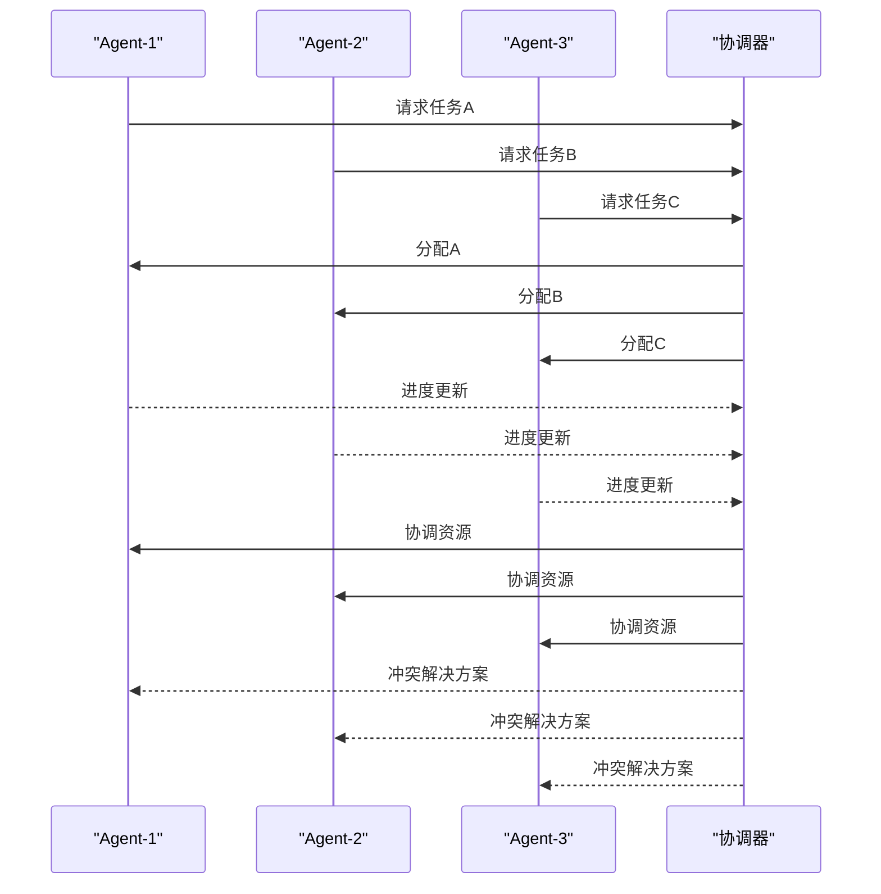
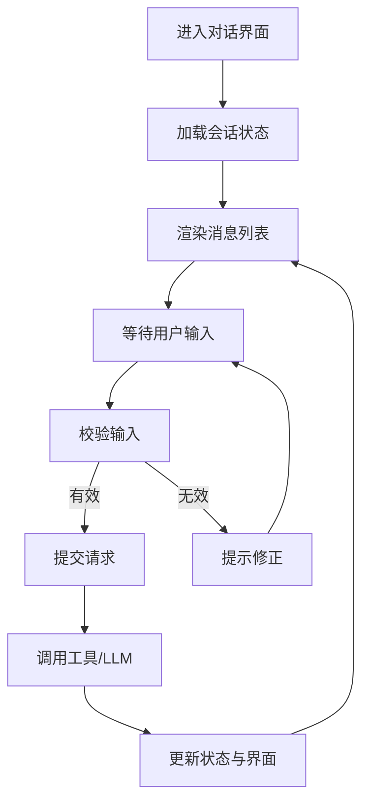
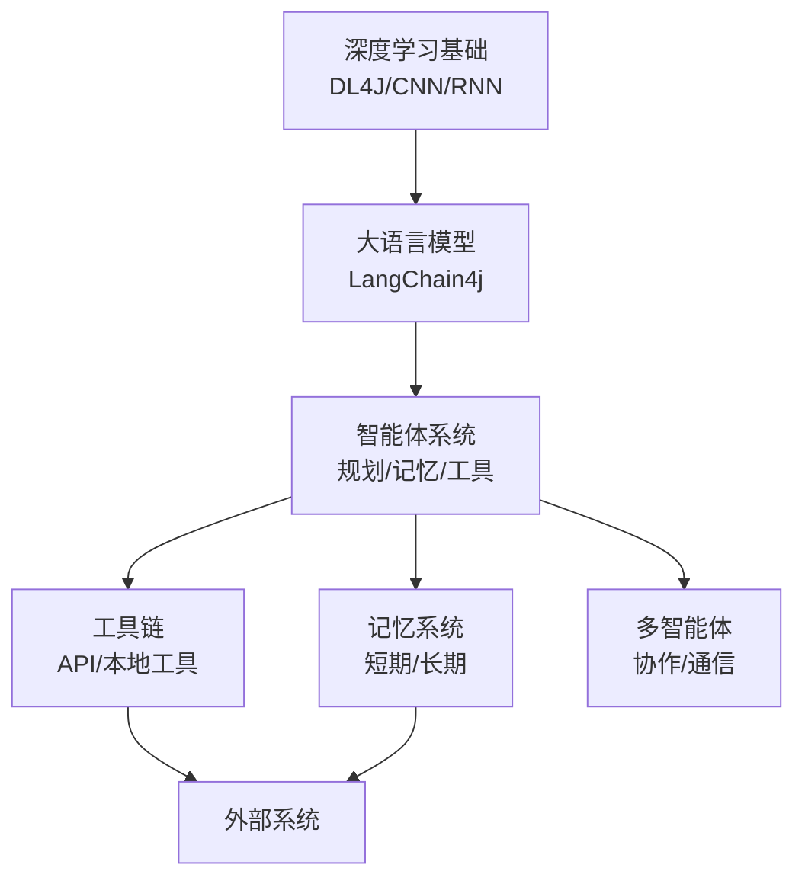

# 个人AI助手

<cite>
**本文引用的文件**
- [README.md](file://book/README.md)
- [01-why-java-ai.md](file://book/part1-deep-learning/chapter-01/01-why-java-ai.md)
- [02-what-is-deep-learning.md](file://book/part1-deep-learning/chapter-01/02-what-is-deep-learning.md)
- [03-first-ai-environment.md](file://book/part1-deep-learning/chapter-01/03-first-ai-environment.md)
- [02-forward-propagation.md](file://book/part1-deep-learning/chapter-02/02-forward-propagation.md)
- [03-backpropagation.md](file://book/part1-deep-learning/chapter-02/03-backpropagation.md)
- [04-first-neural-network-dl4j.md](file://book/part1-deep-learning/chapter-02/04-first-neural-network-dl4j.md)
- [01-image-recognition-problem.md](file://book/part1-deep-learning/chapter-03/01-image-recognition-problem.md)
- [04-classic-cnn-architectures.md](file://book/part1-deep-learning/chapter-03/04-classic-cnn-architectures.md)
- [05-build-image-classifier.md](file://book/part1-deep-learning/chapter-03/05-build-image-classifier.md)
- [01-sequence-data-challenge.md](file://book/part1-deep-learning/chapter-04/01-sequence-data-challenge.md)
- [02-rnn-memory-and-forgetting.md](file://book/part1-deep-learning/chapter-04/02-rnn-memory-and-forgetting.md)
- [03-lstm-and-gru.md](file://book/part1-deep-learning/chapter-04/03-lstm-and-gru.md)
- [04-text-generation-practice.md](file://book/part1-deep-learning/chapter-04/04-text-generation-practice.md)
- [05-design-thinking-sequential-modeling.md](file://book/part1-deep-learning/chapter-04/05-design-thinking-sequential-modeling.md)
</cite>

## 目录
1. [引言](#引言)
2. [项目结构](#项目结构)
3. [核心组件](#核心组件)
4. [架构总览](#架构总览)
5. [详细组件分析](#详细组件分析)
6. [依赖分析](#依赖分析)
7. [性能考虑](#性能考虑)
8. [故障排查指南](#故障排查指南)
9. [结论](#结论)
10. [附录](#附录)

## 引言
本项目围绕“个人AI助手”的系统设计与实现展开，结合深度学习、大语言模型（LLM）与智能体（Agent）能力，形成从感知、理解、规划、记忆到行动的闭环。项目以Java生态为核心，强调工程化落地与企业级集成能力，提供从环境搭建、模型训练、工具链编排到用户界面与部署优化的完整路径。

## 项目结构
项目采用分层组织方式：
- 第一部分：深度学习基础（神经网络、前向/反向传播、CNN、RNN/LSTM/GRU）
- 第二部分：大语言模型（LLM原理、LangChain4j集成、提示工程、RAG、对话系统）
- 第三部分：智能体（工具使用、规划与推理、记忆系统、多智能体协作）

**图表来源**
- [README.md:30-111](file://book/README.md#L30-L111)

**章节来源**
- [README.md:1-187](file://book/README.md#L1-L187)

## 核心组件
- 深度学习基础：涵盖神经网络、CNN、RNN/LSTM/GRU的原理与Java实现要点，为后续LLM与智能体提供底层能力支撑。
- 大语言模型：基于LangChain4j实现LLM集成、提示工程、RAG与对话系统，强调与Java工程实践的结合。
- 智能体：围绕工具使用、任务规划、记忆管理与多智能体协作，构建可扩展的Agent系统。

**章节来源**
- [README.md:170-177](file://book/README.md#L170-L177)

## 架构总览
个人AI助手的整体架构分为三层：
- 感知与理解层：图像/文本输入经预处理与特征提取，结合LLM进行语义理解与意图识别。
- 决策与规划层：基于规划与推理框架（如ReAct）生成任务计划，并结合记忆系统进行上下文管理。
- 工具与行动层：通过Function Calling调用外部API或本地工具，完成对外部世界的操作；多智能体协同完成复杂任务。

[此图为概念性架构示意，不直接对应具体源码文件，故无图表来源]

## 详细组件分析

### 深度学习基础（神经网络、CNN、RNN/LSTM/GRU）
- 神经网络：前向传播与反向传播的数学推导与向量化实现，强调权重初始化、激活函数与损失函数的选择。
- CNN：经典架构（LeNet、AlexNet、ResNet）的设计思想与DL4J实现要点，突出特征金字塔、残差连接与批归一化。
- RNN/LSTM/GRU：时序建模的核心机制，重点解释长期依赖问题、梯度消失与门控机制（遗忘门、输入门、输出门）。

**图表来源**
- [04-first-neural-network-dl4j.md:57-149](file://book/part1-deep-learning/chapter-02/04-first-neural-network-dl4j.md#L57-L149)

**章节来源**
- [02-forward-propagation.md:95-175](file://book/part1-deep-learning/chapter-02/02-forward-propagation.md#L95-L175)
- [03-backpropagation.md:75-183](file://book/part1-deep-learning/chapter-02/03-backpropagation.md#L75-L183)
- [04-first-neural-network-dl4j.md:57-149](file://book/part1-deep-learning/chapter-02/04-first-neural-network-dl4j.md#L57-L149)
- [01-image-recognition-problem.md:93-130](file://book/part1-deep-learning/chapter-03/01-image-recognition-problem.md#L93-L130)
- [04-classic-cnn-architectures.md:41-104](file://book/part1-deep-learning/chapter-03/04-classic-cnn-architectures.md#L41-L104)
- [05-build-image-classifier.md:191-322](file://book/part1-deep-learning/chapter-03/05-build-image-classifier.md#L191-L322)
- [01-sequence-data-challenge.md:117-139](file://book/part1-deep-learning/chapter-04/01-sequence-data-challenge.md#L117-L139)
- [02-rnn-memory-and-forgetting.md:46-79](file://book/part1-deep-learning/chapter-04/02-rnn-memory-and-forgetting.md#L46-L79)
- [03-lstm-and-gru.md:81-133](file://book/part1-deep-learning/chapter-04/03-lstm-and-gru.md#L81-L133)

### 大语言模型（LLM、LangChain4j、提示工程、RAG、对话系统）
- LLM原理与提示工程：强调提示模板设计、结构化输出与提示即编程的理念。
- LangChain4j集成：展示如何在Java环境中调用LLM、构建链路与处理响应。
- RAG与对话系统：结合检索增强与对话管理，实现上下文感知的问答与对话能力。

[此图为概念性流程示意，不直接对应具体源码文件，故无图表来源]

**章节来源**
- [README.md:69-111](file://book/README.md#L69-L111)

### 工具集成（Function Calling、外部API、本地工具）
- Function Calling：LLM调用函数的能力，强调工具定义、注册与安全控制。
- 外部API与本地工具：通过统一接口对接数据库、文件系统、第三方服务等，实现Agent对外部世界的操作。
- 工具链编排：将多个工具组合为复杂流程，支持条件分支与错误恢复。

[此图为概念性流程示意，不直接对应具体源码文件，故无图表来源]

**章节来源**
- [README.md:112-147](file://book/README.md#L112-L147)

### 记忆系统（短期/长期记忆、对话记忆、向量数据库）
- 短期记忆与长期记忆：区分即时上下文与持久知识，支持快速检索与长期存储。
- 对话记忆管理：维护多轮对话状态，避免上下文膨胀。
- 向量数据库：作为“记忆仓库”，支持相似度检索与语义搜索。

[此图为概念性类图示意，不直接对应具体源码文件，故无图表来源]

**章节来源**
- [README.md:134-147](file://book/README.md#L134-L147)

### 多智能体协作（角色定义、通信协议、冲突解决）
- 角色定义与协作模式：明确各Agent职责，设计任务分解与子任务依赖。
- 通信协议与消息传递：统一消息格式与路由，保障跨Agent协作一致性。
- 冲突解决：在资源竞争与目标不一致时，通过协商与仲裁达成共识。

[此图为概念性时序示意，不直接对应具体源码文件，故无图表来源]

**章节来源**
- [README.md:141-147](file://book/README.md#L141-L147)

### 用户界面与交互设计（对话界面、状态管理、体验优化）
- 对话界面：支持多轮对话、消息渲染、输入校验与反馈。
- 状态管理：维护用户会话状态、工具调用状态与错误状态。
- 体验优化：加载提示、进度反馈、错误引导与可回溯操作。

[此图为概念性流程示意，不直接对应具体源码文件，故无图表来源]

**章节来源**
- [README.md:148-154](file://book/README.md#L148-L154)

## 依赖分析
- 技术栈与依赖：Java 17+、Deeplearning4j、LangChain4j、Maven/Gradle、向量数据库（Milvus/Pinecone/Chroma）。
- 模块耦合：深度学习基础为上层LLM与智能体提供底层能力；LLM与工具链共同构成决策与行动中枢；记忆系统与多智能体协作贯穿全流程。

**图表来源**
- [README.md:170-177](file://book/README.md#L170-L177)

**章节来源**
- [README.md:170-177](file://book/README.md#L170-L177)

## 性能考虑
- 训练与推理优化：合理设置学习率、批大小与优化器；使用早停、正则化与数据增强；在推理阶段采用批处理与缓存。
- 硬件与内存：根据任务规模选择CPU/GPU/TPU；合理设置内存上限与本地库加载策略。
- 部署与监控：容器化部署、指标采集与日志分级；对关键路径进行性能剖析与热点优化。

[本节为通用性能建议，不直接分析具体源码文件，故无章节来源]

## 故障排查指南
- 环境问题：JDK版本、Maven依赖解析、本地库加载失败；通过验证测试与依赖检查定位。
- 训练问题：内存不足、学习率不当、梯度消失；通过调整批大小、学习率调度与正则化策略解决。
- 推理问题：模型加载异常、输入格式不匹配；通过日志与断点定位数据预处理与模型接口问题。

**章节来源**
- [03-first-ai-environment.md:385-407](file://book/part1-deep-learning/chapter-01/03-first-ai-environment.md#L385-L407)

## 结论
本项目以Java生态为核心，系统性地构建了从深度学习基础到大语言模型与智能体的完整能力谱系。通过清晰的功能模块划分、严谨的技术选型与工程化实践，为个人AI助手提供了可扩展、可维护、可部署的实现路径。读者可据此快速落地并持续优化，逐步完善自然语言理解、任务规划、记忆管理与工具链编排等核心能力。

[本节为总结性内容，不直接分析具体源码文件，故无章节来源]

## 附录
- 术语表与参考资料：建议结合术语表与参考资料加深对概念与技术演进的理解。
- 实践建议：从简单任务入手，逐步引入工具链与多智能体协作，持续优化性能与用户体验。

**章节来源**
- [README.md:155-159](file://book/README.md#L155-L159)