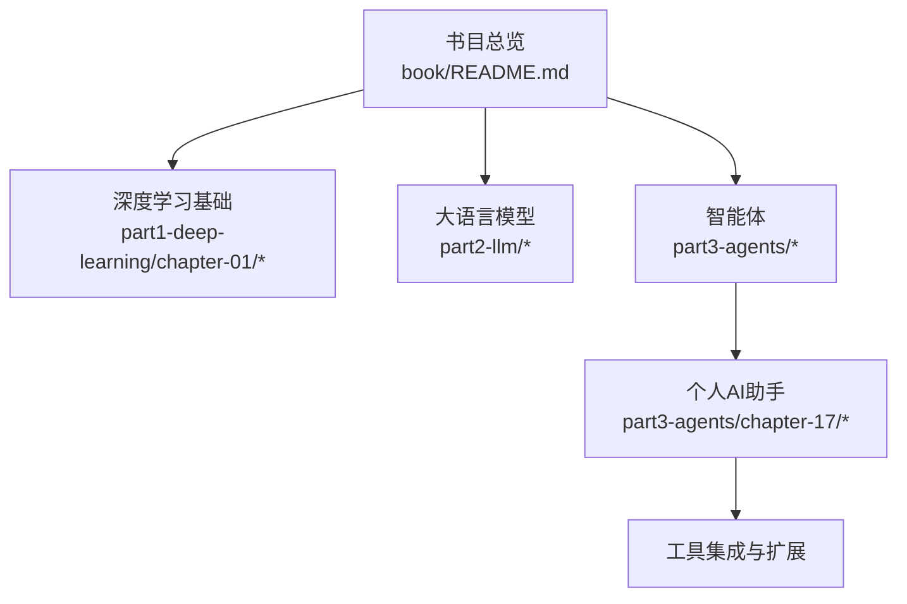
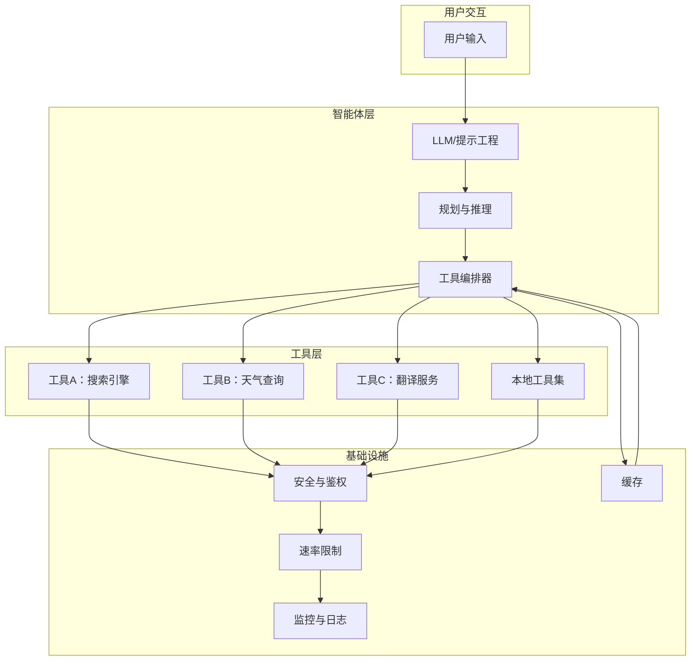
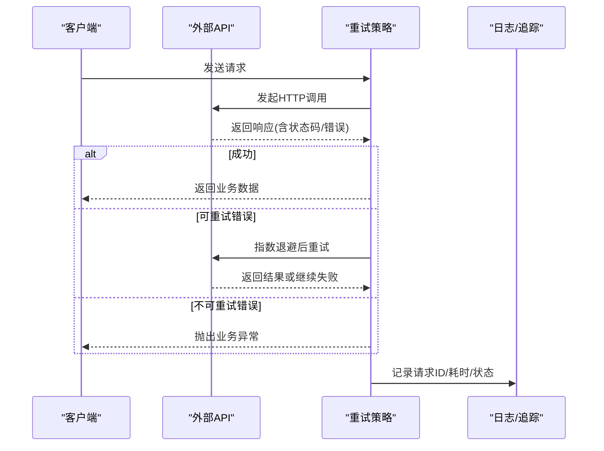
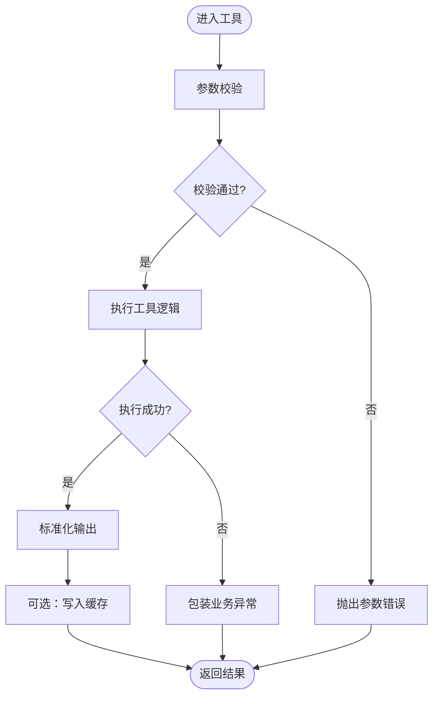
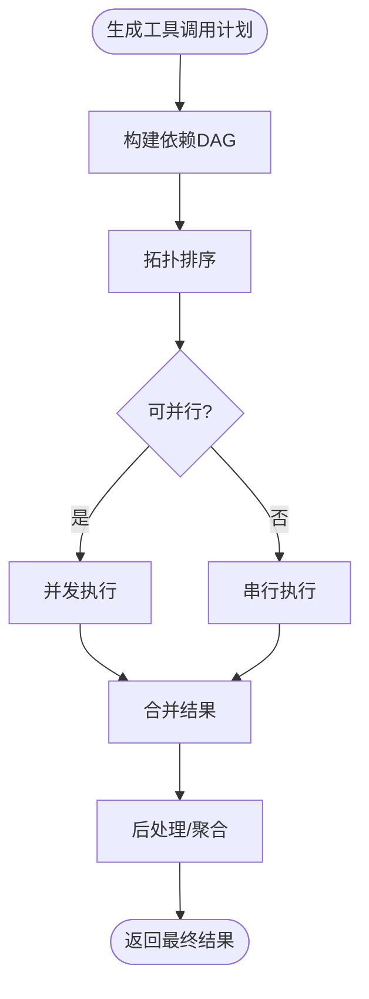
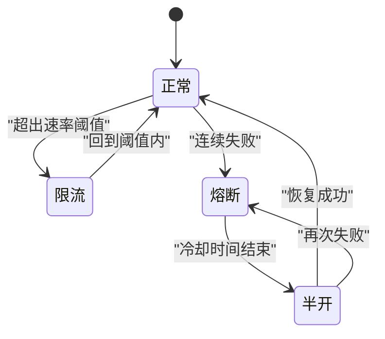
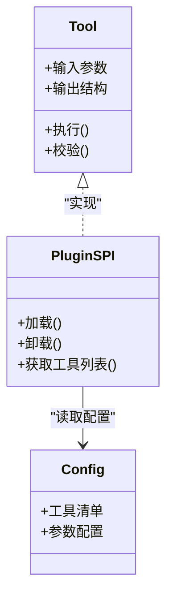
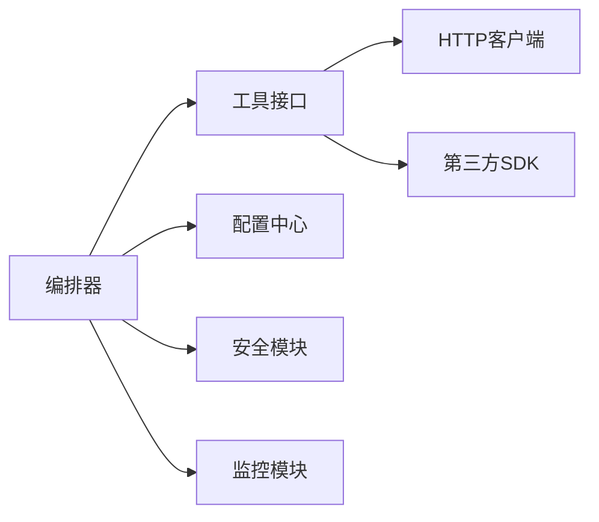

# 工具集成与编排

<cite>
**本文引用的文件**
- [book/README.md](file://book/README.md)
- [book/part1-deep-learning/chapter-01/01-why-java-ai.md](file://book/part1-deep-learning/chapter-01/01-why-java-ai.md)
- [book/part1-deep-learning/chapter-01/02-what-is-deep-learning.md](file://book/part1-deep-learning/chapter-01/02-what-is-deep-learning.md)
- [book/part1-deep-learning/chapter-01/03-first-ai-environment.md](file://book/part1-deep-learning/chapter-01/03-first-ai-environment.md)
</cite>

## 目录
1. [引言](#引言)
2. [项目结构](#项目结构)
3. [核心组件](#核心组件)
4. [架构总览](#架构总览)
5. [详细组件分析](#详细组件分析)
6. [依赖分析](#依赖分析)
7. [性能考量](#性能考量)
8. [故障排查指南](#故障排查指南)
9. [结论](#结论)
10. [附录](#附录)

## 引言
本指南围绕“个人AI助手工具集成与编排”的主题，结合仓库中已提供的内容，系统讲解以下要点：
- 外部API集成技术：HTTP客户端实现、认证机制、错误处理策略
- 本地工具开发：工具接口设计、参数校验、结果处理
- 工具链编排：工具选择算法、执行顺序优化、依赖关系管理
- 典型工具集成示例：搜索引擎、天气查询、翻译服务等
- 工具调用安全：权限控制、速率限制、异常恢复
- 扩展最佳实践：插件架构设计、动态加载机制
- 测试策略与调试技巧：保障稳定性与可靠性

本指南在不展示具体代码的前提下，基于仓库中已有章节进行归纳与延展，帮助读者建立从概念到工程落地的完整知识体系。

## 项目结构
该仓库以图书形式组织内容，围绕Java程序员的AI学习路径展开，重点章节包括：
- 深度学习基础：神经网络、前向/反向传播、训练流程
- 大语言模型：语言模型演进、Transformer、提示工程、OpenAI API实践
- 智能体：工具使用、Function Calling、规划与推理、记忆系统、多智能体协作
- 个人AI助手：项目规划、核心能力、工具集成与扩展、用户界面与交互、部署与优化

**图表来源**
- [book/README.md](file://book/README.md)

**章节来源**
- [book/README.md](file://book/README.md)

## 核心组件
本节从“工具集成与编排”的视角，梳理仓库中与之相关的核心主题与能力模块，并给出工程化落地的实施建议。

- 外部API集成
  - HTTP客户端实现：封装请求/响应、超时与重试、日志与追踪
  - 认证机制：API Key、Bearer Token、OAuth（按需扩展）
  - 错误处理策略：统一异常映射、幂等性与补偿、降级与熔断
- 本地工具开发
  - 工具接口设计：统一签名、输入输出契约、可选参数与默认值
  - 参数校验：类型校验、范围约束、格式校验、必填项检查
  - 结果处理：结构化输出、错误包装、缓存与去重
- 工具链编排
  - 工具选择算法：基于意图识别、上下文匹配、优先级排序
  - 执行顺序优化：依赖拓扑排序、并行化与串行化混合
  - 依赖关系管理：前置条件检查、资源占用与释放
- 安全机制
  - 权限控制：最小权限、白名单与黑名单、访问审计
  - 速率限制：令牌桶/滑动窗口、IP/用户粒度、突发与整形
  - 异常恢复：指数退避重试、告警与熔断、降级策略
- 扩展与测试
  - 插件架构：SPI/接口隔离、配置驱动、热加载
  - 动态加载：类加载器、依赖隔离、生命周期管理
  - 测试策略：单元测试、集成测试、端到端测试、压力与混沌

## 架构总览
下图展示了“个人AI助手”中工具集成与编排的整体架构：LLM负责理解用户意图与生成工具调用计划；编排器根据计划选择工具、管理依赖与顺序；工具执行器负责调用外部API或本地工具；安全与监控贯穿始终。

## 详细组件分析

### 外部API集成（HTTP客户端）
- 请求封装
  - 统一封装HTTP客户端，支持GET/POST/PUT/DELETE
  - 超时与重试：固定间隔或指数退避，区分可重试与不可重试错误
  - 日志与追踪：请求ID、入参/出参、耗时、状态码
- 认证机制
  - API Key：请求头携带或查询参数
  - Bearer Token：Authorization头
  - OAuth：令牌刷新与失效处理
- 错误处理
  - 状态码映射：4xx/5xx分别处理
  - 业务错误：统一错误码与消息包装
  - 幂等性：对可重试请求确保无副作用
  - 降级与熔断：失败阈值触发熔断，快速失败回退

### 本地工具开发（接口设计、参数校验、结果处理）
- 接口设计
  - 统一工具接口：定义输入参数、输出结构、异常类型
  - 可选参数与默认值：避免破坏兼容性
  - 结构化输出：便于后续编排与展示
- 参数校验
  - 必填项检查：空值与空白字符串
  - 类型与范围：数值区间、长度限制、正则匹配
  - 上下文一致性：跨字段依赖与互斥关系
- 结果处理
  - 正常结果：标准化结构，必要时缓存
  - 错误结果：包装为统一异常，保留原始错误
  - 去重与幂等：基于输入指纹或业务键

### 工具链编排（选择、顺序、依赖）
- 工具选择算法
  - 基于意图识别：关键词匹配、分类器打分
  - 上下文匹配：历史对话、用户偏好、设备状态
  - 优先级排序：成功率、耗时、成本、可用性
- 执行顺序优化
  - 依赖拓扑：DAG构建，拓扑排序确定顺序
  - 并行化：无依赖步骤并发执行
  - 串行化：强依赖步骤严格顺序
- 依赖关系管理
  - 前置条件：上游工具输出作为下游输入
  - 资源占用：数据库连接、文件句柄、网络连接的获取与释放
  - 回滚策略：失败时撤销已执行步骤的影响

### 典型工具集成示例
- 搜索引擎
  - 输入：查询关键词、语言、地区、结果数量
  - 输出：标题、摘要、链接列表
  - 安全：限制每分钟请求数、过滤敏感内容
- 天气查询
  - 输入：城市名或经纬度、日期范围
  - 输出：温度、湿度、风速、天气现象
  - 安全：速率限制、缓存热点数据
- 翻译服务
  - 输入：原文、源语言、目标语言
  - 输出：译文、置信度、分段信息
  - 安全：字符数限制、敏感词检测

以上示例均遵循统一的接口设计与错误处理规范，便于在编排器中组合使用。

### 工具调用安全（权限、速率、恢复）
- 权限控制
  - 最小权限：仅授予必要工具与参数
  - 白名单/黑名单：工具与参数级别控制
  - 审计日志：记录谁在何时调用了哪些工具
- 速率限制
  - 令牌桶/滑动窗口：平滑突发流量
  - 粒度：IP、用户、工具、API Key
  - 降级：超过阈值时拒绝或延迟处理
- 异常恢复
  - 指数退避重试：避免雪崩效应
  - 熔断：连续失败触发短路保护
  - 告警：异常阈值触发通知

### 扩展最佳实践（插件架构与动态加载）
- 插件架构
  - 接口隔离：定义清晰的SPI，避免耦合
  - 配置驱动：通过配置文件声明工具清单与参数
  - 生命周期：加载、初始化、运行、销毁
- 动态加载
  - 类加载器：隔离插件依赖，避免冲突
  - 依赖管理：工具间依赖声明与版本约束
  - 热加载：支持插件热部署与灰度发布

## 依赖分析
- 组件耦合与内聚
  - 工具层与编排层通过统一接口解耦，提升内聚性
  - 安全与监控作为横切关注点，被各层复用
- 直接与间接依赖
  - 编排器依赖工具接口与配置中心
  - 工具实现依赖HTTP客户端与第三方SDK
- 外部依赖与集成点
  - LLM服务：OpenAI等（参考相关章节）
  - 向量数据库：用于RAG与记忆系统
  - 缓存：Redis/Memcached等

## 性能考量
- 编排性能
  - DAG构建与拓扑排序的时间复杂度为O(V+E)，注意大规模工具链的优化
  - 并行执行时合理设置并发度，避免资源争用
- 工具执行性能
  - 合理设置HTTP超时与连接池大小
  - 对热点数据进行缓存，减少重复调用
- 安全与监控
  - 速率限制与熔断降低尾延迟
  - 结构化日志与指标采集支撑容量规划

## 故障排查指南
- 常见问题定位
  - 参数校验失败：检查必填项与格式约束
  - 工具执行异常：查看工具日志与错误码
  - 编排死锁：检查依赖环与拓扑排序
- 调试技巧
  - 增加请求ID与上下文日志，串联调用链
  - 使用断点与单元测试覆盖边界条件
  - 压力测试与混沌工程验证稳定性

## 结论
通过将LLM的意图理解、工具编排与安全监控有机结合，个人AI助手能够在复杂任务中实现高效、可靠与可控的工具链执行。本指南提供了从概念到工程落地的系统性方法，读者可据此在Java生态中构建可扩展、可维护的工具集成平台。

## 附录
- 相关章节索引
  - 个人AI助手：项目规划、核心能力、工具集成与扩展、部署与优化
  - 大语言模型：提示工程、OpenAI API实践、LangChain4j集成
  - 智能体：工具使用、Function Calling、规划与推理、记忆系统

**章节来源**
- [book/README.md](file://book/README.md)
- [book/part1-deep-learning/chapter-01/01-why-java-ai.md](file://book/part1-deep-learning/chapter-01/01-why-java-ai.md)
- [book/part1-deep-learning/chapter-01/02-what-is-deep-learning.md](file://book/part1-deep-learning/chapter-01/02-what-is-deep-learning.md)
- [book/part1-deep-learning/chapter-01/03-first-ai-environment.md](file://book/part1-deep-learning/chapter-01/03-first-ai-environment.md)