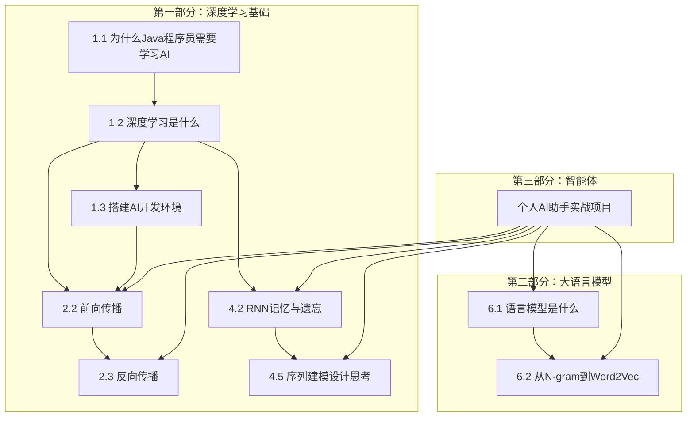
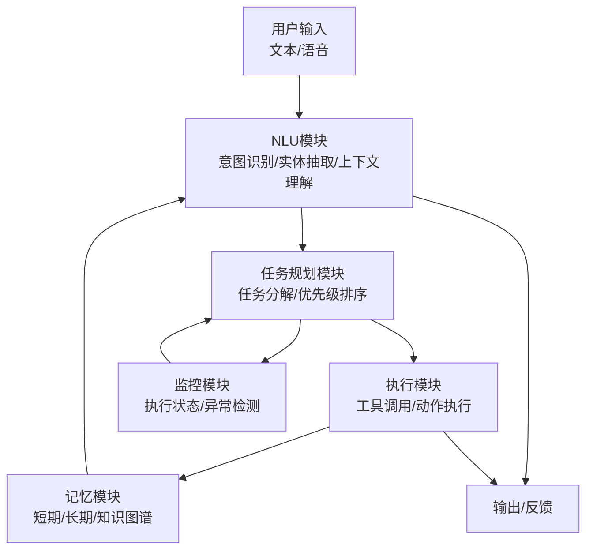
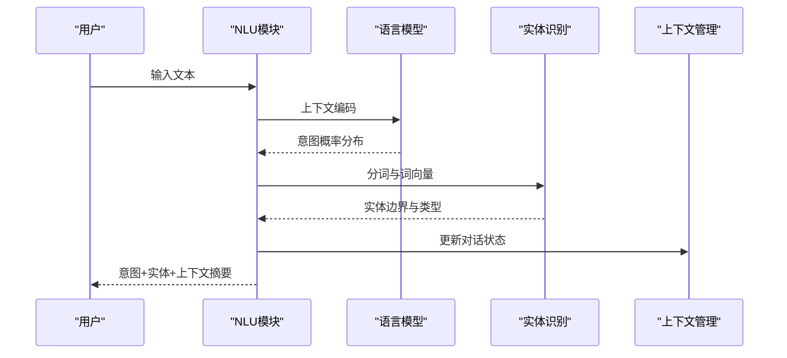
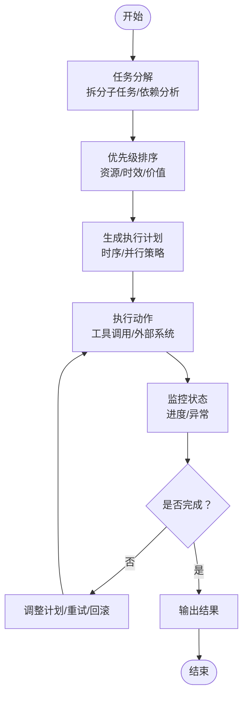
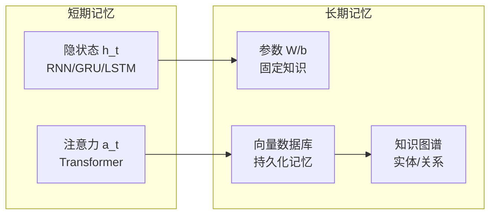
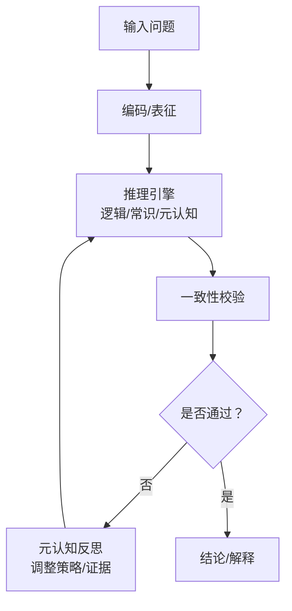
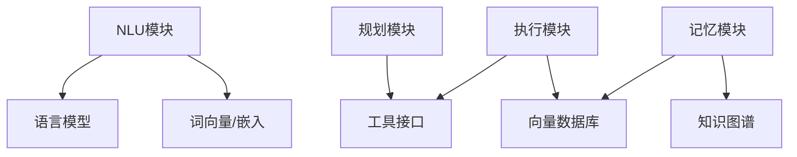

# 核心能力实现

<cite>
**本文引用的文件**
- [book/README.md](file://book/README.md)
- [book/part1-deep-learning/chapter-01/01-why-java-ai.md](file://book/part1-deep-learning/chapter-01/01-why-java-ai.md)
- [book/part1-deep-learning/chapter-01/02-what-is-deep-learning.md](file://book/part1-deep-learning/chapter-01/02-what-is-deep-learning.md)
- [book/part1-deep-learning/chapter-01/03-first-ai-environment.md](file://book/part1-deep-learning/chapter-01/03-first-ai-environment.md)
- [book/part1-deep-learning/chapter-02/02-forward-propagation.md](file://book/part1-deep-learning/chapter-02/02-forward-propagation.md)
- [book/part1-deep-learning/chapter-02/03-backpropagation.md](file://book/part1-deep-learning/chapter-02/03-backpropagation.md)
- [book/part1-deep-learning/chapter-04/02-rnn-memory-and-forgetting.md](file://book/part1-deep-learning/chapter-04/02-rnn-memory-and-forgetting.md)
- [book/part1-deep-learning/chapter-04/05-design-thinking-sequential-modeling.md](file://book/part1-deep-learning/chapter-04/05-design-thinking-sequential-modeling.md)
- [book/part2-llm/README.md](file://book/part2-llm/README.md)
- [book/part2-llm/chapter-06/01-what-is-language-model.md](file://book/part2-llm/chapter-06/01-what-is-language-model.md)
- [book/part2-llm/chapter-06/02-ngram-to-word2vec.md](file://book/part2-llm/chapter-06/02-ngram-to-word2vec.md)
</cite>

## 目录
1. [引言](#引言)
2. [项目结构](#项目结构)
3. [核心组件](#核心组件)
4. [架构总览](#架构总览)
5. [详细组件分析](#详细组件分析)
6. [依赖分析](#依赖分析)
7. [性能考量](#性能考量)
8. [故障排查指南](#故障排查指南)
9. [结论](#结论)
10. [附录](#附录)

## 引言
本技术文档围绕“个人AI助手”的核心能力展开，聚焦以下方面：
- 自然语言理解（NLU）：意图识别、实体抽取、上下文理解
- 任务规划与执行：任务分解、优先级排序、执行监控
- 记忆系统：短期记忆、长期记忆、知识图谱构建
- 推理机制：逻辑推理、常识推理、元认知推理
- 能力协作与数据流：模块间协同与数据流转
- 性能优化与调试：工程化落地与可维护性

文档基于仓库现有内容进行系统化梳理，并结合Java工程化实践给出实现建议与可视化图示。

## 项目结构
该仓库以“书”为组织形式，分为三大部分：
- 第一部分：深度学习基础（神经网络、前向/反向传播、序列建模）
- 第二部分：大语言模型（语言模型、词向量、提示工程、RAG）
- 第三部分：智能体（工具使用、规划与推理、记忆系统、多智能体）

“个人AI助手”属于第三部分的实战项目，涉及NLU、任务规划、记忆与推理等能力的综合实现。

**图表来源**
- [book/README.md:148-154](file://book/README.md#L148-L154)
- [book/part1-deep-learning/chapter-01/01-why-java-ai.md:1-161](file://book/part1-deep-learning/chapter-01/01-why-java-ai.md#L1-L161)
- [book/part1-deep-learning/chapter-01/02-what-is-deep-learning.md:1-404](file://book/part1-deep-learning/chapter-01/02-what-is-deep-learning.md#L1-L404)
- [book/part1-deep-learning/chapter-01/03-first-ai-environment.md:1-426](file://book/part1-deep-learning/chapter-01/03-first-ai-environment.md#L1-L426)
- [book/part1-deep-learning/chapter-02/02-forward-propagation.md:1-538](file://book/part1-deep-learning/chapter-02/02-forward-propagation.md#L1-L538)
- [book/part1-deep-learning/chapter-02/03-backpropagation.md:1-537](file://book/part1-deep-learning/chapter-02/03-backpropagation.md#L1-L537)
- [book/part1-deep-learning/chapter-04/02-rnn-memory-and-forgetting.md:1-143](file://book/part1-deep-learning/chapter-04/02-rnn-memory-and-forgetting.md#L1-L143)
- [book/part1-deep-learning/chapter-04/05-design-thinking-sequential-modeling.md:83-142](file://book/part1-deep-learning/chapter-04/05-design-thinking-sequential-modeling.md#L83-L142)
- [book/part2-llm/chapter-06/01-what-is-language-model.md:1-62](file://book/part2-llm/chapter-06/01-what-is-language-model.md#L1-L62)
- [book/part2-llm/chapter-06/02-ngram-to-word2vec.md:1-135](file://book/part2-llm/chapter-06/02-ngram-to-word2vec.md#L1-L135)

**章节来源**
- [book/README.md:148-154](file://book/README.md#L148-L154)

## 核心组件
本节从“个人AI助手”的视角，提炼四大核心能力及其在仓库中的理论与实践基础：

- 自然语言理解（NLU）
  - 语言模型与词向量：为意图识别与实体抽取提供基础表征
  - 参考：语言模型定义、N-gram到Word2Vec的演进
- 任务规划与执行
  - 基于ReAct框架的任务分解与执行循环
  - 参考：智能体规划与推理章节
- 记忆系统
  - 短期记忆（隐状态）、长期记忆（参数/外部存储）、知识图谱
  - 参考：RNN记忆机制、序列建模设计思考
- 推理机制
  - 逻辑/常识/元认知推理的融合
  - 参考：智能体设计思考与序列建模的架构演进

**章节来源**
- [book/part2-llm/chapter-06/01-what-is-language-model.md:1-62](file://book/part2-llm/chapter-06/01-what-is-language-model.md#L1-L62)
- [book/part2-llm/chapter-06/02-ngram-to-word2vec.md:1-135](file://book/part2-llm/chapter-06/02-ngram-to-word2vec.md#L1-L135)
- [book/part1-deep-learning/chapter-04/02-rnn-memory-and-forgetting.md:1-143](file://book/part1-deep-learning/chapter-04/02-rnn-memory-and-forgetting.md#L1-L143)
- [book/part1-deep-learning/chapter-04/05-design-thinking-sequential-modeling.md:83-142](file://book/part1-deep-learning/chapter-04/05-design-thinking-sequential-modeling.md#L83-L142)
- [book/README.md:127-132](file://book/README.md#L127-L132)

## 架构总览
个人AI助手的整体架构围绕“感知—理解—规划—执行—记忆—反思”的闭环展开。下图展示了从输入到输出的关键路径与模块交互。

**图表来源**
- [book/README.md:127-132](file://book/README.md#L127-L132)
- [book/part1-deep-learning/chapter-04/02-rnn-memory-and-forgetting.md:1-143](file://book/part1-deep-learning/chapter-04/02-rnn-memory-and-forgetting.md#L1-L143)
- [book/part1-deep-learning/chapter-04/05-design-thinking-sequential-modeling.md:83-142](file://book/part1-deep-learning/chapter-04/05-design-thinking-sequential-modeling.md#L83-L142)

## 详细组件分析

### 自然语言理解（NLU）系统
- 意图识别
  - 基于语言模型的概率预测，结合上下文窗口，输出意图类别与置信度
  - 参考：语言模型定义与概率计算
- 实体抽取
  - 基于词向量与序列标注（如BiLSTM+CRF）的命名实体识别
  - 参考：从N-gram到Word2Vec的词表征演进
- 上下文理解
  - 利用RNN/Transformer的隐状态或注意力机制，维护对话历史与工作记忆
  - 参考：RNN记忆更新、序列建模设计思考

**图表来源**
- [book/part2-llm/chapter-06/01-what-is-language-model.md:1-62](file://book/part2-llm/chapter-06/01-what-is-language-model.md#L1-L62)
- [book/part2-llm/chapter-06/02-ngram-to-word2vec.md:1-135](file://book/part2-llm/chapter-06/02-ngram-to-word2vec.md#L1-L135)
- [book/part1-deep-learning/chapter-04/02-rnn-memory-and-forgetting.md:1-143](file://book/part1-deep-learning/chapter-04/02-rnn-memory-and-forgetting.md#L1-L143)

**章节来源**
- [book/part2-llm/chapter-06/01-what-is-language-model.md:1-62](file://book/part2-llm/chapter-06/01-what-is-language-model.md#L1-L62)
- [book/part2-llm/chapter-06/02-ngram-to-word2vec.md:1-135](file://book/part2-llm/chapter-06/02-ngram-to-word2vec.md#L1-L135)
- [book/part1-deep-learning/chapter-04/02-rnn-memory-and-forgetting.md:1-143](file://book/part1-deep-learning/chapter-04/02-rnn-memory-and-forgetting.md#L1-L143)

### 任务规划与执行机制
- 任务分解
  - 将复杂目标拆解为子任务，明确前置条件与依赖关系
- 优先级排序
  - 基于资源约束、截止时间、价值评估进行排序
- 执行监控
  - 实时跟踪执行进度，异常时触发回滚或重试

**图表来源**
- [book/README.md:127-132](file://book/README.md#L127-L132)

**章节来源**
- [book/README.md:127-132](file://book/README.md#L127-L132)

### 记忆管理系统
- 短期记忆（工作记忆）
  - RNN隐状态承载当前序列信息；Transformer注意力提供动态访问
- 长期记忆（知识记忆）
  - 网络参数固化先验；外部向量数据库/知识图谱持久化
- 知识图谱构建
  - 从实体抽取与关系抽取中构建三元组，支持查询与推理

**图表来源**
- [book/part1-deep-learning/chapter-04/02-rnn-memory-and-forgetting.md:1-143](file://book/part1-deep-learning/chapter-04/02-rnn-memory-and-forgetting.md#L1-L143)
- [book/part1-deep-learning/chapter-04/05-design-thinking-sequential-modeling.md:83-142](file://book/part1-deep-learning/chapter-04/05-design-thinking-sequential-modeling.md#L83-L142)

**章节来源**
- [book/part1-deep-learning/chapter-04/02-rnn-memory-and-forgetting.md:1-143](file://book/part1-deep-learning/chapter-04/02-rnn-memory-and-forgetting.md#L1-L143)
- [book/part1-deep-learning/chapter-04/05-design-thinking-sequential-modeling.md:83-142](file://book/part1-deep-learning/chapter-04/05-design-thinking-sequential-modeling.md#L83-L142)

### 推理机制实现
- 逻辑推理
  - 基于规则与一阶逻辑的推断，适用于结构化领域
- 常识推理
  - 结合预训练语言模型的常识知识，进行合理性校验
- 元认知推理
  - 对自身推理过程的监控与自我修正，提升鲁棒性

**图表来源**
- [book/part1-deep-learning/chapter-04/05-design-thinking-sequential-modeling.md:83-142](file://book/part1-deep-learning/chapter-04/05-design-thinking-sequential-modeling.md#L83-L142)

**章节来源**
- [book/part1-deep-learning/chapter-04/05-design-thinking-sequential-modeling.md:83-142](file://book/part1-deep-learning/chapter-04/05-design-thinking-sequential-modeling.md#L83-L142)

## 依赖分析
- 模块内聚与耦合
  - NLU与记忆模块强耦合（上下文依赖）
  - 规划与执行模块弱耦合，便于并行扩展
- 外部依赖
  - 深度学习框架（Deeplearning4j）用于神经网络训练与推理
  - LLM框架（LangChain4j）用于提示工程与工具调用
  - 向量数据库（Milvus/Pinecone/Chroma）用于长期记忆与检索增强

**图表来源**
- [book/part2-llm/chapter-06/01-what-is-language-model.md:1-62](file://book/part2-llm/chapter-06/01-what-is-language-model.md#L1-L62)
- [book/part2-llm/chapter-06/02-ngram-to-word2vec.md:1-135](file://book/part2-llm/chapter-06/02-ngram-to-word2vec.md#L1-L135)
- [book/part1-deep-learning/chapter-01/03-first-ai-environment.md:1-426](file://book/part1-deep-learning/chapter-01/03-first-ai-environment.md#L1-L426)

**章节来源**
- [book/part1-deep-learning/chapter-01/03-first-ai-environment.md:1-426](file://book/part1-deep-learning/chapter-01/03-first-ai-environment.md#L1-L426)

## 性能考量
- 计算效率
  - 使用向量化与批处理（ND4J）替代循环，显著提升吞吐
  - 激活函数选择：ReLU/LeakyReLU缓解梯度消失，提高收敛速度
- 训练稳定性
  - 损失函数：分类问题采用交叉熵，回归问题采用均方误差
  - 优化器：Adam自适应学习率，提升收敛稳定性
- 记忆与检索
  - 向量相似度检索配合倒排索引，降低检索延迟
  - 知识图谱采用图数据库，支持高效查询与推理

**章节来源**
- [book/part1-deep-learning/chapter-02/02-forward-propagation.md:1-538](file://book/part1-deep-learning/chapter-02/02-forward-propagation.md#L1-L538)
- [book/part1-deep-learning/chapter-02/03-backpropagation.md:1-537](file://book/part1-deep-learning/chapter-02/03-backpropagation.md#L1-L537)
- [book/part1-deep-learning/chapter-04/02-rnn-memory-and-forgetting.md:1-143](file://book/part1-deep-learning/chapter-04/02-rnn-memory-and-forgetting.md#L1-L143)

## 故障排查指南
- 环境与依赖
  - JDK版本与Maven依赖检查，确保ND4J与DL4J版本匹配
  - GPU加速需确认CUDA运行时与平台依赖一致
- 训练问题
  - 内存不足：调整批大小、限制最大物理内存
  - 收敛缓慢：调整学习率、切换优化器（Adam/Momentum）
- 推理与输出
  - 检查激活函数与损失函数的组合是否匹配任务类型
  - 对齐标签空间与输出维度，避免形状不匹配

**章节来源**
- [book/part1-deep-learning/chapter-01/03-first-ai-environment.md:385-426](file://book/part1-deep-learning/chapter-01/03-first-ai-environment.md#L385-L426)
- [book/part1-deep-learning/chapter-02/03-backpropagation.md:205-291](file://book/part1-deep-learning/chapter-02/03-backpropagation.md#L205-L291)

## 结论
本技术文档基于仓库内容，系统梳理了个人AI助手的核心能力与实现路径。通过将深度学习、语言模型、序列建模与智能体规划相结合，可在Java生态中实现可工程化的AI助手。后续可在以下方向深化：
- 将NLU模块与规划模块对接，形成ReAct式的推理-行动循环
- 引入向量数据库与知识图谱，完善长期记忆与知识管理
- 以LangChain4j为工具层，统一提示工程与外部系统集成

## 附录
- 术语表与参考文献请参阅书末附录章节，获取更广泛的背景知识与工程实践建议。