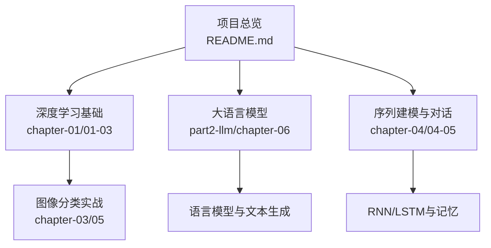
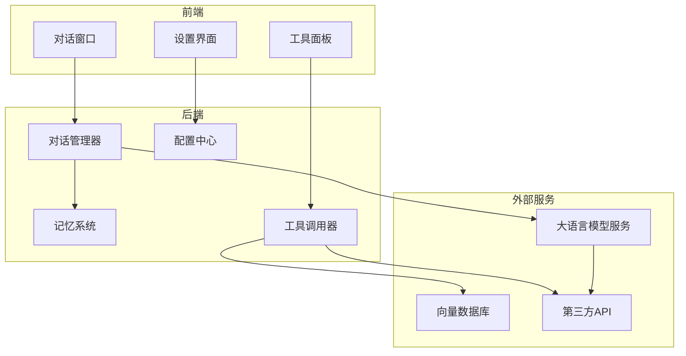
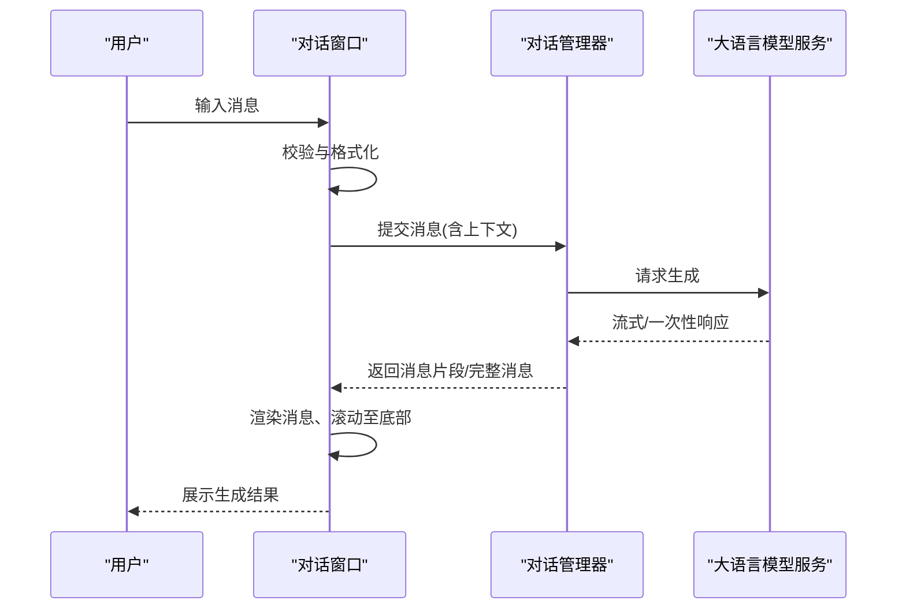
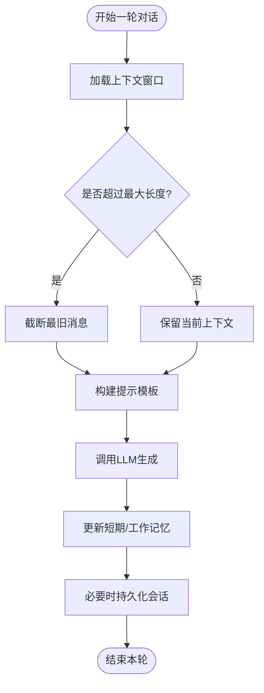
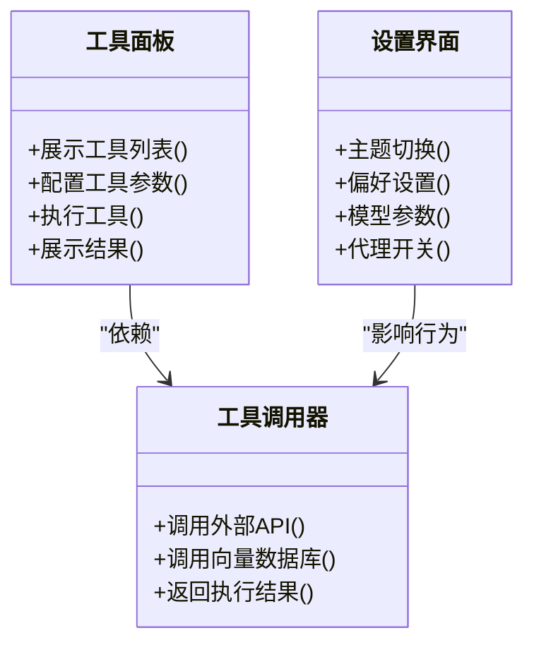
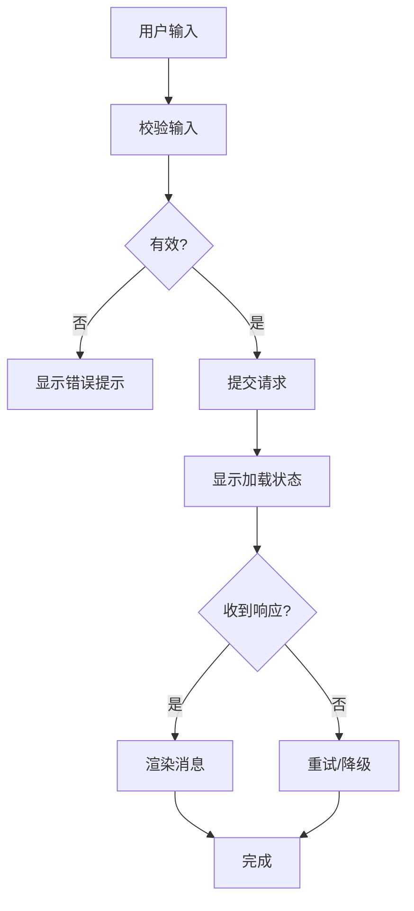
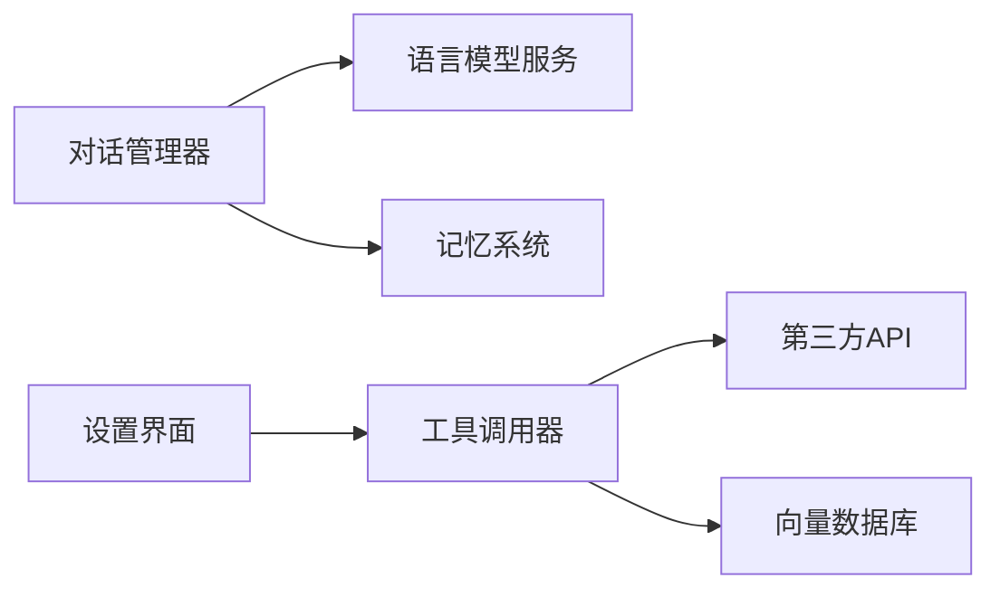

# 用户界面与交互设计

<cite>
**本文引用的文件**
- [README.md](file://book/README.md)
- [01-why-java-ai.md](file://book/part1-deep-learning/chapter-01/01-why-java-ai.md)
- [02-what-is-deep-learning.md](file://book/part1-deep-learning/chapter-01/02-what-is-deep-learning.md)
- [03-first-ai-environment.md](file://book/part1-deep-learning/chapter-01/03-first-ai-environment.md)
- [05-build-image-classifier.md](file://book/part1-deep-learning/chapter-03/05-build-image-classifier.md)
- [04-text-generation-practice.md](file://book/part1-deep-learning/chapter-04/04-text-generation-practice.md)
- [05-design-thinking-sequential-modeling.md](file://book/part1-deep-learning/chapter-04/05-design-thinking-sequential-modeling.md)
- [01-what-is-language-model.md](file://book/part2-llm/chapter-06/01-what-is-language-model.md)
- [02-ngram-to-word2vec.md](file://book/part2-llm/chapter-06/02-ngram-to-word2vec.md)
</cite>

## 目录
1. [简介](#简介)
2. [项目结构](#项目结构)
3. [核心组件](#核心组件)
4. [架构总览](#架构总览)
5. [详细组件分析](#详细组件分析)
6. [依赖分析](#依赖分析)
7. [性能考量](#性能考量)
8. [故障排查指南](#故障排查指南)
9. [结论](#结论)
10. [附录](#附录)

## 简介
本指导文档围绕“个人AI助手”的用户界面与交互设计展开，结合仓库中已有的深度学习、大语言模型与智能体相关内容，系统阐述对话界面设计原则、多轮对话与上下文管理、界面响应式实现、UI组件示例、用户体验优化策略、无障碍与跨平台兼容性，以及测试与用户反馈机制。文档强调以实际代码模块为依据，避免凭空臆造，确保方案可落地、可验证。

## 项目结构
该仓库以“图书”形式组织内容，涵盖深度学习基础、大语言模型与智能体实战项目。与用户界面与交互设计直接相关的内容主要分布在以下章节：
- 深度学习基础：神经网络、RNN/LSTM、CNN等，为后续对话系统与工具集成提供底层能力支撑
- 大语言模型：语言模型定义、文本生成、采样策略，为对话系统的生成与理解能力奠定基础
- 智能体与对话：记忆管理、工具调用、多智能体协作，为会话状态控制与上下文维护提供参考

**图表来源**
- [README.md:1-187](file://book/README.md#L1-L187)

**章节来源**
- [README.md:1-187](file://book/README.md#L1-L187)

## 核心组件
围绕“个人AI助手”的用户界面与交互设计，可抽象出如下核心组件：
- 对话窗口：消息展示、输入处理、状态反馈
- 工具面板：工具调用入口、参数配置、执行结果展示
- 设置界面：主题、偏好、模型参数、代理开关
- 会话管理：多轮对话、上下文维护、会话状态控制
- 响应式渲染：实时消息显示、加载状态指示、错误信息展示

这些组件在仓库中虽未直接以UI代码呈现，但其交互流程与状态管理理念可从以下模块中提炼与映射：
- 语言模型与文本生成：提供“生成/理解”两类能力，支撑对话生成与结构化输出
- RNN/LSTM与记忆：提供短期记忆与工作记忆的建模思路，支撑上下文窗口与会话记忆
- 图像分类实战：提供数据加载、模型训练与预测的工程化流程，可借鉴为工具调用与结果展示

**章节来源**
- [01-what-is-language-model.md:1-263](file://book/part2-llm/chapter-06/01-what-is-language-model.md#L1-L263)
- [04-text-generation-practice.md:146-468](file://book/part1-deep-learning/chapter-04/04-text-generation-practice.md#L146-L468)
- [05-design-thinking-sequential-modeling.md:83-142](file://book/part1-deep-learning/chapter-04/05-design-thinking-sequential-modeling.md#L83-L142)
- [05-build-image-classifier.md:324-464](file://book/part1-deep-learning/chapter-03/05-build-image-classifier.md#L324-L464)

## 架构总览
下图展示了“个人AI助手”的端到端交互架构：前端负责用户输入与消息展示，后端提供对话服务、工具调用与记忆管理，外部服务（如LLM API、向量数据库）提供能力扩展。

**图表来源**
- [01-what-is-language-model.md:1-263](file://book/part2-llm/chapter-06/01-what-is-language-model.md#L1-L263)
- [05-design-thinking-sequential-modeling.md:83-142](file://book/part1-deep-learning/chapter-04/05-design-thinking-sequential-modeling.md#L83-L142)
- [05-build-image-classifier.md:324-464](file://book/part1-deep-learning/chapter-03/05-build-image-classifier.md#L324-L464)

## 详细组件分析

### 对话窗口设计
- 消息展示
  - 用户消息：右对齐、强调样式
  - 助手消息：左对齐、可富文本/Markdown渲染
  - 工具调用反馈：分段展示、高亮关键信息
- 输入处理
  - 文本输入框：支持快捷键、粘贴、拖拽
  - 发送按钮：禁用无效输入、显示发送中状态
  - 历史回放：上下箭头浏览最近消息
- 状态反馈
  - 生成中：显示加载动画与“思考中”提示
  - 错误：弹窗/气泡提示，并提供重试与日志链接
  - 完成：自动滚动至最新消息，闪烁提示

**图表来源**
- [01-what-is-language-model.md:1-263](file://book/part2-llm/chapter-06/01-what-is-language-model.md#L1-L263)
- [04-text-generation-practice.md:146-468](file://book/part1-deep-learning/chapter-04/04-text-generation-practice.md#L146-L468)

**章节来源**
- [01-what-is-language-model.md:1-263](file://book/part2-llm/chapter-06/01-what-is-language-model.md#L1-L263)
- [04-text-generation-practice.md:146-468](file://book/part1-deep-learning/chapter-04/04-text-generation-practice.md#L146-L468)

### 多轮对话与上下文管理
- 上下文窗口：限制最近N条消息，避免超出上下文长度
- 记忆策略：短期记忆（隐状态/最近消息）、工作记忆（当前任务相关）、长期记忆（向量数据库/持久化）
- 会话状态控制：新建会话、复制/删除消息、暂停/恢复生成、切换模型/参数

**图表来源**
- [05-design-thinking-sequential-modeling.md:83-142](file://book/part1-deep-learning/chapter-04/05-design-thinking-sequential-modeling.md#L83-L142)
- [01-what-is-language-model.md:1-263](file://book/part2-llm/chapter-06/01-what-is-language-model.md#L1-L263)

**章节来源**
- [05-design-thinking-sequential-modeling.md:83-142](file://book/part1-deep-learning/chapter-04/05-design-thinking-sequential-modeling.md#L83-L142)
- [01-what-is-language-model.md:1-263](file://book/part2-llm/chapter-06/01-what-is-language-model.md#L1-L263)

### 工具面板与设置界面
- 工具面板
  - 工具列表：图标+名称+简述
  - 参数配置：表单校验、默认值、动态联动
  - 执行结果：表格/卡片/图表展示，支持导出
- 设置界面
  - 主题：浅色/深色/高对比度
  - 偏好：字体大小、动画开关、通知设置
  - 模型参数：温度、最大生成长度、采样策略
  - 代理开关：开启/关闭工具调用、缓存策略

**图表来源**
- [05-build-image-classifier.md:324-464](file://book/part1-deep-learning/chapter-03/05-build-image-classifier.md#L324-L464)

**章节来源**
- [05-build-image-classifier.md:324-464](file://book/part1-deep-learning/chapter-03/05-build-image-classifier.md#L324-L464)

### 响应式设计与状态反馈
- 实时消息显示：WebSocket/Server-Sent Events，增量渲染
- 加载状态：骨架屏/占位符、进度条、节流/防抖
- 错误信息：统一错误码、可复制的日志、重试/回滚
- 可访问性：键盘导航、屏幕阅读器友好、焦点管理、颜色对比度

**图表来源**
- [04-text-generation-practice.md:146-468](file://book/part1-deep-learning/chapter-04/04-text-generation-practice.md#L146-L468)

**章节来源**
- [04-text-generation-practice.md:146-468](file://book/part1-deep-learning/chapter-04/04-text-generation-practice.md#L146-L468)

## 依赖分析
- 对话管理器依赖语言模型服务与记忆系统
- 工具调用器依赖外部API与向量数据库
- 设置界面影响工具调用器的行为（如代理开关、缓存策略）

**图表来源**
- [01-what-is-language-model.md:1-263](file://book/part2-llm/chapter-06/01-what-is-language-model.md#L1-L263)
- [05-build-image-classifier.md:324-464](file://book/part1-deep-learning/chapter-03/05-build-image-classifier.md#L324-L464)

**章节来源**
- [01-what-is-language-model.md:1-263](file://book/part2-llm/chapter-06/01-what-is-language-model.md#L1-L263)
- [05-build-image-classifier.md:324-464](file://book/part1-deep-learning/chapter-03/05-build-image-classifier.md#L324-L464)

## 性能考量
- 生成性能
  - 采样策略：温度、Top-K、核采样，平衡多样性与稳定性
  - 流式输出：边生成边渲染，降低首帧延迟
- 记忆与检索
  - 向量相似度检索，合理设置召回数量与过滤条件
  - 缓存热点上下文，减少重复计算
- 界面渲染
  - 虚拟滚动、懒加载、图片懒加载
  - 防抖/节流输入事件，避免频繁重渲染

**章节来源**
- [04-text-generation-practice.md:146-468](file://book/part1-deep-learning/chapter-04/04-text-generation-practice.md#L146-L468)
- [02-ngram-to-word2vec.md:1-135](file://book/part2-llm/chapter-06/02-ngram-to-word2vec.md#L1-L135)

## 故障排查指南
- 生成异常
  - 检查上下文长度是否超限
  - 校验提示模板与工具调用参数
  - 查看日志与错误码，区分网络/模型/权限问题
- 工具调用失败
  - 核对外部API密钥与配额
  - 检查网络连通与代理设置
  - 回退到本地工具或降级策略
- 界面卡顿
  - 检查是否有过多重渲染
  - 优化消息列表虚拟化与图片资源
  - 降低动画与特效

**章节来源**
- [03-first-ai-environment.md:385-426](file://book/part1-deep-learning/chapter-01/03-first-ai-environment.md#L385-L426)
- [05-build-image-classifier.md:510-572](file://book/part1-deep-learning/chapter-03/05-build-image-classifier.md#L510-L572)

## 结论
本指导文档基于仓库中的深度学习、大语言模型与智能体内容，提出了“个人AI助手”的用户界面与交互设计方案。通过明确对话窗口、工具面板、设置界面的职责边界，结合多轮对话与上下文管理、响应式渲染与状态反馈机制，能够构建出高性能、易用且可扩展的交互体验。建议在后续实现中，以模块化方式逐步落地，并持续通过用户测试与反馈迭代优化。

## 附录
- 无障碍设计要点
  - 键盘可达性：Tab顺序清晰，Esc取消，Enter发送
  - 屏幕阅读器：语义化标签、ARIA描述、焦点可见
  - 颜色与对比度：满足WCAG AA以上标准
- 跨平台兼容性
  - Web端：渐进增强，离线提示，移动端自适应
  - 桌面端：原生窗口、系统托盘、热键
  - 移动端：触摸手势、横竖屏适配、电池优化