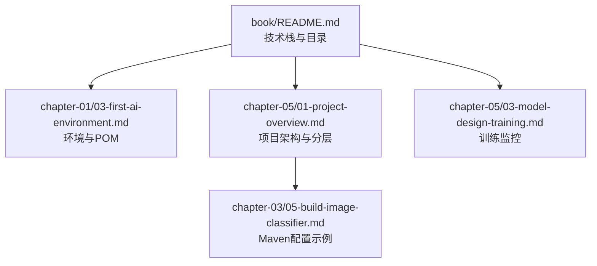
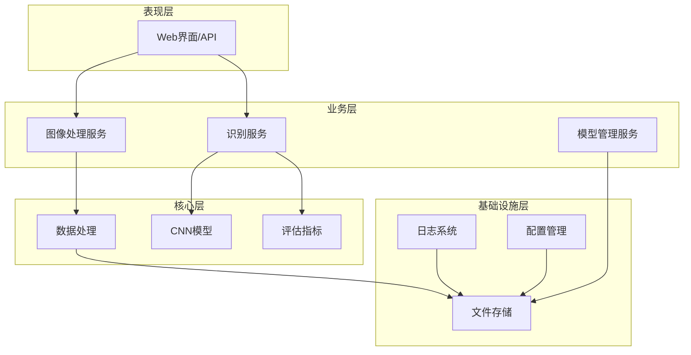
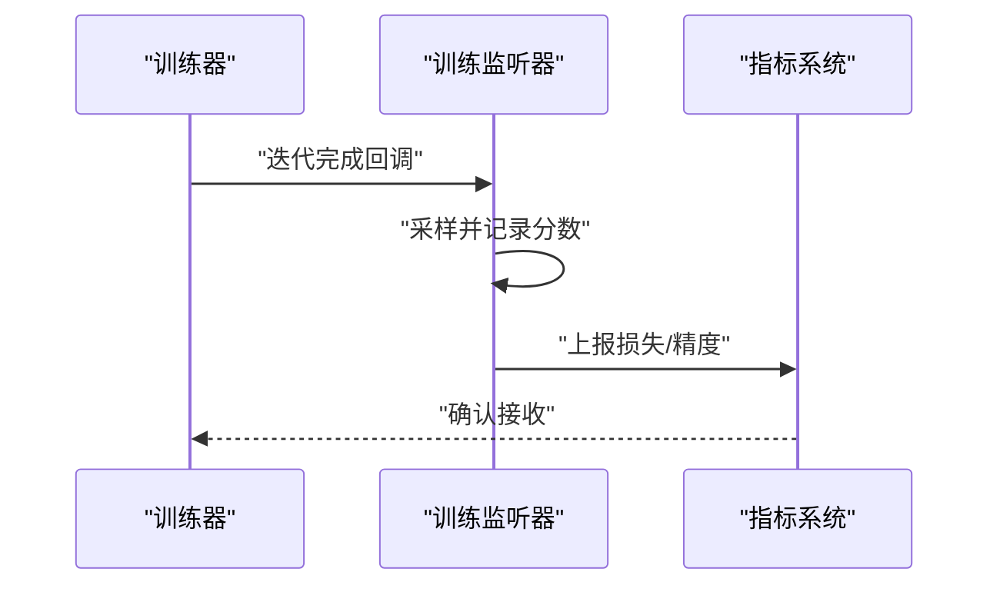
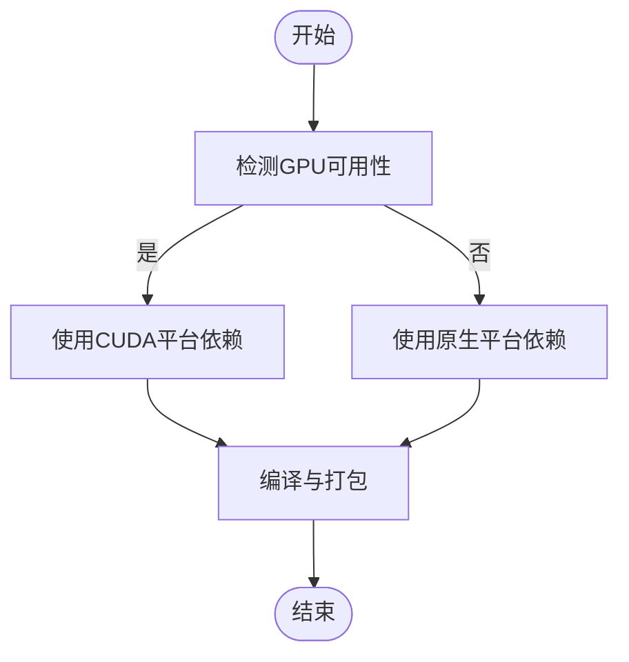
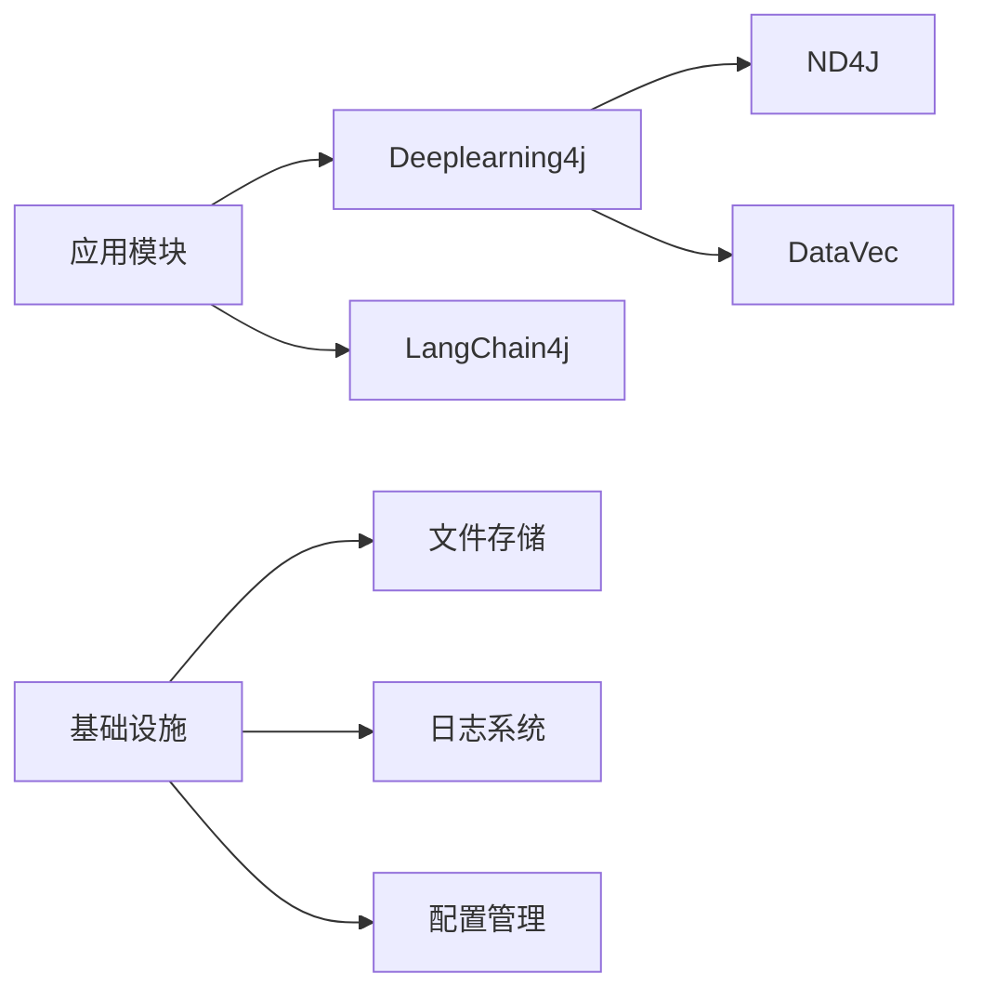

# 部署与性能优化

<cite>
**本文引用的文件**
- [book/README.md](file://book/README.md)
- [book/part1-deep-learning/chapter-01/01-why-java-ai.md](file://book/part1-deep-learning/chapter-01/01-why-java-ai.md)
- [book/part1-deep-learning/chapter-01/02-what-is-deep-learning.md](file://book/part1-deep-learning/chapter-01/02-what-is-deep-learning.md)
- [book/part1-deep-learning/chapter-01/03-first-ai-environment.md](file://book/part1-deep-learning/chapter-01/03-first-ai-environment.md)
- [book/part1-deep-learning/chapter-03/05-build-image-classifier.md](file://book/part1-deep-learning/chapter-03/05-build-image-classifier.md)
- [book/part1-deep-learning/chapter-05/01-project-overview.md](file://book/part1-deep-learning/chapter-05/01-project-overview.md)
- [book/part1-deep-learning/chapter-05/03-model-design-training.md](file://book/part1-deep-learning/chapter-05/03-model-design-training.md)
</cite>

## 目录
1. [引言](#引言)
2. [项目结构](#项目结构)
3. [核心组件](#核心组件)
4. [架构总览](#架构总览)
5. [详细组件分析](#详细组件分析)
6. [依赖分析](#依赖分析)
7. [性能考量](#性能考量)
8. [故障排查指南](#故障排查指南)
9. [结论](#结论)
10. [附录](#附录)

## 引言
本指南面向希望在生产环境中稳定部署与持续优化个人AI助手的工程师。内容围绕系统部署架构（容器化、微服务、负载均衡）、性能优化（内存/CPU/I/O）、监控体系（指标、日志、告警）、安全防护（网络、数据、访问控制）、高可用与灾备、以及基准测试与持续优化流程展开。文中所有技术要点均基于仓库内已提供的技术栈与示例进行提炼与扩展，帮助读者建立可落地的运维体系。

## 项目结构
仓库以“图书”形式组织内容，涵盖深度学习基础、大语言模型与智能体实践，并在部分章节提供了与部署、训练、监控相关的技术细节。以下为与部署与性能优化密切相关的内容概览：

- 章节导航与技术栈
  - 全书目录与技术栈在 [book/README.md](file://book/README.md) 中给出，明确使用 Java 17+、Deeplearning4j、LangChain4j、Maven/Gradle 等。
- 深度学习与AI环境
  - 环境搭建与依赖配置在 [book/part1-deep-learning/chapter-01/03-first-ai-environment.md](file://book/part1-deep-learning/chapter-01/03-first-ai-environment.md) 中提供，包含 Maven POM 示例与ND4J验证。
- 图像分类项目与部署集成
  - 项目概述与分层架构在 [book/part1-deep-learning/chapter-05/01-project-overview.md](file://book/part1-deep-learning/chapter-05/01-project-overview.md) 中给出；训练监控在 [book/part1-deep-learning/chapter-05/03-model-design-training.md](file://book/part1-deep-learning/chapter-05/03-model-design-training.md) 中给出。
- LLM与Java生态
  - LLM框架选择与生态在 [book/part1-deep-learning/chapter-01/01-why-java-ai.md](file://book/part1-deep-learning/chapter-01/01-why-java-ai.md) 与 [book/part1-deep-learning/chapter-01/02-what-is-deep-learning.md](file://book/part1-deep-learning/chapter-01/02-what-is-deep-learning.md) 中体现。

**图表来源**
- [book/README.md:170-177](file://book/README.md#L170-L177)
- [book/part1-deep-learning/chapter-01/03-first-ai-environment.md:82-189](file://book/part1-deep-learning/chapter-01/03-first-ai-environment.md#L82-L189)
- [book/part1-deep-learning/chapter-05/01-project-overview.md:64-91](file://book/part1-deep-learning/chapter-05/01-project-overview.md#L64-L91)
- [book/part1-deep-learning/chapter-05/03-model-design-training.md:215-242](file://book/part1-deep-learning/chapter-05/03-model-design-training.md#L215-L242)
- [book/part1-deep-learning/chapter-03/05-build-image-classifier.md:45-90](file://book/part1-deep-learning/chapter-03/05-build-image-classifier.md#L45-L90)

**章节来源**
- [book/README.md:170-177](file://book/README.md#L170-L177)
- [book/part1-deep-learning/chapter-01/03-first-ai-environment.md:82-189](file://book/part1-deep-learning/chapter-01/03-first-ai-environment.md#L82-L189)
- [book/part1-deep-learning/chapter-05/01-project-overview.md:64-91](file://book/part1-deep-learning/chapter-05/01-project-overview.md#L64-L91)
- [book/part1-deep-learning/chapter-05/03-model-design-training.md:215-242](file://book/part1-deep-learning/chapter-05/03-model-design-training.md#L215-L242)
- [book/part1-deep-learning/chapter-03/05-build-image-classifier.md:45-90](file://book/part1-deep-learning/chapter-03/05-build-image-classifier.md#L45-L90)

## 核心组件
- 深度学习与推理引擎
  - 基于 Deeplearning4j 的模型训练与推理，结合 ND4J 进行高性能数值计算。
- LLM与提示工程
  - 基于 LangChain4j 的提示工程与本地/云端模型集成能力。
- 项目分层架构
  - 表现层（Web/API/UI）、业务层（图像处理/识别/模型管理）、核心层（CNN/数据处理/评估）、基础设施层（存储/日志/配置）。
- 训练监控与可视化
  - 训练过程中的损失与精度采集，便于后续指标化与告警。

**章节来源**
- [book/part1-deep-learning/chapter-01/02-what-is-deep-learning.md:48-136](file://book/part1-deep-learning/chapter-01/02-what-is-deep-learning.md#L48-L136)
- [book/part1-deep-learning/chapter-01/01-why-java-ai.md:33-54](file://book/part1-deep-learning/chapter-01/01-why-java-ai.md#L33-L54)
- [book/part1-deep-learning/chapter-05/01-project-overview.md:64-91](file://book/part1-deep-learning/chapter-05/01-project-overview.md#L64-L91)
- [book/part1-deep-learning/chapter-05/03-model-design-training.md:215-242](file://book/part1-deep-learning/chapter-05/03-model-design-training.md#L215-L242)

## 架构总览
下图展示了从表现层到推理层的整体架构，强调模块化与可扩展性，便于后续容器化与微服务拆分。

**图表来源**
- [book/part1-deep-learning/chapter-05/01-project-overview.md:64-91](file://book/part1-deep-learning/chapter-05/01-project-overview.md#L64-L91)

## 详细组件分析

### 训练监控与指标采集
- 监控职责
  - 训练过程中定期记录损失与精度，形成可回放的训练曲线，支撑后续指标化与告警。
- 关键实现点
  - 训练监听器按固定频率输出分数，便于观察收敛趋势。
- 可扩展性
  - 将分数导出为结构化数据，接入指标系统（如 Prometheus）与可视化面板。

**图表来源**
- [book/part1-deep-learning/chapter-05/03-model-design-training.md:215-242](file://book/part1-deep-learning/chapter-05/03-model-design-training.md#L215-L242)

**章节来源**
- [book/part1-deep-learning/chapter-05/03-model-design-training.md:215-242](file://book/part1-deep-learning/chapter-05/03-model-design-training.md#L215-L242)

### 依赖与构建配置
- Maven依赖
  - 包含 Deeplearning4j 核心、ND4J 平台、DataVec 图像数据处理、LangChain4j 与 OpenAI 集成等。
- 依赖替换（GPU加速）
  - 可将原生平台依赖替换为 CUDA 平台依赖以启用 GPU 加速。

**图表来源**
- [book/part1-deep-learning/chapter-01/03-first-ai-environment.md:372-383](file://book/part1-deep-learning/chapter-01/03-first-ai-environment.md#L372-L383)

**章节来源**
- [book/part1-deep-learning/chapter-01/03-first-ai-environment.md:82-189](file://book/part1-deep-learning/chapter-01/03-first-ai-environment.md#L82-L189)
- [book/part1-deep-learning/chapter-01/03-first-ai-environment.md:372-383](file://book/part1-deep-learning/chapter-01/03-first-ai-environment.md#L372-L383)
- [book/part1-deep-learning/chapter-03/05-build-image-classifier.md:45-90](file://book/part1-deep-learning/chapter-03/05-build-image-classifier.md#L45-L90)

### 项目分层与模块职责
- 表现层
  - 提供 Web 界面与 API 接口，负责请求接入与结果展示。
- 业务层
  - 图像处理服务：负责图像预处理与增强。
  - 识别服务：负责调用模型进行推理。
  - 模型管理服务：负责模型的保存、加载与版本管理。
- 核心层
  - CNN 模型：核心推理引擎。
  - 数据处理：数据加载与预处理。
  - 评估指标：模型评估与指标计算。
- 基础设施层
  - 文件存储：模型与中间数据持久化。
  - 日志系统：统一日志采集与归档。
  - 配置管理：集中化配置与动态刷新。

**章节来源**
- [book/part1-deep-learning/chapter-05/01-project-overview.md:64-91](file://book/part1-deep-learning/chapter-05/01-project-overview.md#L64-L91)

## 依赖分析
- 技术栈与版本
  - Java 17+、Deeplearning4j、LangChain4j、ND4J、Maven。
- 依赖关系
  - DL4J 与 ND4J 为底层数值计算与模型训练基础；DataVec 提供图像数据处理；LangChain4j 提供 LLM 能力与提示工程。
- 可观测性
  - 训练监听器输出可用于构建指标与可视化；日志系统与配置中心共同构成可观测性基础。

**图表来源**
- [book/part1-deep-learning/chapter-01/03-first-ai-environment.md:112-167](file://book/part1-deep-learning/chapter-01/03-first-ai-environment.md#L112-L167)
- [book/part1-deep-learning/chapter-05/03-model-design-training.md:215-242](file://book/part1-deep-learning/chapter-05/03-model-design-training.md#L215-L242)

**章节来源**
- [book/part1-deep-learning/chapter-01/03-first-ai-environment.md:112-167](file://book/part1-deep-learning/chapter-01/03-first-ai-environment.md#L112-L167)
- [book/part1-deep-learning/chapter-05/03-model-design-training.md:215-242](file://book/part1-deep-learning/chapter-05/03-model-design-training.md#L215-L242)

## 性能考量
- 内存管理
  - 针对 AI 训练/推理的内存占用，可通过系统属性进行上限设置与物理内存限制，避免 OOM。
- CPU 优化
  - 合理设置批大小、学习率与优化器参数，减少无效迭代；在具备 GPU 的情况下启用 CUDA 平台依赖以获得显著加速。
- I/O 性能
  - 数据加载与预处理阶段尽量使用向量化与批处理；模型与中间数据的存储采用高效文件系统与合适的缓存策略。
- 训练效率
  - 通过训练监听器输出损失与精度，结合指标系统进行收敛监控，及时调整超参。

**章节来源**
- [book/part1-deep-learning/chapter-01/03-first-ai-environment.md:387-407](file://book/part1-deep-learning/chapter-01/03-first-ai-environment.md#L387-L407)
- [book/part1-deep-learning/chapter-01/03-first-ai-environment.md:372-383](file://book/part1-deep-learning/chapter-01/03-first-ai-environment.md#L372-L383)
- [book/part1-deep-learning/chapter-05/03-model-design-training.md:215-242](file://book/part1-deep-learning/chapter-05/03-model-design-training.md#L215-L242)

## 故障排查指南
- 内存不足
  - 在程序启动时设置最大字节数与物理内存上限，缓解大模型加载与训练时的内存压力。
- 本地库缺失
  - 使用 Maven 依赖解析命令确保本地库正确下载与绑定。
- 训练缓慢
  - 检查是否启用 GPU 版本、适当减小批大小、增大学习率以提升收敛速度。
- 训练监控
  - 通过训练监听器输出分数，观察损失与精度变化，定位过拟合或欠拟合问题。

**章节来源**
- [book/part1-deep-learning/chapter-01/03-first-ai-environment.md:387-407](file://book/part1-deep-learning/chapter-01/03-first-ai-environment.md#L387-L407)
- [book/part1-deep-learning/chapter-05/03-model-design-training.md:215-242](file://book/part1-deep-learning/chapter-05/03-model-design-training.md#L215-L242)

## 结论
本指南基于仓库内的技术栈与示例，给出了从架构设计到部署运维的完整路径：以分层架构为基础，结合训练监控与可观测性，配合内存/CPU/I/O 优化策略，逐步完善容器化、微服务与负载均衡方案，并建立完善的监控、日志与告警体系。通过基准测试与持续优化流程，可确保个人AI助手在生产环境中的稳定性与高性能。

## 附录
- Docker 与 Kubernetes 部署建议
  - 基于 Java 17 运行时镜像，将应用打包为可执行 JAR，结合容器健康检查与资源限制；在 Kubernetes 中通过 Deployment/Service/HPA 等实现弹性伸缩与高可用。
- 安全防护
  - 网络安全：仅暴露必要端口，启用 TLS；访问控制：基于令牌或网关鉴权；数据加密：静态与传输加密策略。
- 监控与告警
  - 指标：CPU/内存/磁盘/网络/I/O；日志：统一采集与分级；告警：阈值与趋势联动。
- 灾备与高可用
  - 多副本部署、持久化存储、滚动升级与回滚、故障转移与数据备份策略。