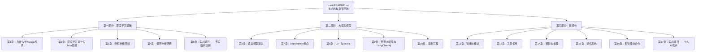
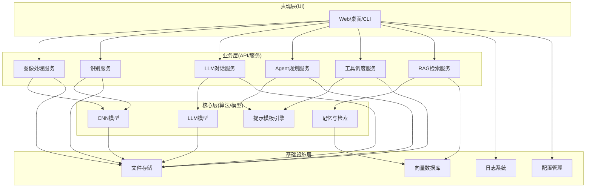
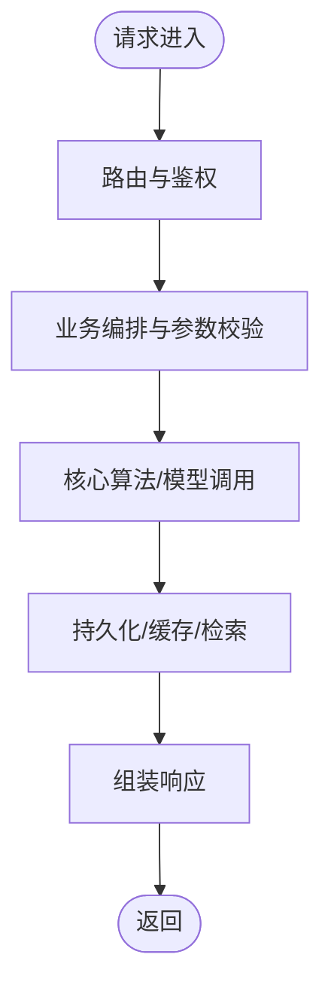
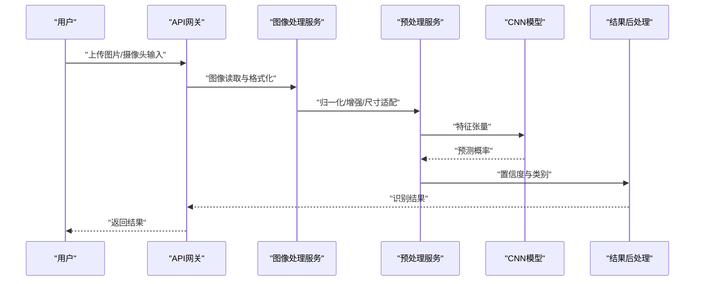
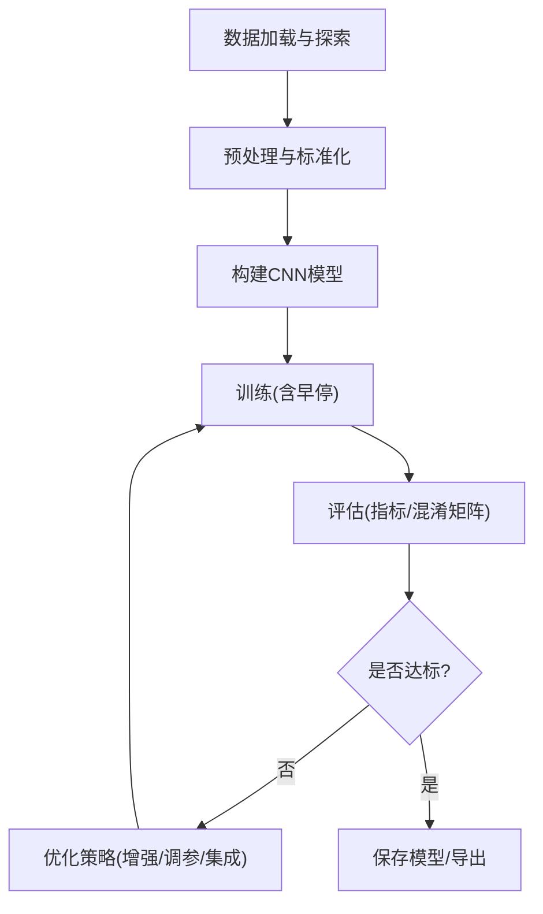
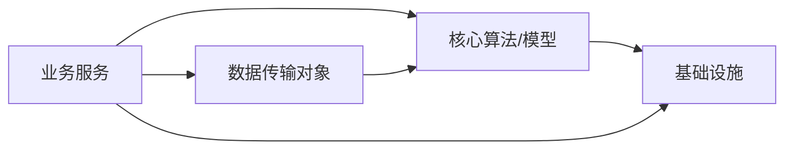

# 项目规划与架构设计

<cite>
**本文引用的文件**
- [book/README.md](file://book/README.md)
- [book/part1-deep-learning/chapter-01/01-why-java-ai.md](file://book/part1-deep-learning/chapter-01/01-why-java-ai.md)
- [book/part1-deep-learning/chapter-01/02-what-is-deep-learning.md](file://book/part1-deep-learning/chapter-01/02-what-is-deep-learning.md)
- [book/part1-deep-learning/chapter-01/03-first-ai-environment.md](file://book/part1-deep-learning/chapter-01/03-first-ai-environment.md)
- [book/part1-deep-learning/chapter-05/01-project-overview.md](file://book/part1-deep-learning/chapter-05/01-project-overview.md)
- [book/part1-deep-learning/chapter-05/02-data-preparation.md](file://book/part1-deep-learning/chapter-05/02-data-preparation.md)
- [book/part1-deep-learning/chapter-05/03-model-design-training.md](file://book/part1-deep-learning/chapter-05/03-model-design-training.md)
- [book/part1-deep-learning/chapter-05/04-model-evaluation-optimization.md](file://book/part1-deep-learning/chapter-05/04-model-evaluation-optimization.md)
</cite>

## 目录
1. [引言](#引言)
2. [项目结构](#项目结构)
3. [核心组件](#核心组件)
4. [架构总览](#架构总览)
5. [详细组件分析](#详细组件分析)
6. [依赖分析](#依赖分析)
7. [性能考虑](#性能考虑)
8. [故障排查指南](#故障排查指南)
9. [结论](#结论)
10. [附录](#附录)

## 引言
本文件面向“个人AI助手”项目的规划与架构设计，基于仓库现有资料，系统阐述模块化设计、可扩展性、系统边界、功能模块划分策略、技术选型决策、部署架构与数据流、里程碑与风险评估、质量保障以及最佳实践。内容以循序渐进的方式组织，既适合初学者快速上手，也为资深工程师提供可落地的工程化参考。

## 项目结构
仓库采用“图书式”组织方式，围绕三大主题展开：
- 第一部分：深度学习基础（含手写数字识别实战）
- 第二部分：大语言模型（LLM）与提示工程
- 第三部分：智能体（Agent）与工具集成、规划推理、记忆系统、多智能体协作

**图示来源**
- [book/README.md:30-168](file://book/README.md#L30-L168)

**章节来源**
- [book/README.md:170-177](file://book/README.md#L170-L177)

## 核心组件
围绕“个人AI助手”的目标，可抽象出以下核心能力模块与支撑模块：

- 核心能力模块
  - 深度学习推理引擎：基于DL4J的CNN推理（可复用至通用图像识别）
  - 大语言模型（LLM）接入：基于LangChain4j的提示工程与RAG
  - Agent规划与工具调用：基于Function Calling与工具注册
  - 记忆与上下文管理：短期/长期记忆与向量检索
  - 多智能体编排：角色分工与消息传递

- 工具集成模块
  - 数据采集与预处理：图像/文本/结构化数据
  - 向量化与检索增强（RAG）：Chroma/Milvus/Pinecone
  - 外部系统对接：数据库、文件系统、第三方API

- 用户界面模块
  - Web/桌面/CLI：统一API网关与前端交互
  - 实时流式输出：WebSocket/Server-Sent Events

- 基础设施模块
  - 模型管理：版本化存储、加载、量化/蒸馏
  - 日志与监控：结构化日志、指标上报
  - 配置中心与密钥管理：环境隔离与安全

**章节来源**
- [book/README.md:148-154](file://book/README.md#L148-L154)
- [book/part1-deep-learning/chapter-05/01-project-overview.md:64-92](file://book/part1-deep-learning/chapter-05/01-project-overview.md#L64-L92)

## 架构总览
“个人AI助手”采用分层架构，强调模块化与可扩展性，系统边界清晰，便于逐步迭代与生产化落地。

**图示来源**
- [book/part1-deep-learning/chapter-05/01-project-overview.md:66-82](file://book/part1-deep-learning/chapter-05/01-project-overview.md#L66-L82)

## 详细组件分析

### 组件A：分层架构与模块边界
- 表现层：统一入口，负责请求路由与响应封装
- 业务层：按职责拆分服务，降低耦合，便于独立演进
- 核心层：模型与算法，强调可替换性与可移植性
- 基础设施层：提供通用能力，屏蔽外部差异

**章节来源**
- [book/part1-deep-learning/chapter-05/01-project-overview.md:48-62](file://book/part1-deep-learning/chapter-05/01-project-overview.md#L48-L62)

### 组件B：数据流与处理管线
以“手写数字识别”为例，展示典型数据流与处理步骤。

**图示来源**
- [book/part1-deep-learning/chapter-05/01-project-overview.md:50-62](file://book/part1-deep-learning/chapter-05/01-project-overview.md#L50-L62)
- [book/part1-deep-learning/chapter-05/02-data-preparation.md:272-312](file://book/part1-deep-learning/chapter-05/02-data-preparation.md#L272-L312)

**章节来源**
- [book/part1-deep-learning/chapter-05/02-data-preparation.md:272-312](file://book/part1-deep-learning/chapter-05/02-data-preparation.md#L272-L312)

### 组件C：模型训练与评估流程
- 模型设计：CNN三层卷积+全连接，BN/ReLU/Dropout
- 训练：早停、监听、评估
- 评估：准确率/精确率/召回率/F1、混淆矩阵
- 优化：数据增强、网格搜索、模型集成、知识蒸馏、量化

**图示来源**
- [book/part1-deep-learning/chapter-05/03-model-design-training.md:144-213](file://book/part1-deep-learning/chapter-05/03-model-design-training.md#L144-L213)
- [book/part1-deep-learning/chapter-05/04-model-evaluation-optimization.md:5-86](file://book/part1-deep-learning/chapter-05/04-model-evaluation-optimization.md#L5-L86)

**章节来源**
- [book/part1-deep-learning/chapter-05/03-model-design-training.md:144-213](file://book/part1-deep-learning/chapter-05/03-model-design-training.md#L144-L213)
- [book/part1-deep-learning/chapter-05/04-model-evaluation-optimization.md:5-86](file://book/part1-deep-learning/chapter-05/04-model-evaluation-optimization.md#L5-L86)

### 组件D：技术选型与决策
- Java 17+：长期支持、新特性、工程化成熟
- 深度学习：Deeplearning4j（DL4J）——Java生态成熟
- LLM：LangChain4j（Java生态活跃）
- 向量数据库：Milvus/Pinecone/Chroma（可按需替换）
- Web服务：Spring Boot（企业级支持）
- 前端：轻量HTML/JS（可扩展为现代框架）

**章节来源**
- [book/part1-deep-learning/chapter-01/03-first-ai-environment.md:82-189](file://book/part1-deep-learning/chapter-01/03-first-ai-environment.md#L82-L189)
- [book/README.md:170-177](file://book/README.md#L170-L177)

### 组件E：个人AI助手的功能模块划分
- 核心能力：图像识别（CNN）、对话理解（LLM）、Agent规划、工具调用、记忆检索
- 工具集成：数据库操作、文件处理、第三方API
- 用户界面：Web/桌面/CLI，支持实时流式输出
- 基础设施：模型版本管理、日志监控、配置中心、向量检索

**章节来源**
- [book/README.md:148-154](file://book/README.md#L148-L154)

## 依赖分析
- 组件内聚与解耦
  - 业务层服务之间通过接口契约解耦，便于替换实现
  - 核心层与基础设施层通过抽象接口隔离，支持多实现切换
- 外部依赖
  - DL4J/LangChain4j版本管理与兼容性
  - 向量数据库与存储后端的可替换性
- 潜在环依赖
  - 通过清晰的接口与分层，避免循环引用
  - 服务间通信尽量使用异步与事件驱动

**图示来源**
- [book/part1-deep-learning/chapter-05/01-project-overview.md:93-121](file://book/part1-deep-learning/chapter-05/01-project-overview.md#L93-L121)

**章节来源**
- [book/part1-deep-learning/chapter-05/01-project-overview.md:93-121](file://book/part1-deep-learning/chapter-05/01-project-overview.md#L93-L121)

## 性能考虑
- 推理性能
  - 模型量化与知识蒸馏降低延迟与资源占用
  - 批处理与缓存提升吞吐
- 训练效率
  - 早停与学习率调度减少无效训练
  - 数据增强与正则化提升泛化
- 可扩展性
  - 服务拆分与无状态化，便于水平扩展
  - 异步消息与限流保护

[本节为通用指导，无需具体文件引用]

## 故障排查指南
- 常见问题定位
  - 数据预处理异常：检查归一化/增强参数与输入格式
  - 训练不收敛：检查学习率、批次大小、正则化
  - 推理慢：启用量化、减少并发、优化批处理
- 日志与监控
  - 结构化日志记录关键路径
  - 指标埋点：吞吐、延迟、错误率、资源使用
- 回滚与恢复
  - 模型版本管理与灰度发布
  - 快照与备份策略

**章节来源**
- [book/part1-deep-learning/chapter-05/04-model-evaluation-optimization.md:350-389](file://book/part1-deep-learning/chapter-05/04-model-evaluation-optimization.md#L350-L389)

## 结论
本规划以“手写数字识别”为起点，逐步扩展到“个人AI助手”的完整能力谱系。通过分层架构、模块化设计与工程化实践，既能满足快速迭代，又能为后续生产化部署打下坚实基础。建议以“M1-M5”里程碑推进，持续进行评估与优化。

[本节为总结性内容，无需具体文件引用]

## 附录

### 里程碑规划与风险评估
- 阶段划分（示例）
  - 阶段1：环境搭建与数据加载
  - 阶段2：模型设计与训练
  - 阶段3：评估与优化
  - 阶段4：API开发与集成
  - 阶段5：测试与部署
- 里程碑
  - M1：数据加载与预处理完成
  - M2：模型训练准确率达预期
  - M3：API接口开发完成
  - M4：系统测试通过
  - M5：部署上线

**章节来源**
- [book/part1-deep-learning/chapter-05/01-project-overview.md:182-202](file://book/part1-deep-learning/chapter-05/01-project-overview.md#L182-L202)

### 质量保证措施
- 测试策略
  - 单元测试：核心算法与工具函数
  - 集成测试：服务间接口与数据流
  - 回归测试：模型版本变更后的稳定性
- 代码质量
  - 规范与静态检查
  - 代码评审与文档同步
- 发布与运维
  - CI/CD流水线
  - A/B测试与灰度发布

[本节为通用指导，无需具体文件引用]

### 最佳实践清单
- 设计
  - 明确模块边界与接口契约
  - 优先考虑可测试性与可观测性
- 实现
  - 使用工厂/策略模式替换条件分支
  - 统一日志与异常处理规范
- 部署
  - 容器化与配置分离
  - 健康检查与自动扩缩容

[本节为通用指导，无需具体文件引用]