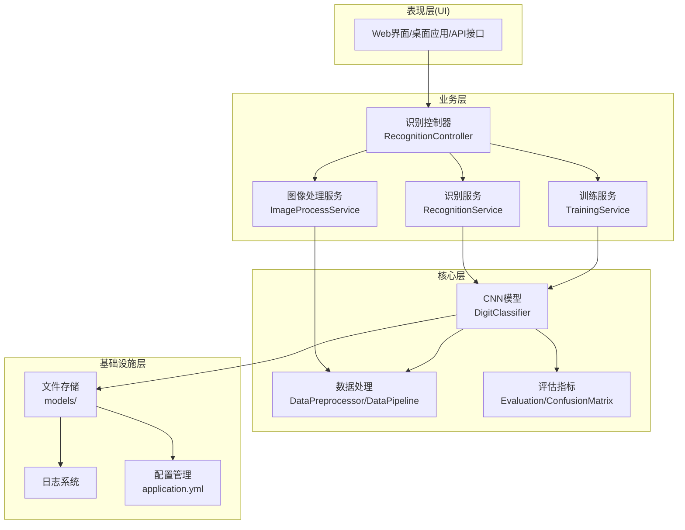
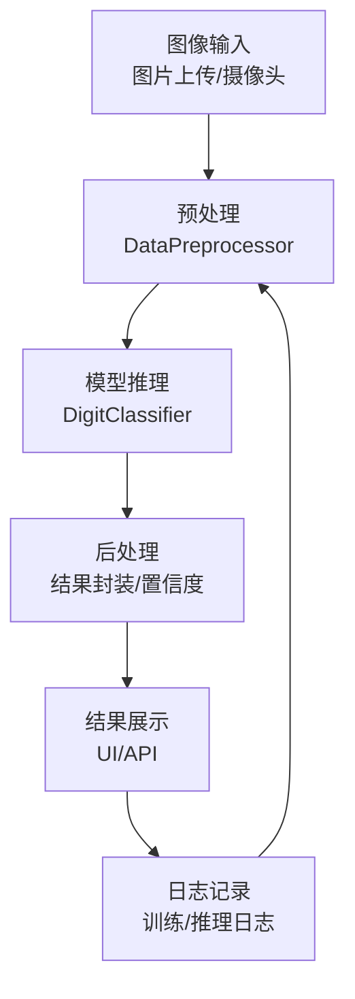
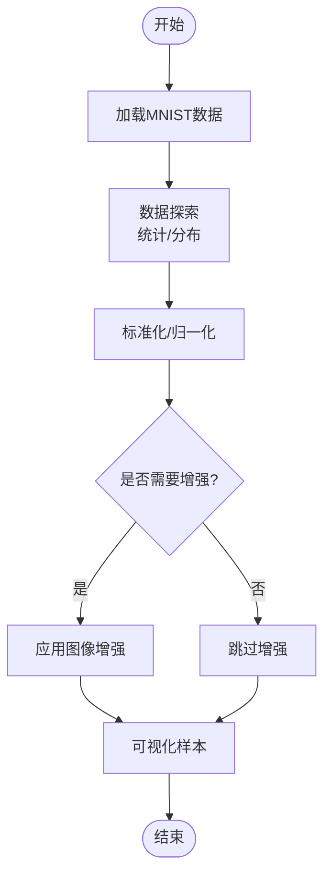
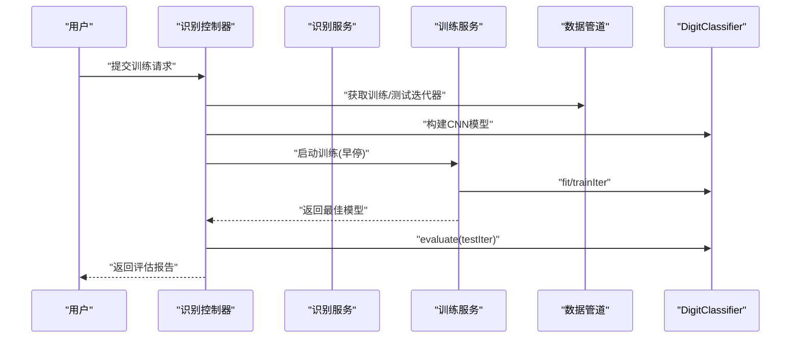
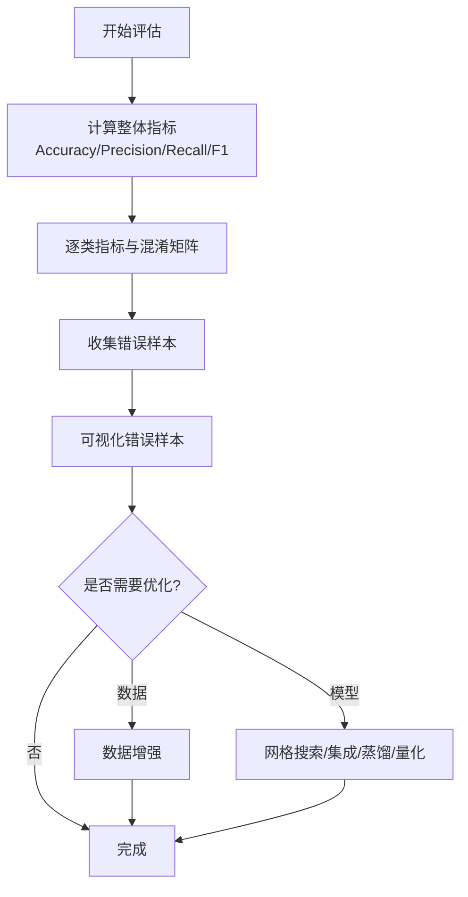

# 实战项目

<cite>
**本文引用的文件**
- [README.md](file://book/README.md)
- [01-project-overview.md](file://book/part1-deep-learning/chapter-05/01-project-overview.md)
- [02-data-preparation.md](file://book/part1-deep-learning/chapter-05/02-data-preparation.md)
- [03-model-design-training.md](file://book/part1-deep-learning/chapter-05/03-model-design-training.md)
- [04-model-evaluation-optimization.md](file://book/part1-deep-learning/chapter-05/04-model-evaluation-optimization.md)
</cite>

## 目录
1. [引言](#引言)
2. [项目结构](#项目结构)
3. [核心组件](#核心组件)
4. [架构总览](#架构总览)
5. [详细组件分析](#详细组件分析)
6. [依赖分析](#依赖分析)
7. [性能考虑](#性能考虑)
8. [故障排查指南](#故障排查指南)
9. [结论](#结论)
10. [附录](#附录)

## 引言
本章节面向实战项目，围绕“手写数字识别系统”的完整开发流程展开，覆盖从需求分析、数据准备、模型设计与训练、到评估与优化的全过程。同时，基于书中的目录与章节标题，给出“智能文档助手”和“个人AI助手”两个综合项目的规划思路与实现要点，帮助读者独立完成这些综合性AI项目。

## 项目结构
本项目以“手写数字识别系统”为主线，采用分层架构与模块化组织方式，便于工程化落地与维护。下图展示了该系统的高层结构与职责划分：

**图表来源**
- [01-project-overview.md:68-82](file://book/part1-deep-learning/chapter-05/01-project-overview.md#L68-L82)
- [01-project-overview.md:95-121](file://book/part1-deep-learning/chapter-05/01-project-overview.md#L95-L121)

**章节来源**
- [01-project-overview.md:64-121](file://book/part1-deep-learning/chapter-05/01-project-overview.md#L64-L121)

## 核心组件
- 数据加载与预处理：MNIST数据加载、数据探索、标准化与增强、自定义数据加载、数据可视化与数据管道。
- 模型设计与训练：CNN架构设计、模型构建、训练流程（基础训练与早停）、超参数调优、模型保存与加载。
- 评估与优化：分类指标、混淆矩阵分析、错误样本可视化、数据增强、超参数网格搜索、模型集成、知识蒸馏、模型量化、性能基准测试。
- 系统边界与技术选型：系统边界图、技术栈选择（DL4J、OpenCV Java、Spring Boot、前端）。

**章节来源**
- [02-data-preparation.md:5-52](file://book/part1-deep-learning/chapter-05/02-data-preparation.md#L5-L52)
- [03-model-design-training.md:36-142](file://book/part1-deep-learning/chapter-05/03-model-design-training.md#L36-L142)
- [04-model-evaluation-optimization.md:15-46](file://book/part1-deep-learning/chapter-05/04-model-evaluation-optimization.md#L15-L46)

## 架构总览
下图展示了“手写数字识别系统”的端到端工作流，从图像输入到模型推理再到结果展示与后处理：

**图表来源**
- [01-project-overview.md:48-62](file://book/part1-deep-learning/chapter-05/01-project-overview.md#L48-L62)

## 详细组件分析

### 数据准备与预处理
- 数据加载：使用DL4J内置MnistDataSetIterator加载训练与测试集；支持自定义目录加载与标签生成。
- 数据探索：统计类别分布、输入维度等，辅助后续数据质量判断。
- 数据预处理：最小-最大归一化到[0,1]，适合CNN收敛；可选图像增强（旋转、平移、缩放）。
- 数据可视化：批量样本可视化，便于直观检查数据质量。
- 数据管道：整合加载、探索、预处理步骤，形成可复用的数据流水线。

**图表来源**
- [02-data-preparation.md:274-312](file://book/part1-deep-learning/chapter-05/02-data-preparation.md#L274-L312)

**章节来源**
- [02-data-preparation.md:7-52](file://book/part1-deep-learning/chapter-05/02-data-preparation.md#L7-L52)
- [02-data-preparation.md:95-143](file://book/part1-deep-learning/chapter-05/02-data-preparation.md#L95-L143)
- [02-data-preparation.md:171-203](file://book/part1-deep-learning/chapter-05/02-data-preparation.md#L171-L203)
- [02-data-preparation.md:205-270](file://book/part1-deep-learning/chapter-05/02-data-preparation.md#L205-L270)
- [02-data-preparation.md:272-312](file://book/part1-deep-learning/chapter-05/02-data-preparation.md#L272-L312)

### 模型设计与训练
- 模型架构：三层卷积块（Conv-BN-ReLU-MaxPool）+ 全连接层 + Dropout + Softmax输出层，输入尺寸28×28×1，输出10类数字。
- 训练流程：基础训练与早停训练（早停条件、评分计算器、模型保存）；支持训练监听与曲线导出。
- 超参数调优：学习率搜索、批次大小影响分析；网格搜索（学习率、Dropout、隐藏层大小）。
- 模型持久化：保存与加载模型，便于部署与复现实验。

**图表来源**
- [03-model-design-training.md:148-213](file://book/part1-deep-learning/chapter-05/03-model-design-training.md#L148-L213)
- [03-model-design-training.md:325-373](file://book/part1-deep-learning/chapter-05/03-model-design-training.md#L325-L373)

**章节来源**
- [03-model-design-training.md:36-142](file://book/part1-deep-learning/chapter-05/03-model-design-training.md#L36-L142)
- [03-model-design-training.md:144-213](file://book/part1-deep-learning/chapter-05/03-model-design-training.md#L144-L213)
- [03-model-design-training.md:244-286](file://book/part1-deep-learning/chapter-05/03-model-design-training.md#L244-L286)
- [03-model-design-training.md:296-321](file://book/part1-deep-learning/chapter-05/03-model-design-training.md#L296-L321)
- [03-model-design-training.md:323-373](file://book/part1-deep-learning/chapter-05/03-model-design-training.md#L323-L373)

### 评估与优化
- 评估指标：整体准确率、精确率、召回率、F1分数；逐类指标与混淆矩阵。
- 错误分析：收集误分类样本，可视化典型错误，定位模型薄弱环节。
- 优化策略：数据增强、网格搜索超参数、模型集成（投票/平均概率）、知识蒸馏、模型量化。
- 性能基准：预热与多次采样，统计平均推理时间与吞吐量。

**图表来源**
- [04-model-evaluation-optimization.md:15-46](file://book/part1-deep-learning/chapter-05/04-model-evaluation-optimization.md#L15-L46)
- [04-model-evaluation-optimization.md:88-141](file://book/part1-deep-learning/chapter-05/04-model-evaluation-optimization.md#L88-L141)
- [04-model-evaluation-optimization.md:143-278](file://book/part1-deep-learning/chapter-05/04-model-evaluation-optimization.md#L143-L278)
- [04-model-evaluation-optimization.md:350-389](file://book/part1-deep-learning/chapter-05/04-model-evaluation-optimization.md#L350-L389)

**章节来源**
- [04-model-evaluation-optimization.md:15-46](file://book/part1-deep-learning/chapter-05/04-model-evaluation-optimization.md#L15-L46)
- [04-model-evaluation-optimization.md:49-86](file://book/part1-deep-learning/chapter-05/04-model-evaluation-optimization.md#L49-L86)
- [04-model-evaluation-optimization.md:88-141](file://book/part1-deep-learning/chapter-05/04-model-evaluation-optimization.md#L88-L141)
- [04-model-evaluation-optimization.md:143-278](file://book/part1-deep-learning/chapter-05/04-model-evaluation-optimization.md#L143-L278)
- [04-model-evaluation-optimization.md:280-348](file://book/part1-deep-learning/chapter-05/04-model-evaluation-optimization.md#L280-L348)
- [04-model-evaluation-optimization.md:350-389](file://book/part1-deep-learning/chapter-05/04-model-evaluation-optimization.md#L350-L389)

### 智能文档助手（规划与实现要点）
基于书的目录与章节标题，智能文档助手项目可参考以下技术路线与实现要点：
- 项目背景与架构设计：明确文档解析、向量化、RAG检索增强生成与对话系统四大部分的职责与边界。
- 文档解析与向量化：将PDF/Word/Markdown等文档切分、清洗、向量化，构建嵌入表示。
- RAG检索增强生成：查询向量化后，从向量库检索Top-K相关片段，拼接上下文，调用LLM生成回答。
- 对话系统实现：维护对话历史、控制上下文长度、处理多轮问答。
- 优化与部署：向量库优化、缓存策略、API限流与监控、容器化部署。

说明：本节为概念性规划与实现要点，不直接分析具体源文件，故不附加“章节来源”。

### 个人AI助手（规划与实现要点）
基于书的目录与章节标题，个人AI助手项目可参考以下技术路线与实现要点：
- 项目规划与架构设计：确定核心能力（问答、工具调用、记忆管理、多智能体协作）与模块划分。
- 核心能力实现：LLM接入、提示工程、结构化输出、推理与行动循环（ReAct）。
- 工具集成与扩展：函数调用（Function Calling）、数据库操作、文件系统访问等。
- 用户界面与交互设计：简洁的对话界面、上下文管理、错误反馈与重试机制。
- 部署与持续优化：模型量化、向量数据库、日志与监控、A/B测试与反馈闭环。

说明：本节为概念性规划与实现要点，不直接分析具体源文件，故不附加“章节来源”。

## 依赖分析
- 深度学习框架：Deeplearning4j（DL4J）用于CNN模型构建与训练。
- 图像处理：OpenCV Java用于图像预处理与增强。
- Web服务：Spring Boot用于API与服务集成。
- 前端：简单HTML/JS用于轻量级界面。
- 向量数据库：可选Milvus/Pinecone/Chroma用于RAG检索。
- 日志与配置：application.yml与日志系统支撑运维与调试。

**章节来源**
- [01-project-overview.md:84-92](file://book/part1-deep-learning/chapter-05/01-project-overview.md#L84-L92)
- [README.md:170-177](file://book/README.md#L170-L177)

## 性能考虑
- 训练性能：合理设置学习率、批次大小；使用早停与学习率调度；批归一化加速收敛。
- 推理性能：模型量化（权重量化）、知识蒸馏、ONNX/TensorRT（如需）；缓存热点查询结果。
- 数据管线：预处理流水线并行化、GPU加速、内存池化。
- 系统监控：训练曲线可视化、延迟与吞吐量监控、错误率追踪。

说明：本节提供通用指导，不直接分析具体源文件，故不附加“章节来源”。

## 故障排查指南
- 数据问题：类别不平衡、像素范围异常、标签不一致。可通过数据探索与可视化定位。
- 训练问题：梯度爆炸/消失、收敛慢、过拟合。调整学习率、加入正则与Dropout、早停。
- 模型问题：精度不达标、推理慢。尝试数据增强、超参数网格搜索、模型集成或量化。
- 部署问题：模型加载失败、推理超时。检查模型格式、硬件资源、并发与缓存策略。

**章节来源**
- [02-data-preparation.md:327-332](file://book/part1-deep-learning/chapter-05/02-data-preparation.md#L327-L332)
- [03-model-design-training.md:388-393](file://book/part1-deep-learning/chapter-05/03-model-design-training.md#L388-L393)
- [04-model-evaluation-optimization.md:400-408](file://book/part1-deep-learning/chapter-05/04-model-evaluation-optimization.md#L400-L408)

## 结论
通过“手写数字识别系统”的完整实践，读者可以掌握从数据准备、模型设计、训练优化到评估部署的全流程方法论。在此基础上，可进一步拓展至“智能文档助手”和“个人AI助手”等综合性项目，将深度学习与大语言模型、RAG、工具调用、记忆系统等技术有机融合，最终实现工程化落地与持续优化。

## 附录
- 项目开发计划与里程碑：阶段性目标与交付节点，便于团队协作与进度把控。
- 思考题与练习题：引导读者深入理解技术原理与工程实践。

**章节来源**
- [01-project-overview.md:182-222](file://book/part1-deep-learning/chapter-05/01-project-overview.md#L182-L222)
- [02-data-preparation.md:314-332](file://book/part1-deep-learning/chapter-05/02-data-preparation.md#L314-L332)
- [03-model-design-training.md:375-393](file://book/part1-deep-learning/chapter-05/03-model-design-training.md#L375-L393)
- [04-model-evaluation-optimization.md:391-418](file://book/part1-deep-learning/chapter-05/04-model-evaluation-optimization.md#L391-L418)