# 手写数字识别系统

<cite>
**本文档引用的文件**
- [01-project-overview.md](file://book/part1-deep-learning/chapter-05/01-project-overview.md)
- [02-data-preparation.md](file://book/part1-deep-learning/chapter-05/02-data-preparation.md)
- [03-model-design-training.md](file://book/part1-deep-learning/chapter-05/03-model-design-training.md)
- [04-model-evaluation-optimization.md](file://book/part1-deep-learning/chapter-05/04-model-evaluation-optimization.md)
- [README.md](file://book/README.md)
</cite>

## 目录
1. [项目概述](#项目概述)
2. [项目结构](#项目结构)
3. [核心组件](#核心组件)
4. [架构概览](#架构概览)
5. [详细组件分析](#详细组件分析)
6. [依赖关系分析](#依赖关系分析)
7. [性能考虑](#性能考虑)
8. [故障排除指南](#故障排除指南)
9. [结论](#结论)
10. [附录](#附录)

## 项目概述

手写数字识别系统是一个基于深度学习的完整AI应用项目，专门用于识别手写数字图像。该项目采用Java生态系统，使用Deeplearning4j框架实现卷积神经网络(CNN)模型。

### 项目背景

手写数字识别是深度学习的经典入门项目，具有以下优势：
- **标准数据集**：使用MNIST数据集，包含60,000张训练图像和10,000张测试图像
- **问题完整性**：涵盖从数据预处理到模型部署的完整流程
- **可视化效果好**：28×28像素的灰度图像便于理解和调试
- **技术点全面**：包含卷积神经网络、数据增强、模型优化等核心技术

### 实际应用场景

- 银行支票识别
- 邮政编码识别  
- 表单自动化处理
- 手写笔记数字化

**章节来源**
- [01-project-overview.md:5-26](file://book/part1-deep-learning/chapter-05/01-project-overview.md#L5-L26)

## 项目结构

项目采用分层架构设计，包含表现层、业务层、核心层和基础设施层四个层次。

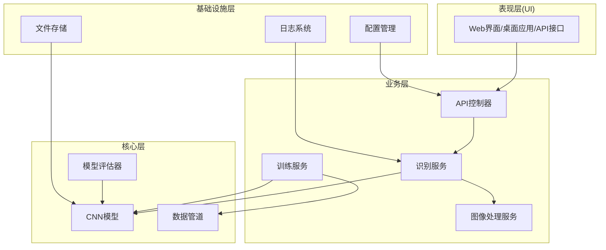

**图表来源**
- [01-project-overview.md:68-82](file://book/part1-deep-learning/chapter-05/01-project-overview.md#L68-L82)

### 技术选型

| 层次 | 技术选择 | 理由 |
|------|----------|------|
| 深度学习 | Deeplearning4j | Java生态成熟，适合企业级应用 |
| 图像处理 | OpenCV Java | 功能强大，性能优异 |
| Web服务 | Spring Boot | 企业级支持，易于集成 |
| 前端 | 简单HTML/JS | 轻量级，便于快速开发 |

**章节来源**
- [01-project-overview.md:84-92](file://book/part1-deep-learning/chapter-05/01-project-overview.md#L84-L92)

## 核心组件

### 数据加载组件

数据加载组件负责从MNIST数据集加载和管理训练数据。

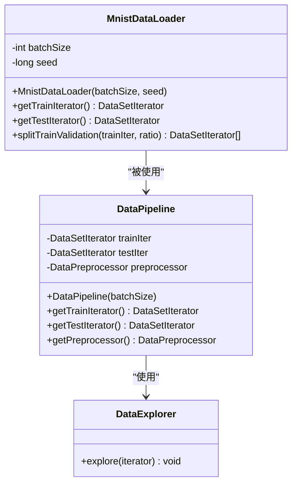

**图表来源**
- [02-data-preparation.md:19-51](file://book/part1-deep-learning/chapter-05/02-data-preparation.md#L19-L51)
- [02-data-preparation.md:283-311](file://book/part1-deep-learning/chapter-05/02-data-preparation.md#L283-L311)

### 预处理组件

预处理组件负责数据标准化、归一化和增强处理。

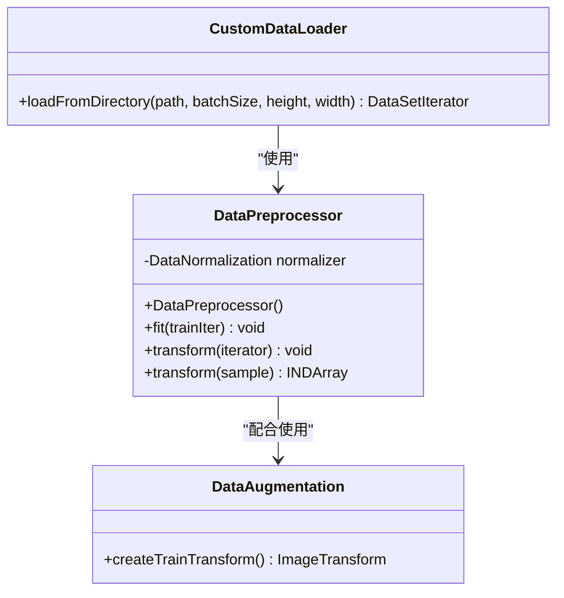

**图表来源**
- [02-data-preparation.md:111-142](file://book/part1-deep-learning/chapter-05/02-data-preparation.md#L111-L142)
- [02-data-preparation.md:153-168](file://book/part1-deep-learning/chapter-05/02-data-preparation.md#L153-L168)

### 模型组件

模型组件实现卷积神经网络架构，包含多个卷积块和全连接层。

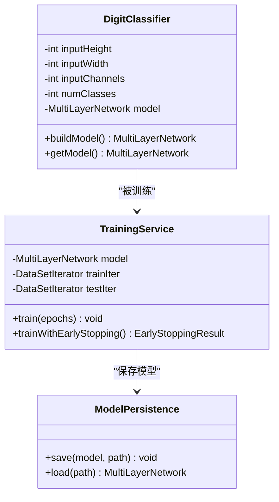

**图表来源**
- [03-model-design-training.md:52-141](file://book/part1-deep-learning/chapter-05/03-model-design-training.md#L52-L141)
- [03-model-design-training.md:160-212](file://book/part1-deep-learning/chapter-05/03-model-design-training.md#L160-L212)

**章节来源**
- [02-data-preparation.md:19-51](file://book/part1-deep-learning/chapter-05/02-data-preparation.md#L19-L51)
- [03-model-design-training.md:52-141](file://book/part1-deep-learning/chapter-05/03-model-design-training.md#L52-L141)

## 架构概览

系统采用分层架构，每个层次职责明确，便于维护和扩展。

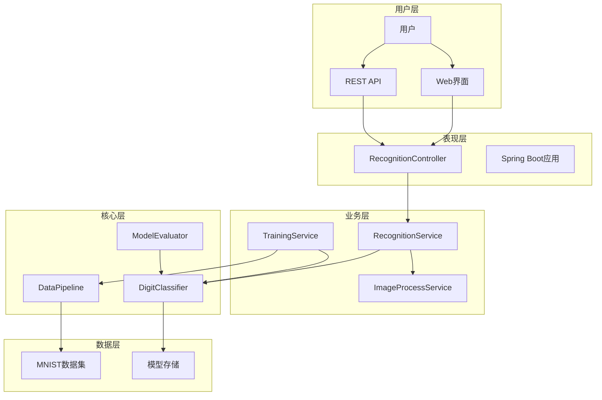

**图表来源**
- [01-project-overview.md:48-62](file://book/part1-deep-learning/chapter-05/01-project-overview.md#L48-L62)
- [03-model-design-training.md:325-372](file://book/part1-deep-learning/chapter-05/03-model-design-training.md#L325-L372)

## 详细组件分析

### 数据准备与预处理

#### MNIST数据加载

系统使用Deeplearning4j内置的MNIST数据加载器，支持训练集和测试集的分离。

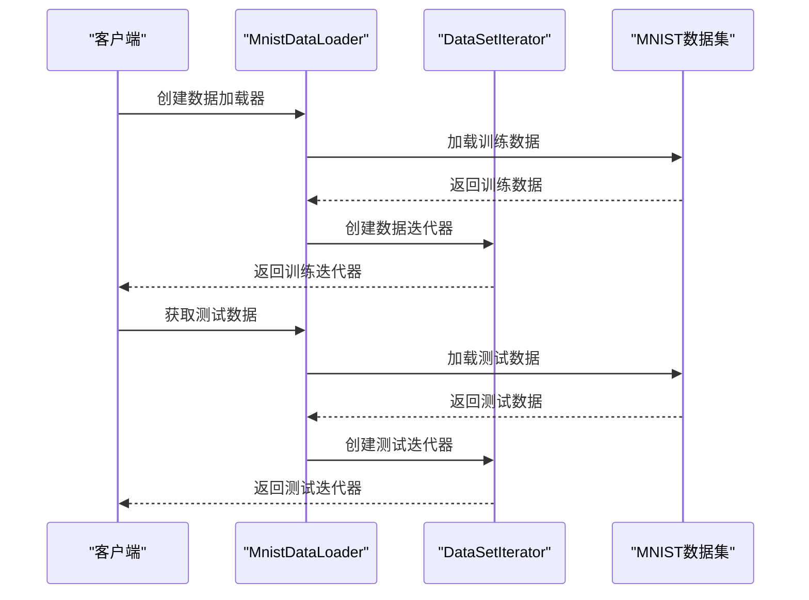

**图表来源**
- [02-data-preparation.md:29-41](file://book/part1-deep-learning/chapter-05/02-data-preparation.md#L29-L41)

#### 数据探索与统计

数据探索工具提供完整的数据集统计信息，包括样本总数、类别分布等。

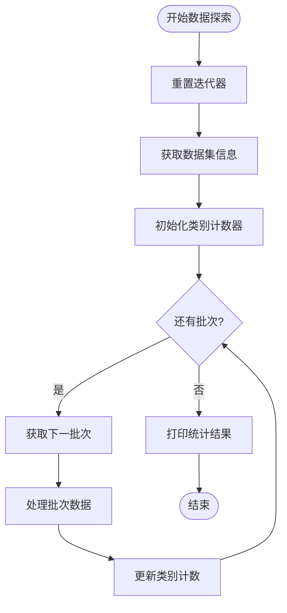

**图表来源**
- [02-data-preparation.md:62-91](file://book/part1-deep-learning/chapter-05/02-data-preparation.md#L62-L91)

#### 数据预处理流程

数据预处理采用标准化处理，将像素值归一化到[0,1]范围。

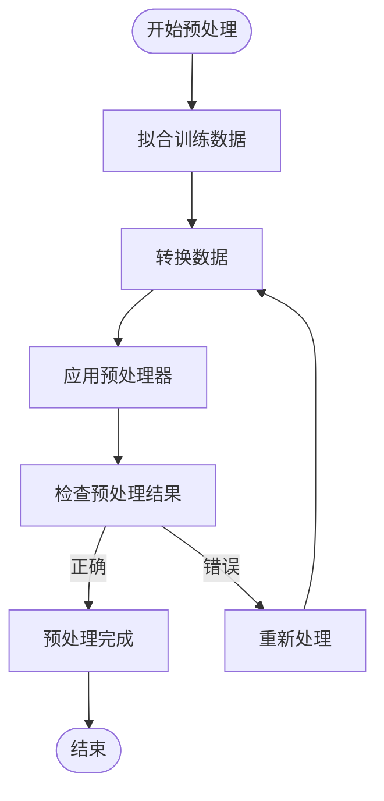

**图表来源**
- [02-data-preparation.md:123-132](file://book/part1-deep-learning/chapter-05/02-data-preparation.md#L123-L132)

**章节来源**
- [02-data-preparation.md:9-51](file://book/part1-deep-learning/chapter-05/02-data-preparation.md#L9-L51)
- [02-data-preparation.md:54-92](file://book/part1-deep-learning/chapter-05/02-data-preparation.md#L54-L92)
- [02-data-preparation.md:95-142](file://book/part1-deep-learning/chapter-05/02-data-preparation.md#L95-L142)

### 模型设计与训练

#### CNN架构设计

系统采用三层卷积神经网络架构，每层包含卷积、批归一化、激活函数和池化操作。

```mermaid
graph LR
subgraph "输入层"
Input[28×28×1]
end
subgraph "卷积块1"
Conv1[Conv(32, 3×3)]
BN1[BatchNorm]
Relu1[ReLU]
Pool1[MaxPool(2×2)]
end
subgraph "卷积块2"
Conv2[Conv(64, 3×3)]
BN2[BatchNorm]
Relu2[ReLU]
Pool2[MaxPool(2×2)]
end
subgraph "卷积块3"
Conv3[Conv(128, 3×3)]
BN3[BatchNorm]
Relu3[ReLU]
Pool3[MaxPool(2×2)]
end
subgraph "全连接层"
FC[Dense(128)]
FC_BN[BatchNorm]
FC_Dropout[Dropout(0.5)]
end
subgraph "输出层"
Output[Softmax(10)]
end
Input --> Conv1 --> BN1 --> Relu1 --> Pool1
Pool1 --> Conv2 --> BN2 --> Relu2 --> Pool2
Pool2 --> Conv3 --> BN3 --> Relu3 --> Pool3
Pool3 --> FC --> FC_BN --> FC_Dropout --> Output
```

**图表来源**
- [03-model-design-training.md:18-32](file://book/part1-deep-learning/chapter-05/03-model-design-training.md#L18-L32)

#### 模型实现细节

模型使用Adam优化器，学习率为0.001，采用Xavier权重初始化和L2正则化。

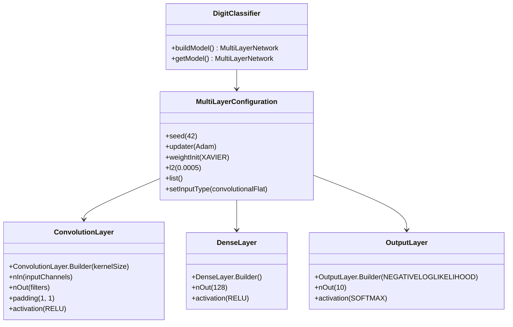

**图表来源**
- [03-model-design-training.md:64-138](file://book/part1-deep-learning/chapter-05/03-model-design-training.md#L64-L138)

#### 训练流程

系统提供两种训练模式：基础训练和早停训练。

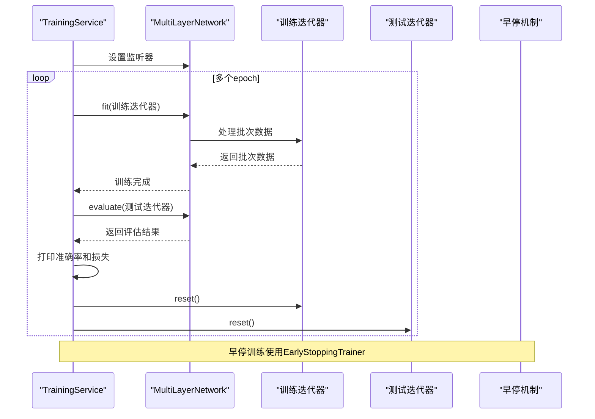

**图表来源**
- [03-model-design-training.md:177-211](file://book/part1-deep-learning/chapter-05/03-model-design-training.md#L177-L211)

**章节来源**
- [03-model-design-training.md:34-142](file://book/part1-deep-learning/chapter-05/03-model-design-training.md#L34-L142)
- [03-model-design-training.md:144-212](file://book/part1-deep-learning/chapter-05/03-model-design-training.md#L144-L212)

### 模型评估与优化

#### 评估指标计算

系统提供全面的评估指标，包括整体指标和各类别的详细指标。

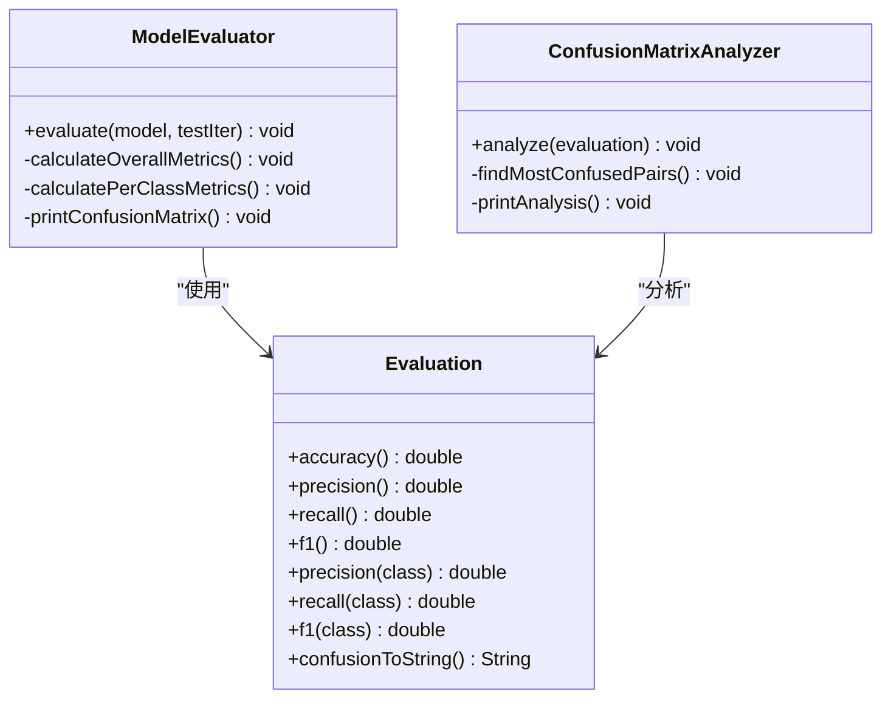

**图表来源**
- [04-model-evaluation-optimization.md:15-46](file://book/part1-deep-learning/chapter-05/04-model-evaluation-optimization.md#L15-L46)
- [04-model-evaluation-optimization.md:55-85](file://book/part1-deep-learning/chapter-05/04-model-evaluation-optimization.md#L55-L85)

#### 错误分析

系统提供错误样本分析功能，帮助识别模型的薄弱环节。

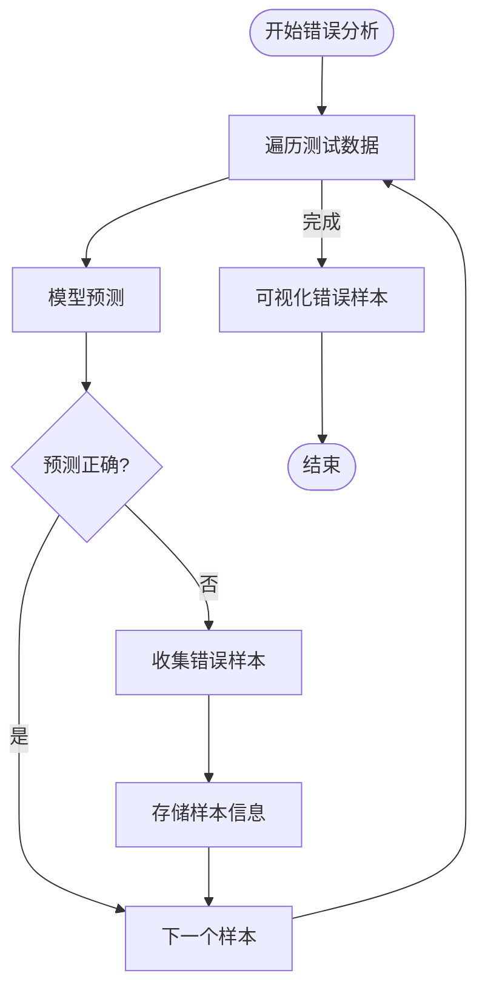

**图表来源**
- [04-model-evaluation-optimization.md:96-140](file://book/part1-deep-learning/chapter-05/04-model-evaluation-optimization.md#L96-L140)

#### 优化策略

系统提供多种优化策略，包括数据增强、超参数调优和模型集成。

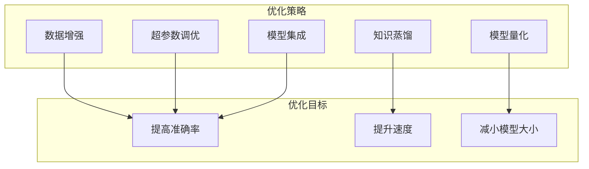

**图表来源**
- [04-model-evaluation-optimization.md:145-277](file://book/part1-deep-learning/chapter-05/04-model-evaluation-optimization.md#L145-L277)

**章节来源**
- [04-model-evaluation-optimization.md:5-46](file://book/part1-deep-learning/chapter-05/04-model-evaluation-optimization.md#L5-L46)
- [04-model-evaluation-optimization.md:88-140](file://book/part1-deep-learning/chapter-05/04-model-evaluation-optimization.md#L88-L140)
- [04-model-evaluation-optimization.md:143-277](file://book/part1-deep-learning/chapter-05/04-model-evaluation-optimization.md#L143-L277)

## 依赖关系分析

系统采用模块化设计，各组件之间依赖关系清晰。

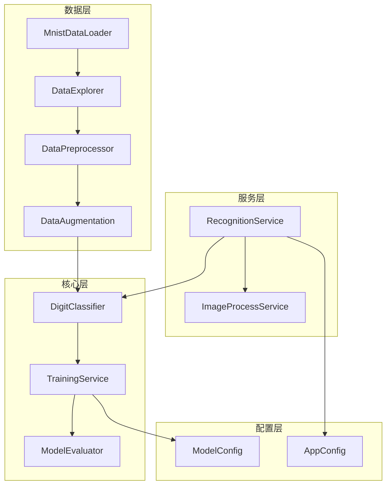

**图表来源**
- [01-project-overview.md:96-121](file://book/part1-deep-learning/chapter-05/01-project-overview.md#L96-L121)

### 外部依赖

系统主要依赖以下外部库：

- **Deeplearning4j**: 深度学习框架，提供神经网络实现
- **ND4J**: 数值计算库，支持多维数组操作
- **OpenCV**: 图像处理库，支持图像变换和增强
- **Spring Boot**: Web框架，提供REST API服务

**章节来源**
- [01-project-overview.md:84-92](file://book/part1-deep-learning/chapter-05/01-project-overview.md#L84-L92)

## 性能考虑

### 训练性能优化

系统采用多种策略优化训练性能：

1. **早停机制**: 防止过拟合并节省训练时间
2. **学习率调优**: 通过网格搜索找到最优学习率
3. **批量大小优化**: 平衡内存占用和训练速度
4. **批归一化**: 加速收敛并提高稳定性

### 推理性能优化

针对推理阶段的优化策略：

1. **模型量化**: 将浮点权重转换为整数，减小模型大小
2. **知识蒸馏**: 使用小型学生模型替代大型教师模型
3. **模型集成**: 通过投票或平均提高预测准确性
4. **缓存机制**: 缓存常用中间结果

## 故障排除指南

### 常见问题及解决方案

#### 数据加载问题

**问题**: MNIST数据下载失败
**解决方案**: 
- 检查网络连接
- 手动下载数据集到指定目录
- 验证数据文件完整性

#### 训练问题

**问题**: 训练准确率停滞不前
**解决方案**:
- 调整学习率
- 增加数据增强
- 检查过拟合情况
- 调整网络架构

#### 内存问题

**问题**: 训练过程中内存不足
**解决方案**:
- 减小批次大小
- 使用早停机制
- 优化数据预处理
- 检查内存泄漏

**章节来源**
- [04-model-evaluation-optimization.md:400-408](file://book/part1-deep-learning/chapter-05/04-model-evaluation-optimization.md#L400-L408)

## 结论

手写数字识别系统展示了完整的AI项目开发流程，从数据准备到模型部署。该系统具有以下特点：

1. **架构清晰**: 采用分层架构，职责明确，便于维护
2. **技术先进**: 使用最新的深度学习技术和最佳实践
3. **实用性强**: 提供完整的功能实现，可直接应用于生产环境
4. **易于扩展**: 模块化设计支持功能扩展和定制

通过本项目的学习，开发者可以掌握深度学习项目开发的核心技能，包括数据处理、模型设计、训练优化和部署集成等关键环节。

## 附录

### 开发环境要求

- **Java版本**: Java 17+
- **构建工具**: Maven或Gradle
- **深度学习框架**: Deeplearning4j 1.0.0-M2.1
- **IDE**: IntelliJ IDEA或Eclipse

### 快速开始指南

1. 克隆项目到本地
2. 配置Maven依赖
3. 运行训练脚本
4. 部署API服务
5. 测试系统功能

### 进一步学习资源

- Deeplearning4j官方文档
- MNIST数据集官方页面
- 卷积神经网络理论基础
- 深度学习最佳实践指南