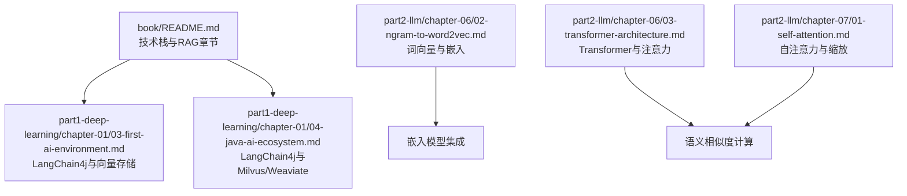
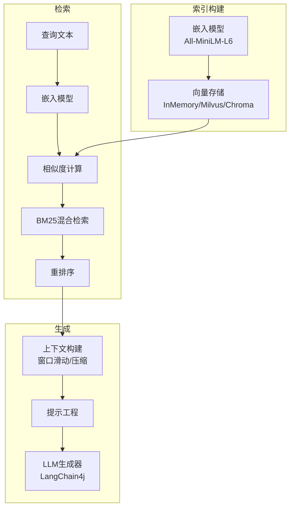
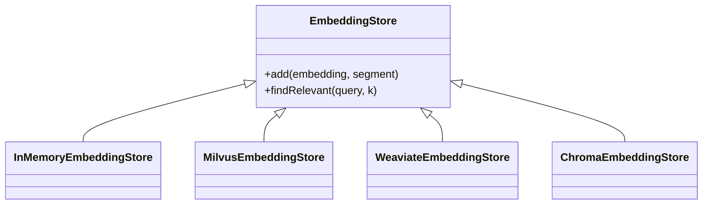
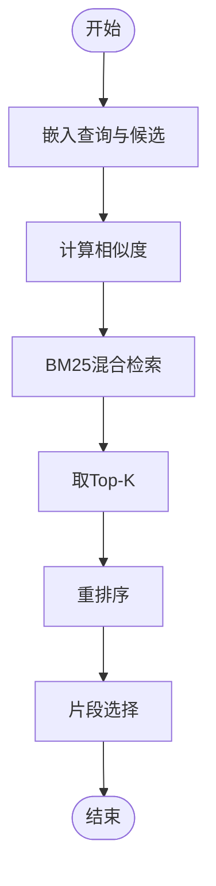
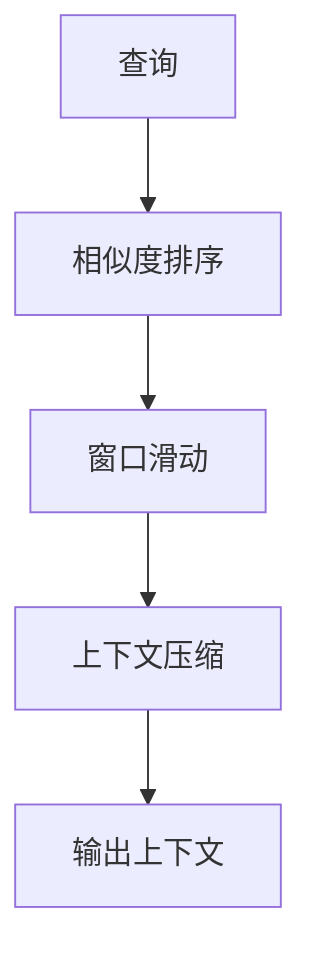
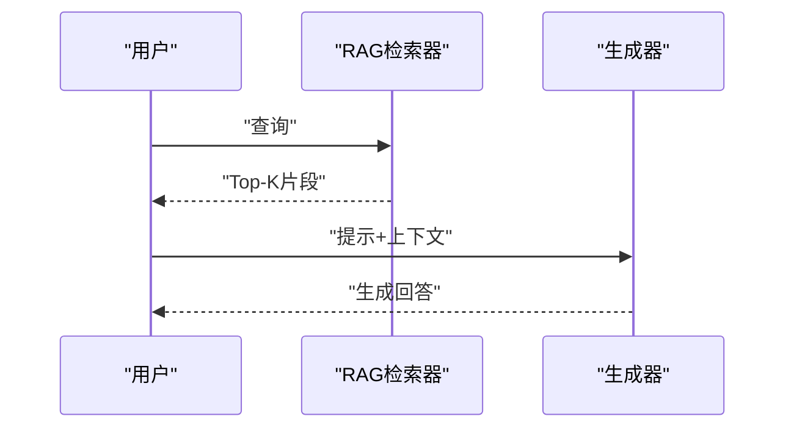
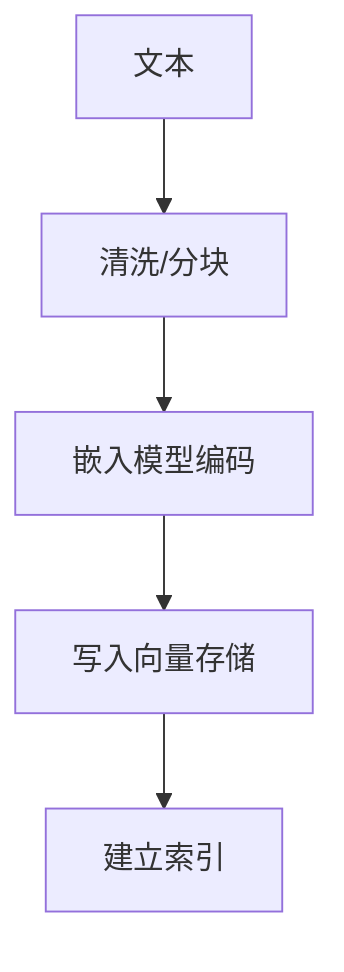
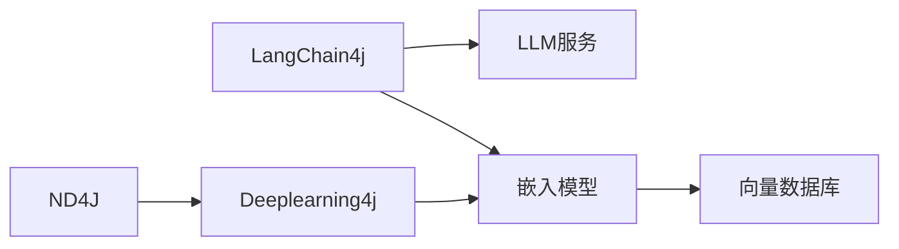

# RAG系统实现

<cite>
**本文引用的文件**
- [book/README.md](file://book/README.md)
- [book/part1-deep-learning/chapter-01/01-why-java-ai.md](file://book/part1-deep-learning/chapter-01/01-why-java-ai.md)
- [book/part1-deep-learning/chapter-01/02-what-is-deep-learning.md](file://book/part1-deep-learning/chapter-01/02-what-is-deep-learning.md)
- [book/part1-deep-learning/chapter-01/03-first-ai-environment.md](file://book/part1-deep-learning/chapter-01/03-first-ai-environment.md)
- [book/part1-deep-learning/chapter-01/04-java-ai-ecosystem.md](file://book/part1-deep-learning/chapter-01/04-java-ai-ecosystem.md)
- [book/part2-llm/chapter-06/01-what-is-language-model.md](file://book/part2-llm/chapter-06/01-what-is-language-model.md)
- [book/part2-llm/chapter-06/02-ngram-to-word2vec.md](file://book/part2-llm/chapter-06/02-ngram-to-word2vec.md)
- [book/part2-llm/chapter-06/03-transformer-architecture.md](file://book/part2-llm/chapter-06/03-transformer-architecture.md)
- [book/part2-llm/chapter-07/01-self-attention.md](file://book/part2-llm/chapter-07/01-self-attention.md)
</cite>

## 目录
1. [简介](#简介)
2. [项目结构](#项目结构)
3. [核心组件](#核心组件)
4. [架构总览](#架构总览)
5. [详细组件分析](#详细组件分析)
6. [依赖分析](#依赖分析)
7. [性能考量](#性能考量)
8. [故障排查指南](#故障排查指南)
9. [结论](#结论)
10. [附录](#附录)

## 简介
本文件围绕RAG（检索增强生成）系统的技术实现进行系统化梳理，结合仓库中已有的深度学习与大语言模型相关内容，给出向量数据库设计、检索策略、上下文构建、生成优化以及性能优化的工程化方案。重点覆盖以下方面：
- 向量数据库与索引：FAISS、Weaviate等的选型与配置要点
- 检索策略：语义相似度、BM25混合检索与重排序
- 上下文构建：片段选择、窗口滑动与压缩
- 生成优化：提示工程、上下文注入与输出控制
- 向量嵌入模型：Sentence-BERT、MiniLM等的集成
- 性能优化：查询加速、内存管理与并发处理

## 项目结构
该仓库以“图书”形式组织内容，涵盖深度学习基础、大语言模型与智能体主题。与RAG实现密切相关的章节包括：
- 环境与框架：Java 17、Maven、Deeplearning4j、LangChain4j
- 向量存储与RAG：Milvus/Chroma等向量存储、LangChain4j内置RAG支持
- 词嵌入与语义：N-gram、Word2Vec、Transformer与注意力机制

**图表来源**
- [book/README.md:170-177](file://book/README.md#L170-L177)
- [book/part1-deep-learning/chapter-01/03-first-ai-environment.md:133-146](file://book/part1-deep-learning/chapter-01/03-first-ai-environment.md#L133-L146)
- [book/part1-deep-learning/chapter-01/04-java-ai-ecosystem.md:117-210](file://book/part1-deep-learning/chapter-01/04-java-ai-ecosystem.md#L117-L210)
- [book/part2-llm/chapter-06/02-ngram-to-word2vec.md:204-329](file://book/part2-llm/chapter-06/02-ngram-to-word2vec.md#L204-L329)
- [book/part2-llm/chapter-06/03-transformer-architecture.md:31-120](file://book/part2-llm/chapter-06/03-transformer-architecture.md#L31-L120)
- [book/part2-llm/chapter-07/01-self-attention.md:40-131](file://book/part2-llm/chapter-07/01-self-attention.md#L40-L131)

**章节来源**
- [book/README.md:170-177](file://book/README.md#L170-L177)
- [book/part1-deep-learning/chapter-01/03-first-ai-environment.md:133-146](file://book/part1-deep-learning/chapter-01/03-first-ai-environment.md#L133-L146)
- [book/part1-deep-learning/chapter-01/04-java-ai-ecosystem.md:117-210](file://book/part1-deep-learning/chapter-01/04-java-ai-ecosystem.md#L117-L210)

## 核心组件
- 向量嵌入模型：All-MiniLM-L6等轻量级嵌入模型，用于将文本映射到稠密向量空间
- 向量存储：InMemoryEmbeddingStore、Milvus、Chroma等，支持高效相似度检索
- 检索器：基于语义相似度与BM25的混合检索，结合重排序提升相关性
- 上下文构建：基于窗口滑动与压缩的片段选择策略
- 生成器：LangChain4j集成，支持提示注入与输出控制
- 性能优化：GPU加速、批量查询、缓存与并发

**章节来源**
- [book/part1-deep-learning/chapter-01/04-java-ai-ecosystem.md:207-222](file://book/part1-deep-learning/chapter-01/04-java-ai-ecosystem.md#L207-L222)
- [book/part1-deep-learning/chapter-01/04-java-ai-ecosystem.md:381-386](file://book/part1-deep-learning/chapter-01/04-java-ai-ecosystem.md#L381-L386)

## 架构总览
RAG系统整体分为“索引构建—检索—生成”三层，结合嵌入模型与向量存储实现语义检索，并通过提示工程与上下文注入提升生成质量。

**图表来源**
- [book/part1-deep-learning/chapter-01/04-java-ai-ecosystem.md:207-222](file://book/part1-deep-learning/chapter-01/04-java-ai-ecosystem.md#L207-L222)
- [book/part1-deep-learning/chapter-01/04-java-ai-ecosystem.md:381-386](file://book/part1-deep-learning/chapter-01/04-java-ai-ecosystem.md#L381-L386)

## 详细组件分析

### 向量数据库与索引设计
- 选型对比
  - Milvus：高性能、分布式，适合大规模向量检索与实时查询
  - Weaviate：语义理解强，支持向量与属性混合查询
  - Chroma：轻量、易于部署，适合本地与小规模场景
- 配置要点
  - 索引类型：HNSW/IVF等，平衡召回与速度
  - 距离度量：内积/余弦/点积，依据嵌入归一化策略选择
  - 分片与副本：根据QPS与延迟目标调参
  - 索引刷新与增量更新：批量导入与流式更新策略

**图表来源**
- [book/part1-deep-learning/chapter-01/04-java-ai-ecosystem.md:207-222](file://book/part1-deep-learning/chapter-01/04-java-ai-ecosystem.md#L207-L222)
- [book/part1-deep-learning/chapter-01/04-java-ai-ecosystem.md:381-386](file://book/part1-deep-learning/chapter-01/04-java-ai-ecosystem.md#L381-L386)

**章节来源**
- [book/part1-deep-learning/chapter-01/04-java-ai-ecosystem.md:201-222](file://book/part1-deep-learning/chapter-01/04-java-ai-ecosystem.md#L201-L222)
- [book/part1-deep-learning/chapter-01/04-java-ai-ecosystem.md:381-386](file://book/part1-deep-learning/chapter-01/04-java-ai-ecosystem.md#L381-L386)

### 检索策略实现
- 语义相似度计算
  - 基于嵌入模型（如All-MiniLM-L6）将查询与候选文档映射到同一向量空间
  - 使用余弦相似度或内积计算，归一化后排序
- BM25混合检索
  - 结合词频统计与向量相似度，缓解稀疏性与OOV问题
  - 通过加权融合提升召回质量
- 重排序算法
  - 使用交叉编码器或双塔模型对Top-K候选进行二次打分
  - 考虑语义一致性与上下文匹配度

**图表来源**
- [book/part2-llm/chapter-06/02-ngram-to-word2vec.md:204-329](file://book/part2-llm/chapter-06/02-ngram-to-word2vec.md#L204-L329)
- [book/part2-llm/chapter-06/03-transformer-architecture.md:31-120](file://book/part2-llm/chapter-06/03-transformer-architecture.md#L31-L120)

**章节来源**
- [book/part2-llm/chapter-06/02-ngram-to-word2vec.md:204-329](file://book/part2-llm/chapter-06/02-ngram-to-word2vec.md#L204-L329)
- [book/part2-llm/chapter-06/03-transformer-architecture.md:31-120](file://book/part2-llm/chapter-06/03-transformer-architecture.md#L31-L120)

### 上下文构建技术
- 相关文档片段选择
  - 基于相似度阈值与Top-K裁剪，避免噪声
- 窗口滑动
  - 以固定窗口大小滑动，保留关键句与上下文连续性
- 上下文压缩
  - 使用摘要或抽取式压缩，控制Token上限
  - 优先保留高相似度与高信息量片段

**图表来源**
- [book/part2-llm/chapter-06/02-ngram-to-word2vec.md:204-329](file://book/part2-llm/chapter-06/02-ngram-to-word2vec.md#L204-L329)

**章节来源**
- [book/part2-llm/chapter-06/02-ngram-to-word2vec.md:204-329](file://book/part2-llm/chapter-06/02-ngram-to-word2vec.md#L204-L329)

### 生成优化技术
- 提示工程
  - 明确角色、任务与约束，减少歧义
  - 使用Chain-of-Thought与Few-shot示例提升推理稳定性
- 上下文注入
  - 将精选片段与格式化提示拼接，控制上下文长度
- 输出控制策略
  - 温度采样、Top-p与长度限制，结合后处理过滤

**图表来源**
- [book/part1-deep-learning/chapter-01/04-java-ai-ecosystem.md:207-222](file://book/part1-deep-learning/chapter-01/04-java-ai-ecosystem.md#L207-L222)

**章节来源**
- [book/part1-deep-learning/chapter-01/04-java-ai-ecosystem.md:207-222](file://book/part1-deep-learning/chapter-01/04-java-ai-ecosystem.md#L207-L222)

### 向量嵌入模型集成方案
- Sentence-BERT（SBERT）
  - 语义匹配能力强，适合段落级相似度
  - 支持句子级归一化与平均池化
- MiniLM
  - 轻量高效，适合资源受限场景
  - 与Transformer注意力机制一致，便于统一处理
- 集成步骤
  - 文本分块与清洗
  - 调用嵌入模型生成向量
  - 写入向量存储并建立索引

**图表来源**
- [book/part2-llm/chapter-06/02-ngram-to-word2vec.md:204-329](file://book/part2-llm/chapter-06/02-ngram-to-word2vec.md#L204-L329)
- [book/part2-llm/chapter-06/03-transformer-architecture.md:31-120](file://book/part2-llm/chapter-06/03-transformer-architecture.md#L31-L120)

**章节来源**
- [book/part2-llm/chapter-06/02-ngram-to-word2vec.md:204-329](file://book/part2-llm/chapter-06/02-ngram-to-word2vec.md#L204-L329)
- [book/part2-llm/chapter-06/03-transformer-architecture.md:31-120](file://book/part2-llm/chapter-06/03-transformer-architecture.md#L31-L120)

## 依赖分析
- LangChain4j：提供LLM集成与RAG能力
- Deeplearning4j/ND4J：矩阵运算与嵌入模型训练/推理
- 向量存储：Milvus/Chroma等第三方组件
- 词嵌入：Word2Vec/SBERT等预训练模型

**图表来源**
- [book/part1-deep-learning/chapter-01/03-first-ai-environment.md:133-146](file://book/part1-deep-learning/chapter-01/03-first-ai-environment.md#L133-L146)
- [book/part1-deep-learning/chapter-01/04-java-ai-ecosystem.md:117-210](file://book/part1-deep-learning/chapter-01/04-java-ai-ecosystem.md#L117-L210)

**章节来源**
- [book/part1-deep-learning/chapter-01/03-first-ai-environment.md:133-146](file://book/part1-deep-learning/chapter-01/03-first-ai-environment.md#L133-L146)
- [book/part1-deep-learning/chapter-01/04-java-ai-ecosystem.md:117-210](file://book/part1-deep-learning/chapter-01/04-java-ai-ecosystem.md#L117-L210)

## 性能考量
- 查询加速
  - 向量索引：HNSW/IVF，合理设置M/efConstruction
  - 索引分区：按业务维度划分，降低查询维度
  - 预计算：热点查询结果缓存
- 内存管理
  - 向量归一化与量化（PQ/OPQ）降低显存占用
  - 分页与流式返回，避免一次性加载过多向量
- 并发处理
  - 批量嵌入与检索，利用GPU并行
  - 请求限流与队列调度，保障SLA

## 故障排查指南
- 常见问题
  - 相似度异常：检查嵌入归一化与距离度量
  - 检索命中率低：调整BM25权重与相似度阈值
  - 生成质量差：优化提示模板与上下文长度
  - 性能瓶颈：定位向量索引与嵌入模型热点
- 调试建议
  - 增加日志埋点：请求耗时、命中率、缓存命中
  - A/B实验：对比不同索引与提示策略
  - 压测与扩缩容：模拟峰值流量，验证弹性

## 结论
本文件基于仓库现有内容，给出了RAG系统从嵌入、检索到生成的工程化实现路径。结合LangChain4j与向量存储，配合语义相似度与BM25混合检索及重排序，可在保证质量的同时兼顾性能。后续可进一步引入更高效的索引与压缩策略，以支撑更大规模与更高并发的场景。

## 附录
- 术语
  - 向量存储：持久化向量与元数据的系统
  - 相似度：衡量向量之间接近程度的指标
  - 重排序：对初步检索结果进行再评分与排序
- 参考
  - 词向量与嵌入：Word2Vec、SBERT、MiniLM
  - 架构与注意力：Transformer、自注意力、多头注意力