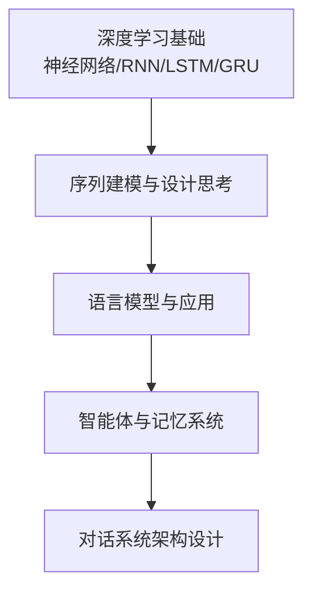
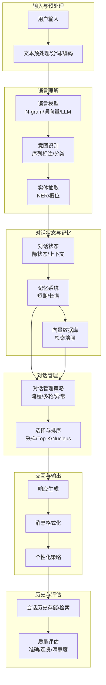
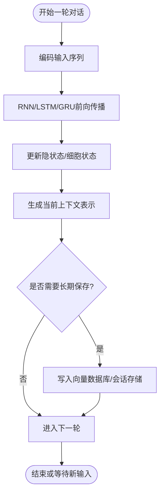
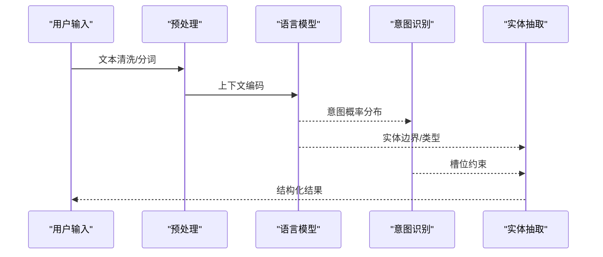
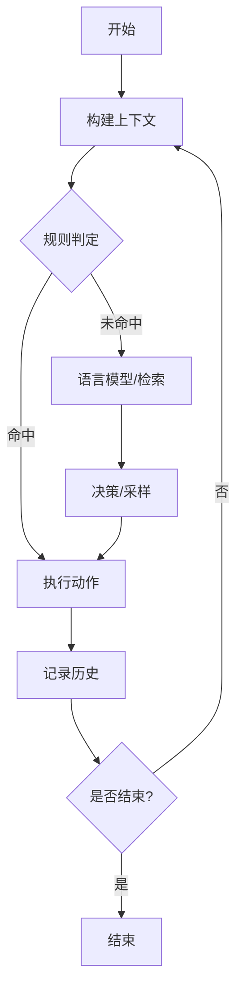
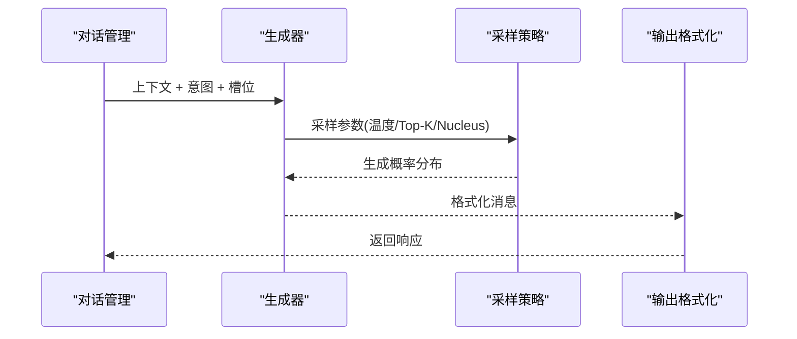
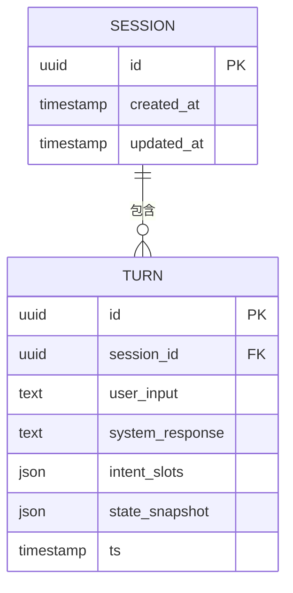
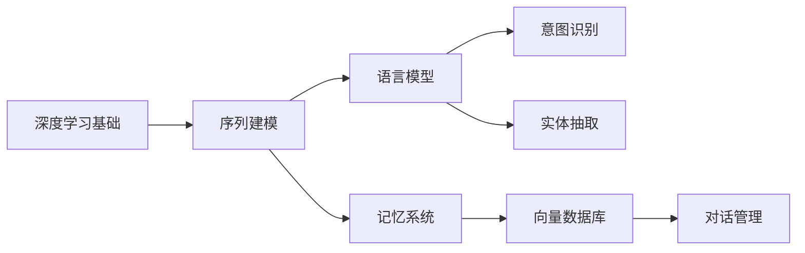

# 对话系统架构

<cite>
**本文引用的文件**   
- [book/README.md](file://book/README.md)
- [book/part1-deep-learning/chapter-01/01-why-java-ai.md](file://book/part1-deep-learning/chapter-01/01-why-java-ai.md)
- [book/part1-deep-learning/chapter-01/02-what-is-deep-learning.md](file://book/part1-deep-learning/chapter-01/02-what-is-deep-learning.md)
- [book/part1-deep-learning/chapter-01/03-first-ai-environment.md](file://book/part1-deep-learning/chapter-01/03-first-ai-environment.md)
- [book/part1-deep-learning/chapter-04/01-sequence-data-challenge.md](file://book/part1-deep-learning/chapter-04/01-sequence-data-challenge.md)
- [book/part1-deep-learning/chapter-04/02-rnn-memory-and-forgetting.md](file://book/part1-deep-learning/chapter-04/02-rnn-memory-and-forgetting.md)
- [book/part1-deep-learning/chapter-04/03-lstm-and-gru.md](file://book/part1-deep-learning/chapter-04/03-lstm-and-gru.md)
- [book/part1-deep-learning/chapter-04/04-text-generation-practice.md](file://book/part1-deep-learning/chapter-04/04-text-generation-practice.md)
- [book/part1-deep-learning/chapter-04/05-design-thinking-sequential-modeling.md](file://book/part1-deep-learning/chapter-04/05-design-thinking-sequential-modeling.md)
- [book/part2-llm/chapter-06/01-what-is-language-model.md](file://book/part2-llm/chapter-06/01-what-is-language-model.md)
- [book/part2-llm/chapter-06/02-ngram-to-word2vec.md](file://book/part2-llm/chapter-06/02-ngram-to-word2vec.md)
</cite>

## 目录
1. [简介](#简介)
2. [项目结构](#项目结构)
3. [核心组件](#核心组件)
4. [架构总览](#架构总览)
5. [详细组件分析](#详细组件分析)
6. [依赖分析](#依赖分析)
7. [性能考量](#性能考量)
8. [故障排查指南](#故障排查指南)
9. [结论](#结论)
10. [附录](#附录)

## 简介
本文件围绕“对话系统架构”的技术实现进行系统化梳理，结合仓库中关于深度学习、序列建模与语言模型的基础知识，给出对话系统在状态管理、意图识别、对话管理、用户交互与历史管理等方面的工程化落地建议。文档强调以序列建模与语言模型为核心，辅以记忆与外部存储，形成可扩展、可维护的对话系统。

## 项目结构
该仓库以“图书”形式组织内容，覆盖深度学习基础、大语言模型与智能体相关主题。与对话系统直接相关的知识分布在以下章节：
- 深度学习基础：神经网络、RNN/LSTM/GRU、序列数据挑战与设计思考
- 语言模型：定义、应用与N-gram到词向量的发展
- 智能体与记忆：短期/长期记忆、对话记忆管理、向量数据库

**章节来源**
- [book/README.md:30-168](file://book/README.md#L30-L168)

## 核心组件
基于仓库内容，对话系统可抽象为如下核心组件：
- 语言理解与槽位填充：以语言模型与序列建模为基础，实现意图识别与实体抽取
- 对话状态管理：利用隐状态与记忆机制，跟踪会话状态与上下文
- 对话管理策略：基于序列建模的流程控制与多轮协调
- 用户交互设计：消息格式化、响应生成与个性化策略
- 历史管理：会话存储、检索与分析
- 质量评估：准确性、连贯性与用户满意度指标

**章节来源**
- [book/part1-deep-learning/chapter-04/01-sequence-data-challenge.md:1-350](file://book/part1-deep-learning/chapter-04/01-sequence-data-challenge.md#L1-L350)
- [book/part1-deep-learning/chapter-04/02-rnn-memory-and-forgetting.md:1-375](file://book/part1-deep-learning/chapter-04/02-rnn-memory-and-forgetting.md#L1-L375)
- [book/part1-deep-learning/chapter-04/03-lstm-and-gru.md:1-365](file://book/part1-deep-learning/chapter-04/03-lstm-and-gru.md#L1-L365)
- [book/part2-llm/chapter-06/01-what-is-language-model.md:1-62](file://book/part2-llm/chapter-06/01-what-is-language-model.md#L1-L62)
- [book/part2-llm/chapter-06/02-ngram-to-word2vec.md:1-135](file://book/part2-llm/chapter-06/02-ngram-to-word2vec.md#L1-L135)

## 架构总览
对话系统以“语言模型 + 序列建模 + 记忆系统”为核心，结合外部向量存储与工具调用，形成端到端的对话闭环。

**图表来源**
- [book/part1-deep-learning/chapter-04/01-sequence-data-challenge.md:1-350](file://book/part1-deep-learning/chapter-04/01-sequence-data-challenge.md#L1-L350)
- [book/part1-deep-learning/chapter-04/02-rnn-memory-and-forgetting.md:1-375](file://book/part1-deep-learning/chapter-04/02-rnn-memory-and-forgetting.md#L1-L375)
- [book/part1-deep-learning/chapter-04/03-lstm-and-gru.md:1-365](file://book/part1-deep-learning/chapter-04/03-lstm-and-gru.md#L1-L365)
- [book/part2-llm/chapter-06/01-what-is-language-model.md:1-62](file://book/part2-llm/chapter-06/01-what-is-language-model.md#L1-L62)
- [book/part2-llm/chapter-06/02-ngram-to-word2vec.md:1-135](file://book/part2-llm/chapter-06/02-ngram-to-word2vec.md#L1-L135)

## 详细组件分析

### 对话状态管理
- 隐状态与记忆：RNN/LSTM/GRU通过隐状态压缩历史信息，实现“用有限状态编码无限历史”的信息瓶颈；LSTM的细胞状态提供长期依赖的直通通道，缓解梯度消失。
- 对话状态跟踪：将用户输入与系统响应序列化为时间步，利用RNN/LSTM的隐状态作为会话状态的紧凑表示；在深层/双向结构中进一步提升上下文建模能力。
- 会话维护与持久化：短期状态保存在内存（隐状态），长期状态与对话片段持久化至向量数据库或关系型存储，支持后续检索与分析。

**图表来源**
- [book/part1-deep-learning/chapter-04/02-rnn-memory-and-forgetting.md:145-189](file://book/part1-deep-learning/chapter-04/02-rnn-memory-and-forgetting.md#L145-L189)
- [book/part1-deep-learning/chapter-04/03-lstm-and-gru.md:135-145](file://book/part1-deep-learning/chapter-04/03-lstm-and-gru.md#L135-L145)

**章节来源**
- [book/part1-deep-learning/chapter-04/02-rnn-memory-and-forgetting.md:1-375](file://book/part1-deep-learning/chapter-04/02-rnn-memory-and-forgetting.md#L1-L375)
- [book/part1-deep-learning/chapter-04/03-lstm-and-gru.md:1-365](file://book/part1-deep-learning/chapter-04/03-lstm-and-gru.md#L1-L365)

### 意图识别与槽位填充
- 语言模型基础：语言模型通过条件概率P(wt | w1..wt-1)预测下一个词，为意图识别与实体抽取提供基础。
- N-gram到词向量：从N-gram统计到Word2Vec的分布式表示，提升语义相似度与泛化能力，有助于意图聚类与槽位归一化。
- 序列标注与分类：将意图识别视为序列标注问题（如BIO标注），将槽位抽取视为序列到序列的映射，结合RNN/LSTM进行端到端训练。

**图表来源**
- [book/part2-llm/chapter-06/01-what-is-language-model.md:1-62](file://book/part2-llm/chapter-06/01-what-is-language-model.md#L1-L62)
- [book/part2-llm/chapter-06/02-ngram-to-word2vec.md:1-135](file://book/part2-llm/chapter-06/02-ngram-to-word2vec.md#L1-L135)

**章节来源**
- [book/part2-llm/chapter-06/01-what-is-language-model.md:1-62](file://book/part2-llm/chapter-06/01-what-is-language-model.md#L1-L62)
- [book/part2-llm/chapter-06/02-ngram-to-word2vec.md:1-135](file://book/part2-llm/chapter-06/02-ngram-to-word2vec.md#L1-L135)

### 对话管理策略
- 流程控制：基于序列建模的流程图（如状态机）与规则混合，利用RNN/LSTM对流程触发条件进行建模，提高鲁棒性。
- 多轮协调：双向RNN/深层RNN增强对前后文的依赖，缓解长依赖问题；在对话中实现“回看/前瞻”的上下文整合。
- 异常处理：通过注意力机制与外部检索（向量数据库）辅助异常恢复；在状态异常时回退到最近一致的历史片段。

**图表来源**
- [book/part1-deep-learning/chapter-04/01-sequence-data-challenge.md:264-292](file://book/part1-deep-learning/chapter-04/01-sequence-data-challenge.md#L264-L292)
- [book/part1-deep-learning/chapter-04/05-design-thinking-sequential-modeling.md:186-253](file://book/part1-deep-learning/chapter-04/05-design-thinking-sequential-modeling.md#L186-L253)

**章节来源**
- [book/part1-deep-learning/chapter-04/01-sequence-data-challenge.md:1-350](file://book/part1-deep-learning/chapter-04/01-sequence-data-challenge.md#L1-L350)
- [book/part1-deep-learning/chapter-04/05-design-thinking-sequential-modeling.md:186-253](file://book/part1-deep-learning/chapter-04/05-design-thinking-sequential-modeling.md#L186-L253)

### 用户交互设计
- 消息格式化：统一消息结构（文本、多媒体、按钮等），结合个性化策略（昵称、口吻、风格）提升体验。
- 响应生成：采用温度采样、Top-K、Nucleus等策略控制创造性与稳定性；在对话中根据上下文动态调整生成参数。
- 个性化：基于用户画像与历史偏好，选择模板、语气与推荐内容，实现“因人而异”的回复。

**图表来源**
- [book/part1-deep-learning/chapter-04/04-text-generation-practice.md:372-468](file://book/part1-deep-learning/chapter-04/04-text-generation-practice.md#L372-L468)

**章节来源**
- [book/part1-deep-learning/chapter-04/04-text-generation-practice.md:1-533](file://book/part1-deep-learning/chapter-04/04-text-generation-practice.md#L1-L533)

### 对话历史管理
- 会话存储：将每轮对话（用户输入、系统响应、意图、槽位、状态）结构化存储，支持快速检索与回放。
- 查询检索：基于向量检索（相似度/语义）与关键词检索相结合，实现高效的历史查询与上下文召回。
- 历史分析：统计对话时长、意图分布、失败率、用户满意度等指标，用于优化模型与策略。

**图表来源**
- [book/part1-deep-learning/chapter-04/04-text-generation-practice.md:283-370](file://book/part1-deep-learning/chapter-04/04-text-generation-practice.md#L283-L370)

**章节来源**
- [book/part1-deep-learning/chapter-04/04-text-generation-practice.md:283-370](file://book/part1-deep-learning/chapter-04/04-text-generation-practice.md#L283-L370)

### 对话质量评估
- 准确性：意图识别准确率、槽位填充F1、语义相似度（向量检索命中率）。
- 连贯性：对话一致性评分（相邻轮次主题/实体一致性）、流畅度（语言模型困惑度）。
- 用户满意度：A/B测试、NPS、人工评估与日志分析。

**章节来源**
- [book/part1-deep-learning/chapter-04/05-design-thinking-sequential-modeling.md:134-290](file://book/part1-deep-learning/chapter-04/05-design-thinking-sequential-modeling.md#L134-L290)

## 依赖分析
- 深度学习与序列建模：RNN/LSTM/GRU作为对话状态与上下文建模的核心组件。
- 语言模型与词表示：N-gram到词向量的发展为意图与实体建模提供基础。
- 记忆与检索：短期隐状态与长期向量存储互补，提升上下文建模与异常恢复能力。

**图表来源**
- [book/part1-deep-learning/chapter-04/01-sequence-data-challenge.md:1-350](file://book/part1-deep-learning/chapter-04/01-sequence-data-challenge.md#L1-L350)
- [book/part2-llm/chapter-06/01-what-is-language-model.md:1-62](file://book/part2-llm/chapter-06/01-what-is-language-model.md#L1-L62)
- [book/part2-llm/chapter-06/02-ngram-to-word2vec.md:1-135](file://book/part2-llm/chapter-06/02-ngram-to-word2vec.md#L1-L135)

**章节来源**
- [book/part1-deep-learning/chapter-04/01-sequence-data-challenge.md:1-350](file://book/part1-deep-learning/chapter-04/01-sequence-data-challenge.md#L1-L350)
- [book/part2-llm/chapter-06/01-what-is-language-model.md:1-62](file://book/part2-llm/chapter-06/01-what-is-language-model.md#L1-L62)
- [book/part2-llm/chapter-06/02-ngram-to-word2vec.md:1-135](file://book/part2-llm/chapter-06/02-ngram-to-word2vec.md#L1-L135)

## 性能考量
- 计算效率：RNN顺序计算限制并行，长序列带来显著延迟；可采用双向/深层结构与注意力机制缓解。
- 记忆容量：隐状态容量有限，需结合外部向量存储；注意检索开销与一致性。
- 采样策略：温度、Top-K、Nucleus在多样性与稳定性之间权衡；需针对场景调优。
- 部署约束：GPU/CPU资源、内存占用、批处理大小与序列长度的折中。

**章节来源**
- [book/part1-deep-learning/chapter-04/05-design-thinking-sequential-modeling.md:186-290](file://book/part1-deep-learning/chapter-04/05-design-thinking-sequential-modeling.md#L186-L290)

## 故障排查指南
- 训练不稳定：检查学习率、梯度裁剪、正则化（Dropout/LayerNorm）与序列长度。
- 长依赖失效：尝试LSTM/GRU或双向结构；必要时引入注意力或外部检索。
- 生成质量差：调整采样参数（温度/Top-K/Nucleus）；扩充训练数据与预处理。
- 内存不足：减少批量大小、序列长度或使用梯度检查点；启用GPU加速。

**章节来源**
- [book/part1-deep-learning/chapter-01/03-first-ai-environment.md:385-426](file://book/part1-deep-learning/chapter-01/03-first-ai-environment.md#L385-L426)
- [book/part1-deep-learning/chapter-04/04-text-generation-practice.md:470-533](file://book/part1-deep-learning/chapter-04/04-text-generation-practice.md#L470-L533)

## 结论
对话系统以序列建模与语言模型为核心，结合记忆与检索机制，能够实现稳健的意图识别、槽位填充与多轮对话管理。通过合理的状态管理、流程控制与交互设计，并配合完善的会话历史与质量评估体系，可在工程实践中获得高可用、可扩展的对话系统。

## 附录
- 环境与工具：JDK 17、Maven、Deeplearning4j、LangChain4j、向量数据库（如Milvus/Pinecone/Chroma）。
- 实践建议：从简单RNN起步，逐步引入LSTM/GRU与注意力；在真实场景中以A/B测试驱动优化。

**章节来源**
- [book/part1-deep-learning/chapter-01/03-first-ai-environment.md:1-426](file://book/part1-deep-learning/chapter-01/03-first-ai-environment.md#L1-L426)
- [book/README.md:170-187](file://book/README.md#L170-L187)