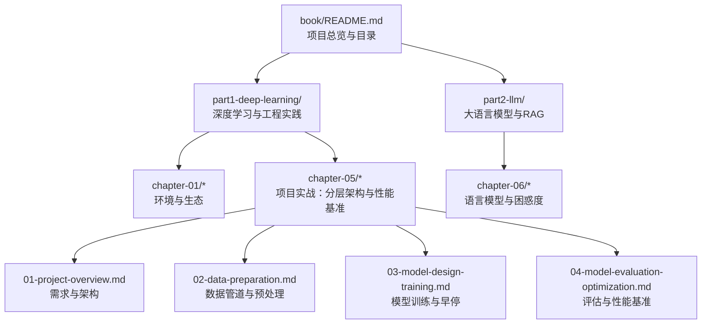
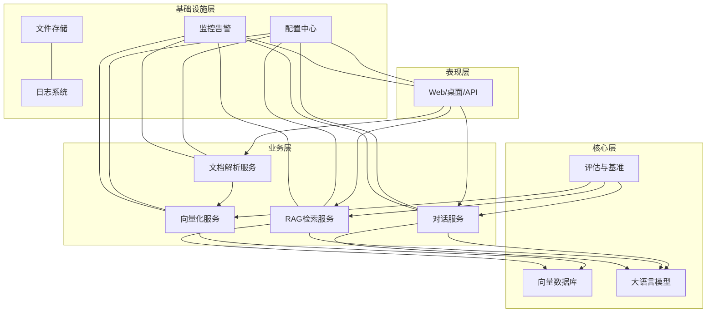
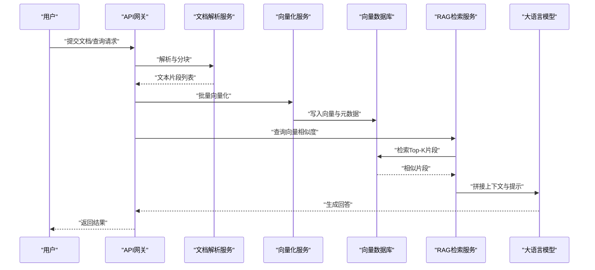
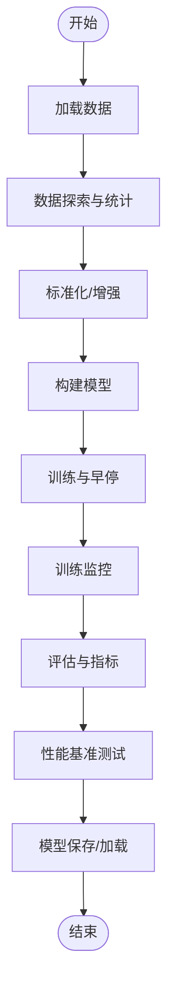
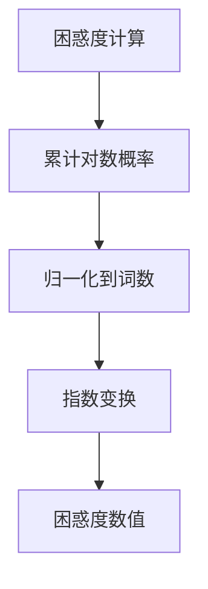
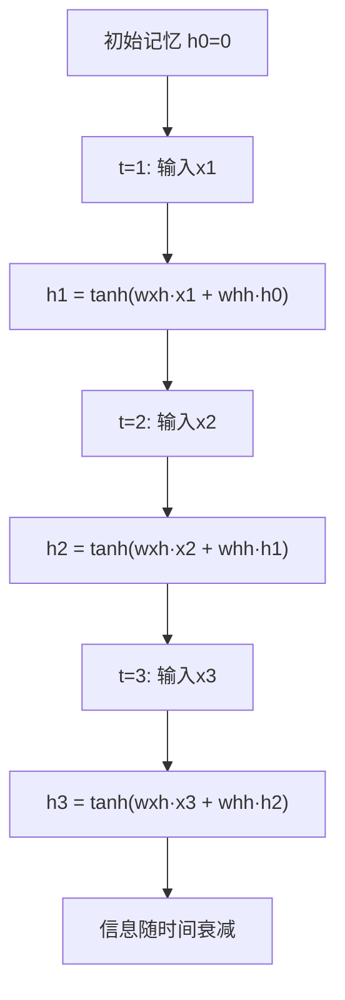
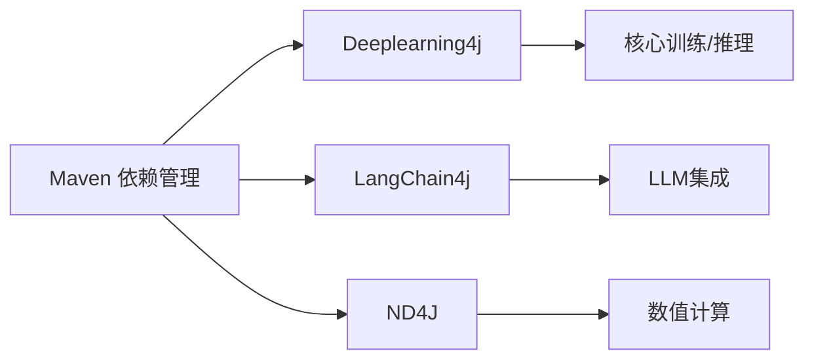

# 性能优化与部署

<cite>
**本文引用的文件**   
- [book/README.md](file://book/README.md)
- [book/part1-deep-learning/chapter-01/01-why-java-ai.md](file://book/part1-deep-learning/chapter-01/01-why-java-ai.md)
- [book/part1-deep-learning/chapter-01/02-what-is-deep-learning.md](file://book/part1-deep-learning/chapter-01/02-what-is-deep-learning.md)
- [book/part1-deep-learning/chapter-01/03-first-ai-environment.md](file://book/part1-deep-learning/chapter-01/03-first-ai-environment.md)
- [book/part1-deep-learning/chapter-01/04-java-ai-ecosystem.md](file://book/part1-deep-learning/chapter-01/04-java-ai-ecosystem.md)
- [book/part1-deep-learning/chapter-05/01-project-overview.md](file://book/part1-deep-learning/chapter-05/01-project-overview.md)
- [book/part1-deep-learning/chapter-05/02-data-preparation.md](file://book/part1-deep-learning/chapter-05/02-data-preparation.md)
- [book/part1-deep-learning/chapter-05/03-model-design-training.md](file://book/part1-deep-learning/chapter-05/03-model-design-training.md)
- [book/part1-deep-learning/chapter-05/04-model-evaluation-optimization.md](file://book/part1-deep-learning/chapter-05/04-model-evaluation-optimization.md)
- [book/part1-deep-learning/chapter-04/02-rnn-memory-and-forgetting.md](file://book/part1-deep-learning/chapter-04/02-rnn-memory-and-forgetting.md)
- [book/part2-llm/chapter-06/01-what-is-language-model.md](file://book/part2-llm/chapter-06/01-what-is-language-model.md)
</cite>

## 目录
1. [简介](#简介)
2. [项目结构](#项目结构)
3. [核心组件](#核心组件)
4. [架构总览](#架构总览)
5. [详细组件分析](#详细组件分析)
6. [依赖分析](#依赖分析)
7. [性能考虑](#性能考虑)
8. [故障排查指南](#故障排查指南)
9. [结论](#结论)
10. [附录](#附录)

## 简介
本文件围绕“智能文档助手”的性能优化与部署展开，结合仓库中已有的深度学习与大语言模型相关内容，系统阐述以下主题：
- 向量索引优化与缓存机制设计
- 响应时间优化技术
- 部署架构（容器化、微服务拆分、负载均衡）
- 监控告警与自动恢复
- 资源管理（内存、CPU、存储）
- 运维指南（日志、故障排查、版本升级）
- 安全加固（数据加密、访问控制、审计）

说明：仓库中明确涉及“智能文档助手”的章节位于顶层目录索引中，但具体实现细节尚未在本仓库中呈现。因此，本文在“智能文档助手”层面采用“基于现有技术栈的工程化落地”视角，将深度学习与大语言模型的工程实践方法映射到该系统，形成可操作的优化与部署策略。

## 项目结构
仓库采用“图书/章节”组织方式，重点章节如下：
- 深度学习基础与环境搭建：为后续大模型与RAG奠定工程基础
- 手写数字识别项目：提供分层架构、训练与评估、性能基准的工程范式
- 大语言模型与RAG：提供检索增强生成与向量化检索的工程参考

**图示来源**
- [book/README.md:1-187](file://book/README.md#L1-L187)
- [book/part1-deep-learning/chapter-05/01-project-overview.md:1-222](file://book/part1-deep-learning/chapter-05/01-project-overview.md#L1-L222)
- [book/part1-deep-learning/chapter-05/02-data-preparation.md:1-332](file://book/part1-deep-learning/chapter-05/02-data-preparation.md#L1-L332)
- [book/part1-deep-learning/chapter-05/03-model-design-training.md:1-393](file://book/part1-deep-learning/chapter-05/03-model-design-training.md#L1-L393)
- [book/part1-deep-learning/chapter-05/04-model-evaluation-optimization.md:1-418](file://book/part1-deep-learning/chapter-05/04-model-evaluation-optimization.md#L1-L418)
- [book/part2-llm/chapter-06/01-what-is-language-model.md:121-180](file://book/part2-llm/chapter-06/01-what-is-language-model.md#L121-L180)

**章节来源**
- [book/README.md:1-187](file://book/README.md#L1-L187)
- [book/part1-deep-learning/chapter-05/01-project-overview.md:1-222](file://book/part1-deep-learning/chapter-05/01-project-overview.md#L1-L222)

## 核心组件
- 数据管道与预处理：标准化、增强、可视化与批处理
- 模型训练与评估：早停、监控、超参数搜索、模型保存/加载
- 性能基准：推理速度与吞吐量测试
- 语言模型与困惑度：评估指标与稀疏性问题
- 记忆与RAG：序列建模与检索增强生成

上述组件共同构成“智能文档助手”的工程基座，支撑向量化检索、对话与生成等上层功能。

**章节来源**
- [book/part1-deep-learning/chapter-05/02-data-preparation.md:1-332](file://book/part1-deep-learning/chapter-05/02-data-preparation.md#L1-L332)
- [book/part1-deep-learning/chapter-05/03-model-design-training.md:1-393](file://book/part1-deep-learning/chapter-05/03-model-design-training.md#L1-L393)
- [book/part1-deep-learning/chapter-05/04-model-evaluation-optimization.md:1-418](file://book/part1-deep-learning/chapter-05/04-model-evaluation-optimization.md#L1-L418)
- [book/part2-llm/chapter-06/01-what-is-language-model.md:121-180](file://book/part2-llm/chapter-06/01-what-is-language-model.md#L121-L180)

## 架构总览
智能文档助手的工程化架构可借鉴“手写数字识别项目”的分层设计，并结合大语言模型与RAG能力，形成如下总体视图：

**图示来源**
- [book/part1-deep-learning/chapter-05/01-project-overview.md:64-82](file://book/part1-deep-learning/chapter-05/01-project-overview.md#L64-L82)
- [book/part1-deep-learning/chapter-05/03-model-design-training.md:36-142](file://book/part1-deep-learning/chapter-05/03-model-design-training.md#L36-L142)
- [book/part1-deep-learning/chapter-05/04-model-evaluation-optimization.md:350-388](file://book/part1-deep-learning/chapter-05/04-model-evaluation-optimization.md#L350-L388)

## 详细组件分析

### 向量化与RAG检索
- 文档解析与分块：将长文档切分为可嵌入的片段
- 向量化：使用嵌入模型生成向量表示
- 向量入库：写入向量数据库（如Milvus/Pinecone/Chroma）
- 检索增强：查询向量相似度，拼接上下文给大模型生成

**图示来源**
- [book/part1-deep-learning/chapter-01/04-java-ai-ecosystem.md:123](file://book/part1-deep-learning/chapter-01/04-java-ai-ecosystem.md#L123)
- [book/part1-deep-learning/chapter-01/04-java-ai-ecosystem.md:193](file://book/part1-deep-learning/chapter-01/04-java-ai-ecosystem.md#L193)
- [book/part1-deep-learning/chapter-01/04-java-ai-ecosystem.md:335](file://book/part1-deep-learning/chapter-01/04-java-ai-ecosystem.md#L335)

**章节来源**
- [book/part1-deep-learning/chapter-01/04-java-ai-ecosystem.md:23-335](file://book/part1-deep-learning/chapter-01/04-java-ai-ecosystem.md#L23-L335)

### 训练与评估流水线
- 数据加载与预处理：标准化、增强、可视化
- 模型训练：早停、监控、超参数搜索
- 模型评估：指标、混淆矩阵、错误分析
- 性能基准：推理时间与吞吐量

**图示来源**
- [book/part1-deep-learning/chapter-05/02-data-preparation.md:274-312](file://book/part1-deep-learning/chapter-05/02-data-preparation.md#L274-L312)
- [book/part1-deep-learning/chapter-05/03-model-design-training.md:144-213](file://book/part1-deep-learning/chapter-05/03-model-design-training.md#L144-L213)
- [book/part1-deep-learning/chapter-05/04-model-evaluation-optimization.md:14-46](file://book/part1-deep-learning/chapter-05/04-model-evaluation-optimization.md#L14-L46)
- [book/part1-deep-learning/chapter-05/04-model-evaluation-optimization.md:350-388](file://book/part1-deep-learning/chapter-05/04-model-evaluation-optimization.md#L350-L388)

**章节来源**
- [book/part1-deep-learning/chapter-05/02-data-preparation.md:1-332](file://book/part1-deep-learning/chapter-05/02-data-preparation.md#L1-L332)
- [book/part1-deep-learning/chapter-05/03-model-design-training.md:1-393](file://book/part1-deep-learning/chapter-05/03-model-design-training.md#L1-L393)
- [book/part1-deep-learning/chapter-05/04-model-evaluation-optimization.md:1-418](file://book/part1-deep-learning/chapter-05/04-model-evaluation-optimization.md#L1-L418)

### 语言模型与困惑度
- 困惑度（Perplexity）作为语言模型质量的指标
- 稀疏性与长距离依赖是语言建模的核心挑战

**图示来源**
- [book/part2-llm/chapter-06/01-what-is-language-model.md:121-146](file://book/part2-llm/chapter-06/01-what-is-language-model.md#L121-L146)

**章节来源**
- [book/part2-llm/chapter-06/01-what-is-language-model.md:121-180](file://book/part2-llm/chapter-06/01-what-is-language-model.md#L121-L180)

### 记忆与序列建模
- RNN的记忆更新与信息衰减体现了序列建模的挑战
- 在RAG中，短期记忆可对应最近对话，长期记忆对应向量库

**图示来源**
- [book/part1-deep-learning/chapter-04/02-rnn-memory-and-forgetting.md:93-143](file://book/part1-deep-learning/chapter-04/02-rnn-memory-and-forgetting.md#L93-L143)

**章节来源**
- [book/part1-deep-learning/chapter-04/02-rnn-memory-and-forgetting.md:93-143](file://book/part1-deep-learning/chapter-04/02-rnn-memory-and-forgetting.md#L93-L143)

## 依赖分析
- 技术栈与版本管理：Maven统一管理DL4J、LangChain4j、ND4J等依赖
- 深度学习框架：Deeplearning4j（Java生态）
- 大语言模型：LangChain4j（Java生态）
- 向量数据库：Milvus/Pinecone/Chroma（工程实践参考）

**图示来源**
- [book/part1-deep-learning/chapter-01/03-first-ai-environment.md:82-189](file://book/part1-deep-learning/chapter-01/03-first-ai-environment.md#L82-L189)

**章节来源**
- [book/part1-deep-learning/chapter-01/03-first-ai-environment.md:82-189](file://book/part1-deep-learning/chapter-01/03-first-ai-environment.md#L82-L189)

## 性能考虑

### 向量索引优化
- 维度与相似度：合理选择嵌入维度，平衡精度与性能
- 索引类型：HNSW/IVF/PQ等索引策略的选择与调参
- Top-K与过滤：在检索阶段加入元数据过滤，减少无效扫描
- 批量写入与增量更新：批量向量化与异步更新策略

### 缓存机制设计
- 查询缓存：对高频问题与相似问题的结果进行缓存
- 向量缓存：对常用片段的向量表示进行驻留
- 多级缓存：本地内存缓存 + 远程分布式缓存（Redis/Memcached）

### 响应时间优化
- 预热与预取：启动时预热模型与向量索引
- 并行化：批处理与并行检索
- 超时与降级：在延迟过高时返回摘要或默认答案

### 训练与推理性能基准
- 推理速度测试：预热后多次采样，统计平均耗时与吞吐
- 模型压缩：量化、知识蒸馏、剪枝（在评估章节已有方法论）

**章节来源**
- [book/part1-deep-learning/chapter-05/04-model-evaluation-optimization.md:350-388](file://book/part1-deep-learning/chapter-05/04-model-evaluation-optimization.md#L350-L388)

## 故障排查指南

### 训练与评估常见问题
- 内存不足：调整批大小、使用GPU版本、限制最大内存
- 收敛慢：调整学习率、使用早停、数据增强
- 过拟合：Dropout、正则化、数据增强、早停

### 环境与依赖
- 本地库缺失：检查Maven依赖解析与本地仓库
- GPU加速：确认CUDA版本与ND4J CUDA平台依赖匹配

### 性能问题定位
- 使用性能基准测试定位瓶颈（推理/检索/向量化）
- 逐步隔离模块，验证各组件吞吐与延迟

**章节来源**
- [book/part1-deep-learning/chapter-01/03-first-ai-environment.md:385-407](file://book/part1-deep-learning/chapter-01/03-first-ai-environment.md#L385-L407)
- [book/part1-deep-learning/chapter-05/03-model-design-training.md:194-212](file://book/part1-deep-learning/chapter-05/03-model-design-training.md#L194-L212)
- [book/part1-deep-learning/chapter-05/04-model-evaluation-optimization.md:391-410](file://book/part1-deep-learning/chapter-05/04-model-evaluation-optimization.md#L391-L410)

## 结论
本文件基于仓库中的深度学习与大语言模型工程实践，为“智能文档助手”的性能优化与部署提供了系统化的方法论与实施路径。通过数据管道、模型训练与评估、性能基准测试，以及RAG与向量检索的工程化落地，可实现稳定、高效且可扩展的智能文档系统。

## 附录

### 部署架构设计要点
- 容器化：使用Docker封装各服务，统一镜像与运行时
- 微服务拆分：文档解析、向量化、RAG检索、对话服务独立部署
- 负载均衡：Nginx/Ingress + 服务网格（Istio）实现流量治理
- 存储与缓存：对象存储（S3兼容）、向量数据库、Redis/Memcached
- 监控与告警：Prometheus/Grafana + 日志聚合（ELK/EFK）

### 资源管理策略
- 内存优化：JVM参数调优、对象池、及时释放
- CPU利用率：并行批处理、异步I/O、线程池合理配置
- 存储空间：向量索引压缩、日志轮转、冷热数据分离

### 运维指南
- 日志管理：结构化日志、统一采集与检索
- 故障排查：端到端链路追踪、关键指标阈值告警
- 版本升级：蓝绿/金丝雀发布、灰度流量、回滚策略

### 安全加固
- 数据加密：传输加密（TLS）、静态加密（密钥管理）
- 访问控制：API鉴权、最小权限、速率限制
- 审计日志：操作审计、敏感行为告警、合规报告