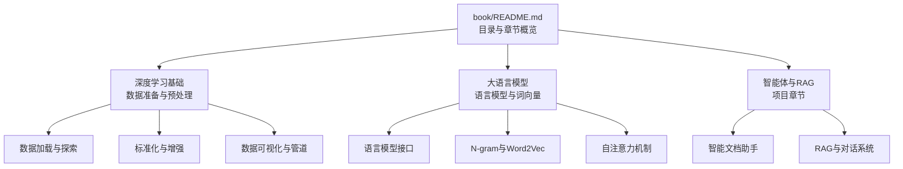
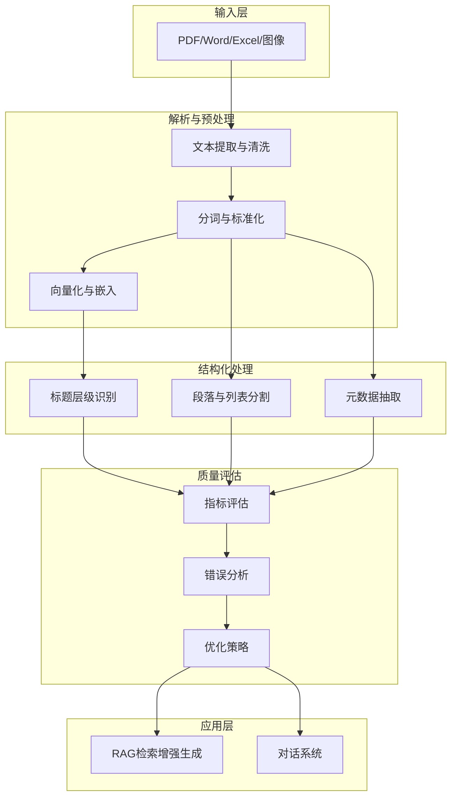
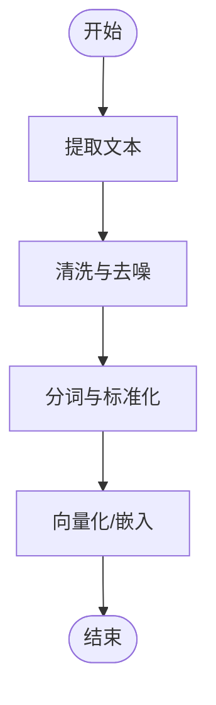
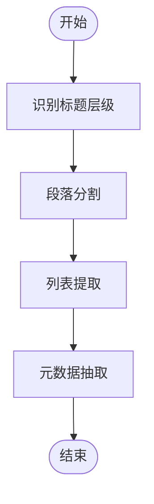
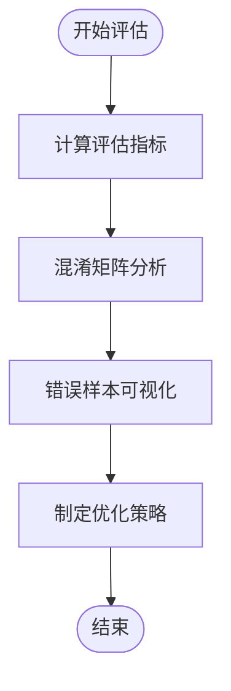
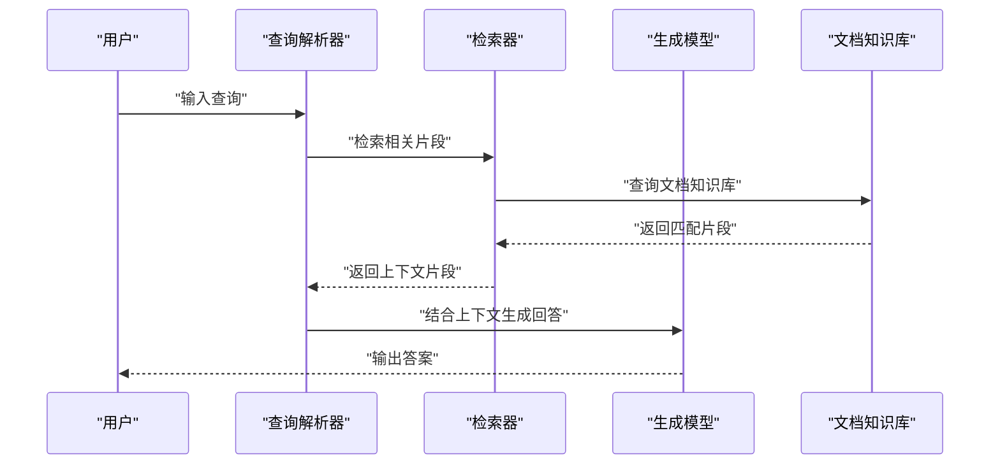
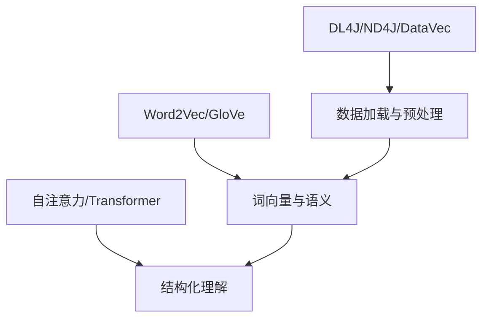

# 文档处理技术

<cite>
**本文引用的文件**
- [book/README.md](file://book/README.md)
- [book/part1-deep-learning/chapter-01/01-why-java-ai.md](file://book/part1-deep-learning/chapter-01/01-why-java-ai.md)
- [book/part1-deep-learning/chapter-01/02-what-is-deep-learning.md](file://book/part1-deep-learning/chapter-01/02-what-is-deep-learning.md)
- [book/part1-deep-learning/chapter-01/03-first-ai-environment.md](file://book/part1-deep-learning/chapter-01/03-first-ai-environment.md)
- [book/part1-deep-learning/chapter-04/04-text-generation-practice.md](file://book/part1-deep-learning/chapter-04/04-text-generation-practice.md)
- [book/part1-deep-learning/chapter-05/01-project-overview.md](file://book/part1-deep-learning/chapter-05/01-project-overview.md)
- [book/part1-deep-learning/chapter-05/02-data-preparation.md](file://book/part1-deep-learning/chapter-05/02-data-preparation.md)
- [book/part1-deep-learning/chapter-05/03-model-design-training.md](file://book/part1-deep-learning/chapter-05/03-model-design-training.md)
- [book/part1-deep-learning/chapter-05/04-model-evaluation-optimization.md](file://book/part1-deep-learning/chapter-05/04-model-evaluation-optimization.md)
- [book/part2-llm/chapter-06/01-what-is-language-model.md](file://book/part2-llm/chapter-06/01-what-is-language-model.md)
- [book/part2-llm/chapter-06/02-ngram-to-word2vec.md](file://book/part2-llm/chapter-06/02-ngram-to-word2vec.md)
- [book/part2-llm/chapter-07/01-self-attention.md](file://book/part2-llm/chapter-07/01-self-attention.md)
</cite>

## 目录
1. [简介](#简介)
2. [项目结构](#项目结构)
3. [核心组件](#核心组件)
4. [架构总览](#架构总览)
5. [详细组件分析](#详细组件分析)
6. [依赖分析](#依赖分析)
7. [性能考虑](#性能考虑)
8. [故障排查指南](#故障排查指南)
9. [结论](#结论)
10. [附录](#附录)

## 简介
本文件围绕“文档处理技术”的主题，结合仓库中已有的深度学习与大语言模型相关内容，系统阐述多格式文档解析与结构化处理的工程化实现路径。重点覆盖以下方面：
- 多格式文档解析：以文本预处理为核心，结合图像与表格的处理思路，形成统一的处理管线。
- 文本预处理：清洗、分词、去噪、标准化与向量化，支撑后续结构化与检索增强生成（RAG）。
- 结构化处理：标题层级识别、段落分割、列表提取、元数据抽取，形成可检索的结构化知识。
- 质量评估与验证：指标体系、错误分析与优化策略，确保处理结果的准确性与完整性。

本技术文档既面向具备Java工程背景的读者，也兼顾非专业用户的可读性，通过流程图与示意图直观呈现处理步骤与组件关系。

## 项目结构
仓库以“图书”形式组织内容，分为“深度学习基础”“大语言模型”“智能体”三大板块。与文档处理技术直接相关的内容主要集中在：
- 深度学习基础：提供数据准备、预处理、模型训练与评估的工程化范式，为文档向量化与检索奠定基础。
- 大语言模型：提供语言模型、词向量与注意力机制的理论与实践，支撑文档语义理解与结构化生成。
- 目录与章节：明确“智能文档助手”“RAG”“对话系统”等章节，体现文档处理技术在实际项目中的落地路径。

**图示来源**
- [book/README.md](file://book/README.md)

**章节来源**
- [book/README.md](file://book/README.md)

## 核心组件
围绕文档处理技术，可抽象出如下核心组件与职责：
- 文档解析器：负责从PDF/Word/Excel等格式中提取文本、表格与图像，并进行初步清洗与结构化。
- 文本预处理器：执行清洗、分词、去噪、标准化与向量化，输出可用于检索与生成的文本表示。
- 结构化提取器：识别标题层级、段落、列表与元数据，形成结构化知识图谱或索引。
- 质量评估器：基于指标与错误分析，评估处理质量并指导优化。
- 检索增强生成（RAG）：将结构化知识与生成模型结合，提升问答与摘要的准确性。

上述组件在“深度学习基础”与“大语言模型”两部分中均有对应的工程化实现范式，可直接迁移至文档处理场景。

**章节来源**
- [book/part1-deep-learning/chapter-05/02-data-preparation.md](file://book/part1-deep-learning/chapter-05/02-data-preparation.md)
- [book/part1-deep-learning/chapter-05/03-model-design-training.md](file://book/part1-deep-learning/chapter-05/03-model-design-training.md)
- [book/part1-deep-learning/chapter-05/04-model-evaluation-optimization.md](file://book/part1-deep-learning/chapter-05/04-model-evaluation-optimization.md)
- [book/part2-llm/chapter-06/01-what-is-language-model.md](file://book/part2-llm/chapter-06/01-what-is-language-model.md)
- [book/part2-llm/chapter-06/02-ngram-to-word2vec.md](file://book/part2-llm/chapter-06/02-ngram-to-word2vec.md)
- [book/part2-llm/chapter-07/01-self-attention.md](file://book/part2-llm/chapter-07/01-self-attention.md)

## 架构总览
下图展示了文档处理技术的整体架构：从多格式输入到结构化输出，贯穿预处理、结构化提取与质量评估，最终接入RAG与对话系统。

**图示来源**
- [book/part1-deep-learning/chapter-05/02-data-preparation.md](file://book/part1-deep-learning/chapter-05/02-data-preparation.md)
- [book/part1-deep-learning/chapter-05/03-model-design-training.md](file://book/part1-deep-learning/chapter-05/03-model-design-training.md)
- [book/part1-deep-learning/chapter-05/04-model-evaluation-optimization.md](file://book/part1-deep-learning/chapter-05/04-model-evaluation-optimization.md)
- [book/part2-llm/chapter-06/01-what-is-language-model.md](file://book/part2-llm/chapter-06/01-what-is-language-model.md)
- [book/part2-llm/chapter-06/02-ngram-to-word2vec.md](file://book/part2-llm/chapter-06/02-ngram-to-word2vec.md)
- [book/part2-llm/chapter-07/01-self-attention.md](file://book/part2-llm/chapter-07/01-self-attention.md)

## 详细组件分析

### 文档解析与文本预处理
- 文本提取与清洗：针对PDF/Word/Excel等格式，先进行文本提取，再进行清洗（去除多余空白、特殊字符、页眉页脚等）。
- 分词与标准化：采用字符级或词级分词策略，结合大小写归一化、标点处理与数字标准化，提升后续处理稳定性。
- 向量化与嵌入：将清洗后的文本映射为稠密向量（如Word2Vec、Sentence-BERT等），为检索与生成提供语义表示。

**图示来源**
- [book/part1-deep-learning/chapter-04/04-text-generation-practice.md](file://book/part1-deep-learning/chapter-04/04-text-generation-practice.md)
- [book/part2-llm/chapter-06/02-ngram-to-word2vec.md](file://book/part2-llm/chapter-06/02-ngram-to-word2vec.md)

**章节来源**
- [book/part1-deep-learning/chapter-04/04-text-generation-practice.md](file://book/part1-deep-learning/chapter-04/04-text-generation-practice.md)
- [book/part2-llm/chapter-06/02-ngram-to-word2vec.md](file://book/part2-llm/chapter-06/02-ngram-to-word2vec.md)

### 结构化处理：标题、段落、列表与元数据
- 标题层级识别：基于字体大小、粗细、缩进与上下文相似度，识别H1/H2/H3等层级。
- 段落分割：依据空行、首行缩进、标点符号等规则进行段落切分。
- 列表提取：识别有序/无序列表，提取条目并保持层级关系。
- 元数据抽取：从文档头部、尾部或属性中抽取作者、标题、日期、主题等信息。

**图示来源**
- [book/part1-deep-learning/chapter-05/02-data-preparation.md](file://book/part1-deep-learning/chapter-05/02-data-preparation.md)

**章节来源**
- [book/part1-deep-learning/chapter-05/02-data-preparation.md](file://book/part1-deep-learning/chapter-05/02-data-preparation.md)

### 质量评估与验证
- 指标评估：准确率、精确率、召回率、F1分数；混淆矩阵分析，定位易混淆类别。
- 错误分析：可视化错误样本，分析常见错误类型（如标题误判、段落切分错误）。
- 优化策略：数据增强、超参数调优、模型集成、知识蒸馏与量化，提升鲁棒性与效率。

**图示来源**
- [book/part1-deep-learning/chapter-05/04-model-evaluation-optimization.md](file://book/part1-deep-learning/chapter-05/04-model-evaluation-optimization.md)

**章节来源**
- [book/part1-deep-learning/chapter-05/04-model-evaluation-optimization.md](file://book/part1-deep-learning/chapter-05/04-model-evaluation-optimization.md)

### 检索增强生成（RAG）与对话系统
- RAG流程：将结构化文档与向量化文本送入检索器，结合上下文与生成模型生成答案。
- 对话系统：基于RAG的结果与用户历史，提供连贯、准确的问答体验。

**图示来源**
- [book/part2-llm/chapter-06/01-what-is-language-model.md](file://book/part2-llm/chapter-06/01-what-is-language-model.md)
- [book/part2-llm/chapter-06/02-ngram-to-word2vec.md](file://book/part2-llm/chapter-06/02-ngram-to-word2vec.md)
- [book/part2-llm/chapter-07/01-self-attention.md](file://book/part2-llm/chapter-07/01-self-attention.md)

**章节来源**
- [book/part2-llm/chapter-06/01-what-is-language-model.md](file://book/part2-llm/chapter-06/01-what-is-language-model.md)
- [book/part2-llm/chapter-06/02-ngram-to-word2vec.md](file://book/part2-llm/chapter-06/02-ngram-to-word2vec.md)
- [book/part2-llm/chapter-07/01-self-attention.md](file://book/part2-llm/chapter-07/01-self-attention.md)

## 依赖分析
- 深度学习与数据处理：DL4J、ND4J、DataVec提供数据加载、预处理、归一化与可视化能力。
- 语言模型与词向量：Word2Vec、GloVe等提供词嵌入与相似度计算，支撑语义理解。
- 注意力机制：Transformer与自注意力为文档结构化与检索提供理论基础。

**图示来源**
- [book/part1-deep-learning/chapter-05/02-data-preparation.md](file://book/part1-deep-learning/chapter-05/02-data-preparation.md)
- [book/part2-llm/chapter-06/02-ngram-to-word2vec.md](file://book/part2-llm/chapter-06/02-ngram-to-word2vec.md)
- [book/part2-llm/chapter-07/01-self-attention.md](file://book/part2-llm/chapter-07/01-self-attention.md)

**章节来源**
- [book/part1-deep-learning/chapter-05/02-data-preparation.md](file://book/part1-deep-learning/chapter-05/02-data-preparation.md)
- [book/part2-llm/chapter-06/02-ngram-to-word2vec.md](file://book/part2-llm/chapter-06/02-ngram-to-word2vec.md)
- [book/part2-llm/chapter-07/01-self-attention.md](file://book/part2-llm/chapter-07/01-self-attention.md)

## 性能考虑
- 数据预处理：归一化与增强可提升模型稳定性与泛化能力；注意内存与I/O开销。
- 检索与生成：合理设置检索窗口与上下文长度，平衡准确率与延迟。
- 模型压缩：知识蒸馏与量化可在保证精度的前提下降低推理成本。
- 并行化与缓存：批量处理与结果缓存可显著提升吞吐量。

[本节为通用性能建议，无需具体文件引用]

## 故障排查指南
- 环境与依赖：确认JDK版本、Maven依赖与本地库加载状态，必要时调整内存参数。
- 数据问题：检查数据集分布、类别不平衡与标注一致性，使用可视化工具辅助诊断。
- 模型问题：通过早停、学习率调度与超参数网格搜索优化训练过程。
- 评估与优化：利用混淆矩阵与错误样本分析定位薄弱环节，实施针对性优化。

**章节来源**
- [book/part1-deep-learning/chapter-01/03-first-ai-environment.md](file://book/part1-deep-learning/chapter-01/03-first-ai-environment.md)
- [book/part1-deep-learning/chapter-05/02-data-preparation.md](file://book/part1-deep-learning/chapter-05/02-data-preparation.md)
- [book/part1-deep-learning/chapter-05/03-model-design-training.md](file://book/part1-deep-learning/chapter-05/03-model-design-training.md)
- [book/part1-deep-learning/chapter-05/04-model-evaluation-optimization.md](file://book/part1-deep-learning/chapter-05/04-model-evaluation-optimization.md)

## 结论
通过将深度学习与大语言模型的工程化范式迁移到文档处理领域，可构建从多格式解析、文本预处理、结构化提取到质量评估与RAG应用的完整技术闭环。该方法既保证了处理结果的准确性与一致性，也为后续的智能问答与对话系统提供了坚实基础。

[本节为总结性内容，无需具体文件引用]

## 附录
- 术语表与参考资料：参见书籍附录，涵盖技术术语与参考文献。
- 实践建议：结合项目背景与资源约束，选择合适的预处理策略与模型架构，持续迭代优化。

**章节来源**
- [book/README.md](file://book/README.md)