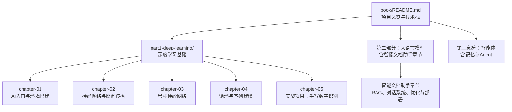
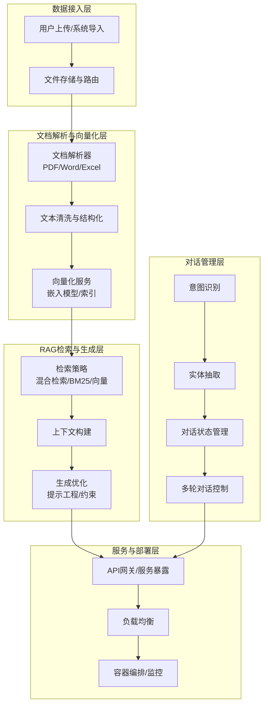
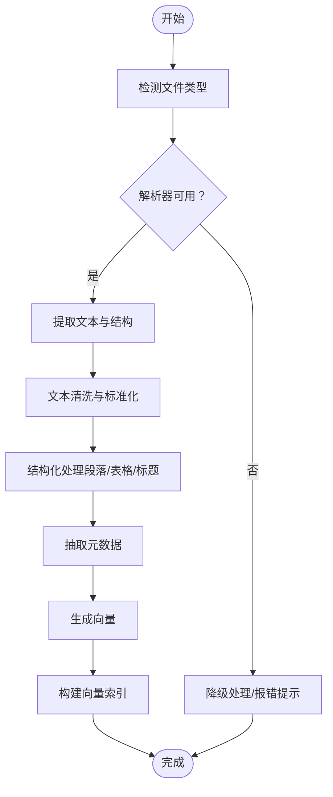
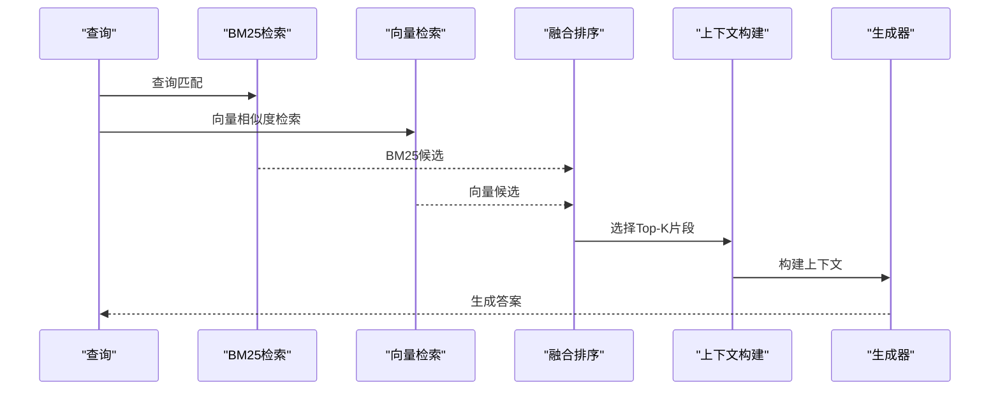
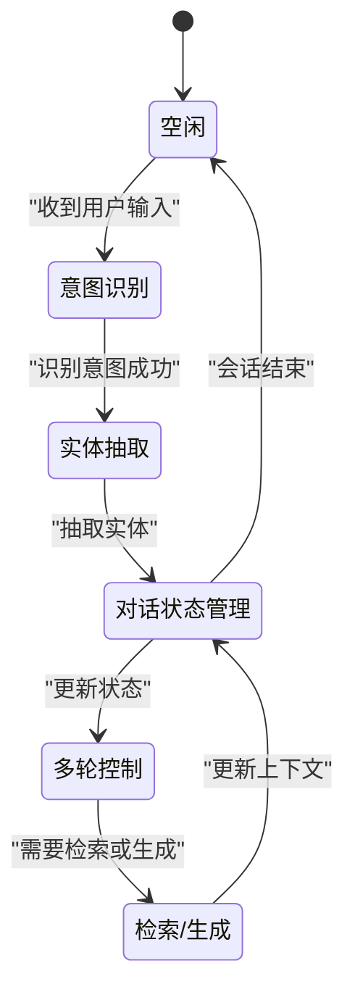
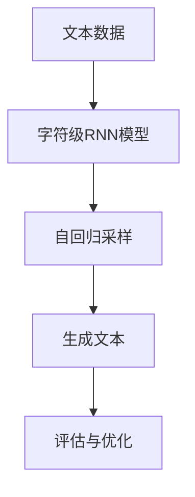
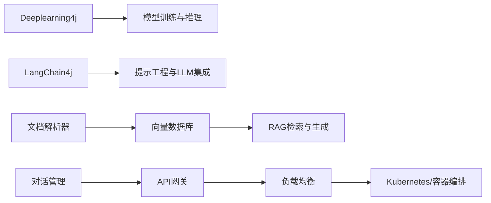

# 智能文档助手

<cite>
**本文引用的文件**
- [book/README.md](file://book/README.md)
- [book/part1-deep-learning/chapter-01/01-why-java-ai.md](file://book/part1-deep-learning/chapter-01/01-why-java-ai.md)
- [book/part1-deep-learning/chapter-01/02-what-is-deep-learning.md](file://book/part1-deep-learning/chapter-01/02-what-is-deep-learning.md)
- [book/part1-deep-learning/chapter-01/03-first-ai-environment.md](file://book/part1-deep-learning/chapter-01/03-first-ai-environment.md)
- [book/part1-deep-learning/chapter-04/04-text-generation-practice.md](file://book/part1-deep-learning/chapter-04/04-text-generation-practice.md)
- [book/part1-deep-learning/chapter-05/01-project-overview.md](file://book/part1-deep-learning/chapter-05/01-project-overview.md)
- [book/part1-deep-learning/chapter-05/02-data-preparation.md](file://book/part1-deep-learning/chapter-05/02-data-preparation.md)
- [book/part1-deep-learning/chapter-05/03-model-design-training.md](file://book/part1-deep-learning/chapter-05/03-model-design-training.md)
</cite>

## 目录
1. [简介](#简介)
2. [项目结构](#项目结构)
3. [核心组件](#核心组件)
4. [架构总览](#架构总览)
5. [详细组件分析](#详细组件分析)
6. [依赖分析](#依赖分析)
7. [性能考虑](#性能考虑)
8. [故障排查指南](#故障排查指南)
9. [结论](#结论)
10. [附录](#附录)

## 简介
本项目围绕“智能文档助手”的实战主题展开，基于Java生态构建从文档解析、文本向量化、RAG检索增强生成到对话系统的完整技术方案。仓库提供了从深度学习基础、语言模型与Transformer、到实战项目（如手写数字识别）的系统化内容，为构建生产级智能文档处理系统奠定理论与工程基础。

## 项目结构
仓库采用“图书章节”组织方式，分为三大部分：
- 第一部分：深度学习基础（神经网络、卷积、循环与序列建模）
- 第二部分：大语言模型（语言模型演进、Transformer、提示工程、本地部署）
- 第三部分：智能体（工具使用、规划推理、记忆系统、多智能体协作）

“智能文档助手”作为实战项目位于第二部分第11章，涵盖文档解析与向量化、RAG检索增强生成、对话系统实现与优化部署等内容。

**图表来源**
- [book/README.md:105-111](file://book/README.md#L105-L111)

**章节来源**
- [book/README.md:105-111](file://book/README.md#L105-L111)

## 核心组件
- 文档解析与预处理：支持多格式文档（PDF、Word、Excel）的文本提取、结构化处理与元数据提取，为后续向量化与RAG检索提供高质量文本。
- 文本向量化：选择合适的词嵌入模型，生成向量并构建向量索引，支撑快速相似度检索。
- RAG系统：设计检索策略（BM25/向量混合检索）、上下文构建与生成优化，提升问答准确性与一致性。
- 对话系统：包含意图识别、实体抽取、对话状态管理与多轮对话控制，确保自然流畅的人机交互。
- 性能优化：向量索引优化、缓存策略、响应时间优化与资源调度。
- 部署方案：容器化部署、负载均衡、监控告警与可观测性。

（本节为总体概览，具体实现细节在后续章节展开）

## 架构总览
智能文档助手的整体架构由“数据接入层、文档解析与向量化层、RAG检索与生成层、对话管理层、服务与部署层”构成。下图展示了各层之间的交互关系与数据流向。

（该图为概念性架构示意，用于帮助理解整体流程）

## 详细组件分析

### 文档解析与向量化
- 多格式解析：针对PDF、Word、Excel等格式，采用相应的解析库进行文本提取与结构化处理，保留段落、标题、表格、列表等结构信息，并抽取元数据（作者、创建时间、页码等）。
- 文本预处理：统一编码、去除噪声、分句分段、标准化格式，确保后续向量化质量。
- 向量化与索引：选择合适的嵌入模型（如通用中文词嵌入或领域自监督模型），将文本映射为稠密向量；构建向量索引（如HNSW/IVF），支持高维相似度检索。
- 元数据关联：将向量与元数据绑定，便于检索后排序与过滤。

（该流程图为概念性说明，具体实现需结合实际解析库与向量化服务）

**章节来源**
- [book/README.md:105-111](file://book/README.md#L105-L111)

### RAG系统设计与实现
- 检索策略：采用混合检索（BM25与向量检索结合），先用BM25粗排，再用向量精排，提高召回与排序质量。
- 上下文构建：根据查询与候选片段，动态拼接上下文，控制上下文长度，避免冗余信息干扰。
- 生成优化：通过提示工程（如角色设定、结构化输出、思维链）提升生成稳定性与准确性；必要时加入后处理校验与事实核查。

（该图为概念性流程示意，具体实现需结合检索与生成服务）

**章节来源**
- [book/README.md:105-111](file://book/README.md#L105-L111)

### 对话系统架构
- 意图识别：基于规则或轻量分类模型识别用户意图（如“查询文档”、“总结摘要”、“生成报告”）。
- 实体抽取：从用户输入中抽取关键实体（文档名称、日期范围、关键词等），用于检索与生成。
- 对话状态管理：维护会话状态（当前意图、已抽取实体、历史消息），支持跨轮次上下文。
- 多轮对话控制：根据状态机或策略模型，决定下一步动作（继续追问、直接检索、生成回答）。

（该图为概念性状态图，具体实现需结合意图与实体识别模块）

**章节来源**
- [book/README.md:105-111](file://book/README.md#L105-L111)

### 深度学习与序列建模基础（为文本生成与RAG提供支撑）
- 循环神经网络与LSTM/GRU：理解序列数据的挑战与建模方法，为文本生成与对话建模提供基础。
- 文本生成实践：通过字符级RNN实现自回归生成，掌握采样策略与温度调节。
- 手写数字识别项目：涵盖数据准备、模型设计、训练与评估，体现从数据到模型再到部署的完整流程。

**图表来源**
- [book/part1-deep-learning/chapter-04/04-text-generation-practice.md:1-370](file://book/part1-deep-learning/chapter-04/04-text-generation-practice.md#L1-L370)

**章节来源**
- [book/part1-deep-learning/chapter-04/04-text-generation-practice.md:1-370](file://book/part1-deep-learning/chapter-04/04-text-generation-practice.md#L1-L370)
- [book/part1-deep-learning/chapter-05/01-project-overview.md:1-91](file://book/part1-deep-learning/chapter-05/01-project-overview.md#L1-L91)
- [book/part1-deep-learning/chapter-05/02-data-preparation.md:1-332](file://book/part1-deep-learning/chapter-05/02-data-preparation.md#L1-L332)
- [book/part1-deep-learning/chapter-05/03-model-design-training.md:1-393](file://book/part1-deep-learning/chapter-05/03-model-design-training.md#L1-L393)

## 依赖分析
- 技术栈与组件耦合：
  - Java 17+：统一运行环境与语言特性。
  - 深度学习框架：Deeplearning4j（DL4J）用于模型训练与推理。
  - LLM框架：LangChain4j（用于提示工程与本地LLM集成）。
  - 向量数据库：Milvus/Pinecone/Chroma（用于向量索引与检索）。
  - 构建工具：Maven/Gradle（依赖管理与打包）。
- 组件间依赖关系：
  - 文档解析层依赖文件读取与解析库；
  - 向量化层依赖嵌入模型与索引库；
  - RAG层依赖检索与生成服务；
  - 对话层依赖NLU（意图识别与实体抽取）与状态管理；
  - 服务层依赖API网关、负载均衡与容器编排。

（该图为概念性依赖关系示意）

**章节来源**
- [book/README.md:170-177](file://book/README.md#L170-L177)

## 性能考虑
- 向量索引优化：
  - 选择合适索引类型（HNSW/IVF/Flat），平衡检索精度与速度。
  - 向量维度与归一化策略，减少内积/余弦距离计算开销。
  - 分片与分区策略，支持大规模向量数据的水平扩展。
- 缓存策略：
  - 查询热点缓存（BM25候选、向量候选、生成结果）。
  - 多级缓存（本地缓存+分布式缓存），降低重复计算。
- 响应时间优化：
  - 异步化与流水线并行（解析、向量化、检索、生成）。
  - 上下文裁剪与最大上下文长度限制，避免超长输入。
  - 生成参数调优（温度、top-p、最大生成长度）。
- 资源调度：
  - GPU/CPU资源分配与隔离，保障高并发场景稳定性。
  - 模型服务化与弹性伸缩，按流量动态扩容。

（本节为通用性能建议，具体实现需结合实际系统与硬件环境）

## 故障排查指南
- 环境与依赖问题：
  - JDK版本不匹配、Maven依赖缺失、本地库加载失败等问题可通过环境验证与依赖解析排查。
- 训练与推理问题：
  - 内存不足、GPU不可用、学习率不当、批次大小不合适等，可通过日志与监控定位。
- 数据与预处理问题：
  - 文本编码异常、解析失败、向量维度不一致等，需检查数据管道与预处理步骤。
- RAG与生成问题：
  - 检索命中率低、生成漂移、上下文截断等，需优化检索策略与提示工程。

**章节来源**
- [book/part1-deep-learning/chapter-01/03-first-ai-environment.md:385-426](file://book/part1-deep-learning/chapter-01/03-first-ai-environment.md#L385-L426)
- [book/part1-deep-learning/chapter-05/02-data-preparation.md:1-332](file://book/part1-deep-learning/chapter-05/02-data-preparation.md#L1-L332)
- [book/part1-deep-learning/chapter-05/03-model-design-training.md:144-393](file://book/part1-deep-learning/chapter-05/03-model-design-training.md#L144-L393)

## 结论
本项目以“智能文档助手”为主线，串联文档解析、向量化、RAG检索与生成、对话管理与部署优化，形成一套可落地的生产级方案。通过Java生态与工程化实践，既能满足企业级稳定性与可运维性要求，又能灵活适配多场景的文档处理需求。建议在实际落地时，结合业务数据与硬件资源，持续优化检索与生成策略，完善监控与告警体系，确保系统在高并发与复杂查询场景下的稳定表现。

## 附录
- 术语表与参考资料可参考书籍附录章节，便于进一步学习与查阅。
- 代码示例与集成指南建议结合各章节的实践代码逐步实现，从环境搭建到模型训练、从RAG检索到对话系统，循序渐进完成端到端系统构建。

**章节来源**
- [book/README.md:155-187](file://book/README.md#L155-L187)