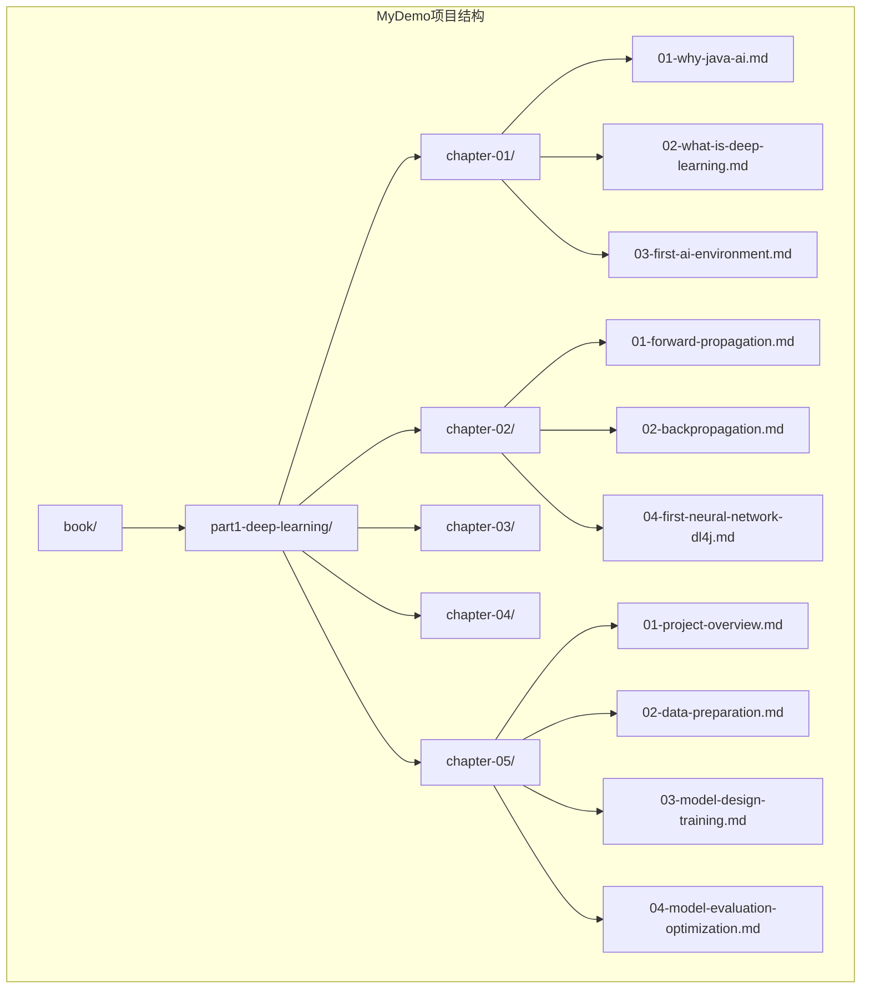
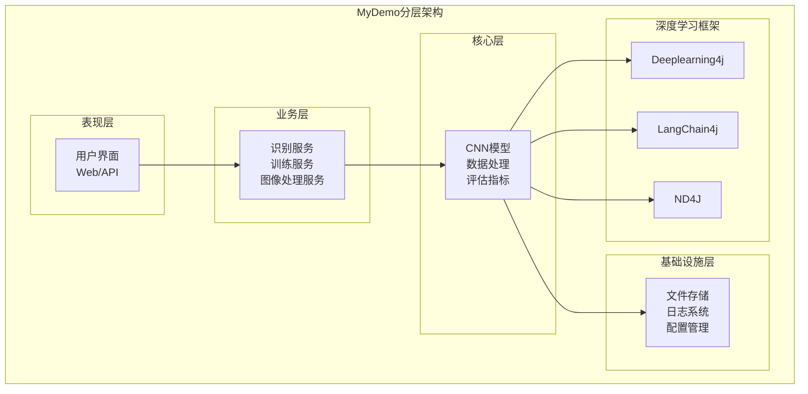
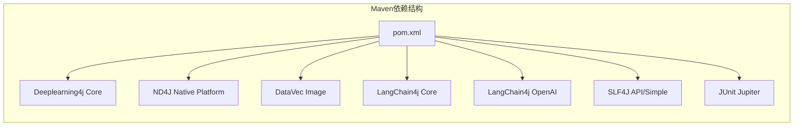
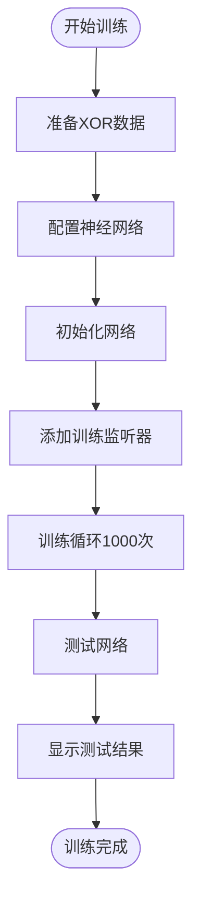
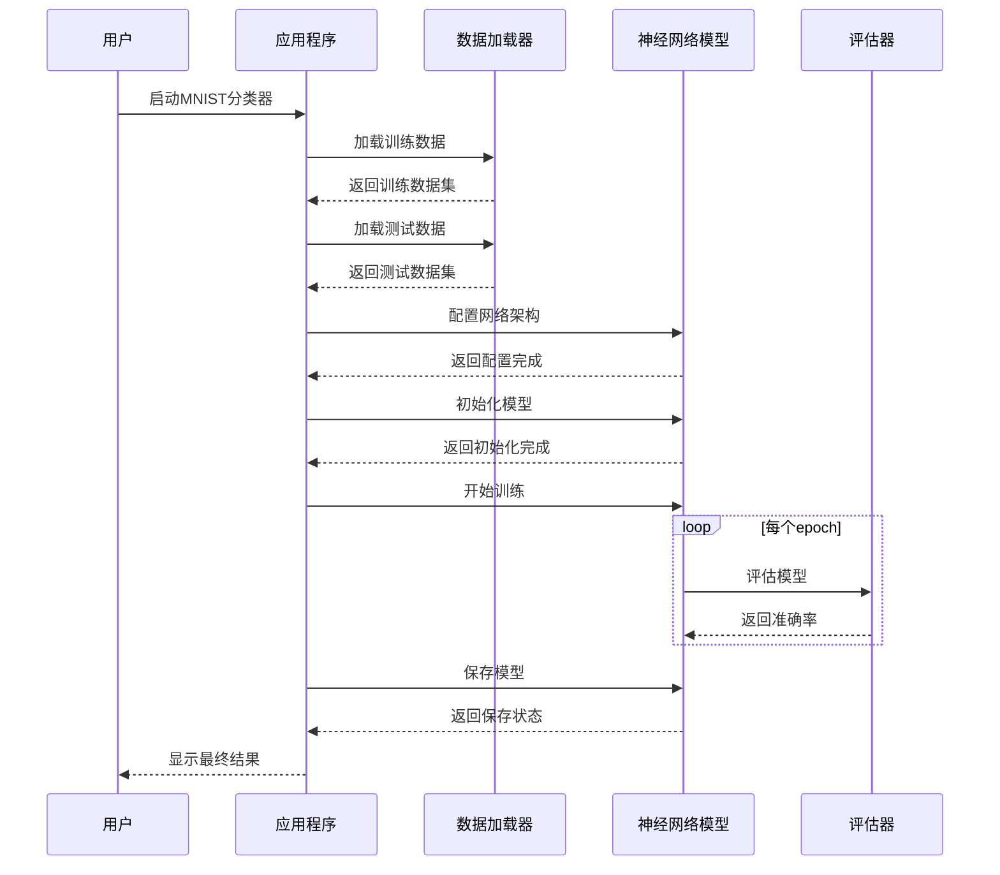
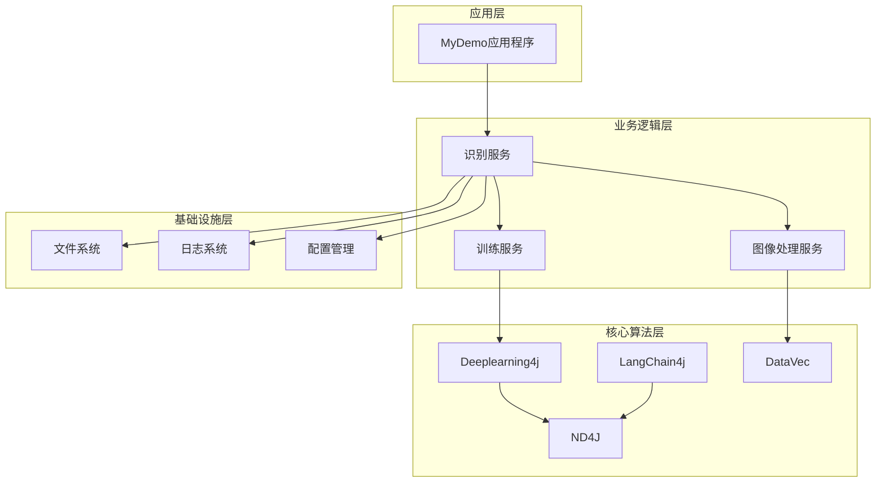

# 快速开始

<cite>
**本文档引用的文件**
- [book/part1-deep-learning/chapter-01/03-first-ai-environment.md](file://book/part1-deep-learning/chapter-01/03-first-ai-environment.md)
- [book/part1-deep-learning/chapter-02/04-first-neural-network-dl4j.md](file://book/part1-deep-learning/chapter-02/04-first-neural-network-dl4j.md)
- [book/part1-deep-learning/chapter-05/01-project-overview.md](file://book/part1-deep-learning/chapter-05/01-project-overview.md)
- [book/README.md](file://book/README.md)
</cite>

## 目录
1. [引言](#引言)
2. [项目结构](#项目结构)
3. [核心组件](#核心组件)
4. [架构概览](#架构概览)
5. [详细组件分析](#详细组件分析)
6. [依赖关系分析](#依赖关系分析)
7. [性能考虑](#性能考虑)
8. [故障排除指南](#故障排除指南)
9. [结论](#结论)

## 引言

欢迎来到MyDemo项目的快速开始指南！这是一个专为Java程序员设计的AI学习项目，旨在帮助您快速建立起可用的AI开发环境。本指南将带您完成从环境搭建到第一个AI程序运行的完整流程，涵盖Java 17+安装、Maven配置、Deeplearning4j和LangChain4j框架的集成。

作为Java程序员，我们将使用您最熟悉的工具链来构建AI应用，包括Java 17 LTS、Maven构建工具、IntelliJ IDEA IDE，以及Java生态中最成熟的深度学习框架Deeplearning4j和大语言模型框架LangChain4j。

## 项目结构

MyDemo项目采用模块化的学习结构，按照深度学习的不同阶段组织内容：



**图表来源**
- [book/README.md:30-68](file://book/README.md#L30-L68)

**章节来源**
- [book/README.md:30-68](file://book/README.md#L30-L68)

## 核心组件

MyDemo项目的核心组件包括：

### 1. 深度学习框架：Deeplearning4j (DL4J)
- Java生态最成熟的深度学习框架
- 纯Java实现，无需Python依赖
- 支持分布式训练和生产部署
- 提供完整的神经网络构建工具

### 2. 大语言模型框架：LangChain4j
- Java生态最活跃的LLM框架
- 提供与各种大语言模型的集成能力
- 支持提示工程和智能体开发

### 3. 数学计算库：ND4J
- Java的NumPy替代品
- 提供高性能的数组操作和矩阵运算
- 支持CPU和GPU加速

### 4. 数据处理：DataVec
- 专门的数据预处理库
- 支持图像、文本等多类型数据
- 提供数据转换和标准化功能

**章节来源**
- [book/part1-deep-learning/chapter-01/03-first-ai-environment.md:105-146](file://book/part1-deep-learning/chapter-01/03-first-ai-environment.md#L105-L146)

## 架构概览

MyDemo项目采用分层架构设计，从底层的数学计算到顶层的应用服务：



**图表来源**
- [book/part1-deep-learning/chapter-05/01-project-overview.md:64-82](file://book/part1-deep-learning/chapter-05/01-project-overview.md#L64-L82)

## 详细组件分析

### 环境搭建组件

#### JDK 17+ 安装配置

**Windows系统安装步骤：**
1. 下载Eclipse Temurin JDK 17 LTS版本
2. 设置JAVA_HOME环境变量指向JDK安装目录
3. 将%JAVA_HOME%\bin添加到PATH环境变量
4. 验证安装：java -version

**macOS系统安装步骤：**
```bash
# 使用Homebrew安装
brew install openjdk@17

# 配置环境变量
echo 'export PATH="/usr/local/opt/openjdk@17/bin:$PATH"' >> ~/.zshrc
source ~/.zshrc
```

**Linux系统安装步骤：**
```bash
# Ubuntu/Debian
sudo apt update
sudo apt install openjdk-17-jdk

# CentOS/RHEL  
sudo yum install java-17-openjdk-devel
```

#### Maven项目配置

完整的Maven配置包含以下关键依赖：



**图表来源**
- [book/part1-deep-learning/chapter-01/03-first-ai-environment.md:112-167](file://book/part1-deep-learning/chapter-01/03-first-ai-environment.md#L112-L167)

**章节来源**
- [book/part1-deep-learning/chapter-01/03-first-ai-environment.md:17-60](file://book/part1-deep-learning/chapter-01/03-first-ai-environment.md#L17-L60)

### 第一个AI程序组件

#### 环境验证测试

创建EnvironmentTest类验证ND4J安装：

```java
@Test
void testNd4jInstallation() {
    // 创建两个1x3数组
    INDArray array1 = Nd4j.create(new double[]{1.0, 2.0, 3.0});
    INDArray array2 = Nd4j.create(new double[]{4.0, 5.0, 6.0});
    
    // 执行矩阵加法
    INDArray sum = array1.add(array2);
    
    // 验证结果
    assertArrayEquals(new double[]{5.0, 7.0, 9.0}, sum.toDoubleVector(), 0.001);
}
```

**章节来源**
- [book/part1-deep-learning/chapter-01/03-first-ai-environment.md:195-244](file://book/part1-deep-learning/chapter-01/03-first-ai-environment.md#L195-L244)

#### XOR逻辑神经网络

实现第一个神经网络解决XOR问题：



**图表来源**
- [book/part1-deep-learning/chapter-01/03-first-ai-environment.md:280-341](file://book/part1-deep-learning/chapter-01/03-first-ai-environment.md#L280-L341)

**章节来源**
- [book/part1-deep-learning/chapter-01/03-first-ai-environment.md:255-357](file://book/part1-deep-learning/chapter-01/03-first-ai-environment.md#L255-L357)

### 高级组件

#### MNIST手写数字识别

实现完整的MNIST分类器：



**图表来源**
- [book/part1-deep-learning/chapter-02/04-first-neural-network-dl4j.md:80-147](file://book/part1-deep-learning/chapter-02/04-first-neural-network-dl4j.md#L80-L147)

**章节来源**
- [book/part1-deep-learning/chapter-02/04-first-neural-network-dl4j.md:16-177](file://book/part1-deep-learning/chapter-02/04-first-neural-network-dl4j.md#L16-L177)

## 依赖关系分析

MyDemo项目的依赖关系体现了清晰的层次结构：



**图表来源**
- [book/part1-deep-learning/chapter-05/01-project-overview.md:93-121](file://book/part1-deep-learning/chapter-05/01-project-overview.md#L93-L121)

**章节来源**
- [book/part1-deep-learning/chapter-05/01-project-overview.md:84-92](file://book/part1-deep-learning/chapter-05/01-project-overview.md#L84-L92)

## 性能考虑

### GPU加速配置

对于有NVIDIA GPU的用户，可以通过替换ND4J依赖来启用CUDA加速：

```xml
<!-- 替换nd4j-native-platform为nd4j-cuda-11.x-platform -->
<dependency>
    <groupId>org.nd4j</groupId>
    <artifactId>nd4j-cuda-11.8-platform</artifactId>
    <version>${dl4j.version}</version>
</dependency>
```

### 内存优化策略

针对内存不足的问题，可以在程序开始时设置内存限制：

```java
// 设置最大堆内存
System.setProperty("org.bytedeco.javacpp.maxbytes", "4G");
System.setProperty("org.bytedeco.javacpp.maxphysicalbytes", "8G");
```

### 训练性能优化

- 检查是否使用了GPU版本
- 适当减小batch大小
- 调整学习率参数
- 使用合适的优化器（Adam、SGD等）

## 故障排除指南

### 常见问题及解决方案

**问题1：内存不足**
- 解决方案：增加JVM堆内存设置
- 验证命令：`java -Xmx8g -jar your-app.jar`

**问题2：找不到本地库**
- 检查Maven依赖是否正确下载
- 清理并重新构建项目：`mvn clean install`

**问题3：训练速度慢**
- 确认是否启用了GPU加速
- 调整batch大小和学习率
- 检查硬件资源使用情况

**问题4：依赖冲突**
- 查看依赖树：`mvn dependency:tree`
- 排除冲突的传递依赖
- 统一版本号

**问题5：IDE配置问题**
- 确保IDE使用正确的JDK版本
- 刷新Maven项目
- 检查项目结构配置

### 环境验证步骤

1. **JDK验证**：`java -version`
2. **Maven验证**：`mvn -version`
3. **项目构建**：`mvn clean compile`
4. **单元测试**：`mvn test`
5. **运行示例**：`mvn exec:java -Dexec.mainClass="com.example.ai.chapter01.FirstNeuralNetwork"`

**章节来源**
- [book/part1-deep-learning/chapter-01/03-first-ai-environment.md:385-407](file://book/part1-deep-learning/chapter-01/03-first-ai-environment.md#L385-L407)

## 结论

通过本快速开始指南，您已经完成了MyDemo项目的完整环境搭建，包括：

1. **JDK 17+安装**：选择了Java 17 LTS作为开发环境
2. **Maven项目创建**：配置了完整的依赖关系
3. **环境验证**：通过ND4J矩阵运算测试验证安装
4. **第一个AI程序**：成功运行了XOR逻辑神经网络
5. **高级应用**：实现了MNIST手写数字识别

现在您已经具备了Java AI开发的基础能力，可以继续深入学习MyDemo项目的其他章节，包括卷积神经网络、循环神经网络、大语言模型和智能体开发。

记住，作为Java程序员，您拥有类型安全、企业级集成和生产就绪的优势。利用这些优势，您可以构建更加稳定和可靠的AI应用。

下一步建议：
- 继续学习第二章的MNIST分类器实现
- 探索第三章的卷积神经网络
- 了解第四章的循环神经网络
- 准备进入第五章的实战项目

祝您在Java AI开发的道路上取得成功！