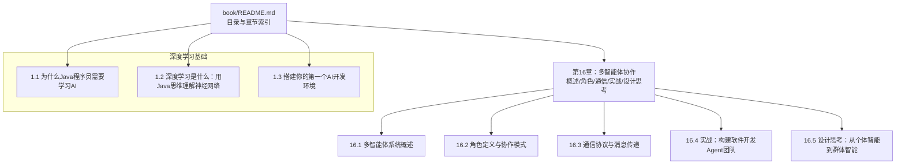
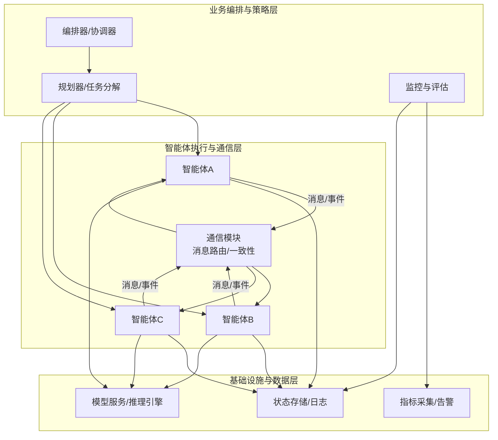
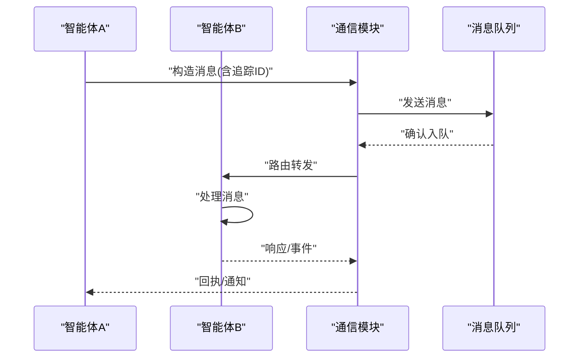
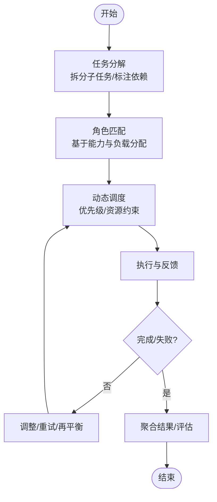
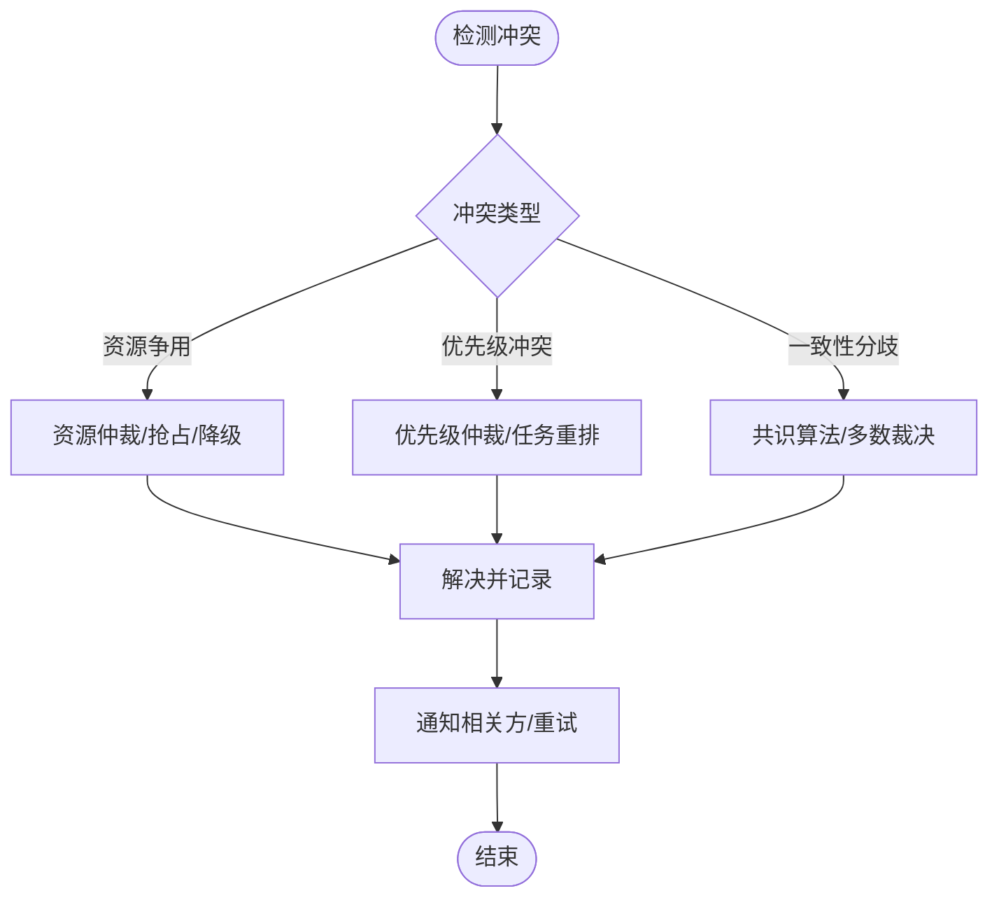
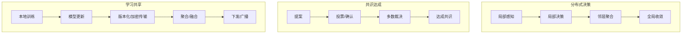
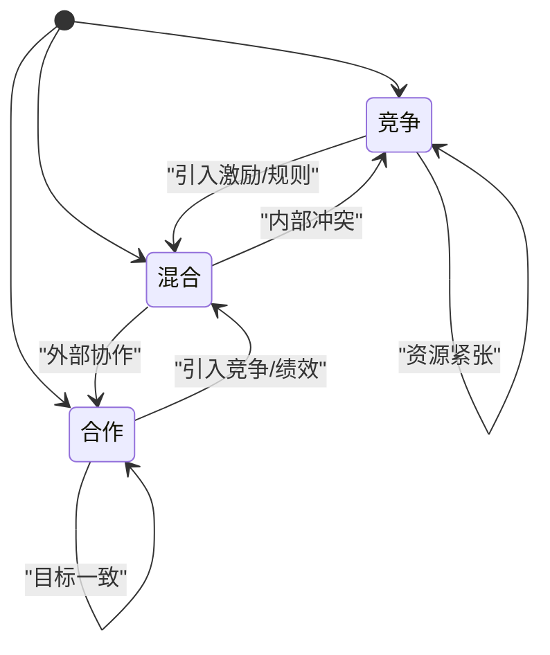
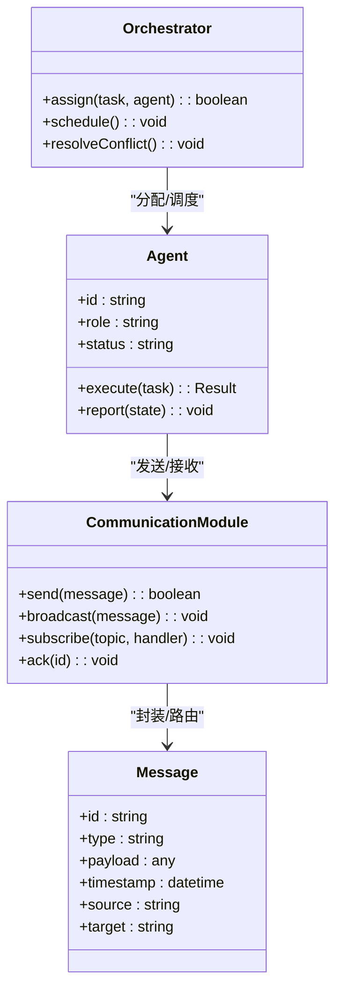
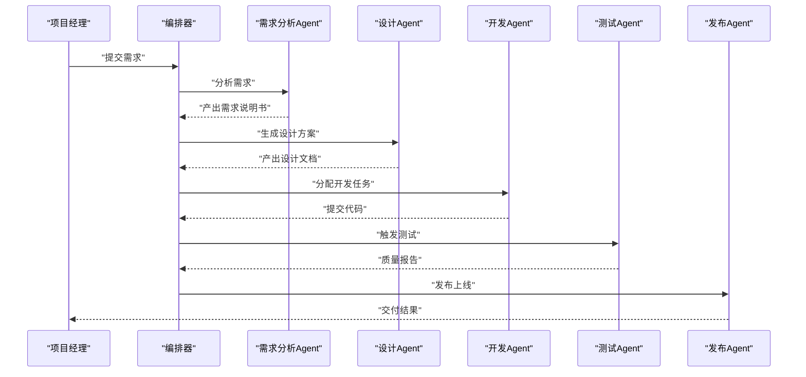
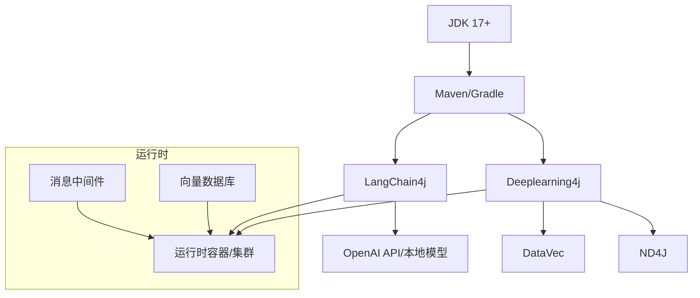

# 多智能体协作

<cite>
**本文引用的文件**   
- [book/README.md](file://book/README.md)
- [book/part1-deep-learning/chapter-01/01-why-java-ai.md](file://book/part1-deep-learning/chapter-01/01-why-java-ai.md)
- [book/part1-deep-learning/chapter-01/02-what-is-deep-learning.md](file://book/part1-deep-learning/chapter-01/02-what-is-deep-learning.md)
- [book/part1-deep-learning/chapter-01/03-first-ai-environment.md](file://book/part1-deep-learning/chapter-01/03-first-ai-environment.md)
</cite>

## 目录
1. [引言](#引言)
2. [项目结构](#项目结构)
3. [核心组件](#核心组件)
4. [架构总览](#架构总览)
5. [详细组件分析](#详细组件分析)
6. [依赖分析](#依赖分析)
7. [性能考虑](#性能考虑)
8. [故障排查指南](#故障排查指南)
9. [结论](#结论)
10. [附录](#附录)

## 引言
本章节围绕“多智能体协作”的主题展开，结合仓库中已有的知识体系，系统阐述多智能体系统的架构设计、智能体间通信协议、协调与冲突解决机制、角色分配与任务分解、群体智能的实现（分布式决策、共识与学习共享）、协作模式（竞争、合作、混合）以及工程化落地所需的接口设计、状态同步与性能监控。同时给出可操作的实现框架与评估方法，并通过贴近工程实践的案例说明应用场景。

## 项目结构
该仓库以“书”为组织单位，包含多章节内容，覆盖深度学习基础、大语言模型与智能体相关内容。其中第16章明确指向“多智能体协作”，并列出若干子主题，为本章节提供理论与实践基础。

图表来源
- [book/README.md:141-146](file://book/README.md#L141-L146)

章节来源
- [book/README.md:141-146](file://book/README.md#L141-L146)

## 核心组件
围绕多智能体协作，本节从系统视角抽象出以下核心组件与职责：

- 智能体（Agent）
  - 具备感知、推理、规划与行动能力；在多智能体场景中承担角色与任务。
- 通信与消息传递（Communication & Messaging）
  - 定义消息格式、路由与一致性保障；支持广播、点对点、主题订阅等模式。
- 协调与冲突解决（Coordination & Conflict Resolution）
  - 基于优先级、资源约束与全局目标进行任务再分配与冲突消解。
- 角色与任务（Role & Task）
  - 角色定义能力边界与职责；任务分解与动态调度提升整体效率。
- 群体智能（Swarm Intelligence）
  - 分布式决策、共识形成与学习共享，实现从个体到群体的涌现能力。
- 工程化支撑（Infrastructure）
  - 接口设计、状态同步、性能监控与可观测性，保障系统稳定与可运维。

章节来源
- [book/README.md:141-146](file://book/README.md#L141-L146)

## 架构总览
多智能体系统在工程实践中通常采用分层架构：上层为业务编排与策略层，中间层为智能体执行与通信层，底层为基础设施与数据存储层。下图展示了从高层到低层的交互关系与数据流向。

图表来源
- [book/README.md:141-146](file://book/README.md#L141-L146)

## 详细组件分析

### 通信协议与消息传递
- 目标
  - 定义统一的消息格式与路由策略，确保跨智能体的可靠、有序与可追踪通信。
- 关键要素
  - 消息类型：请求/响应、事件通知、心跳、控制指令。
  - 路由策略：点对点、广播、主题订阅、请求-回复。
  - 一致性与可靠性：幂等、去重、确认与重传、超时与重试。
  - 可观测性：消息追踪ID、时间戳、来源/目标标识。
- 实施要点
  - 采用轻量协议（如JSON或二进制）封装消息体。
  - 使用队列/主题中间件实现异步解耦。
  - 在网关层统一校验与路由，避免智能体直连带来的耦合。

图表来源
- [book/README.md:141-146](file://book/README.md#L141-L146)

章节来源
- [book/README.md:141-146](file://book/README.md#L141-L146)

### 角色定义与任务分解
- 角色定义
  - 基于能力画像（工具调用、推理、记忆、规划）划分角色，明确职责边界与依赖关系。
- 任务分解
  - 将复杂任务拆分为子任务，标注前置条件、依赖关系与资源占用。
- 动态调度
  - 根据角色空闲度、负载与优先级进行动态分配，必要时进行任务再平衡。

图表来源
- [book/README.md:141-146](file://book/README.md#L141-L146)

章节来源
- [book/README.md:141-146](file://book/README.md#L141-L146)

### 协调机制与冲突解决
- 协调机制
  - 中心化协调：集中式编排器统一调度；去中心化协调：基于协商与投票。
  - 一致性协议：Paxos/Raft用于关键状态一致；最终一致性用于非关键路径。
- 冲突解决
  - 优先级仲裁：高优任务抢占或降级低优任务。
  - 资源回收：释放被阻塞的资源，触发重试或补偿。
  - 回滚与补偿：对已执行部分进行补偿，维持全局一致性。

图表来源
- [book/README.md:141-146](file://book/README.md#L141-L146)

章节来源
- [book/README.md:141-146](file://book/README.md#L141-L146)

### 群体智能：分布式决策、共识与学习共享
- 分布式决策
  - 基于局部信息与邻居交互进行局部最优决策，通过迭代收敛至全局近似最优。
- 共识达成
  - 使用拜占庭容错、实用拜占庭容错等算法在存在恶意节点时达成共识。
- 学习共享
  - 通过参数服务器、联邦学习或模型版本化共享，实现跨智能体的经验复用。

图表来源
- [book/README.md:141-146](file://book/README.md#L141-L146)

章节来源
- [book/README.md:141-146](file://book/README.md#L141-L146)

### 协作模式：竞争、合作与混合
- 竞争模式
  - 场景：资源有限、目标冲突；通过竞价、抢占或轮询实现资源分配。
- 合作模式
  - 场景：共同目标、互补能力；通过任务分工与结果共享实现协同。
- 混合模式
  - 场景：既有共同目标也有内部竞争；通过分层治理与激励机制平衡内外部关系。

图表来源
- [book/README.md:141-146](file://book/README.md#L141-L146)

章节来源
- [book/README.md:141-146](file://book/README.md#L141-L146)

### 实现框架：通信接口、状态同步与性能监控
- 通信接口设计
  - 定义统一的消息契约与路由接口，支持多协议适配与扩展。
- 状态同步
  - 采用事件溯源或状态快照，结合版本号与冲突检测，保障一致性。
- 性能监控
  - 指标采集（吞吐、延迟、错误率、资源利用率）、可视化与告警联动。

图表来源
- [book/README.md:141-146](file://book/README.md#L141-L146)

章节来源
- [book/README.md:141-146](file://book/README.md#L141-L146)

### 实战案例：软件开发Agent团队
- 场景描述
  - 由多个具备不同能力的智能体组成团队，分别负责需求分析、设计、编码、测试与发布。
- 关键流程
  - 需求→任务分解→角色匹配→动态调度→执行→质量门禁→交付。
- 评估方法
  - 交付周期、缺陷密度、资源利用率、任务按时完成率、团队协作满意度。

图表来源
- [book/README.md:141-146](file://book/README.md#L141-L146)

章节来源
- [book/README.md:141-146](file://book/README.md#L141-L146)

## 依赖分析
多智能体系统依赖于底层基础设施与上层业务编排的协同。下图展示了从环境准备到系统运行的关键依赖关系。

图表来源
- [book/part1-deep-learning/chapter-01/03-first-ai-environment.md:84-189](file://book/part1-deep-learning/chapter-01/03-first-ai-environment.md#L84-L189)

章节来源
- [book/part1-deep-learning/chapter-01/03-first-ai-environment.md:84-189](file://book/part1-deep-learning/chapter-01/03-first-ai-environment.md#L84-L189)

## 性能考虑
- 并发与吞吐
  - 使用无锁队列与批量处理降低上下文切换；合理设置线程池与背压策略。
- 通信开销
  - 消息压缩与批量化；选择低延迟网络与就近部署。
- 训练与推理
  - 利用GPU/TPU加速；模型量化与缓存热点；异步推理与结果合并。
- 可观测性
  - 采样与聚合指标，避免过度埋点；关键路径打点与端到端追踪。

## 故障排查指南
- 常见问题
  - 消息丢失/重复：检查确认与去重策略；核对中间件配置。
  - 死锁/活锁：审查任务依赖与优先级；引入超时与降级。
  - 性能瓶颈：定位热点线程与IO；优化批处理与缓存。
- 工具与手段
  - 日志分级与结构化；指标仪表盘；链路追踪；压力测试。

章节来源
- [book/part1-deep-learning/chapter-01/03-first-ai-environment.md:385-407](file://book/part1-deep-learning/chapter-01/03-first-ai-environment.md#L385-L407)

## 结论
多智能体协作的核心在于“分而治之、协而共进”。通过清晰的角色与任务划分、稳健的通信与协调机制、可演进的群体智能与学习共享，以及完善的工程化支撑，能够在复杂业务场景中实现高效、弹性与可扩展的智能体团队。结合仓库提供的深度学习与智能体知识基础，可进一步将模型能力与多智能体系统深度融合，实现从感知到决策再到行动的闭环。

## 附录
- 术语
  - 智能体：具备感知、推理、规划与行动能力的实体。
  - 通信协议：统一的消息格式与路由规则。
  - 协调：在多智能体之间进行任务与资源的统一管理。
  - 冲突解决：在资源与目标冲突时的仲裁与恢复机制。
  - 群体智能：从个体行为中涌现出的集体智慧。
- 参考资料
  - 仓库中关于深度学习与智能体的相关章节，为多智能体系统提供理论与实践基础。