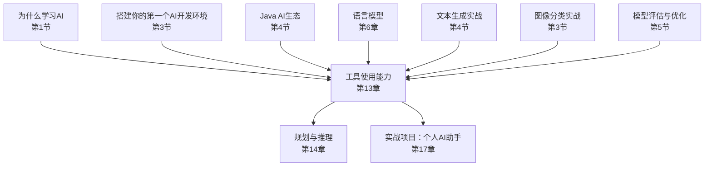
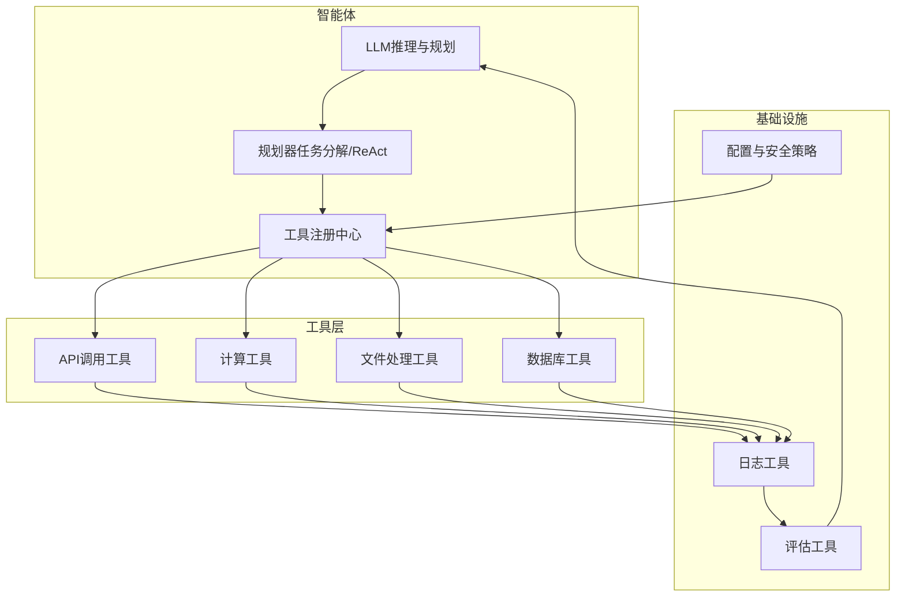
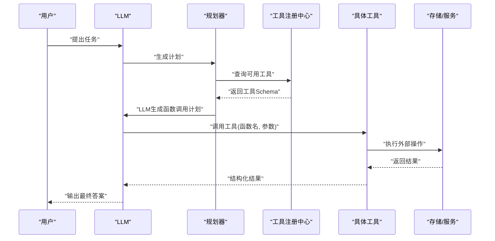
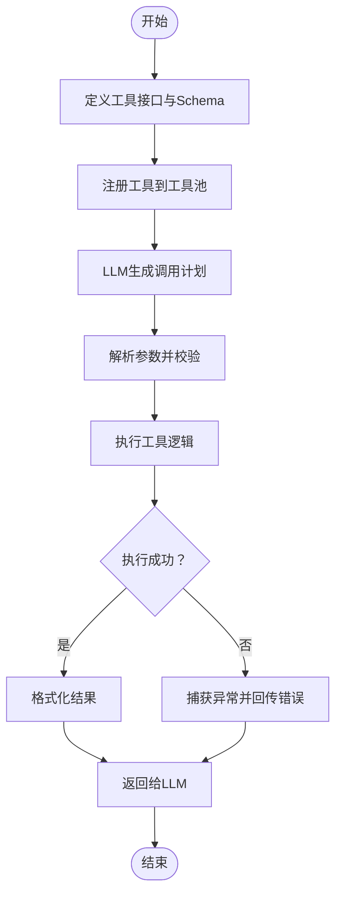
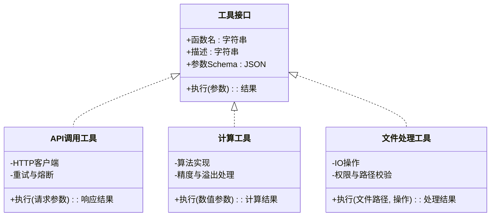
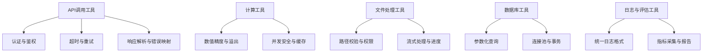
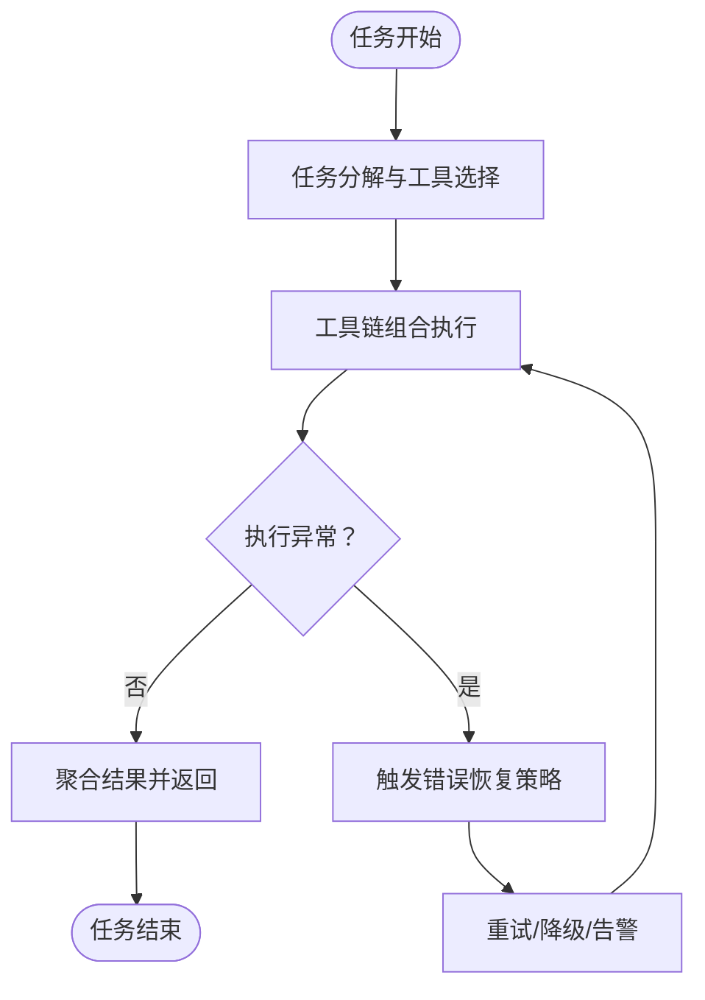
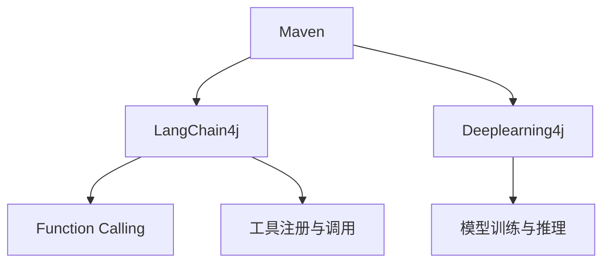

# 工具使用能力

<cite>
**本文引用的文件**   
- [README.md](file://book/README.md)
- [01-why-java-ai.md](file://book/part1-deep-learning/chapter-01/01-why-java-ai.md)
- [03-first-ai-environment.md](file://book/part1-deep-learning/chapter-01/03-first-ai-environment.md)
- [04-java-ai-ecosystem.md](file://book/part1-deep-learning/chapter-01/04-java-ai-ecosystem.md)
- [01-what-is-language-model.md](file://book/part2-llm/chapter-06/01-what-is-language-model.md)
- [04-text-generation-practice.md](file://book/part1-deep-learning/chapter-04/04-text-generation-practice.md)
- [05-build-image-classifier.md](file://book/part1-deep-learning/chapter-03/05-build-image-classifier.md)
- [04-model-evaluation-optimization.md](file://book/part1-deep-learning/chapter-05/04-model-evaluation-optimization.md)
</cite>

## 目录
1. [引言](#引言)
2. [项目结构](#项目结构)
3. [核心组件](#核心组件)
4. [架构总览](#架构总览)
5. [详细组件分析](#详细组件分析)
6. [依赖分析](#依赖分析)
7. [性能考量](#性能考量)
8. [故障排查指南](#故障排查指南)
9. [结论](#结论)
10. [附录](#附录)

## 引言
本章节聚焦“工具使用能力”，围绕智能体的工具调用机制展开，系统阐述Function Calling（函数调用）的核心原理与实现方式，详解工具的定义、注册与调用流程，覆盖工具接口设计、参数传递与结果处理，并给出Java自定义工具的开发规范、异常处理与性能优化建议。同时，结合仓库中已有的章节主题与技术栈，提供常见工具类型（API调用、计算、文件处理等）的实现思路与最佳实践，以及工具链组合使用与错误恢复策略。

## 项目结构
该仓库以“书稿”形式组织内容，涵盖深度学习、大语言模型与智能体三个部分。与“工具使用能力”直接相关的内容主要分布在以下章节：
- 第13章：工具使用——让AI操作外部世界（Function Calling、工具定义与注册、Java自定义工具、实战：让LLM操作数据库、设计思考：安全性与可控性）
- 第14章：规划与推理——智能体的决策能力（ReAct框架、思维链与思维树）
- 第17章：实战项目——个人AI助手（工具集成与扩展）
- 第1节：为什么学习AI（工具使用率现状与分层）
- 第3节：搭建你的第一个AI开发环境（LangChain4j、Deeplearning4j、Maven依赖）
- 第4节：Java AI生态（LangChain4j、Function Calling、工具链选型）
- 第6章：语言模型（语言模型接口与实现示例，为工具封装提供参考）
- 第4节：循环神经网络实战（文本生成项目结构，体现工具化模块划分）
- 第3节：卷积神经网络实战（图像分类项目结构，体现工具化模块划分）
- 第5节：模型评估与优化（错误分析与可视化，体现工具化评估流程）

**图表来源**
- [README.md:119-168](file://book/README.md#L119-L168)
- [01-why-java-ai.md:1-80](file://book/part1-deep-learning/chapter-01/01-why-java-ai.md#L1-L80)
- [03-first-ai-environment.md:1-189](file://book/part1-deep-learning/chapter-01/03-first-ai-environment.md#L1-L189)
- [04-java-ai-ecosystem.md:1-320](file://book/part1-deep-learning/chapter-01/04-java-ai-ecosystem.md#L1-L320)
- [01-what-is-language-model.md:1-180](file://book/part2-llm/chapter-06/01-what-is-language-model.md#L1-L180)
- [04-text-generation-practice.md:1-50](file://book/part1-deep-learning/chapter-04/04-text-generation-practice.md#L1-L50)
- [05-build-image-classifier.md:1-43](file://book/part1-deep-learning/chapter-03/05-build-image-classifier.md#L1-L43)
- [04-model-evaluation-optimization.md:88-141](file://book/part1-deep-learning/chapter-05/04-model-evaluation-optimization.md#L88-L141)

**章节来源**
- [README.md:119-168](file://book/README.md#L119-L168)

## 核心组件
- Function Calling（函数调用）：LLM通过函数签名与参数描述，动态决定调用哪些工具以完成外部世界操作。
- 工具定义与注册：将工具抽象为统一接口，声明名称、描述、参数Schema与执行逻辑；注册到智能体的工具池。
- 工具调用流程：LLM生成函数调用计划（函数名、参数），智能体执行工具，返回结果给LLM，形成“推理-行动”的闭环。
- Java自定义工具：遵循接口规范，实现参数校验、异常处理与性能优化，确保与LangChain4j等框架协同工作。
- 工具链组合：将API调用、计算、文件处理等工具串联，形成复杂任务流水线；配合错误恢复策略提升鲁棒性。

**章节来源**
- [README.md:119-168](file://book/README.md#L119-L168)
- [03-first-ai-environment.md:134-146](file://book/part1-deep-learning/chapter-01/03-first-ai-environment.md#L134-L146)
- [04-java-ai-ecosystem.md:117-124](file://book/part1-deep-learning/chapter-01/04-java-ai-ecosystem.md#L117-L124)

## 架构总览
下图展示了智能体的工具使用架构：LLM负责“思考与决策”，工具层负责“外部世界操作”，日志与评估工具贯穿始终，形成闭环。

**图表来源**
- [README.md:119-168](file://book/README.md#L119-L168)
- [03-first-ai-environment.md:134-146](file://book/part1-deep-learning/chapter-01/03-first-ai-environment.md#L134-L146)
- [04-model-evaluation-optimization.md:88-141](file://book/part1-deep-learning/chapter-05/04-model-evaluation-optimization.md#L88-L141)

## 详细组件分析

### Function Calling 核心原理与实现
- 原理：LLM基于工具Schema生成函数调用请求（函数名、参数JSON），智能体解析并执行对应工具，将结果回传LLM，形成“推理-行动-反馈”的循环。
- 实现要点：
  - 工具Schema：包含函数名、描述、参数（名称、类型、是否必需、默认值、约束）。
  - 参数传递：严格校验与转换，必要时进行类型映射与默认值填充。
  - 结果处理：统一包装为结构化结果，便于LLM后续决策。
  - 安全控制：白名单、超时、重试与熔断策略。

**图表来源**
- [README.md:119-168](file://book/README.md#L119-L168)

**章节来源**
- [README.md:119-168](file://book/README.md#L119-L168)

### 工具定义、注册与调用流程
- 工具定义：抽象为统一接口，声明函数名、描述、参数Schema与执行方法。
- 注册：将工具实例注册到工具池，绑定名称与Schema，支持动态启用/禁用。
- 调用：LLM生成调用计划，解析参数，执行工具，捕获异常并回传错误信息。
- 结果处理：将结果标准化，支持字符串、JSON、二进制等格式，必要时进行二次处理。

**图表来源**
- [README.md:119-168](file://book/README.md#L119-L168)

**章节来源**
- [README.md:119-168](file://book/README.md#L119-L168)

### Java自定义工具开发规范
- 接口设计：遵循统一工具接口，明确函数名、描述、参数Schema与返回值结构。
- 参数传递：严格类型校验、默认值填充、边界检查；对可选参数提供合理默认行为。
- 异常处理：区分业务异常与系统异常，提供清晰错误码与错误信息；支持重试与降级。
- 性能优化：缓存热点数据、批量处理、异步执行；限制资源占用与超时控制。
- 安全性：参数白名单、SQL注入防护、文件访问权限控制、敏感信息脱敏。
- 可观测性：埋点日志、指标采集、链路追踪；提供健康检查与熔断开关。

**图表来源**
- [README.md:119-168](file://book/README.md#L119-L168)

**章节来源**
- [README.md:119-168](file://book/README.md#L119-L168)

### 常用工具类型实现思路
- API调用工具：封装HTTP客户端，支持认证、超时、重试与熔断；参数校验与响应解析；错误码映射与重试策略。
- 计算工具：提供数学运算、统计分析或模型推理接口；注意精度、溢出与并发安全。
- 文件处理工具：支持读写、压缩、格式转换；校验路径与权限，防止路径穿越；支持流式处理与进度回调。
- 数据库工具：封装CRUD操作，支持事务与连接池；参数化查询防注入；分页与索引优化。
- 日志与评估工具：统一日志格式与级别；提供性能指标与错误统计；支持可视化与报告生成。

**图表来源**
- [README.md:119-168](file://book/README.md#L119-L168)
- [04-model-evaluation-optimization.md:88-141](file://book/part1-deep-learning/chapter-05/04-model-evaluation-optimization.md#L88-L141)

**章节来源**
- [README.md:119-168](file://book/README.md#L119-L168)
- [04-model-evaluation-optimization.md:88-141](file://book/part1-deep-learning/chapter-05/04-model-evaluation-optimization.md#L88-L141)

### 工具链组合使用与错误恢复策略
- 组合策略：将多个工具按任务分解顺序串联，中间结果作为下游工具输入；必要时加入条件判断与分支。
- 错误恢复：设置最大重试次数与退避策略；对不可恢复错误进行快速失败与告警；记录上下文与轨迹以便回溯。
- 安全控制：工具白名单、参数校验、超时与熔断；对高风险工具增加审批或沙箱隔离。
- 性能优化：批量执行、异步处理、缓存热点数据；监控关键指标并自动扩缩容。

**图表来源**
- [README.md:119-168](file://book/README.md#L119-L168)

**章节来源**
- [README.md:119-168](file://book/README.md#L119-L168)

### 与现有章节的关联与实践参考
- 语言模型接口与实现：为工具封装提供接口设计参考（如预测接口的抽象与实现）。
- 文本生成实战：体现模块化工具划分（主程序、模型、数据、工具），可借鉴到工具层模块化。
- 图像分类实战：体现模块化工具划分（主类、模型、数据、工具），可借鉴到工具层模块化。
- 模型评估与优化：提供错误分析与可视化工具思路，可用于工具执行结果的评估与改进。

**章节来源**
- [01-what-is-language-model.md:1-180](file://book/part2-llm/chapter-06/01-what-is-language-model.md#L1-L180)
- [04-text-generation-practice.md:1-50](file://book/part1-deep-learning/chapter-04/04-text-generation-practice.md#L1-L50)
- [05-build-image-classifier.md:1-43](file://book/part1-deep-learning/chapter-03/05-build-image-classifier.md#L1-L43)
- [04-model-evaluation-optimization.md:88-141](file://book/part1-deep-learning/chapter-05/04-model-evaluation-optimization.md#L88-L141)

## 依赖分析
- 技术栈依赖：LangChain4j用于LLM与工具集成，Deeplearning4j用于深度学习模型，Maven管理依赖。
- 工具生态：LangChain4j提供Function Calling能力与工具注册机制；生态内工具类型丰富，可组合使用。
- 项目依赖：各实战项目体现模块化与工具化思路，便于迁移至工具层。

**图表来源**
- [03-first-ai-environment.md:134-146](file://book/part1-deep-learning/chapter-01/03-first-ai-environment.md#L134-L146)
- [04-java-ai-ecosystem.md:117-124](file://book/part1-deep-learning/chapter-01/04-java-ai-ecosystem.md#L117-L124)

**章节来源**
- [03-first-ai-environment.md:134-146](file://book/part1-deep-learning/chapter-01/03-first-ai-environment.md#L134-L146)
- [04-java-ai-ecosystem.md:117-124](file://book/part1-deep-learning/chapter-01/04-java-ai-ecosystem.md#L117-L124)

## 性能考量
- 工具执行性能：批量处理、异步执行、缓存热点数据；限制并发与资源占用。
- 网络与I/O：API调用工具设置合理的超时与重试；文件工具采用流式处理与分块传输。
- 内存与CPU：计算工具注意内存峰值与CPU占用；对大数据集采用分批处理。
- 监控与告警：埋点关键指标（耗时、错误率、吞吐），设置阈值告警与自动扩容。

## 故障排查指南
- 常见问题：参数校验失败、工具执行异常、网络超时、权限不足、资源耗尽。
- 排查步骤：检查工具Schema与参数映射、查看日志与指标、验证网络与权限、复现最小化用例。
- 恢复策略：启用重试与熔断、降级非关键工具、隔离故障节点、回滚配置变更。
- 评估与改进：利用评估工具分析错误样本与性能瓶颈，持续优化工具实现与调用策略。

**章节来源**
- [04-model-evaluation-optimization.md:88-141](file://book/part1-deep-learning/chapter-05/04-model-evaluation-optimization.md#L88-L141)

## 结论
工具使用能力是智能体从“被动响应”走向“主动行动”的关键。通过Function Calling机制，LLM能够动态调用各类工具完成外部世界操作。结合统一的工具接口、严格的参数与异常处理、完善的性能与安全策略，以及工具链组合与错误恢复，可以构建稳定、高效、可扩展的智能体工具体系。仓库中的章节为工具化设计提供了丰富的实践参考与生态支撑。

## 附录
- 工具开发清单：接口设计、Schema定义、参数校验、异常处理、性能优化、安全控制、可观测性。
- 工具链组合清单：API调用、计算、文件处理、数据库、日志与评估工具的组合策略与最佳实践。
- 参考章节：第13章、第14章、第17章、第1节、第3节、第4节、第6节、第4节、第3节、第5节。