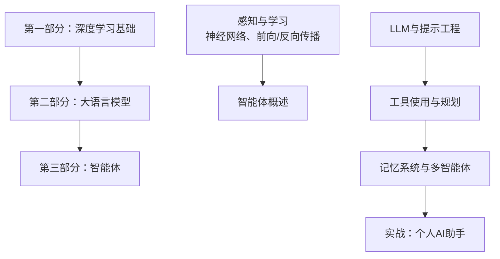
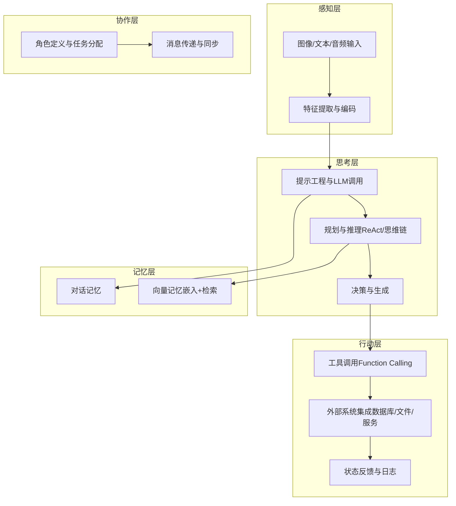
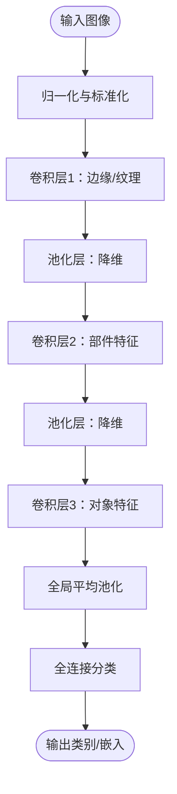
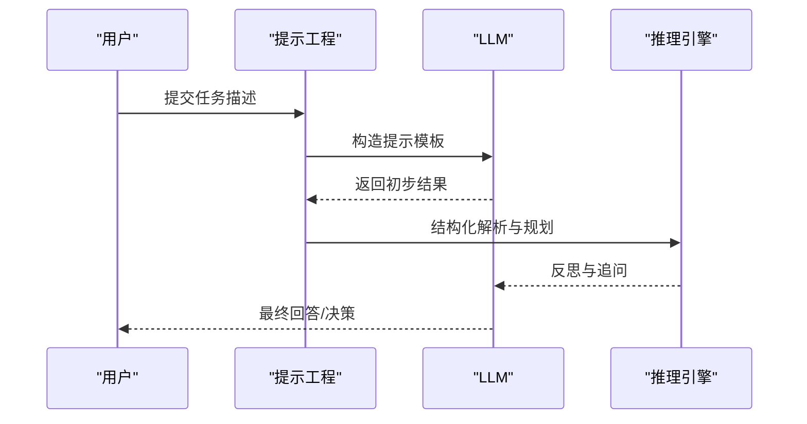
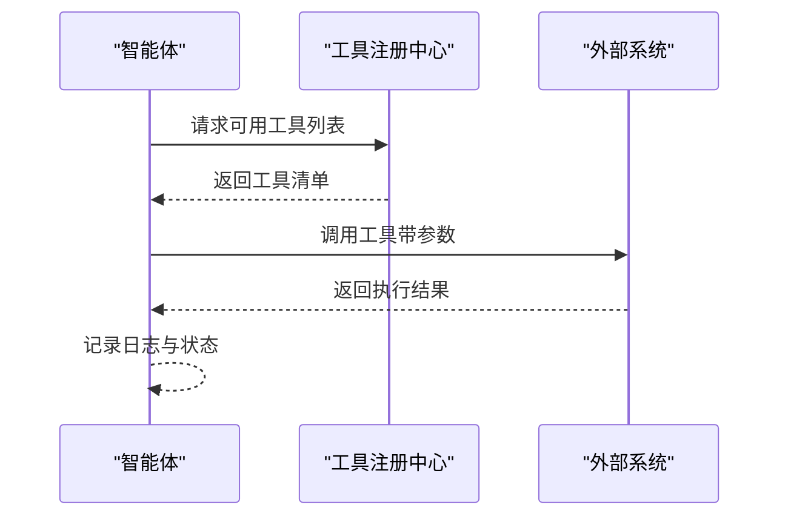
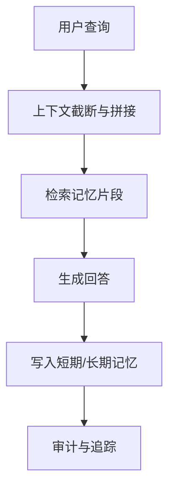
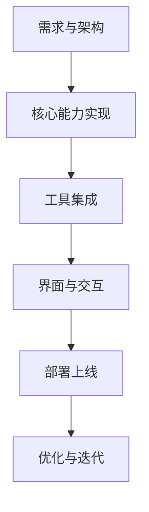
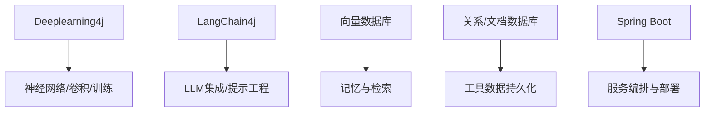

# 智能体概述

<cite>
**本文引用的文件**
- [book/README.md](file://book/README.md)
- [part1-deep-learning/chapter-01/01-why-java-ai.md](file://part1-deep-learning/chapter-01/01-why-java-ai.md)
- [part1-deep-learning/chapter-01/02-what-is-deep-learning.md](file://part1-deep-learning/chapter-01/02-what-is-deep-learning.md)
- [part1-deep-learning/chapter-01/03-first-ai-environment.md](file://part1-deep-learning/chapter-01/03-first-ai-environment.md)
- [part1-deep-learning/chapter-02/02-forward-propagation.md](file://part1-deep-learning/chapter-02/02-forward-propagation.md)
- [part1-deep-learning/chapter-02/03-backpropagation.md](file://part1-deep-learning/chapter-02/03-backpropagation.md)
- [part1-deep-learning/chapter-02/04-first-neural-network-dl4j.md](file://part1-deep-learning/chapter-02/04-first-neural-network-dl4j.md)
- [part1-deep-learning/chapter-02/05-why-deep-learning-needs-depth.md](file://part1-deep-learning/chapter-02/05-why-deep-learning-needs-depth.md)
- [part1-deep-learning/chapter-03/01-image-recognition-problem.md](file://part1-deep-learning/chapter-03/01-image-recognition-problem.md)
- [part1-deep-learning/chapter-03/04-classic-cnn-architectures.md](file://part1-deep-learning/chapter-03/04-classic-cnn-architectures.md)
- [part1-deep-learning/chapter-03/05-build-image-classifier.md](file://part1-deep-learning/chapter-03/05-build-image-classifier.md)
</cite>

## 目录
1. [引言](#引言)
2. [项目结构](#项目结构)
3. [核心组件](#核心组件)
4. [架构总览](#架构总览)
5. [详细组件分析](#详细组件分析)
6. [依赖分析](#依赖分析)
7. [性能考虑](#性能考虑)
8. [故障排查指南](#故障排查指南)
9. [结论](#结论)
10. [附录](#附录)

## 引言
本节面向Java程序员，系统性介绍智能体（Agent）的基本概念、核心组成与工作原理，并与传统程序进行对比；阐述智能体的“感知—思考—行动”三大能力；梳理智能体的发展脉络与典型应用场景；给出智能体系统的设计原则（模块化、可扩展、性能优化）；最后结合Java生态（如Deeplearning4j、LangChain4j等）说明如何在Java体系内构建与落地智能体系统。

## 项目结构
该仓库围绕“AI学习路径”组织内容，分为三部分：
- 第一部分：深度学习基础（感知与学习）
- 第二部分：大语言模型（思考与推理）
- 第三部分：智能体（感知—思考—行动的综合应用）

其中，智能体相关内容位于第三部分的章节中，贯穿“感知—工具—规划—记忆—协作—实战”的主题线索。

**图表来源**
- [book/README.md:112-154](file://book/README.md#L112-L154)

**章节来源**
- [book/README.md:30-187](file://book/README.md#L30-L187)

## 核心组件
智能体系统由以下核心组件构成：
- 感知组件：负责从多模态输入（文本、图像、结构化数据）中抽取特征与语义表示
- 思考组件：基于LLM或推理框架进行规划、决策与生成
- 行动组件：通过工具调用、API或外部系统执行具体动作
- 记忆组件：短期与长期记忆，支撑上下文与个性化
- 协作组件：多智能体间的角色分工与消息传递
- 工具与基础设施：数据库、文件系统、第三方服务等

这些组件在Java生态中可通过DL4J（深度学习）、LangChain4j（LLM与提示工程）、向量数据库、Spring Boot等技术栈协同实现。

**章节来源**
- [book/README.md:112-154](file://book/README.md#L112-L154)

## 架构总览
智能体系统采用“分层+模块化”的架构设计，强调可扩展性与工程化落地：

**图表来源**
- [book/README.md:112-154](file://book/README.md#L112-L154)

## 详细组件分析

### 感知组件：从像素到语义的桥梁
- 问题背景：从像素到语义存在“语义鸿沟”，需要层次化特征提取
- 技术路径：卷积神经网络通过卷积+池化逐步提取边缘、纹理、部件到对象
- 工程实践：DL4J提供ConvolutionLayer/SubsamplingLayer等层，支持NCHW数据格式与批处理

**图表来源**
- [part1-deep-learning/chapter-03/04-classic-cnn-architectures.md:24-327](file://part1-deep-learning/chapter-03/04-classic-cnn-architectures.md#L24-L327)

**章节来源**
- [part1-deep-learning/chapter-03/01-image-recognition-problem.md:139-228](file://part1-deep-learning/chapter-03/01-image-recognition-problem.md#L139-L228)
- [part1-deep-learning/chapter-03/04-classic-cnn-architectures.md:17-104](file://part1-deep-learning/chapter-03/04-classic-cnn-architectures.md#L17-L104)

### 思考组件：从感知到推理
- 前向传播：数据在网络中逐层变换，激活函数引入非线性
- 反向传播：链式法则计算梯度，优化器更新参数
- LLM与提示工程：通过提示模板、思维链、结构化输出引导模型推理

**图表来源**
- [part1-deep-learning/chapter-02/02-forward-propagation.md:119-175](file://part1-deep-learning/chapter-02/02-forward-propagation.md#L119-L175)
- [part1-deep-learning/chapter-02/03-backpropagation.md:112-183](file://part1-deep-learning/chapter-02/03-backpropagation.md#L112-L183)

**章节来源**
- [part1-deep-learning/chapter-02/02-forward-propagation.md:214-325](file://part1-deep-learning/chapter-02/02-forward-propagation.md#L214-L325)
- [part1-deep-learning/chapter-02/03-backpropagation.md:327-370](file://part1-deep-learning/chapter-02/03-backpropagation.md#L327-L370)

### 行动组件：工具调用与外部系统集成
- Function Calling：LLM调用函数/工具的能力，将推理转化为可执行动作
- 工具注册与安全：定义工具接口、参数校验、权限控制与审计
- 实战示例：让LLM操作数据库、发送消息、生成报告等

**图表来源**
- [book/README.md:120-126](file://book/README.md#L120-L126)

**章节来源**
- [book/README.md:120-126](file://book/README.md#L120-L126)

### 记忆组件：短期与长期记忆
- 短期记忆：上下文窗口内的对话历史与中间结果
- 长期记忆：向量数据库中的嵌入与检索，支持RAG与个性化
- 设计要点：记忆的增删改查、容量控制、隐私保护与性能优化

**图表来源**
- [book/README.md:134-140](file://book/README.md#L134-L140)

**章节来源**
- [book/README.md:134-140](file://book/README.md#L134-L140)

### 协作组件：多智能体系统
- 角色定义：分析、生成、执行、审核等角色划分
- 协作模式：流水线、并行、仲裁与冲突解决
- 通信协议：消息格式、路由策略、一致性与容错

**图表来源**
- [book/README.md:141-147](file://book/README.md#L141-L147)

**章节来源**
- [book/README.md:141-147](file://book/README.md#L141-L147)

### 实战项目：个人AI助手
- 项目规划：需求分析、架构设计、模块划分
- 核心能力：对话、工具调用、记忆、多轮上下文
- 集成与扩展：数据库、第三方API、前端界面
- 部署与优化：容器化、监控、A/B测试、持续迭代

**图表来源**
- [book/README.md:148-154](file://book/README.md#L148-L154)

**章节来源**
- [book/README.md:148-154](file://book/README.md#L148-L154)

## 依赖分析
智能体系统在Java生态中的关键依赖与集成点：
- 深度学习：Deeplearning4j（DL4J）提供神经网络、卷积层、批处理与训练管线
- 大语言模型：LangChain4j提供LLM集成、提示工程、Function Calling与RAG
- 数据与存储：向量数据库（如Milvus/Pinecone/Chroma）与关系型/文档数据库
- 工具与服务：HTTP客户端、消息队列、缓存与日志系统
- 部署与运维：Spring Boot、容器化、可观测性与自动化测试

**图表来源**
- [book/README.md:170-177](file://book/README.md#L170-L177)

**章节来源**
- [book/README.md:170-177](file://book/README.md#L170-L177)

## 性能考虑
- 计算效率
  - 向量化与批处理：利用ND4J矩阵运算提升吞吐
  - 激活函数与初始化：ReLU、Xavier/He初始化、批归一化
  - 梯度优化：Adam等自适应优化器，避免梯度消失/爆炸
- 存储与检索
  - 向量索引与相似度计算的近似最近邻（ANN）策略
  - 分片与缓存：热点数据与冷数据分离
- 系统开销
  - 工具调用的超时与重试、熔断与隔离
  - 日志与追踪：分布式链路与性能指标采集
- 部署与弹性
  - 容器化与资源配额、自动扩缩容
  - 灰度发布与回滚策略

**章节来源**
- [part1-deep-learning/chapter-02/02-forward-propagation.md:326-379](file://part1-deep-learning/chapter-02/02-forward-propagation.md#L326-L379)
- [part1-deep-learning/chapter-02/03-backpropagation.md:205-291](file://part1-deep-learning/chapter-02/03-backpropagation.md#L205-L291)
- [part1-deep-learning/chapter-03/04-classic-cnn-architectures.md:253-327](file://part1-deep-learning/chapter-03/04-classic-cnn-architectures.md#L253-L327)

## 故障排查指南
- 训练不稳定
  - 检查学习率、优化器与正则化参数
  - 使用早停、梯度裁剪与学习率调度
- 推理性能低
  - 模型量化、KV缓存与并行推理
  - 工具调用超时与重试策略
- 记忆检索不准
  - 调整嵌入维度与相似度阈值
  - 重新训练或微调嵌入模型
- 部署异常
  - 容器资源限制、日志与监控告警
  - 逐步发布与回滚预案

**章节来源**
- [part1-deep-learning/chapter-02/05-why-deep-learning-needs-depth.md:162-247](file://part1-deep-learning/chapter-02/05-why-deep-learning-needs-depth.md#L162-L247)
- [part1-deep-learning/chapter-03/05-build-image-classifier.md:518-544](file://part1-deep-learning/chapter-03/05-build-image-classifier.md#L518-L544)

## 结论
智能体是“感知—思考—行动”的闭环系统，依托深度学习与大语言模型实现从数据到决策再到执行的全链路自动化。在Java生态中，DL4J与LangChain4j提供了从底层计算到上层应用的完整能力，结合向量数据库与企业级框架，可实现高可靠、可扩展、可维护的智能体系统。建议从感知与学习（DL4J）起步，逐步引入LLM与工具调用，最终形成以模块化、可扩展与性能优化为核心的设计与工程实践。

## 附录
- 术语表与参考文献：参见书末附录
- 实践建议：从最小可行智能体（MVI）开始，逐步增加记忆、工具与协作能力

**章节来源**
- [book/README.md:155-187](file://book/README.md#L155-L187)