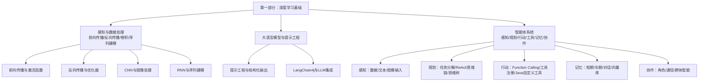
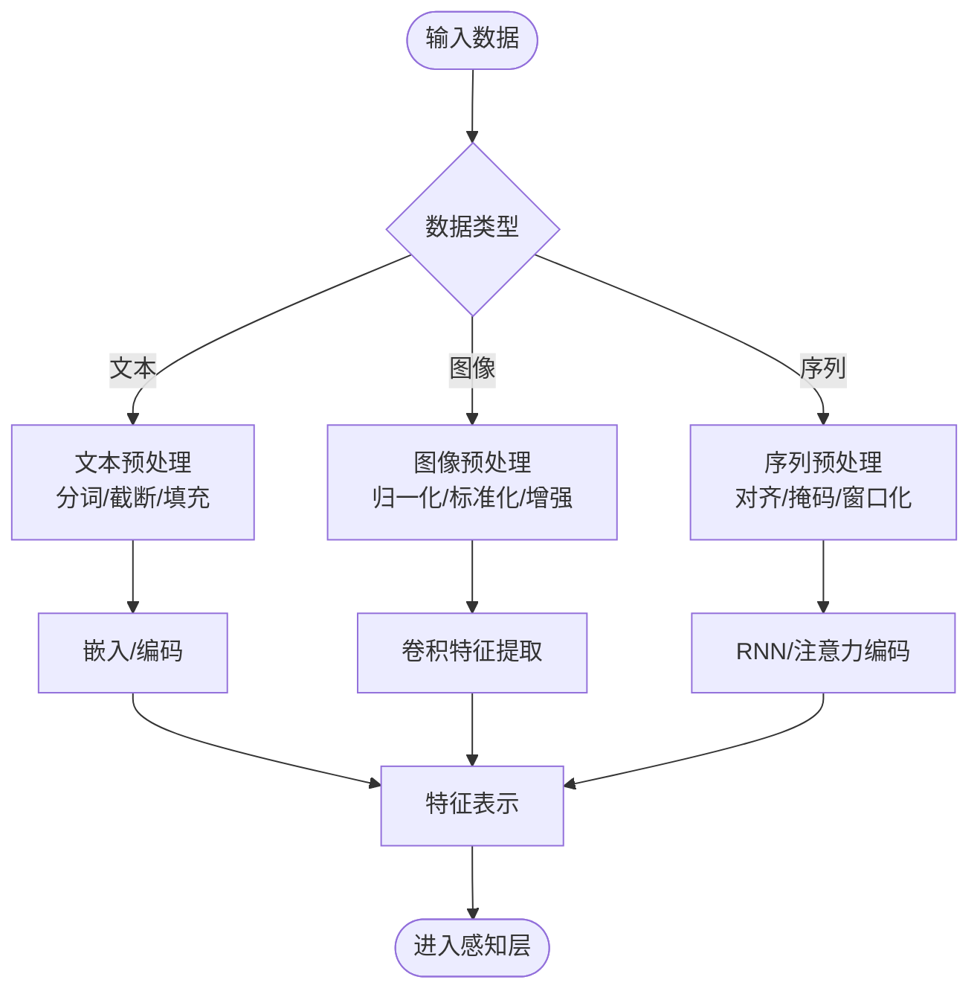
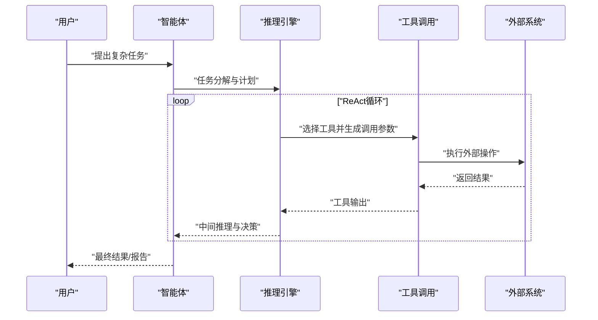
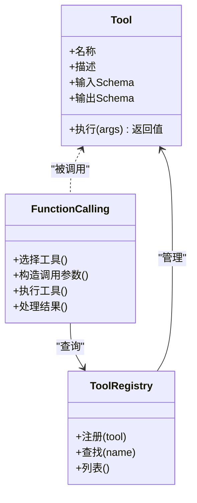
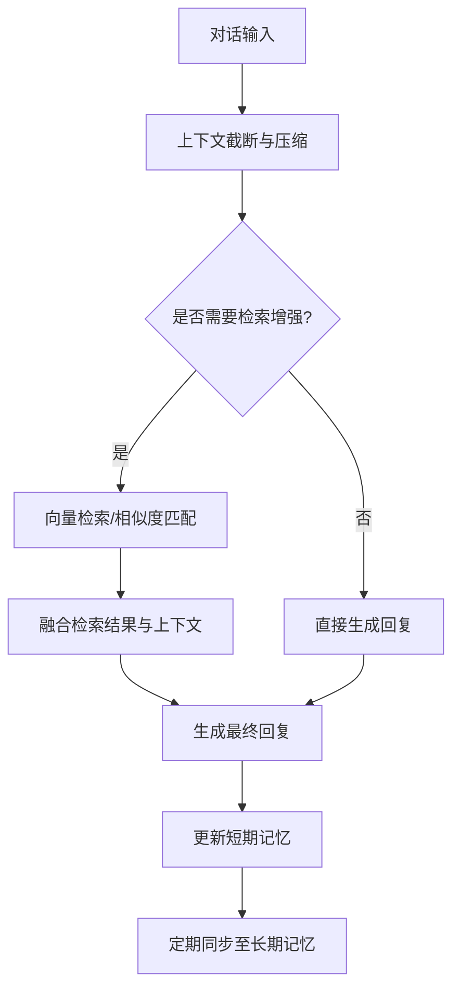
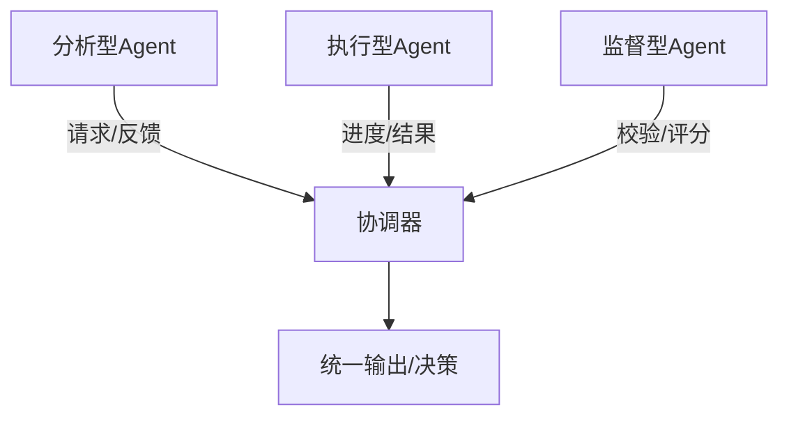
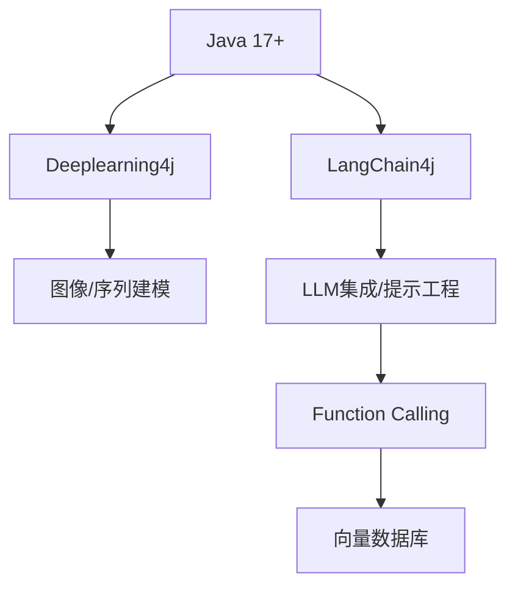

# 智能体系统

<cite>
**本文引用的文件**   
- [README.md](file://book/README.md)
- [01-why-java-ai.md](file://book/part1-deep-learning/chapter-01/01-why-java-ai.md)
- [02-forward-propagation.md](file://book/part1-deep-learning/chapter-02/02-forward-propagation.md)
- [03-backpropagation.md](file://book/part1-deep-learning/chapter-02/03-backpropagation.md)
- [04-first-neural-network-dl4j.md](file://book/part1-deep-learning/chapter-02/04-first-neural-network-dl4j.md)
- [01-image-recognition-problem.md](file://book/part1-deep-learning/chapter-03/01-image-recognition-problem.md)
- [04-classic-cnn-architectures.md](file://book/part1-deep-learning/chapter-03/04-classic-cnn-architectures.md)
- [05-build-image-classifier.md](file://book/part1-deep-learning/chapter-03/05-build-image-classifier.md)
- [01-sequence-data-challenge.md](file://book/part1-deep-learning/chapter-04/01-sequence-data-challenge.md)
</cite>

## 目录
1. [引言](#引言)
2. [项目结构](#项目结构)
3. [核心组件](#核心组件)
4. [架构总览](#架构总览)
5. [详细组件分析](#详细组件分析)
6. [依赖分析](#依赖分析)
7. [性能考量](#性能考量)
8. [故障排查指南](#故障排查指南)
9. [结论](#结论)
10. [附录](#附录)

## 引言
本节围绕“智能体系统”的核心目标，结合仓库中已有的深度学习与大语言模型相关内容，系统阐述智能体的三大核心能力：感知、规划与行动；工具使用（Function Calling）与Java自定义工具开发；规划与推理（任务分解、ReAct框架、思维链/思维树）；记忆系统（短期/长期记忆、对话记忆管理、向量数据库）；以及多智能体协作（角色定义、通信协议、群体智能）。同时，给出基于仓库已有章节的实践路径与架构建议，帮助读者从深度学习与LLM基础出发，逐步构建可工程化的智能体系统。

## 项目结构
该仓库以“从Java视角理解AI”为主线，分为三大部分：
- 第一部分：深度学习基础（感知与数据处理）
- 第二部分：大语言模型（LLM与提示工程）
- 第三部分：智能体（感知、规划、行动、工具、记忆、协作）

**图表来源**
- [README.md: 112-147:112-147](file://book/README.md#L112-L147)

**章节来源**
- [README.md: 112-147:112-147](file://book/README.md#L112-L147)

## 核心组件
智能体系统由以下核心组件构成：
- 感知（Perception）：负责接收与理解来自环境的多模态输入（文本、图像、结构化数据），并将其转化为可用于后续处理的内部表示。
- 规划（Planning）：对目标进行任务分解，制定执行策略，并在不确定性环境中进行推理与决策。
- 行动（Action）：将决策转化为具体动作，如调用工具、生成回复、写入数据库、发送消息等。

此外，工具使用（Function Calling）、记忆系统（短期/长期/对话/向量库）与多智能体协作（角色、通信、群体智能）是支撑上述三大组件的关键基础设施。

**章节来源**
- [README.md: 112-147:112-147](file://book/README.md#L112-L147)

## 架构总览
下图展示了智能体系统从感知到行动的整体架构，以及与工具、记忆、协作模块的交互关系。

```mermaid
graph TB
subgraph "输入与感知"
S1["传感器/输入接口"]
P1["数据预处理/特征提取"]
end
subgraph "智能决策"
PL["规划与推理<br/>任务分解/ReAct/思维链/思维树"]
M["记忆系统<br/>短期/长期/对话/向量库"]
end
subgraph "执行与反馈"
AC["行动控制<br/>Function Calling/工具注册"]
OUT["输出/反馈"]
end
subgraph "协作与编排"
CO["多智能体编排<br/>角色/通信/群体智能"]
end
S1 --> P1 --> PL
PL <-- M --> PL
PL --> AC --> OUT
CO --> PL
CO --> AC
```

[本图为概念性架构示意，不直接映射具体源码文件]

## 详细组件分析

### 感知组件：多模态输入与特征提取
- 文本感知：通过嵌入与上下文窗口管理，将自然语言转化为向量表示，支持长文本与多轮对话。
- 图像感知：基于卷积神经网络（CNN）进行特征提取，支持批处理与数据增强，适配不同输入尺寸与通道格式。
- 序列感知：通过RNN等结构捕获时序依赖，适用于时间序列、语音与文本序列建模。

**图表来源**
- [01-image-recognition-problem.md: 165-228:165-228](file://book/part1-deep-learning/chapter-03/01-image-recognition-problem.md#L165-L228)
- [01-sequence-data-challenge.md: 140-232:140-232](file://book/part1-deep-learning/chapter-04/01-sequence-data-challenge.md#L140-L232)

**章节来源**
- [02-forward-propagation.md: 214-325:214-325](file://book/part1-deep-learning/chapter-02/02-forward-propagation.md#L214-L325)
- [03-backpropagation.md: 292-326:292-326](file://book/part1-deep-learning/chapter-02/03-backpropagation.md#L292-L326)
- [01-image-recognition-problem.md: 165-228:165-228](file://book/part1-deep-learning/chapter-03/01-image-recognition-problem.md#L165-L228)
- [01-sequence-data-challenge.md: 140-232:140-232](file://book/part1-deep-learning/chapter-04/01-sequence-data-challenge.md#L140-L232)

### 规划与推理：任务分解、ReAct、思维链与思维树
- 任务分解：将复杂目标拆解为可执行子任务，明确依赖关系与优先级。
- ReAct框架：在“思考（推理）—行动（工具调用）”之间循环，逐步逼近目标。
- 思维链（Chain-of-Thought, CoT）：引导模型输出中间推理步骤，提升复杂问题的解决能力。
- 思维树（Tree of Thoughts, ToT）：在搜索空间中探索多种推理路径，提升解的质量与鲁棒性。

[本图为概念性流程示意，不直接映射具体源码文件]

**章节来源**
- [README.md: 127-132:127-132](file://book/README.md#L127-L132)

### 工具使用与Function Calling：定义、注册与Java自定义工具
- Function Calling：LLM根据上下文与目标动态选择并调用工具，实现对外部世界的操作。
- 工具定义与注册：规范工具签名、输入输出schema、错误处理与安全策略。
- Java自定义工具：以Java实现工具类，遵循统一接口，接入工具注册中心，供LLM调用。

[本图为概念性类图示意，不直接映射具体源码文件]

**章节来源**
- [README.md: 120-126:120-126](file://book/README.md#L120-L126)

### 记忆系统：短期/长期/对话/向量库
- 短期记忆：保存最近的上下文片段，支持快速检索与拼接。
- 长期记忆：持久化存储知识库、规则与经验，支持跨对话与跨任务复用。
- 对话记忆管理：维护多轮对话历史，控制上下文长度与焦点。
- 向量数据库：将文本/图像嵌入向量化并索引，支持相似度检索与RAG增强。

[本图为概念性流程示意，不直接映射具体源码文件]

**章节来源**
- [README.md: 134-139:134-139](file://book/README.md#L134-L139)

### 多智能体协作：角色、通信与群体智能
- 角色定义：明确各智能体职责（如分析、执行、协调、监督），形成互补能力。
- 通信协议：定义消息格式、路由规则与冲突解决机制，保障一致性与可靠性。
- 群体智能：通过任务分配、进度同步与结果聚合，实现整体优于个体的协同效果。

[本图为概念性协作示意，不直接映射具体源码文件]

**章节来源**
- [README.md: 141-146:141-146](file://book/README.md#L141-L146)

## 依赖分析
智能体系统在技术栈与依赖方面，可借鉴仓库中已有的深度学习与LLM实践：
- Java 17+：统一运行时与工具链。
- 深度学习框架：Deeplearning4j（DL4J）用于感知与特征提取。
- LLM框架：LangChain4j（Java生态的LLM开发框架）用于提示工程、Function Calling与工具集成。
- 向量数据库：Milvus/Pinecone/Chroma等用于向量检索与RAG。
- 构建工具：Maven/Gradle，便于依赖管理与工程化落地。

**图表来源**
- [README.md: 170-177:170-177](file://book/README.md#L170-L177)

**章节来源**
- [README.md: 170-177:170-177](file://book/README.md#L170-L177)

## 性能考量
- 感知层优化：使用批处理与向量化计算（ND4J），合理设置输入尺寸与通道格式，减少内存占用与计算开销。
- 规划与推理：在复杂任务中采用分层分解与剪枝策略，降低搜索空间；在ReAct中控制工具调用频率与上下文长度。
- 工具调用：对工具执行进行超时与重试控制，避免阻塞主线程；对敏感工具进行权限与参数校验。
- 记忆系统：短期记忆采用环形缓冲区，长期记忆采用增量同步；向量检索使用近似最近邻（ANN）算法与索引优化。
- 多智能体：通过异步消息与背压机制，避免拥塞；在冲突场景采用仲裁策略与版本合并。

[本节为通用性能建议，不直接分析具体源码文件]

## 故障排查指南
- 环境与依赖
  - 确认JDK版本与Maven配置正确，依赖下载完整。
  - 若出现本地库加载失败，检查平台依赖与网络代理。
- 训练与推理
  - 若训练收敛缓慢，检查学习率、优化器与损失函数选择。
  - 若显存不足，减小批大小或切换CPU后端。
- 工具与Function Calling
  - 工具未被识别：检查工具注册与命名一致性。
  - 工具执行异常：增加日志与异常捕获，区分业务异常与系统异常。
- 记忆与检索
  - 检索结果不相关：调整嵌入模型与检索阈值，优化查询向量质量。
  - 写入延迟：采用异步写入与批量提交，配合队列与重试。
- 多智能体
  - 消息丢失：引入确认与重发机制；对关键消息进行持久化。
  - 死锁与竞态：使用无锁数据结构与有序消息队列，避免循环依赖。

**章节来源**
- [03-backpropagation.md: 382-394:382-394](file://book/part1-deep-learning/chapter-02/03-backpropagation.md#L382-L394)
- [04-first-neural-network-dl4j.md: 231-290:231-290](file://book/part1-deep-learning/chapter-02/04-first-neural-network-dl4j.md#L231-L290)

## 结论
本仓库提供了从深度学习到大语言模型再到智能体系统的完整学习路径。通过将感知（DL4J/CNN/RNN）、规划（ReAct/CoT/ToT）、行动（Function Calling/工具体系）、记忆（短期/长期/向量库）与协作（角色/通信/群体智能）有机整合，可构建具备工程化落地能力的智能体系统。建议在实践中以模块化方式逐步实现，先完成感知与工具层，再扩展到规划与记忆，最终实现多智能体编排与优化。

[本节为总结性内容，不直接分析具体源码文件]

## 附录
- 实践建议
  - 以仓库中的深度学习与图像分类实践为基础，构建感知与特征提取模块。
  - 引入LangChain4j实现提示工程与Function Calling，逐步扩展工具生态。
  - 以对话与检索增强为切入点，完善记忆系统与RAG流程。
  - 从小规模多智能体开始，逐步引入通信协议与群体智能策略。

**章节来源**
- [01-why-java-ai.md: 81-109:81-109](file://book/part1-deep-learning/chapter-01/01-why-java-ai.md#L81-L109)
- [04-classic-cnn-architectures.md: 379-421:379-421](file://book/part1-deep-learning/chapter-03/04-classic-cnn-architectures.md#L379-L421)
- [05-build-image-classifier.md: 466-507:466-507](file://book/part1-deep-learning/chapter-03/05-build-image-classifier.md#L466-L507)