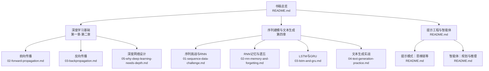
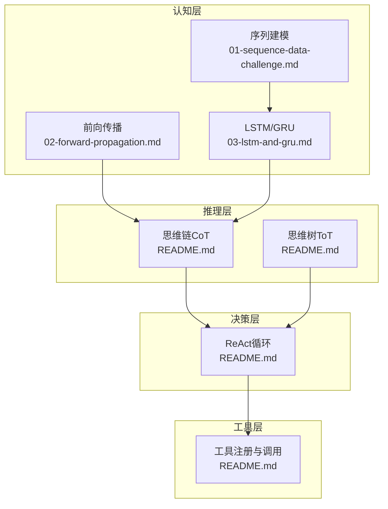
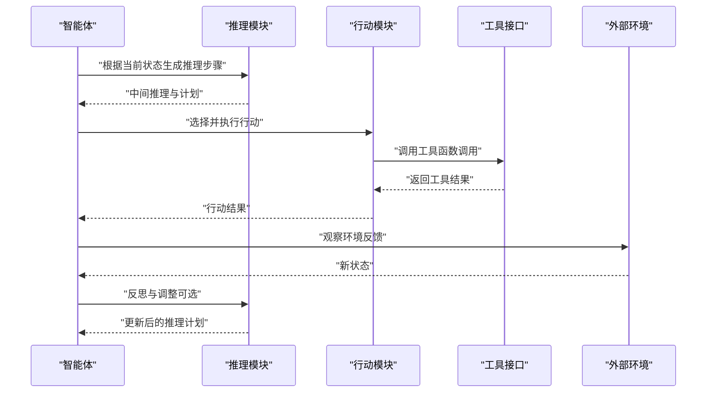
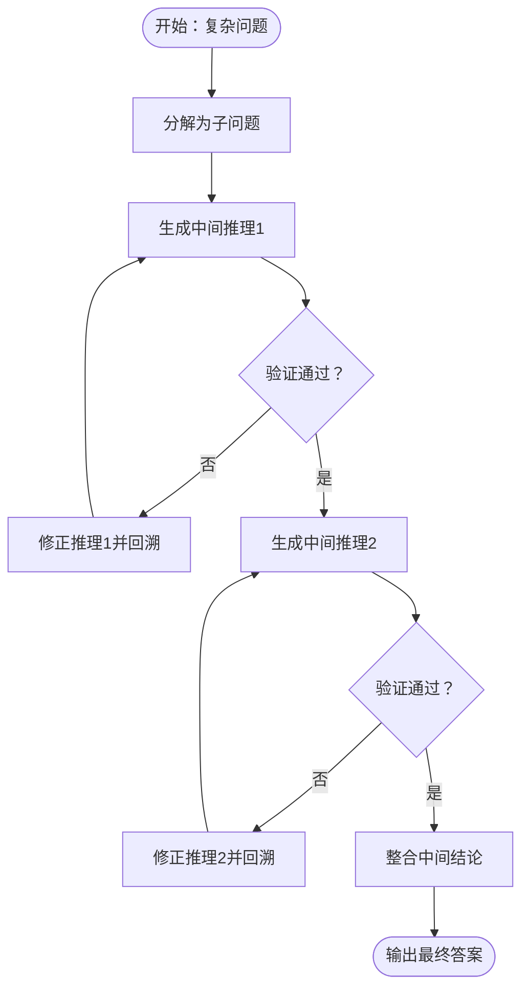
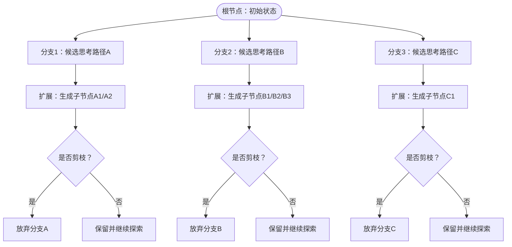
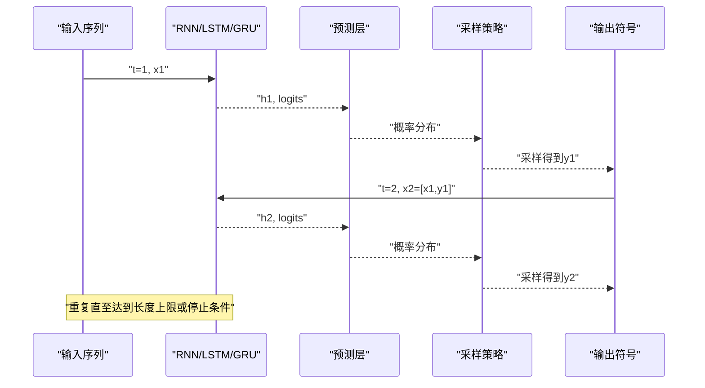
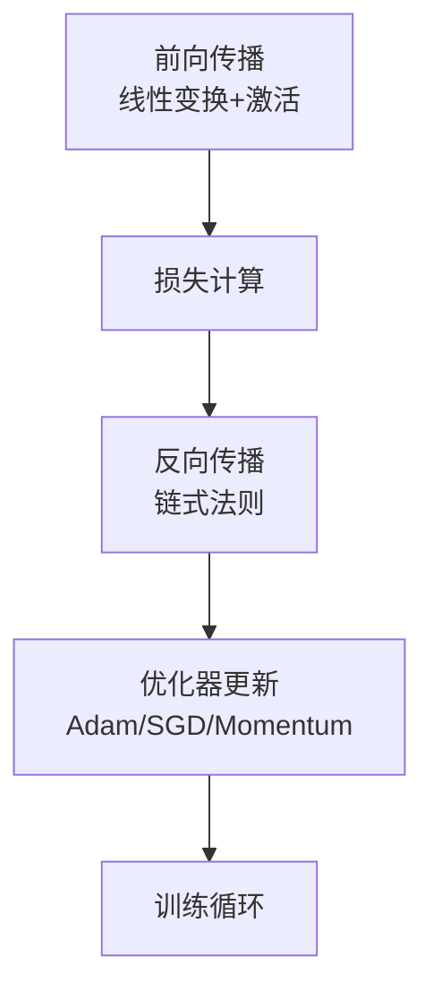
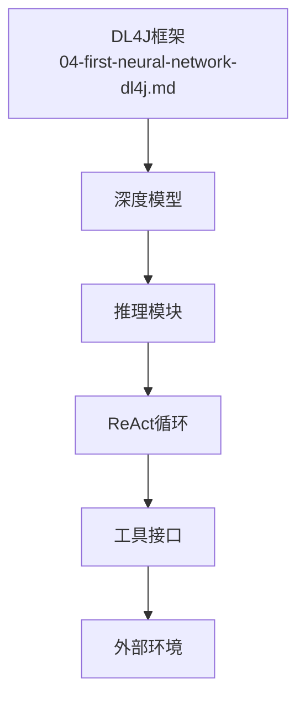

# 规划与推理

<cite>
**本文引用的文件**
- [README.md](file://book/README.md)
- [01-why-java-ai.md](file://book/part1-deep-learning/chapter-01/01-why-java-ai.md)
- [02-forward-propagation.md](file://book/part1-deep-learning/chapter-02/02-forward-propagation.md)
- [03-backpropagation.md](file://book/part1-deep-learning/chapter-02/03-backpropagation.md)
- [04-first-neural-network-dl4j.md](file://book/part1-deep-learning/chapter-02/04-first-neural-network-dl4j.md)
- [05-why-deep-learning-needs-depth.md](file://book/part1-deep-learning/chapter-02/05-why-deep-learning-needs-depth.md)
- [01-sequence-data-challenge.md](file://book/part1-deep-learning/chapter-04/01-sequence-data-challenge.md)
- [02-rnn-memory-and-forgetting.md](file://book/part1-deep-learning/chapter-04/02-rnn-memory-and-forgetting.md)
- [03-lstm-and-gru.md](file://book/part1-deep-learning/chapter-04/03-lstm-and-gru.md)
- [04-text-generation-practice.md](file://book/part1-deep-learning/chapter-04/04-text-generation-practice.md)
</cite>

## 目录
1. [引言](#引言)
2. [项目结构](#项目结构)
3. [核心组件](#核心组件)
4. [架构总览](#架构总览)
5. [详细组件分析](#详细组件分析)
6. [依赖分析](#依赖分析)
7. [性能考量](#性能考量)
8. [故障排查指南](#故障排查指南)
9. [结论](#结论)
10. [附录](#附录)

## 引言
本篇围绕“规划与推理”主题，系统梳理智能体的高级认知能力，包括任务规划、逻辑推理与决策制定，并深入讲解ReAct框架的推理与行动交替机制、思维链（Chain of Thought, CoT）的分步推理与中间记录、以及思维树（Tree of Thoughts, ToT）的搜索空间扩展与剪枝策略。同时结合书稿中的深度学习与序列建模基础，给出可落地的工程化实现路径与实践建议。

## 项目结构
本仓库为Java程序员的AI学习指南，涵盖深度学习基础、大语言模型与智能体相关内容。与“规划与推理”直接相关的章节包括：
- 深度学习基础：前向传播、反向传播、深度网络设计与序列建模
- 序列建模：RNN、LSTM/GRU、文本生成与自回归推理
- 提示工程与智能体：提示模式（含思维链）、智能体核心组件与工具使用

图表来源
- [README.md](file://book/README.md)
- [02-forward-propagation.md](file://book/part1-deep-learning/chapter-02/02-forward-propagation.md)
- [03-backpropagation.md](file://book/part1-deep-learning/chapter-02/03-backpropagation.md)
- [05-why-deep-learning-needs-depth.md](file://book/part1-deep-learning/chapter-02/05-why-deep-learning-needs-depth.md)
- [01-sequence-data-challenge.md](file://book/part1-deep-learning/chapter-04/01-sequence-data-challenge.md)
- [02-rnn-memory-and-forgetting.md](file://book/part1-deep-learning/chapter-04/02-rnn-memory-and-forgetting.md)
- [03-lstm-and-gru.md](file://book/part1-deep-learning/chapter-04/03-lstm-and-gru.md)
- [04-text-generation-practice.md](file://book/part1-deep-learning/chapter-04/04-text-generation-practice.md)

章节来源
- [README.md](file://book/README.md)
- [02-forward-propagation.md](file://book/part1-deep-learning/chapter-02/02-forward-propagation.md)
- [03-backpropagation.md](file://book/part1-deep-learning/chapter-02/03-backpropagation.md)
- [05-why-deep-learning-needs-depth.md](file://book/part1-deep-learning/chapter-02/05-why-deep-learning-needs-depth.md)
- [01-sequence-data-challenge.md](file://book/part1-deep-learning/chapter-04/01-sequence-data-challenge.md)
- [02-rnn-memory-and-forgetting.md](file://book/part1-deep-learning/chapter-04/02-rnn-memory-and-forgetting.md)
- [03-lstm-and-gru.md](file://book/part1-deep-learning/chapter-04/03-lstm-and-gru.md)
- [04-text-generation-practice.md](file://book/part1-deep-learning/chapter-04/04-text-generation-practice.md)

## 核心组件
- 深度学习基础
  - 前向传播：数据在神经网络中的流动与激活
  - 反向传播：基于链式法则的梯度计算与参数更新
  - 深度网络设计：残差连接、批归一化、正则化等
- 序列建模与推理
  - RNN隐状态机制与长期依赖问题
  - LSTM/GRU门控机制与信息直通通道
  - 文本生成的自回归推理与采样策略
- 提示工程与智能体
  - 思维链（CoT）：分步推理与中间记录
  - ReAct框架：推理与行动的交替循环
  - 思维树（ToT）：搜索空间扩展与剪枝策略

章节来源
- [02-forward-propagation.md](file://book/part1-deep-learning/chapter-02/02-forward-propagation.md)
- [03-backpropagation.md](file://book/part1-deep-learning/chapter-02/03-backpropagation.md)
- [05-why-deep-learning-needs-depth.md](file://book/part1-deep-learning/chapter-02/05-why-deep-learning-needs-depth.md)
- [01-sequence-data-challenge.md](file://book/part1-deep-learning/chapter-04/01-sequence-data-challenge.md)
- [02-rnn-memory-and-forgetting.md](file://book/part1-deep-learning/chapter-04/02-rnn-memory-and-forgetting.md)
- [03-lstm-and-gru.md](file://book/part1-deep-learning/chapter-04/03-lstm-and-gru.md)
- [04-text-generation-practice.md](file://book/part1-deep-learning/chapter-04/04-text-generation-practice.md)
- [README.md](file://book/README.md)

## 架构总览
从工程实现角度看，“规划与推理”的系统可抽象为如下模块化架构：
- 认知层：基于深度学习的感知与表示（前向传播、序列建模）
- 推理层：思维链与思维树的推理引擎（分步推理、搜索与剪枝）
- 决策层：ReAct循环（推理-行动-观察-反思）
- 工具层：函数调用与外部世界交互（工具注册与调用）

图表来源
- [02-forward-propagation.md](file://book/part1-deep-learning/chapter-02/02-forward-propagation.md)
- [01-sequence-data-challenge.md](file://book/part1-deep-learning/chapter-04/01-sequence-data-challenge.md)
- [03-lstm-and-gru.md](file://book/part1-deep-learning/chapter-04/03-lstm-and-gru.md)
- [README.md](file://book/README.md)

## 详细组件分析

### ReAct框架：推理与行动的循环
ReAct通过“推理-行动-观察-反思”的交替循环，使智能体能够在与环境交互的同时进行逻辑推理与计划调整。其核心在于：
- 推理阶段：基于上下文与工具可用性生成中间推理步骤
- 行动阶段：调用工具（如函数调用）执行具体任务
- 观察阶段：获取工具返回结果并更新内部状态
- 反思阶段：评估行动效果，决定是否继续推理或终止

图表来源
- [README.md](file://book/README.md)

章节来源
- [README.md](file://book/README.md)

### 思维链（Chain of Thought, CoT）
思维链通过将复杂问题分解为一系列中间推理步骤，记录中间状态，从而提升复杂任务的解决能力。其要点包括：
- 问题分解：将复杂问题拆分为若干子问题
- 中间推理：对每个子问题生成可验证的中间结论
- 记录与回溯：中间推理过程可被记录与复用
- 逐步验证：通过工具或外部验证机制校验中间结论

图表来源
- [README.md](file://book/README.md)

章节来源
- [README.md](file://book/README.md)

### 思维树（Tree of Thoughts, ToT）
思维树将搜索空间扩展为树状结构，通过多分支探索与剪枝策略提高解的质量与效率。关键要素：
- 搜索空间扩展：在每个节点生成多个候选思考路径
- 剪枝策略：基于启发式或评估函数过滤低质量分支
- 评估与回溯：对路径进行评估，回溯到更优分支继续探索

图表来源
- [README.md](file://book/README.md)

章节来源
- [README.md](file://book/README.md)

### 序列建模与自回归推理
序列建模为推理提供了“历史-当前-未来”的时序理解框架，RNN/LSTM/GRU通过隐状态承载历史信息，实现长期依赖建模；文本生成展示了自回归推理的典型流程：输入序列→预测下一个符号→采样→更新输入→继续生成。

图表来源
- [01-sequence-data-challenge.md](file://book/part1-deep-learning/chapter-04/01-sequence-data-challenge.md)
- [02-rnn-memory-and-forgetting.md](file://book/part1-deep-learning/chapter-04/02-rnn-memory-and-forgetting.md)
- [03-lstm-and-gru.md](file://book/part1-deep-learning/chapter-04/03-lstm-and-gru.md)
- [04-text-generation-practice.md](file://book/part1-deep-learning/chapter-04/04-text-generation-practice.md)

章节来源
- [01-sequence-data-challenge.md](file://book/part1-deep-learning/chapter-04/01-sequence-data-challenge.md)
- [02-rnn-memory-and-forgetting.md](file://book/part1-deep-learning/chapter-04/02-rnn-memory-and-forgetting.md)
- [03-lstm-and-gru.md](file://book/part1-deep-learning/chapter-04/03-lstm-and-gru.md)
- [04-text-generation-practice.md](file://book/part1-deep-learning/chapter-04/04-text-generation-practice.md)

### 深度学习基础与工程化支撑
- 前向传播：线性变换+激活，支持批处理与向量化
- 反向传播：链式法则计算梯度，配合优化器（如Adam）更新参数
- 深度网络设计：残差连接缓解梯度消失，批归一化稳定训练，Dropout防止过拟合

图表来源
- [02-forward-propagation.md](file://book/part1-deep-learning/chapter-02/02-forward-propagation.md)
- [03-backpropagation.md](file://book/part1-deep-learning/chapter-02/03-backpropagation.md)
- [05-why-deep-learning-needs-depth.md](file://book/part1-deep-learning/chapter-02/05-why-deep-learning-needs-depth.md)

章节来源
- [02-forward-propagation.md](file://book/part1-deep-learning/chapter-02/02-forward-propagation.md)
- [03-backpropagation.md](file://book/part1-deep-learning/chapter-02/03-backpropagation.md)
- [05-why-deep-learning-needs-depth.md](file://book/part1-deep-learning/chapter-02/05-why-deep-learning-needs-depth.md)

## 依赖分析
- 模块耦合
  - 推理层（CoT/ToT）依赖认知层（前向传播、序列建模）提供的表示与预测能力
  - 决策层（ReAct）依赖工具层（函数调用）与外部环境交互
- 外部依赖
  - Java生态：Deeplearning4j（DL4J）用于深度学习建模与训练
  - 提示工程：LangChain4j用于LLM集成与提示模板管理
- 潜在风险
  - 训练不稳定：需注意梯度消失/爆炸、过拟合等问题
  - 推理不可靠：需引入验证与回溯机制（CoT/ToT）

图表来源
- [04-first-neural-network-dl4j.md](file://book/part1-deep-learning/chapter-02/04-first-neural-network-dl4j.md)
- [README.md](file://book/README.md)

章节来源
- [04-first-neural-network-dl4j.md](file://book/part1-deep-learning/chapter-02/04-first-neural-network-dl4j.md)
- [README.md](file://book/README.md)

## 性能考量
- 训练效率
  - 向量化与批处理：显著提升前向/反向传播效率
  - 优化器选择：Adam在大多数场景下具有更快的收敛速度与更好的稳定性
- 推理效率
  - 序列建模：自回归生成需逐步采样，可通过并行解码、Top-K/Nucleus采样等策略优化
  - 搜索剪枝：ToT中采用启发式评估与剪枝策略，减少无效分支探索
- 稳定性
  - 深度网络：残差连接、批归一化、合适的初始化与正则化有助于缓解梯度问题与过拟合

## 故障排查指南
- 训练不收敛或震荡
  - 检查学习率与优化器配置
  - 确认梯度裁剪与归一化策略
- 梯度消失/爆炸
  - 使用残差连接、合适的激活函数（如ReLU/Tanh）
  - 采用梯度裁剪与权重初始化策略
- 推理质量差
  - 引入思维链中间记录与验证
  - 在ToT中实施有效的剪枝与评估策略
- 工具调用失败
  - 校验工具注册与权限
  - 增加重试与降级策略

章节来源
- [03-backpropagation.md](file://book/part1-deep-learning/chapter-02/03-backpropagation.md)
- [05-why-deep-learning-needs-depth.md](file://book/part1-deep-learning/chapter-02/05-why-deep-learning-needs-depth.md)
- [02-rnn-memory-and-forgetting.md](file://book/part1-deep-learning/chapter-04/02-rnn-memory-and-forgetting.md)
- [03-lstm-and-gru.md](file://book/part1-deep-learning/chapter-04/03-lstm-and-gru.md)
- [README.md](file://book/README.md)

## 结论
“规划与推理”是智能体从被动响应走向主动决策的关键能力。通过ReAct的推理-行动循环、思维链的分步推理与中间记录、以及思维树的搜索与剪枝，结合深度学习的认知基础与序列建模的时序理解，可以构建具备复杂问题解决能力的智能体系统。工程实践中应重视训练稳定性、推理可解释性与工具可靠性，以实现可落地的智能体应用。

## 附录
- 实践建议
  - 从简单CoT入手，逐步引入ToT与ReAct
  - 在推理链中加入可验证的中间步骤与回溯机制
  - 使用DL4J与LangChain4j构建端到端的推理-行动系统
- 进一步阅读
  - 深度学习基础与序列建模章节
  - 提示工程与智能体相关章节