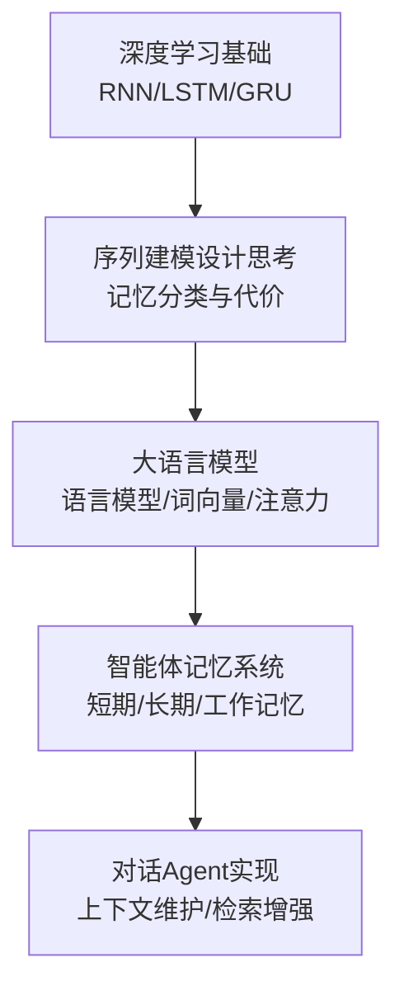
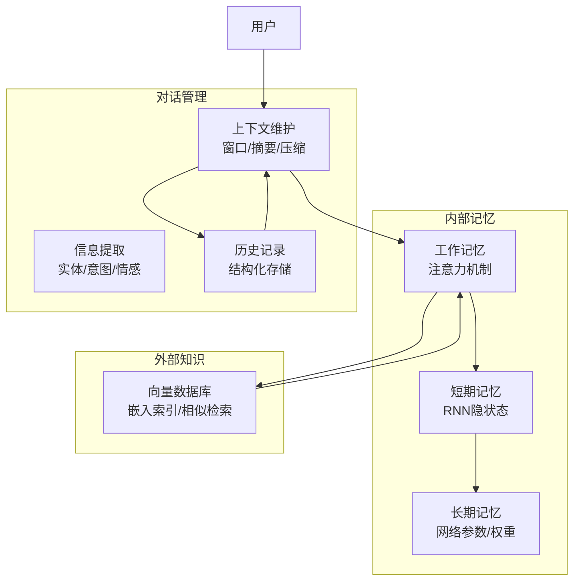
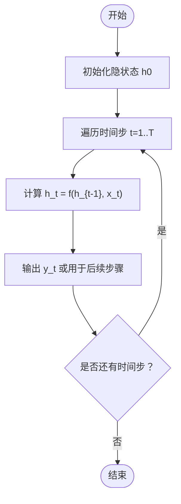
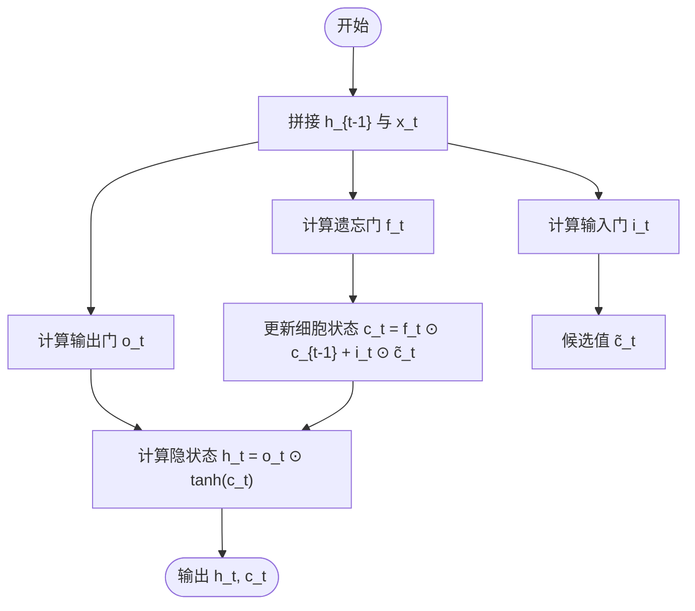
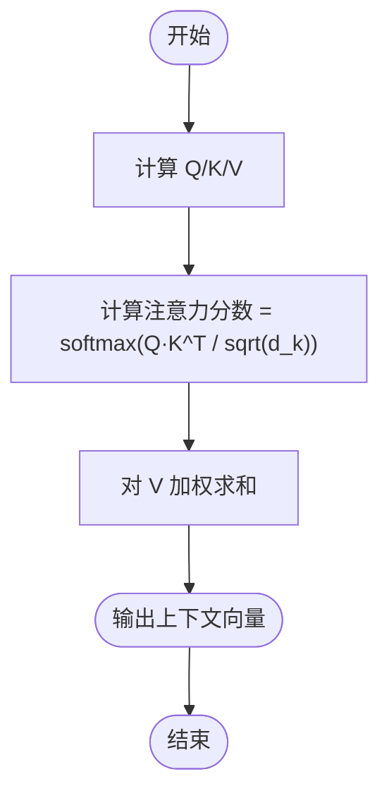
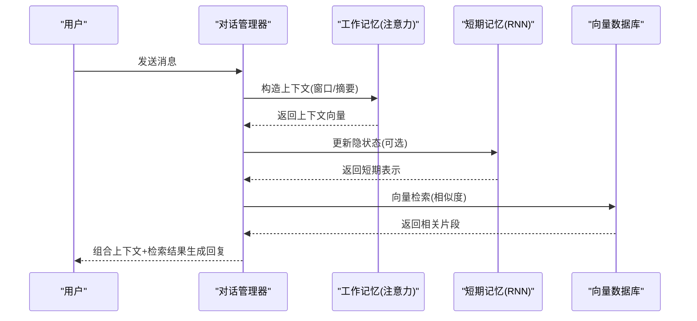
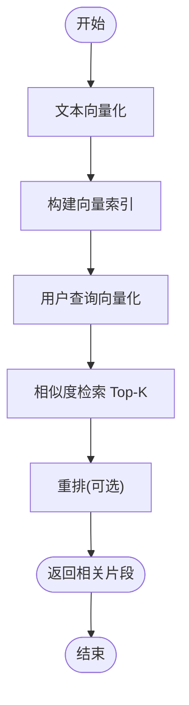
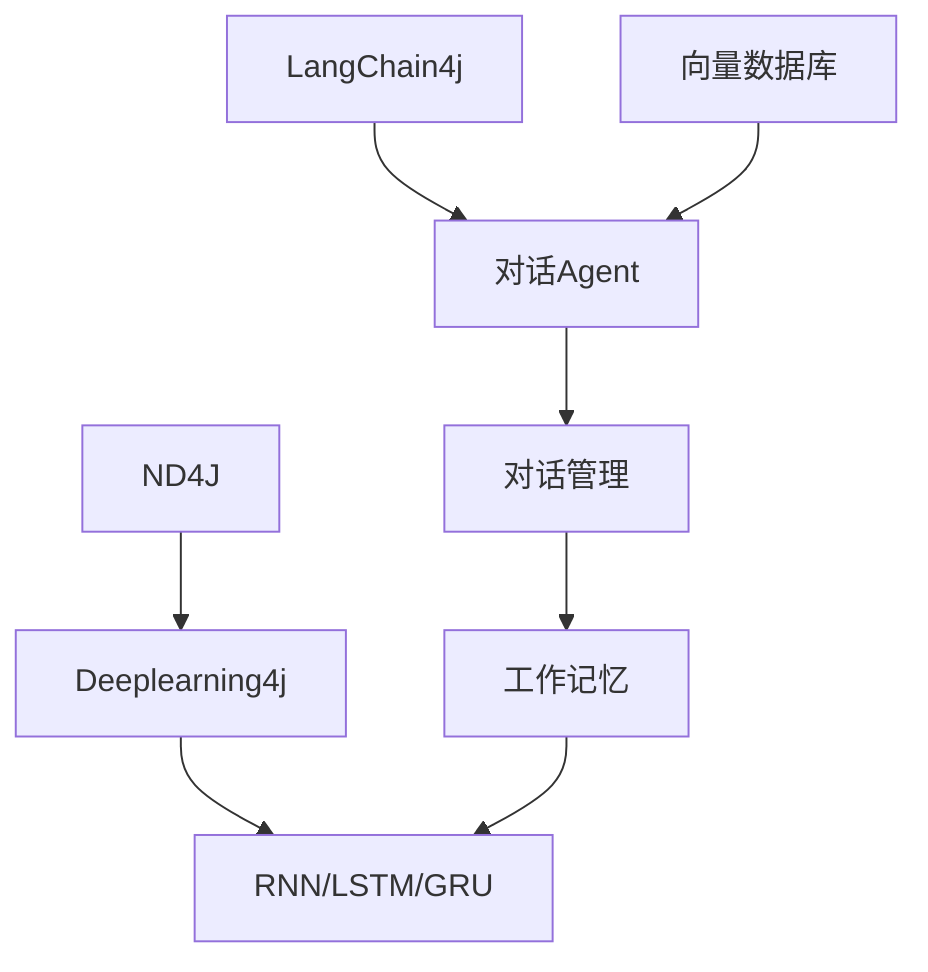

# 记忆系统

<cite>
**本文引用的文件**
- [book/README.md](file://book/README.md)
- [01-why-java-ai.md](file://book/part1-deep-learning/chapter-01/01-why-java-ai.md)
- [02-what-is-deep-learning.md](file://book/part1-deep-learning/chapter-01/02-what-is-deep-learning.md)
- [03-first-ai-environment.md](file://book/part1-deep-learning/chapter-01/03-first-ai-environment.md)
- [01-sequence-data-challenge.md](file://book/part1-deep-learning/chapter-04/01-sequence-data-challenge.md)
- [02-rnn-memory-and-forgetting.md](file://book/part1-deep-learning/chapter-04/02-rnn-memory-and-forgetting.md)
- [03-lstm-and-gru.md](file://book/part1-deep-learning/chapter-04/03-lstm-and-gru.md)
- [04-text-generation-practice.md](file://book/part1-deep-learning/chapter-04/04-text-generation-practice.md)
- [05-design-thinking-sequential-modeling.md](file://book/part1-deep-learning/chapter-04/05-design-thinking-sequential-modeling.md)
- [01-what-is-language-model.md](file://book/part2-llm/chapter-06/01-what-is-language-model.md)
- [02-ngram-to-word2vec.md](file://book/part2-llm/chapter-06/02-ngram-to-word2vec.md)
- [01-self-attention.md](file://book/part2-llm/chapter-07/01-self-attention.md)
</cite>

## 目录
1. [简介](#简介)
2. [项目结构](#项目结构)
3. [核心组件](#核心组件)
4. [架构总览](#架构总览)
5. [详细组件分析](#详细组件分析)
6. [依赖分析](#依赖分析)
7. [性能考量](#性能考量)
8. [故障排查指南](#故障排查指南)
9. [结论](#结论)
10. [附录](#附录)

## 简介
本章节围绕智能体的记忆系统展开，系统性阐述短期记忆、长期记忆与工作记忆的组织方式；详解对话记忆管理（上下文维护、信息提取、历史记录处理）；深入分析向量数据库在记忆系统中的应用（向量嵌入、相似度检索、知识索引）；并给出记忆的编码、存储与检索机制（含多模态融合）的实现方案，覆盖内存管理策略、持久化机制与性能优化技巧，并结合实际应用场景展示效果与改进方法。

## 项目结构
该仓库以“图书”形式组织内容，涵盖深度学习基础、大语言模型与智能体相关主题。与记忆系统密切相关的知识分布在以下章节：
- 深度学习基础：RNN、LSTM/GRU、序列数据挑战与设计思考，奠定短期/工作记忆与长期依赖的理论基础
- 大语言模型：语言模型定义、词向量（Word2Vec）、注意力机制，支撑工作记忆与外部知识检索
- 智能体：记忆分类与代价权衡，为构建“有记忆的对话Agent”提供设计指导

**章节来源**
- [book/README.md: 目录与技术栈:30-176](file://book/README.md#L30-L176)
- [01-sequence-data-challenge.md: 序列挑战与参数共享:333-350](file://book/part1-deep-learning/chapter-04/01-sequence-data-challenge.md#L333-L350)
- [05-design-thinking-sequential-modeling.md: 记忆分类与代价:101-132](file://book/part1-deep-learning/chapter-04/05-design-thinking-sequential-modeling.md#L101-L132)

## 核心组件
- 短期记忆（工作记忆）
  - RNN隐状态承载当前处理的序列历史，容量有限、访问速度快、计算代价低
  - LSTM/GRU通过门控机制实现选择性记忆与遗忘，缓解长期依赖问题
- 长期记忆（知识库）
  - 网络参数构成“内嵌知识”
  - 外部向量数据库作为“知识仓库”，支持大规模知识索引与相似度检索
- 工作记忆（任务相关上下文）
  - 注意力机制动态聚焦当前任务相关信息，容量更大、速度中等、计算代价较高
- 对话记忆管理
  - 上下文维护：截断窗口、滚动窗口、摘要压缩
  - 信息提取：关键实体/意图/情感抽取
  - 历史记录：结构化存储（时间戳、角色、内容、向量索引）

**章节来源**
- [02-rnn-memory-and-forgetting.md: 隐状态与记忆更新:24-32](file://book/part1-deep-learning/chapter-04/02-rnn-memory-and-forgetting.md#L24-L32)
- [03-lstm-and-gru.md: LSTM门控与GRU简化:40-133](file://book/part1-deep-learning/chapter-04/03-lstm-and-gru.md#L40-L133)
- [05-design-thinking-sequential-modeling.md: 记忆分类与代价:101-132](file://book/part1-deep-learning/chapter-04/05-design-thinking-sequential-modeling.md#L101-L132)
- [01-what-is-language-model.md: 语言模型定义:11-24](file://book/part2-llm/chapter-06/01-what-is-language-model.md#L11-L24)
- [02-ngram-to-word2vec.md: 词向量与相似度:204-328](file://book/part2-llm/chapter-06/02-ngram-to-word2vec.md#L204-L328)

## 架构总览
记忆系统整体架构由“内部记忆（短期/长期）+ 外部知识（向量数据库）+ 对话管理（上下文/检索）”构成，形成“内化知识 + 外部检索”的混合记忆范式。

**图表来源**
- [02-rnn-memory-and-forgetting.md: 隐状态与信息流动:34-44](file://book/part1-deep-learning/chapter-04/02-rnn-memory-and-forgetting.md#L34-L44)
- [03-lstm-and-gru.md: LSTM门控与GRU简化:40-133](file://book/part1-deep-learning/chapter-04/03-lstm-and-gru.md#L40-L133)
- [05-design-thinking-sequential-modeling.md: 记忆分类与代价:101-132](file://book/part1-deep-learning/chapter-04/05-design-thinking-sequential-modeling.md#L101-L132)
- [01-what-is-language-model.md: 语言模型定义:11-24](file://book/part2-llm/chapter-06/01-what-is-language-model.md#L11-L24)
- [02-ngram-to-word2vec.md: 词向量与相似度:204-328](file://book/part2-llm/chapter-06/02-ngram-to-word2vec.md#L204-L328)

## 详细组件分析

### 组件A：短期记忆（RNN隐状态）
- 实现要点
  - 单步更新：h_t = f(h_{t-1}, x_t)，通过tanh等激活函数压缩历史信息
  - 长期依赖问题：梯度在反向传播中指数衰减，导致早期信息丢失
  - 变体：双向RNN（前后向信息融合）、深层RNN（多层时序抽象）
- 记忆更新流程

**图表来源**
- [02-rnn-memory-and-forgetting.md: RNN单元与记忆更新:46-79](file://book/part1-deep-learning/chapter-04/02-rnn-memory-and-forgetting.md#L46-L79)

**章节来源**
- [02-rnn-memory-and-forgetting.md: RNN核心机制与长期依赖:22-188](file://book/part1-deep-learning/chapter-04/02-rnn-memory-and-forgetting.md#L22-L188)

### 组件B：长期记忆（LSTM/GRU）
- 实现要点
  - LSTM：三个门控（遗忘门、输入门、输出门）+ 细胞状态直通通道，解决长期依赖
  - GRU：简化为两个门（重置门、更新门），在速度与表达能力间折中
- 门控哲学
  - 选择性：不是所有信息同等重要，门控让网络学会“关注重要信息，忽略无关信息”

**图表来源**
- [03-lstm-and-gru.md: LSTM门控与细胞状态:81-133](file://book/part1-deep-learning/chapter-04/03-lstm-and-gru.md#L81-L133)

**章节来源**
- [03-lstm-and-gru.md: LSTM/GRU结构与计算:40-314](file://book/part1-deep-learning/chapter-04/03-lstm-and-gru.md#L40-L314)

### 组件C：工作记忆（注意力机制）
- 实现要点
  - Query/Key/Value：Query匹配Key得到注意力分数，按分数对Value加权求和
  - 缩放因子：缩放点积以稳定softmax分布，避免梯度消失
  - 语义聚类：相似词在向量空间中聚集，支持类比推理与近义检索
- 注意力流程

**图表来源**
- [01-self-attention.md: Query/Key/Value与缩放因子:133-200](file://book/part2-llm/chapter-07/01-self-attention.md#L133-L200)

**章节来源**
- [01-self-attention.md: 注意力机制与缩放因子:133-200](file://book/part2-llm/chapter-07/01-self-attention.md#L133-L200)
- [02-ngram-to-word2vec.md: 词向量与相似度:204-328](file://book/part2-llm/chapter-06/02-ngram-to-word2vec.md#L204-L328)

### 组件D：对话记忆管理（上下文维护/信息提取/历史记录）
- 上下文维护
  - 固定窗口：仅保留最近N轮对话
  - 滚动窗口：滑动窗口，逐步淘汰最旧内容
  - 摘要压缩：对长历史生成摘要，降低显存占用
- 信息提取
  - 实体抽取：识别命名实体（人名、地点、时间等）
  - 意图识别：判断用户目标（查询、下单、咨询等）
  - 情感分析：识别情绪倾向，辅助回复策略
- 历史记录
  - 结构化存储：时间戳、角色（用户/系统）、内容、向量索引、元数据
  - 版本控制：支持回滚与对比分析

**图表来源**
- [05-design-thinking-sequential-modeling.md: 记忆分类与代价:101-132](file://book/part1-deep-learning/chapter-04/05-design-thinking-sequential-modeling.md#L101-L132)
- [04-text-generation-practice.md: 文本生成与采样策略:283-369](file://book/part1-deep-learning/chapter-04/04-text-generation-practice.md#L283-L369)

**章节来源**
- [04-text-generation-practice.md: 文本生成与采样策略:283-468](file://book/part1-deep-learning/chapter-04/04-text-generation-practice.md#L283-L468)

### 组件E：向量数据库与检索增强
- 向量嵌入
  - 词向量（Word2Vec）：将离散符号映射到连续向量空间，支持相似度计算与类比推理
  - 文本嵌入：对句子/段落进行向量化，便于跨文档检索
- 相似度检索
  - 余弦相似度：衡量向量夹角，常用于语义检索
  - Top-K/Nucleus采样：在候选集中按相似度采样，提升多样性与稳定性
- 知识索引
  - 分片索引：按主题/来源切分知识，提高检索效率
  - 多模态融合：文本、图像、音频等多模态向量统一索引，支持跨模态检索

**图表来源**
- [02-ngram-to-word2vec.md: 词向量与相似度:204-328](file://book/part2-llm/chapter-06/02-ngram-to-word2vec.md#L204-L328)

**章节来源**
- [02-ngram-to-word2vec.md: 词向量与相似度:204-384](file://book/part2-llm/chapter-06/02-ngram-to-word2vec.md#L204-L384)

### 组件F：多模态信息融合
- 融合策略
  - 早期融合：在输入层将多模态特征拼接或加权
  - 中期融合：在特征层进行跨模态注意力或门控融合
  - 晚期融合：在决策层对多模态输出进行加权投票
- 应用场景
  - 图文检索：文本查询与图像特征联合检索
  - 音视频理解：语音转文本 + 文本情感分析
  - 交互式问答：结合用户语音、表情与文本上下文

[本节为概念性内容，不直接分析具体文件]

## 依赖分析
- 内部依赖
  - RNN/LSTM/GRU依赖ND4J矩阵运算库进行高效数值计算
  - 注意力模块依赖缩放因子与softmax稳定化
- 外部依赖
  - 向量数据库（如Milvus/Pinecone/Chroma）提供大规模相似度检索
  - LLM框架（LangChain4j）提供提示工程与工具调用能力
- 耦合与内聚
  - 对话管理器与工作记忆耦合度高，需清晰的接口定义
  - 向量数据库与检索模块相对独立，便于替换与扩展

**图表来源**
- [03-first-ai-environment.md: 深度学习框架与依赖:112-167](file://book/part1-deep-learning/chapter-01/03-first-ai-environment.md#L112-L167)
- [book/README.md: 技术栈与向量数据库:170-176](file://book/README.md#L170-L176)

**章节来源**
- [03-first-ai-environment.md: 深度学习框架与依赖:112-187](file://book/part1-deep-learning/chapter-01/03-first-ai-environment.md#L112-L187)
- [book/README.md: 技术栈与向量数据库:170-176](file://book/README.md#L170-L176)

## 性能考量
- 记忆容量与速度的权衡
  - 隐状态容量小、速度最快、代价低，适合短时任务
  - 注意力容量大、速度中等、代价高，适合长上下文与检索增强
  - 外部存储容量无限、速度慢、代价中等，适合大规模知识库
- 优化策略
  - 内存管理：批处理、梯度检查点、混合精度
  - 检索优化：倒排索引、IVF/HNSW、向量压缩
  - 计算优化：并行化、缓存热点、增量更新
- 部署建议
  - 小规模：CPU+内存，适合开发与小流量
  - 中等规模：GPU+向量数据库，支持实时检索
  - 大规模：分布式向量数据库+CDN缓存，支持高并发

[本节为通用性能指导，不直接分析具体文件]

## 故障排查指南
- 记忆失效
  - 症状：回复缺乏上下文连贯性
  - 排查：确认上下文窗口设置、摘要压缩策略、历史记录完整性
- 检索不准
  - 症状：检索结果与查询语义不符
  - 排查：检查嵌入质量、相似度阈值、Top-K设置、重排策略
- 性能瓶颈
  - 症状：延迟升高、吞吐下降
  - 排查：监控向量索引命中率、内存占用、GPU利用率、网络带宽
- 训练不稳定
  - 症状：损失震荡、梯度爆炸/消失
  - 排查：学习率、归一化、正则化、梯度裁剪

**章节来源**
- [02-rnn-memory-and-forgetting.md: 长期依赖与梯度消失:145-188](file://book/part1-deep-learning/chapter-04/02-rnn-memory-and-forgetting.md#L145-L188)
- [03-lstm-and-gru.md: LSTM梯度流动与门控:283-308](file://book/part1-deep-learning/chapter-04/03-lstm-and-gru.md#L283-L308)

## 结论
记忆系统通过“内部记忆（短期/长期）+ 外部知识（向量数据库）+ 对话管理（上下文/检索）”的协同，实现智能体对复杂任务的长期理解与稳定交互。短期记忆负责即时处理，长期记忆沉淀知识，工作记忆聚焦任务相关上下文，向量数据库提供可扩展的知识检索能力。结合内存管理、持久化与性能优化，可在不同规模与场景下实现高效、稳定的记忆系统。

[本节为总结性内容，不直接分析具体文件]

## 附录
- 实践建议
  - 从简单RNN起步，逐步引入LSTM/GRU，再接入注意力与向量检索
  - 对话管理采用“窗口+摘要”混合策略，兼顾时效性与完整性
  - 向量检索结合相似度阈值与重排，提升召回质量
- 参考实现路径
  - 文本生成与采样策略：参考字符级RNN与温度/Top-K/Nucleus采样
  - 词向量与相似度：参考Word2Vec实现与余弦相似度计算

**章节来源**
- [04-text-generation-practice.md: 文本生成与采样策略:283-468](file://book/part1-deep-learning/chapter-04/04-text-generation-practice.md#L283-L468)
- [02-ngram-to-word2vec.md: 词向量与相似度:204-384](file://book/part2-llm/chapter-06/02-ngram-to-word2vec.md#L204-L384)