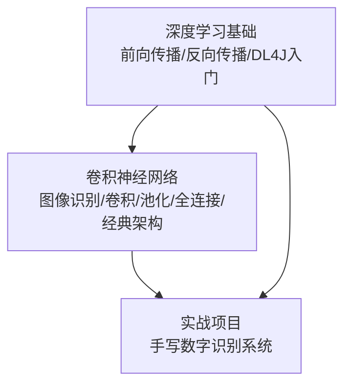
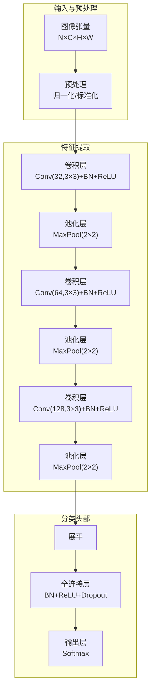
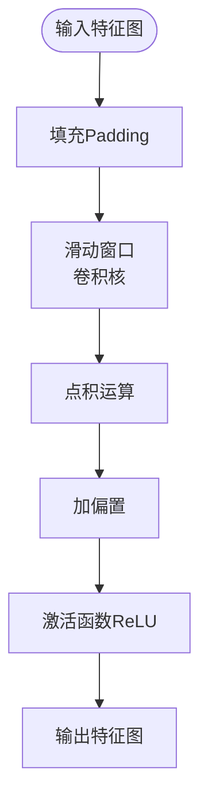
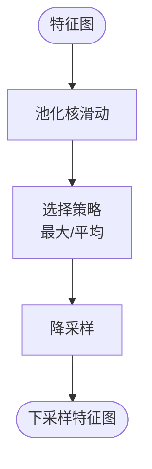
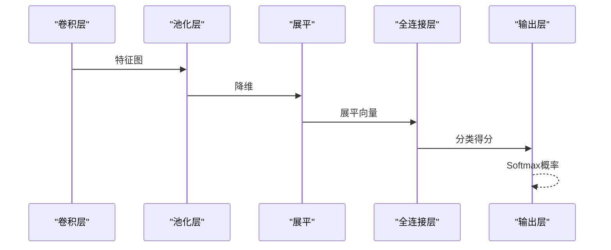
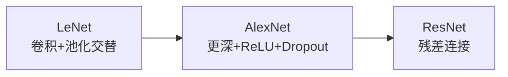
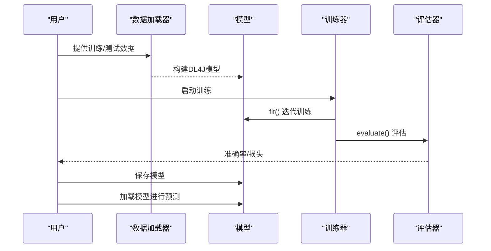
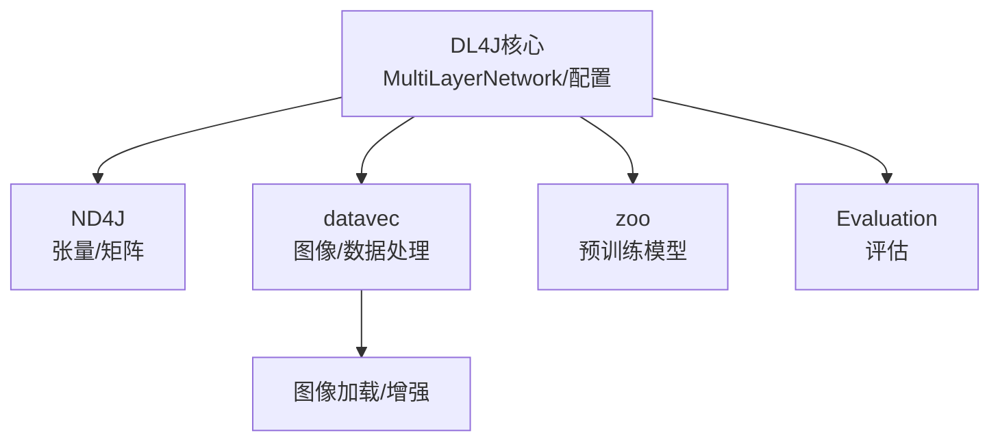

# 卷积神经网络

<cite>
**本文引用的文件**
- [README.md](file://book/README.md)
- [01-图像识别问题.md](file://book/part1-deep-learning/chapter-03/01-image-recognition-problem.md)
- [02-卷积操作的本质.md](file://book/part1-deep-learning/chapter-03/02-convolution-operation.md)
- [03-池化与全连接.md](file://book/part1-deep-learning/chapter-03/03-pooling-and-fully-connected.md)
- [04-经典CNN架构.md](file://book/part1-deep-learning/chapter-03/04-classic-cnn-architectures.md)
- [05-构建图像分类器.md](file://book/part1-deep-learning/chapter-03/05-build-image-classifier.md)
- [06-局部感知与参数共享.md](file://book/part1-deep-learning/chapter-03/06-local-perception-weight-sharing.md)
- [01-前向传播.md](file://book/part1-deep-learning/chapter-02/02-forward-propagation.md)
- [03-反向传播.md](file://book/part1-deep-learning/chapter-02/03-backpropagation.md)
- [04-首个神经网络-DL4J.md](file://book/part1-deep-learning/chapter-02/04-first-neural-network-dl4j.md)
- [05-深度为何必要.md](file://book/part1-deep-learning/chapter-02/05-why-deep-learning-needs-depth.md)
- [01-项目概述.md](file://book/part1-deep-learning/chapter-05/01-project-overview.md)
- [02-数据准备.md](file://book/part1-deep-learning/chapter-05/02-data-preparation.md)
- [03-模型设计与训练.md](file://book/part1-deep-learning/chapter-05/03-model-design-training.md)
- [04-模型评估与优化.md](file://book/part1-deep-learning/chapter-05/04-model-evaluation-optimization.md)
</cite>

## 目录
1. [引言](#引言)
2. [项目结构](#项目结构)
3. [核心组件](#核心组件)
4. [架构总览](#架构总览)
5. [详细组件分析](#详细组件分析)
6. [依赖分析](#依赖分析)
7. [性能考虑](#性能考虑)
8. [故障排查指南](#故障排查指南)
9. [结论](#结论)
10. [附录](#附录)

## 引言
本教学文档围绕卷积神经网络（CNN）展开，面向Java程序员，系统讲解CNN的设计理念、核心组件（卷积层、池化层、全连接层）的工作原理与数学运算过程，并结合Deeplearning4j（DL4J）框架，提供从理论到代码的完整实践路径。文档同时回顾前向传播与反向传播的数学基础，剖析经典CNN架构（LeNet、AlexNet、ResNet），并通过端到端的图像分类器实现案例，帮助读者掌握计算机视觉领域的核心技术。

## 项目结构
本项目以“深度学习基础—卷积神经网络—实战项目”为主线组织内容，形成从理论到工程实践的完整闭环。章节分布如下：
- 第一部分：深度学习基础（前向传播、反向传播、DL4J入门）
- 第三部分：卷积神经网络（图像识别问题、卷积/池化/全连接、经典架构、端到端分类器）
- 第五部分：实战项目（手写数字识别系统）

**章节来源**
- [README.md:1-187](file://book/README.md#L1-L187)

## 核心组件
本节聚焦CNN三大核心组件及其在DL4J中的实现要点：
- 卷积层（ConvolutionLayer）：通过滑动窗口提取局部特征，实现局部感知与参数共享
- 池化层（SubsamplingLayer）：降低特征空间维度，增强平移不变性
- 全连接层（DenseLayer/OutputLayer）：将卷积特征映射到类别空间，输出分类结果

此外，DL4J提供了丰富的辅助层与工具：
- 批归一化（BatchNormalization）：稳定训练、加速收敛
- Dropout：正则化，缓解过拟合
- 激活函数（ReLU/Tanh/Sigmoid/Softmax）：引入非线性，控制输出范围
- 损失函数（负对数似然、交叉熵）：衡量预测与真实标签的差异

**章节来源**
- [01-前向传播.md:179-230](file://book/part1-deep-learning/chapter-02/02-forward-propagation.md#L179-L230)
- [03-反向传播.md:205-291](file://book/part1-deep-learning/chapter-02/03-backpropagation.md#L205-L291)
- [04-首个神经网络-DL4J.md:202-230](file://book/part1-deep-learning/chapter-02/04-first-neural-network-dl4j.md#L202-L230)

## 架构总览
CNN的整体流程包括：输入图像张量（NCHW/NHWC）→ 卷积+激活 → 池化 → 重复多层 → 展平 → 全连接 → 输出层 → 分类结果。训练阶段通过反向传播更新参数，评估阶段使用准确率、精确率、召回率、F1等指标。

**图示来源**
- [05-构建图像分类器.md:226-321](file://book/part1-deep-learning/chapter-03/05-build-image-classifier.md#L226-L321)
- [03-模型设计与训练.md:64-142](file://book/part1-deep-learning/chapter-05/03-model-design-training.md#L64-L142)

## 详细组件分析

### 卷积层：局部感知与参数共享
- 局部感知：每个卷积核仅关注输入的一小块区域，捕获边缘、纹理等局部特征
- 参数共享：同一卷积核在整个输入上共享参数，大幅减少参数量并提升平移不变性
- 数学运算：卷积核在输入上滑动，计算点积得到特征图；通过填充（padding）控制输出尺寸

**图示来源**
- [02-卷积操作的本质.md:1-200](file://book/part1-deep-learning/chapter-03/02-convolution-operation.md#L1-L200)

**章节来源**
- [02-卷积操作的本质.md:1-200](file://book/part1-deep-learning/chapter-03/02-convolution-operation.md#L1-L200)
- [06-局部感知与参数共享.md:1-200](file://book/part1-deep-learning/chapter-03/06-local-perception-weight-sharing.md#L1-L200)

### 池化层：降维与不变性
- 最大池化：保留局部区域内最大响应，强调显著特征
- 平均池化：平滑响应，降低噪声敏感性
- 步幅与核大小：控制降维程度与感受野

**图示来源**
- [03-池化与全连接.md:1-200](file://book/part1-deep-learning/chapter-03/03-pooling-and-fully-connected.md#L1-L200)

**章节来源**
- [03-池化与全连接.md:1-200](file://book/part1-deep-learning/chapter-03/03-pooling-and-fully-connected.md#L1-L200)

### 全连接层：分类决策
- 将卷积层输出展平后送入全连接层，学习复杂非线性映射
- 输出层使用Softmax进行多分类概率输出
- 常配合Dropout与批归一化提升泛化能力

**图示来源**
- [05-构建图像分类器.md:296-321](file://book/part1-deep-learning/chapter-03/05-build-image-classifier.md#L296-L321)
- [03-模型设计与训练.md:115-142](file://book/part1-deep-learning/chapter-05/03-model-design-training.md#L115-L142)

**章节来源**
- [05-构建图像分类器.md:296-321](file://book/part1-deep-learning/chapter-03/05-build-image-classifier.md#L296-L321)
- [03-模型设计与训练.md:115-142](file://book/part1-deep-learning/chapter-05/03-model-design-training.md#L115-L142)

### 经典CNN架构：设计理念与适用场景
- LeNet：开创性工作，手写数字识别，强调卷积+池化交替与参数较少
- AlexNet：深度学习爆发起点，引入ReLU、Dropout、LRN与GPU并行训练
- ResNet：残差连接突破深度限制，解决梯度消失，适合更深网络

**图示来源**
- [04-经典CNN架构.md:17-114](file://book/part1-deep-learning/chapter-03/04-classic-cnn-architectures.md#L17-L114)
- [04-经典CNN架构.md:115-251](file://book/part1-deep-learning/chapter-03/04-classic-cnn-architectures.md#L115-L251)
- [04-经典CNN架构.md:253-338](file://book/part1-deep-learning/chapter-03/04-classic-cnn-architectures.md#L253-L338)

**章节来源**
- [04-经典CNN架构.md:17-114](file://book/part1-deep-learning/chapter-03/04-classic-cnn-architectures.md#L17-L114)
- [04-经典CNN架构.md:115-251](file://book/part1-deep-learning/chapter-03/04-classic-cnn-architectures.md#L115-L251)
- [04-经典CNN架构.md:253-338](file://book/part1-deep-learning/chapter-03/04-classic-cnn-architectures.md#L253-L338)

### 端到端图像分类器实现（基于DL4J）
- 数据准备：加载与预处理（归一化、标准化）、数据增强（翻转、旋转、缩放）
- 模型构建：卷积块（卷积+BN+ReLU+池化）+ 全连接块（BN+ReLU+Dropout）+ 输出层
- 训练与评估：早停、学习率调度、模型保存与加载
- 预测接口：加载模型、图像预处理、输出概率与类别

**图示来源**
- [05-构建图像分类器.md:324-396](file://book/part1-deep-learning/chapter-03/05-build-image-classifier.md#L324-L396)
- [05-构建图像分类器.md:399-464](file://book/part1-deep-learning/chapter-03/05-build-image-classifier.md#L399-L464)

**章节来源**
- [05-构建图像分类器.md:47-90](file://book/part1-deep-learning/chapter-03/05-build-image-classifier.md#L47-L90)
- [05-构建图像分类器.md:92-157](file://book/part1-deep-learning/chapter-03/05-build-image-classifier.md#L92-L157)
- [05-构建图像分类器.md:159-189](file://book/part1-deep-learning/chapter-03/05-build-image-classifier.md#L159-L189)
- [05-构建图像分类器.md:191-322](file://book/part1-deep-learning/chapter-03/05-build-image-classifier.md#L191-L322)
- [05-构建图像分类器.md:324-396](file://book/part1-deep-learning/chapter-03/05-build-image-classifier.md#L324-L396)
- [05-构建图像分类器.md:399-464](file://book/part1-deep-learning/chapter-03/05-build-image-classifier.md#L399-L464)

## 依赖分析
- DL4J核心：MultiLayerNetwork、NeuralNetConfiguration、DataSetIterator、Evaluation
- ND4J：张量运算、矩阵/向量操作
- datavec：图像加载、数据增强、数据迭代器
- zoo：预训练模型（如ResNet50/VGG16）

**图示来源**
- [04-构建图像分类器.md:47-90](file://book/part1-deep-learning/chapter-03/05-build-image-classifier.md#L47-L90)
- [04-经典CNN架构.md:379-421](file://book/part1-deep-learning/chapter-03/04-classic-cnn-architectures.md#L379-L421)

**章节来源**
- [04-构建图像分类器.md:47-90](file://book/part1-deep-learning/chapter-03/05-build-image-classifier.md#L47-L90)
- [04-经典CNN架构.md:379-421](file://book/part1-deep-learning/chapter-03/04-classic-cnn-architectures.md#L379-L421)

## 性能考虑
- 训练效率：批归一化、合适的初始化（Xavier/He）、优化器（Adam）
- 泛化能力：Dropout、L2正则化、数据增强、早停
- 推理优化：模型量化、知识蒸馏、减少网络深度/宽度
- 硬件利用：根据显存选择批次大小，合理设置学习率与梯度累积

**章节来源**
- [05-模型评估与优化.md:280-348](file://book/part1-deep-learning/chapter-05/04-model-evaluation-optimization.md#L280-L348)
- [05-模型评估与优化.md:350-389](file://book/part1-deep-learning/chapter-05/04-model-evaluation-optimization.md#L350-L389)

## 故障排查指南
- 梯度消失/爆炸：使用ReLU、批归一化、残差连接、梯度裁剪
- 过拟合：增加Dropout、L2正则化、数据增强、早停
- 训练不稳定：降低学习率、使用Adam、预热训练
- 推理速度慢：量化、模型蒸馏、ONNX/TensorRT导出（如需）

**章节来源**
- [05-模型评估与优化.md:143-221](file://book/part1-deep-learning/chapter-05/04-model-evaluation-optimization.md#L143-L221)
- [05-模型评估与优化.md:280-348](file://book/part1-deep-learning/chapter-05/04-model-evaluation-optimization.md#L280-L348)

## 结论
通过本教程，读者应能理解CNN的核心思想（局部感知、参数共享、层次化特征提取），掌握卷积/池化/全连接层的数学与实现要点，并能在DL4J中构建、训练与评估端到端的图像分类器。结合经典架构与工程实践，可进一步提升模型性能与部署效率。

## 附录
- 图像预处理：归一化、标准化、数据增强
- 评估指标：准确率、精确率、召回率、F1、混淆矩阵
- 项目实践：手写数字识别系统（MNIST），包含数据准备、模型设计、训练与评估、模型保存与加载

**章节来源**
- [01-图像识别问题.md:165-228](file://book/part1-deep-learning/chapter-03/01-image-recognition-problem.md#L165-L228)
- [01-图像识别问题.md:258-339](file://book/part1-deep-learning/chapter-03/01-image-recognition-problem.md#L258-L339)
- [02-数据准备.md:95-143](file://book/part1-deep-learning/chapter-05/02-data-preparation.md#L95-L143)
- [02-数据准备.md:205-270](file://book/part1-deep-learning/chapter-05/02-data-preparation.md#L205-L270)
- [04-模型评估与优化.md:5-47](file://book/part1-deep-learning/chapter-05/04-model-evaluation-optimization.md#L5-L47)
- [04-模型评估与优化.md:88-141](file://book/part1-deep-learning/chapter-05/04-model-evaluation-optimization.md#L88-L141)