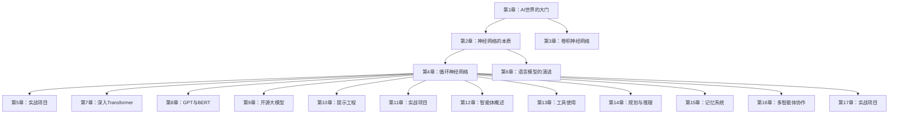
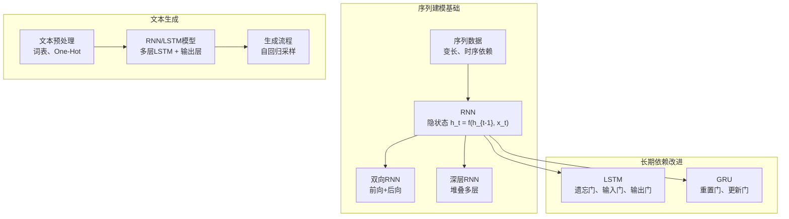
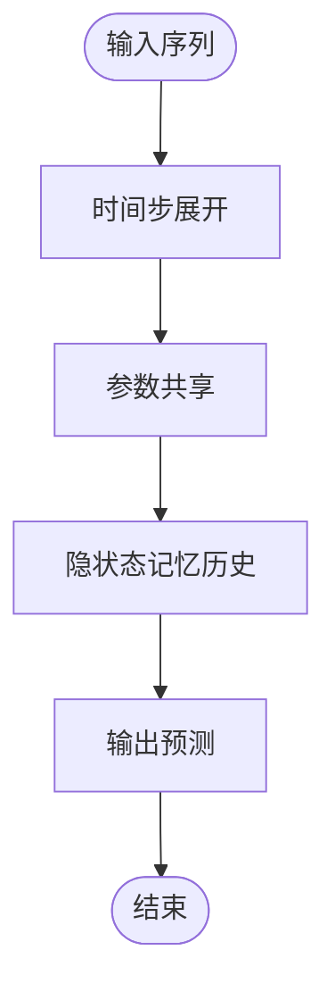
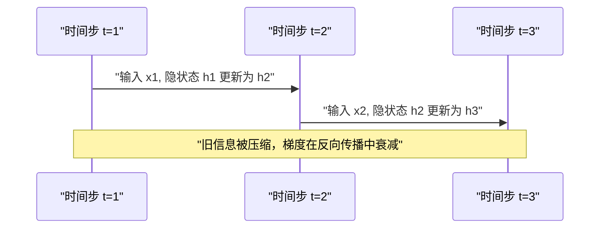
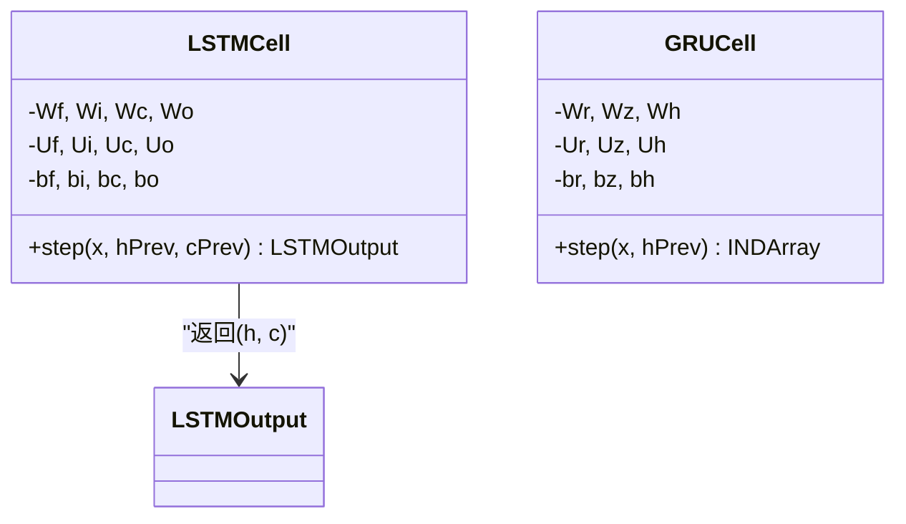
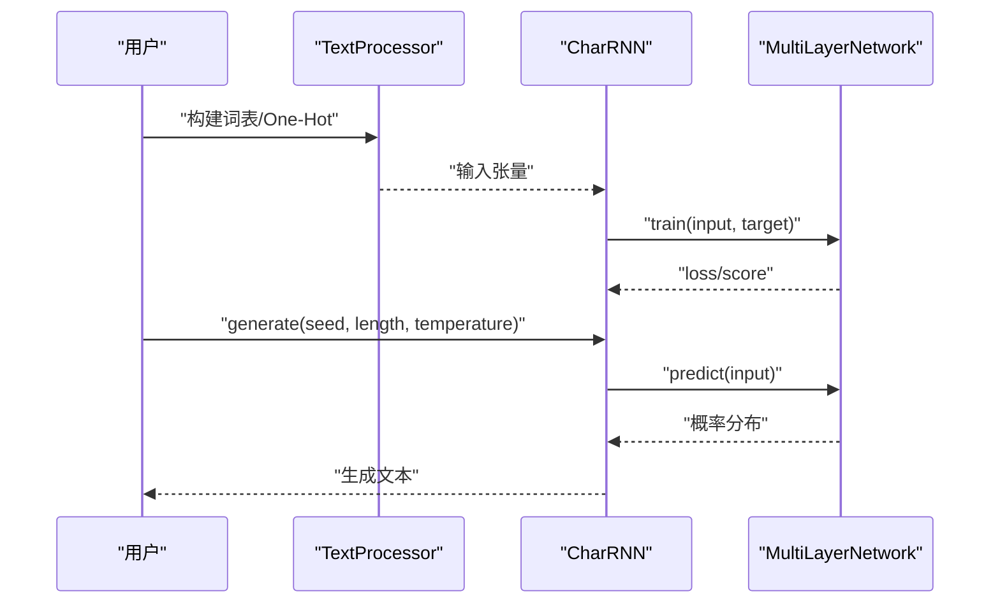
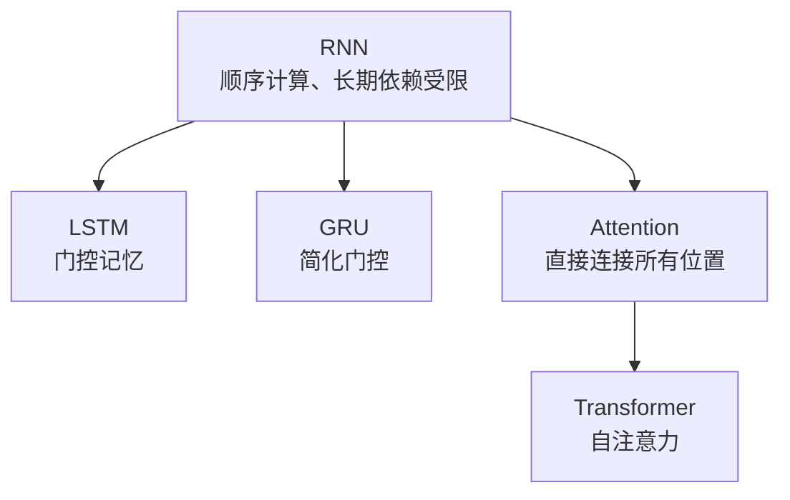
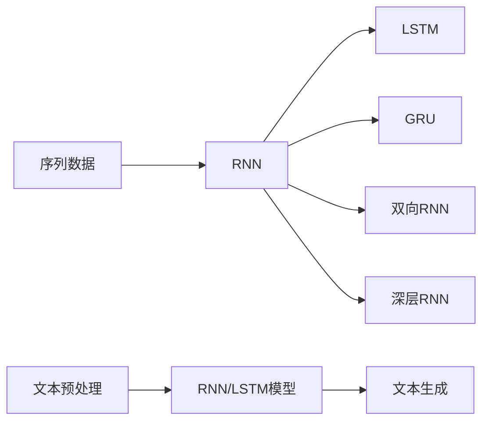

# 循环神经网络

<cite>
**本文引用的文件**
- [README.md](file://book/README.md)
- [01-why-java-ai.md](file://book/part1-deep-learning/chapter-01/01-why-java-ai.md)
- [02-what-is-deep-learning.md](file://book/part1-deep-learning/chapter-01/02-what-is-deep-learning.md)
- [02-forward-propagation.md](file://book/part1-deep-learning/chapter-02/02-forward-propagation.md)
- [03-backpropagation.md](file://book/part1-deep-learning/chapter-02/03-backpropagation.md)
- [01-sequence-data-challenge.md](file://book/part1-deep-learning/chapter-04/01-sequence-data-challenge.md)
- [02-rnn-memory-and-forgetting.md](file://book/part1-deep-learning/chapter-04/02-rnn-memory-and-forgetting.md)
- [03-lstm-and-gru.md](file://book/part1-deep-learning/chapter-04/03-lstm-and-gru.md)
- [04-text-generation-practice.md](file://book/part1-deep-learning/chapter-04/04-text-generation-practice.md)
- [05-design-thinking-sequential-modeling.md](file://book/part1-deep-learning/chapter-04/05-design-thinking-sequential-modeling.md)
</cite>

## 目录
1. [引言](#引言)
2. [项目结构](#项目结构)
3. [核心组件](#核心组件)
4. [架构总览](#架构总览)
5. [详细组件分析](#详细组件分析)
6. [依赖分析](#依赖分析)
7. [性能考虑](#性能考虑)
8. [故障排查指南](#故障排查指南)
9. [结论](#结论)
10. [附录](#附录)

## 引言
本章围绕循环神经网络（RNN）展开，系统讲解序列数据建模的挑战、RNN的基本原理、时间步展开、梯度消失与梯度爆炸问题，以及RNN的记忆机制与遗忘问题。随后对比LSTM与GRU的改进方案及其数学原理，并通过文本生成的实际案例，展示如何用Deeplearning4j实现RNN/LSTM模型进行序列预测。文档提供从概念理解到代码实现的完整学习路径，帮助Java程序员掌握处理时序数据的核心技术。

## 项目结构
本节基于仓库中“深度学习基础”部分的章节组织，重点聚焦第四章“循环神经网络”的内容，同时结合第一章与第二章关于深度学习基础、前向传播与反向传播的知识，形成完整的知识体系。

**图表来源**
- [README.md:30-68](file://book/README.md#L30-L68)

**章节来源**
- [README.md:30-68](file://book/README.md#L30-L68)

## 核心组件
本章的核心内容围绕以下主题展开：
- 序列数据的挑战与RNN的基本结构
- 隐状态与记忆更新机制
- 长期依赖问题与梯度消失/爆炸
- LSTM与GRU的门控机制
- 文本生成的完整实现（Deeplearning4j）

**章节来源**
- [01-sequence-data-challenge.md:1-350](file://book/part1-deep-learning/chapter-04/01-sequence-data-challenge.md#L1-L350)
- [02-rnn-memory-and-forgetting.md:1-375](file://book/part1-deep-learning/chapter-04/02-rnn-memory-and-forgetting.md#L1-L375)
- [03-lstm-and-gru.md:1-365](file://book/part1-deep-learning/chapter-04/03-lstm-and-gru.md#L1-L365)
- [04-text-generation-practice.md:1-533](file://book/part1-deep-learning/chapter-04/04-text-generation-practice.md#L1-L533)

## 架构总览
本节给出RNN、LSTM、GRU在序列建模中的整体架构关系，以及与文本生成任务的结合方式。

**图表来源**
- [01-sequence-data-challenge.md:117-138](file://book/part1-deep-learning/chapter-04/01-sequence-data-challenge.md#L117-L138)
- [02-rnn-memory-and-forgetting.md:190-256](file://book/part1-deep-learning/chapter-04/02-rnn-memory-and-forgetting.md#L190-L256)
- [03-lstm-and-gru.md:40-133](file://book/part1-deep-learning/chapter-04/03-lstm-and-gru.md#L40-L133)
- [04-text-generation-practice.md:146-281](file://book/part1-deep-learning/chapter-04/04-text-generation-practice.md#L146-L281)

## 详细组件分析

### 序列数据建模的挑战与RNN基础
- 序列数据的特点：顺序性、变长性、时序依赖、长期依赖
- 传统全连接网络与CNN在处理序列时的局限
- RNN的核心思想：用隐状态记忆历史信息，参数共享，时间步展开
- RNN数学表达：h_t = f(h_{t-1}, x_t)，y_t = W_hy × h_t + b_y

**图表来源**
- [01-sequence-data-challenge.md:117-138](file://book/part1-deep-learning/chapter-04/01-sequence-data-challenge.md#L117-L138)

**章节来源**
- [01-sequence-data-challenge.md:1-350](file://book/part1-deep-learning/chapter-04/01-sequence-data-challenge.md#L1-L350)

### RNN的记忆机制与遗忘问题
- 隐状态的更新过程：h_t = tanh(Wxh·x_t + Whh·h_{t-1} + bh)
- 信息衰减与梯度消失：随着时间步增加，早期信息被压缩，梯度在反向传播中指数衰减
- 双向RNN：利用未来信息，合并前向与后向隐状态
- 深层RNN：堆叠多层RNN，逐层提取更高抽象

**图表来源**
- [02-rnn-memory-and-forgetting.md:147-179](file://book/part1-deep-learning/chapter-04/02-rnn-memory-and-forgetting.md#L147-L179)

**章节来源**
- [02-rnn-memory-and-forgetting.md:1-375](file://book/part1-deep-learning/chapter-04/02-rnn-memory-and-forgetting.md#L1-L375)

### LSTM与GRU：长期依赖的解决方案
- LSTM：通过遗忘门、输入门、候选值、输出门，引入“细胞状态”作为信息的直通通道，缓解梯度消失
- GRU：简化为重置门与更新门，减少参数量，仍能有效建模长期依赖
- 门控机制的数学表达与计算流程

**图表来源**
- [03-lstm-and-gru.md:83-133](file://book/part1-deep-learning/chapter-04/03-lstm-and-gru.md#L83-L133)
- [03-lstm-and-gru.md:177-214](file://book/part1-deep-learning/chapter-04/03-lstm-and-gru.md#L177-L214)

**章节来源**
- [03-lstm-and-gru.md:1-365](file://book/part1-deep-learning/chapter-04/03-lstm-and-gru.md#L1-L365)

### 文本生成实战：用Deeplearning4j实现RNN/LSTM
- 文本预处理：构建字符级词表、One-Hot编码、索引序列
- 字符级RNN模型：多层LSTM + RnnOutputLayer，支持每个时间步输出
- 训练流程：准备输入/目标张量，调用fit进行训练
- 生成流程：自回归采样，支持温度、Top-K、Nucleus采样策略
- 主程序：加载数据、构建模型、训练与生成示例

**图表来源**
- [04-text-generation-practice.md:146-281](file://book/part1-deep-learning/chapter-04/04-text-generation-practice.md#L146-L281)
- [04-text-generation-practice.md:283-370](file://book/part1-deep-learning/chapter-04/04-text-generation-practice.md#L283-L370)

**章节来源**
- [04-text-generation-practice.md:1-533](file://book/part1-deep-learning/chapter-04/04-text-generation-practice.md#L1-L533)

### 设计思考：时序建模的本质与架构演进
- RNN作为状态空间模型：h_t = f(h_{t-1}, x_t)，y_t = g(h_t)
- 与其他模型对比：马尔可夫链、N-gram、Transformer
- 信息瓶颈：用固定大小的隐状态编码任意长度的历史
- 从RNN到Transformer的演进：注意力机制解决顺序计算与长期依赖问题
- 实践建议：选择合适的模型、处理长序列、正则化技巧

**图表来源**
- [05-design-thinking-sequential-modeling.md:60-97](file://book/part1-deep-learning/chapter-04/05-design-thinking-sequential-modeling.md#L60-L97)

**章节来源**
- [05-design-thinking-sequential-modeling.md:1-290](file://book/part1-deep-learning/chapter-04/05-design-thinking-sequential-modeling.md#L1-L290)

## 依赖分析
- 概念依赖：序列数据挑战 → RNN基础 → 记忆与遗忘 → LSTM/GRU → 文本生成实战 → 设计思考
- 技术依赖：ND4J张量库用于向量化计算；Deeplearning4j提供RNN/LSTM层与训练接口
- 工程依赖：文本预处理模块负责词表构建与One-Hot编码；采样工具提供多种生成策略

**图表来源**
- [01-sequence-data-challenge.md:117-138](file://book/part1-deep-learning/chapter-04/01-sequence-data-challenge.md#L117-L138)
- [03-lstm-and-gru.md:40-133](file://book/part1-deep-learning/chapter-04/03-lstm-and-gru.md#L40-L133)
- [04-text-generation-practice.md:146-281](file://book/part1-deep-learning/chapter-04/04-text-generation-practice.md#L146-L281)

**章节来源**
- [01-sequence-data-challenge.md:1-350](file://book/part1-deep-learning/chapter-04/01-sequence-data-challenge.md#L1-L350)
- [03-lstm-and-gru.md:1-365](file://book/part1-deep-learning/chapter-04/03-lstm-and-gru.md#L1-L365)
- [04-text-generation-practice.md:1-533](file://book/part1-deep-learning/chapter-04/04-text-generation-practice.md#L1-L533)

## 性能考虑
- 计算效率：向量化矩阵运算显著优于循环实现；批处理并行处理多个样本
- 梯度问题：RNN在长序列上容易出现梯度消失/爆炸；LSTM/GRU通过门控缓解
- 记忆容量：隐状态容量有限，需通过门控与注意力机制平衡信息容量与计算效率
- 实践建议：选择合适的模型（短序列优先RNN/GRU，长序列+全局依赖优先Transformer）、处理长序列（截断、滑动窗口、分层）、正则化（Dropout、Layer Normalization）

[本节为通用性能讨论，无需特定文件引用]

## 故障排查指南
- 训练不稳定或发散：检查学习率、梯度裁剪、初始化策略；尝试Adam优化器
- 生成质量差：调整温度采样、尝试Top-K/Nucleus采样；增加训练数据与迭代轮数
- 内存不足：减小批次大小、序列长度；使用GPU加速；启用混合精度
- 梯度消失/爆炸：使用LSTM/GRU、梯度裁剪、残差连接、更好的初始化

[本节为通用故障排查建议，无需特定文件引用]

## 结论
本章从序列数据建模的挑战出发，系统阐述了RNN的基本原理、记忆与遗忘机制、长期依赖问题及LSTM/GRU的改进方案，并通过文本生成的完整实现展示了如何用Deeplearning4j构建与训练RNN/LSTM模型。结合设计思考，读者可以理解RNN与Transformer的架构演进与各自适用场景，从而在实际工程中做出合理的技术选型。

[本节为总结性内容，无需特定文件引用]

## 附录
- 概念对照：RNN隐状态、LSTM门控、GRU门控、文本生成采样策略
- 实践清单：准备数据与词表、构建模型、训练与评估、生成与调试
- 进一步阅读：Transformer与注意力机制、预训练语言模型、智能体与多智能体协作

[本节为补充性内容，无需特定文件引用]