# 深度学习基础

<cite>
**本文档引用的文件**
- [03-first-ai-environment.md](file://part1-deep-learning/chapter-01/03-first-ai-environment.md)
- [02-forward-propagation.md](file://part1-deep-learning/chapter-02/02-forward-propagation.md)
- [03-backpropagation.md](file://part1-deep-learning/chapter-02/03-backpropagation.md)
- [01-image-recognition-problem.md](file://part1-deep-learning/chapter-03/01-image-recognition-problem.md)
- [04-classic-cnn-architectures.md](file://part1-deep-learning/chapter-03/04-classic-cnn-architectures.md)
- [01-sequence-data-challenge.md](file://part1-deep-learning/chapter-04/01-sequence-data-challenge.md)
- [02-rnn-memory-and-forgetting.md](file://part1-deep-learning/chapter-04/02-rnn-memory-and-forgetting.md)
- [03-lstm-and-gru.md](file://part1-deep-learning/chapter-04/03-lstm-and-gru.md)
- [04-text-generation-practice.md](file://part1-deep-learning/chapter-04/04-text-generation-practice.md)
- [02-data-preparation.md](file://part1-deep-learning/chapter-05/02-data-preparation.md)
- [03-model-design-training.md](file://part1-deep-learning/chapter-05/03-model-design-training.md)
- [04-model-evaluation-optimization.md](file://part1-deep-learning/chapter-05/04-model-evaluation-optimization.md)
</cite>

## 更新摘要
**变更内容**
- 更新了章节标题和内容以匹配实际的代码库结构
- 新增了完整的深度学习基础章节内容
- 完善了从理论到实践的完整学习路径
- 增强了Java编程语言的实用性内容

## 目录
1. [引言](#引言)
2. [项目结构](#项目结构)
3. [核心组件](#核心组件)
4. [架构概览](#架构概览)
5. [详细组件分析](#详细组件分析)
6. [依赖分析](#依赖分析)
7. [性能考虑](#性能考虑)
8. [故障排除指南](#故障排除指南)
9. [结论](#结论)
10. [附录](#附录)

## 引言
本课程面向Java程序员，系统性地讲解深度学习基础理论与实践。通过Deeplearning4j框架，我们将用Java代码实现神经网络的核心算法，包括前向传播、反向传播、卷积神经网络和循环神经网络及其变体（LSTM、GRU）。课程强调从理论到实践的完整学习路径，帮助Java开发者掌握AI核心技术并在企业级环境中落地。

## 项目结构
该项目采用分章节组织的学习体系，涵盖从AI入门到实战项目的完整路径：

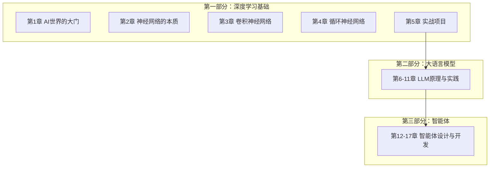

**图表来源**
- [03-first-ai-environment.md:15-25](file://part1-deep-learning/chapter-01/03-first-ai-environment.md#L15-L25)

## 核心组件
本课程围绕四大核心主题构建知识体系：

### 1. 神经网络基础
- 前向传播算法：数据在神经网络中的流动过程
- 反向传播算法：基于链式法则的梯度计算
- 激活函数：Sigmoid、Tanh、ReLU、Softmax等
- 优化器：SGD、Adam等参数更新策略

### 2. 卷积神经网络
- 卷积操作：特征提取的核心机制
- 池化技术：降维与不变性学习
- 经典架构：LeNet、AlexNet、ResNet
- 批处理与向量化计算

### 3. 循环神经网络
- 序列建模：时间维度的引入
- RNN核心机制：隐状态的记忆与遗忘
- LSTM与GRU：解决长期依赖问题
- 文本生成实践

### 4. 实战项目
- 手写数字识别系统
- 图像分类器构建
- 文本生成模型
- 模型评估与优化

**章节来源**
- [02-forward-propagation.md:25-537](file://part1-deep-learning/chapter-02/02-forward-propagation.md#L25-L537)
- [03-backpropagation.md:38-536](file://part1-deep-learning/chapter-02/03-backpropagation.md#L38-L536)
- [04-classic-cnn-architectures.md:17-448](file://part1-deep-learning/chapter-03/04-classic-cnn-architectures.md#L17-L448)
- [03-lstm-and-gru.md:40-364](file://part1-deep-learning/chapter-04/03-lstm-and-gru.md#L40-L364)

## 架构概览
课程采用渐进式学习架构，从概念理解到代码实现，再到项目实战：

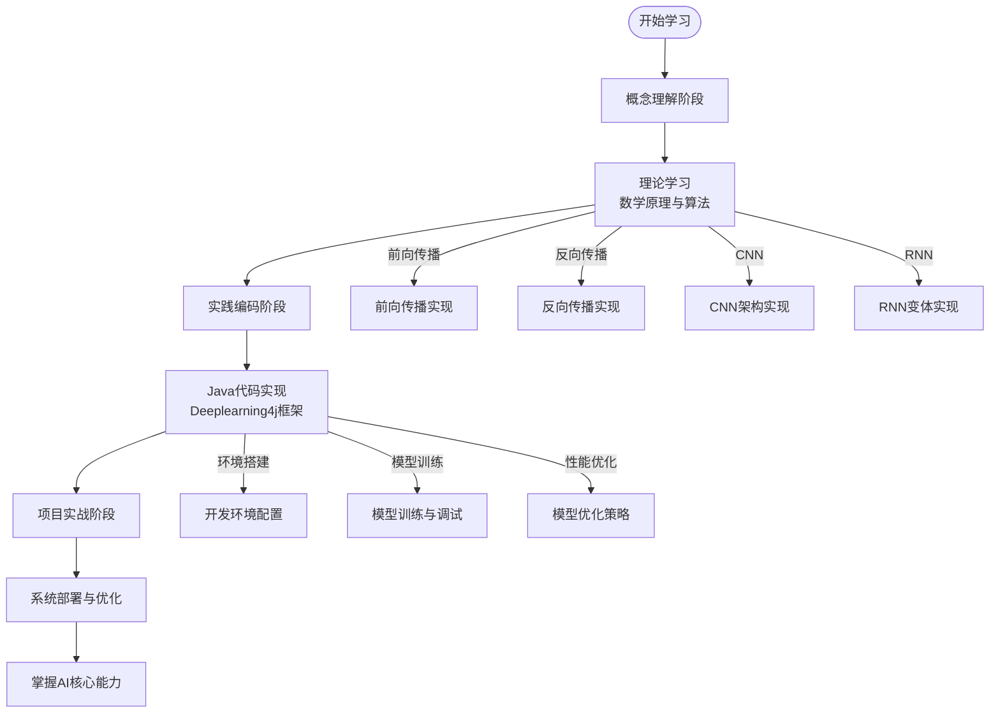

**图表来源**
- [03-first-ai-environment.md:265-367](file://part1-deep-learning/chapter-01/03-first-ai-environment.md#L265-L367)
- [02-forward-propagation.md:411-510](file://part1-deep-learning/chapter-02/02-forward-propagation.md#L411-L510)

## 详细组件分析

### 神经网络核心算法

#### 前向传播机制
前向传播是神经网络数据流动的核心过程，通过矩阵运算实现高效的批量计算：

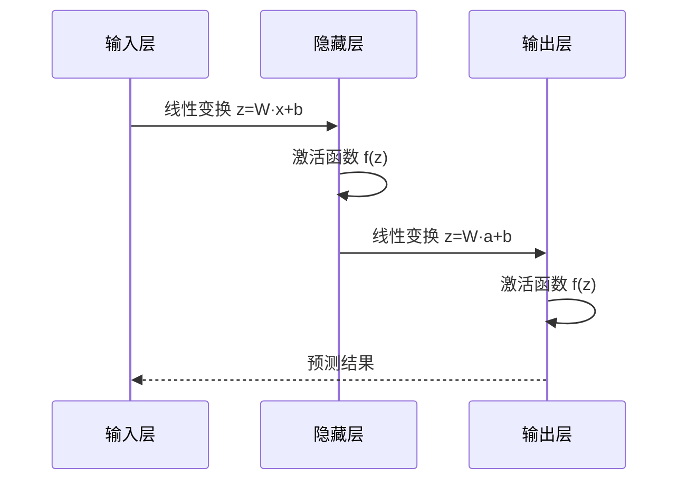

**图表来源**
- [02-forward-propagation.md:118-175](file://part1-deep-learning/chapter-02/02-forward-propagation.md#L118-L175)

前向传播的关键要素：
- **线性变换**：z = W·x + b
- **激活函数**：引入非线性特性
- **批处理**：并行处理多个样本
- **向量化**：ND4J矩阵运算优化

**章节来源**
- [02-forward-propagation.md:95-212](file://part1-deep-learning/chapter-02/02-forward-propagation.md#L95-L212)

#### 反向传播算法
反向传播通过链式法则计算梯度，实现神经网络的自动学习：

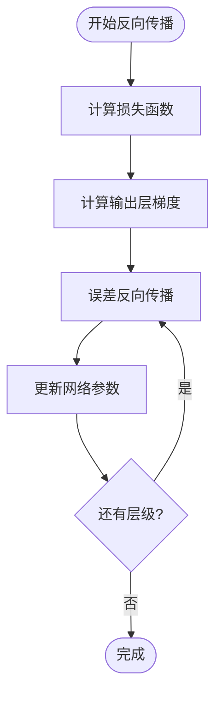

**图表来源**
- [03-backpropagation.md:75-183](file://part1-deep-learning/chapter-03/03-backpropagation.md#L75-L183)

反向传播的核心公式：
- 输出层误差：δᴸ = ∂L/∂aᴸ ⊙ f'(zᴸ)
- 隐藏层误差：δᴸ⁻¹ = (Wᴸᵀ · δᴸ) ⊙ f'(zᴸ⁻¹)
- 参数梯度：∂L/∂Wᴸ = δᴸ · (aᴸ⁻¹)ᵀ

**章节来源**
- [03-backpropagation.md:88-183](file://part1-deep-learning/chapter-03/03-backpropagation.md#L88-L183)

### 卷积神经网络架构

#### 卷积操作与特征提取
CNN通过卷积层实现局部特征提取，池化层实现降维和不变性学习：

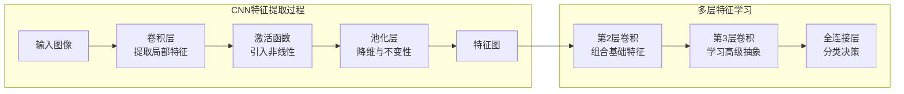

**图表来源**
- [01-image-recognition-problem.md:139-164](file://part1-deep-learning/chapter-03/01-image-recognition-problem.md#L139-L164)

经典CNN架构演进：
- **LeNet-5**：开创性手写数字识别
- **AlexNet**：深度学习爆发的起点
- **ResNet**：残差连接突破深度限制

**章节来源**
- [04-classic-cnn-architectures.md:17-448](file://part1-deep-learning/chapter-03/04-classic-cnn-architectures.md#L17-L448)

#### 图像分类器实现
完整的图像分类系统包含数据处理、模型训练和预测服务：

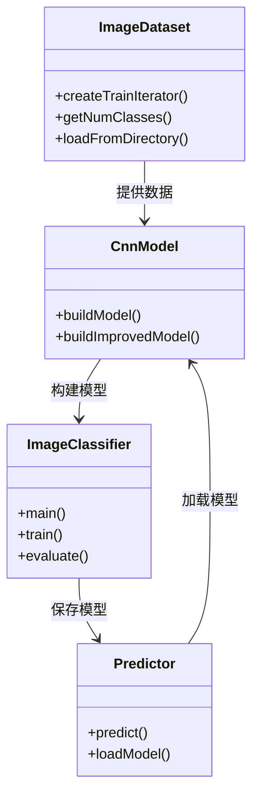

**图表来源**
- [04-classic-cnn-architectures.md:94-321](file://part1-deep-learning/chapter-03/04-classic-cnn-architectures.md#L94-L321)

**章节来源**
- [04-classic-cnn-architectures.md:45-396](file://part1-deep-learning/chapter-03/04-classic-cnn-architectures.md#L45-L396)

### 循环神经网络与序列建模

#### RNN的核心机制
RNN通过隐状态实现对序列历史信息的记忆与遗忘：

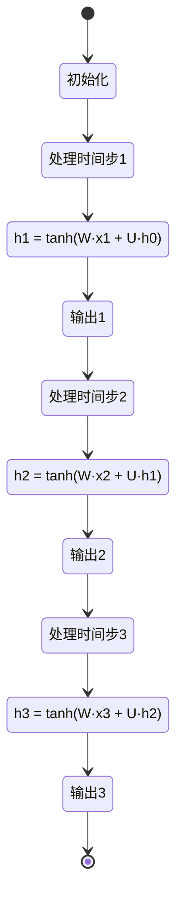

**图表来源**
- [02-rnn-memory-and-forgetting.md:22-79](file://part1-deep-learning/chapter-04/02-rnn-memory-and-forgetting.md#L22-L79)

RNN的长期依赖问题与解决方案：
- **梯度消失**：信息在时间步传播中逐渐衰减
- **LSTM**：门控机制实现选择性记忆
- **GRU**：简化版门控，性能相当但更高效

**章节来源**
- [01-sequence-data-challenge.md:117-232](file://part1-deep-learning/chapter-04/01-sequence-data-challenge.md#L117-L232)
- [02-rnn-memory-and-forgetting.md:145-256](file://part1-deep-learning/chapter-04/02-rnn-memory-and-forgetting.md#L145-L256)

#### LSTM与GRU实现
LSTM通过三个门控机制解决长期依赖问题：

```mermaid
flowchart LR
subgraph "LSTM门控机制"
InputGate[输入门<br/>i_t = σ(Wi·[h_{t-1},x_t])]
ForgetGate[遗忘门<br/>f_t = σ(Wf·[h_{t-1},x_t])]
OutputGate[输出门<br/>o_t = σ(Wo·[h_{t-1},x_t])]
InputGate --> Candidate[候选值<br/>c̃_t = tanh(Wc·[h_{t-1},x_t])]
ForgetGate --> CellState[细胞状态<br/>c_t = f_t ⊙ c_{t-1} + i_t ⊙ c̃_t]
OutputGate --> HiddenState[隐状态<br/>h_t = o_t ⊙ tanh(c_t)]
end
```

**图表来源**
- [03-lstm-and-gru.md:81-133](file://part1-deep-learning/chapter-04/03-lstm-and-gru.md#L81-L133)

**章节来源**
- [03-lstm-and-gru.md:40-364](file://part1-deep-learning/chapter-04/03-lstm-and-gru.md#L40-L364)

### 文本生成实践
基于字符级RNN的文本生成系统：

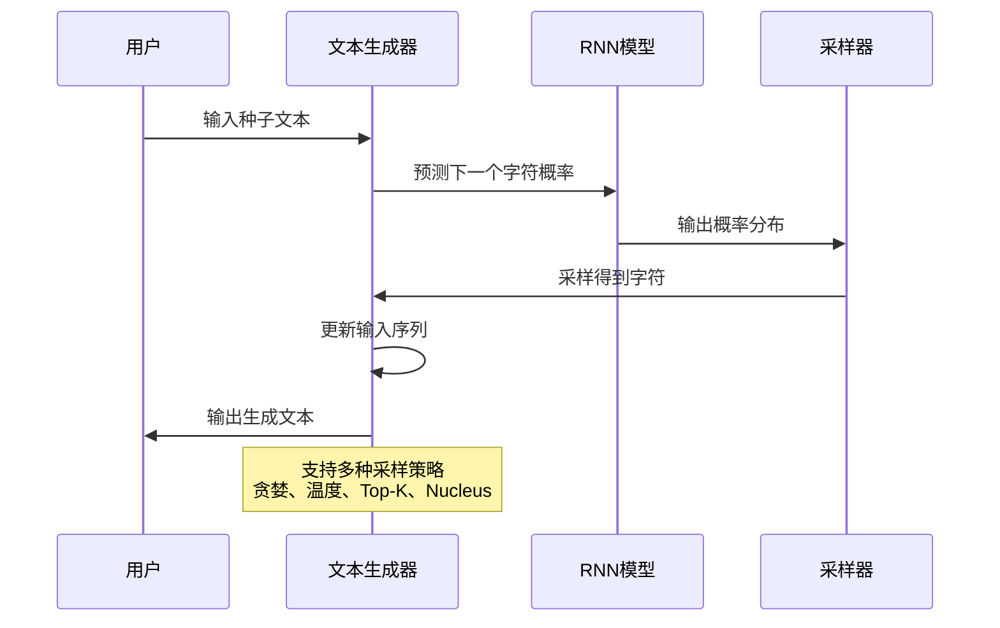

**图表来源**
- [04-text-generation-practice.md:283-370](file://part1-deep-learning/chapter-04/04-text-generation-practice.md#L283-L370)

**章节来源**
- [04-text-generation-practice.md:52-533](file://part1-deep-learning/chapter-04/04-text-generation-practice.md#L52-L533)

### 实战项目

#### 数据准备与预处理
完整的数据处理管道包含加载、探索、预处理和可视化：

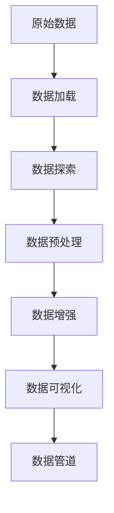

**图表来源**
- [02-data-preparation.md:282-322](file://part1-deep-learning/chapter-05/02-data-preparation.md#L282-L322)

**章节来源**
- [02-data-preparation.md:15-352](file://part1-deep-learning/chapter-05/02-data-preparation.md#L15-L352)

#### 模型设计与训练
三层CNN架构设计与训练流程：

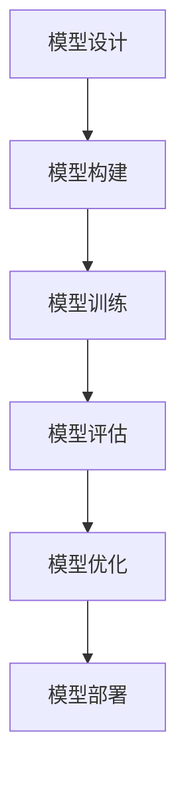

**图表来源**
- [03-model-design-training.md:154-223](file://part1-deep-learning/chapter-05/03-model-design-training.md#L154-L223)

**章节来源**
- [03-model-design-training.md:15-413](file://part1-deep-learning/chapter-05/03-model-design-training.md#L15-L413)

#### 模型评估与优化
全面的评估指标和优化策略：

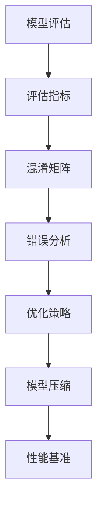

**图表来源**
- [04-model-evaluation-optimization.md:15-96](file://part1-deep-learning/chapter-05/04-model-evaluation-optimization.md#L15-L96)

**章节来源**
- [04-model-evaluation-optimization.md:15-438](file://part1-deep-learning/chapter-05/04-model-evaluation-optimization.md#L15-L438)

## 依赖分析
课程内容遵循渐进式依赖关系，确保学习的连贯性和完整性：

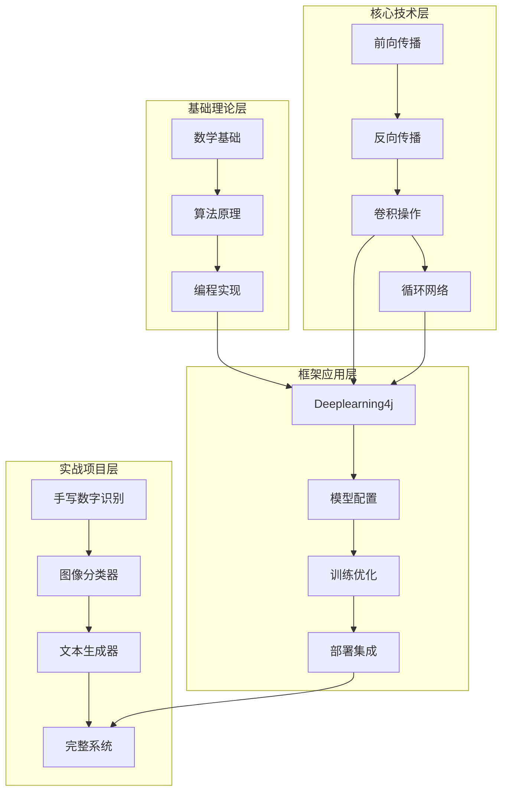

**图表来源**
- [03-first-ai-environment.md:19-55](file://part1-deep-learning/chapter-01/03-first-ai-environment.md#L19-L55)
- [02-forward-propagation.md:177-212](file://part1-deep-learning/chapter-02/02-forward-propagation.md#L177-L212)

**章节来源**
- [03-first-ai-environment.md:19-55](file://part1-deep-learning/chapter-01/03-first-ai-environment.md#L19-L55)

## 性能考虑
深度学习模型的性能优化涉及多个层面：

### 计算效率优化
- **向量化计算**：使用ND4J进行矩阵运算
- **批处理策略**：合理设置批次大小平衡内存与速度
- **GPU加速**：利用CUDA进行并行计算
- **内存管理**：控制张量大小和生命周期

### 训练稳定性
- **梯度控制**：梯度裁剪防止梯度爆炸
- **学习率调度**：动态调整学习率
- **正则化技术**：Dropout、L2正则化
- **早停机制**：防止过拟合

### 模型压缩
- **知识蒸馏**：用大模型指导小模型
- **模型量化**：权重精度降低
- **剪枝技术**：去除冗余参数

## 故障排除指南

### 常见问题诊断
1. **训练不收敛**
   - 检查学习率设置
   - 验证数据预处理
   - 确认网络架构合理性

2. **过拟合现象**
   - 增加数据增强
   - 添加Dropout层
   - 使用L2正则化

3. **内存不足**
   - 减小批次大小
   - 释放不必要的张量
   - 使用GPU内存优化

### 调试工具使用
- **训练监控**：ScoreIterationListener
- **模型可视化**：训练曲线分析
- **错误分析**：混淆矩阵和错误样本
- **性能基准**：推理速度测试

**章节来源**
- [03-backpropagation.md:327-370](file://part1-deep-learning/chapter-02/03-backpropagation.md#L327-L370)
- [04-model-evaluation-optimization.md:350-389](file://part1-deep-learning/chapter-05/04-model-evaluation-optimization.md#L350-L389)

## 结论
本课程通过系统的理论讲解和丰富的实践示例，为Java程序员构建了完整的深度学习知识体系。从神经网络的基础算法到CNN、RNN的高级架构，从Deeplearning4j框架的实际应用到完整的项目实战，学员能够：

1. **掌握核心算法**：深入理解前向传播、反向传播、卷积操作、循环网络的工作原理
2. **具备工程能力**：使用Java和Deeplearning4j构建生产级AI应用
3. **培养系统思维**：从数据预处理到模型部署的完整项目流程
4. **适应企业需求**：将AI能力融入现有Java生态系统

通过循序渐进的学习路径和动手实践，Java程序员可以成功跨越AI技术门槛，成为AI时代的合格建设者。

## 附录

### 学习路径建议
1. **基础阶段**（1-2周）
   - 理解AI基本概念和Java生态
   - 掌握神经网络基础算法
   - 完成第一个神经网络项目

2. **进阶阶段**（2-3周）
   - 深入学习CNN和RNN架构
   - 实现图像分类和文本生成
   - 掌握模型优化技术

3. **实战阶段**（2-3周）
   - 完成完整项目开发
   - 学习部署和集成
   - 项目优化和性能调优

### 技术栈配置
- **Java版本**：Java 17+
- **深度学习框架**：Deeplearning4j 1.0.0-M2.1
- **构建工具**：Maven 3.6+
- **开发环境**：IntelliJ IDEA
- **可选GPU**：NVIDIA CUDA 11.x

### 进一步学习资源
- Deeplearning4j官方文档和示例
- 深度学习理论书籍和论文
- 相关开源项目和社区资源