# 神经网络基础

<cite>
**本文档引用的文件**
- [01-why-java-ai.md](file://book/part1-deep-learning/chapter-01/01-why-java-ai.md)
- [02-what-is-deep-learning.md](file://book/part1-deep-learning/chapter-01/02-what-is-deep-learning.md)
- [03-first-ai-environment.md](file://book/part1-deep-learning/chapter-01/03-first-ai-environment.md)
- [02-forward-propagation.md](file://book/part1-deep-learning/chapter-02/02-forward-propagation.md)
- [03-backpropagation.md](file://book/part1-deep-learning/chapter-02/03-backpropagation.md)
- [04-first-neural-network-dl4j.md](file://book/part1-deep-learning/chapter-02/04-first-neural-network-dl4j.md)
- [05-why-deep-learning-needs-depth.md](file://book/part1-deep-learning/chapter-02/05-why-deep-learning-needs-depth.md)
- [README.md](file://book/README.md)
</cite>

## 目录
1. [引言](#引言)
2. [项目结构](#项目结构)
3. [核心概念](#核心概念)
4. [架构概览](#架构概览)
5. [详细组件分析](#详细组件分析)
6. [依赖关系分析](#依赖关系分析)
7. [性能考量](#性能考量)
8. [故障排除指南](#故障排除指南)
9. [结论](#结论)
10. [附录](#附录)

## 引言

本教程专为Java程序员设计，旨在帮助您从零开始掌握神经网络的基础知识。通过深入浅出的方式，我们将用Java思维理解AI概念，用Deeplearning4j框架实现第一个神经网络，并提供从理论到实践的完整学习路径。

神经网络不是魔法，它是一种特殊的计算结构——就像Java中的集合框架，有其特定的设计模式和用法。我们将用熟悉的Java类比来理解神经网络的各个组成部分。

## 项目结构

该项目采用分章节组织的学习结构，从基础概念到实践应用逐步深入：

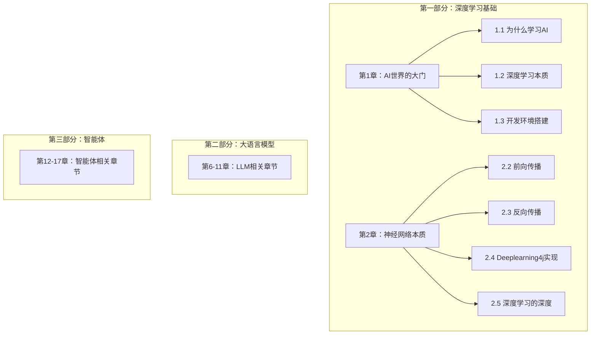

**图表来源**
- [README.md:30-68](file://book/README.md#L30-L68)

**章节来源**
- [README.md:30-68](file://book/README.md#L30-L68)

## 核心概念

### 神经网络的基本组成

神经网络由多个层次组成，每个层次包含多个神经元。让我们用Java类比来理解：

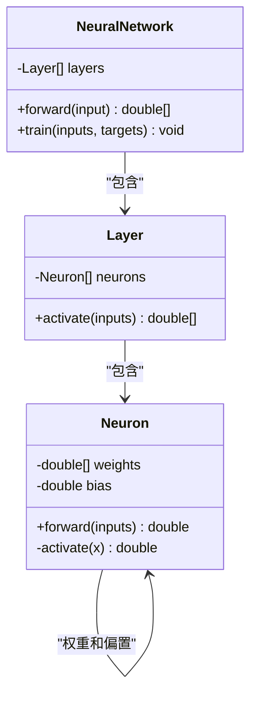

**图表来源**
- [02-what-is-deep-learning.md:82-136](file://book/part1-deep-learning/chapter-01/02-what-is-deep-learning.md#L82-L136)

### 权重和偏置的作用机制

权重和偏置是神经网络中最重要的可学习参数：

- **权重（Weights）**：控制输入信号的重要性，类似于Java中成员变量存储状态
- **偏置（Bias）**：控制神经元的激活阈值，类似于Java中方法的默认行为

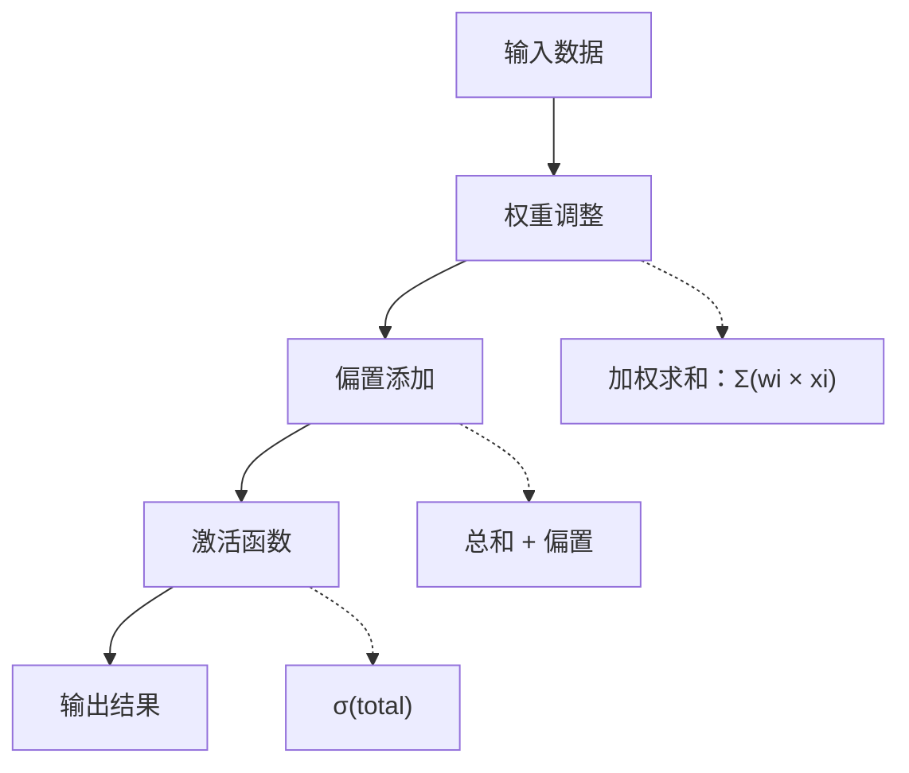

**图表来源**
- [02-forward-propagation.md:29-62](file://book/part1-deep-learning/chapter-02/02-forward-propagation.md#L29-L62)

**章节来源**
- [02-what-is-deep-learning.md:116-136](file://book/part1-deep-learning/chapter-01/02-what-is-deep-learning.md#L116-L136)
- [02-forward-propagation.md:29-62](file://book/part1-deep-learning/chapter-02/02-forward-propagation.md#L29-L62)

## 架构概览

### 神经网络的整体架构

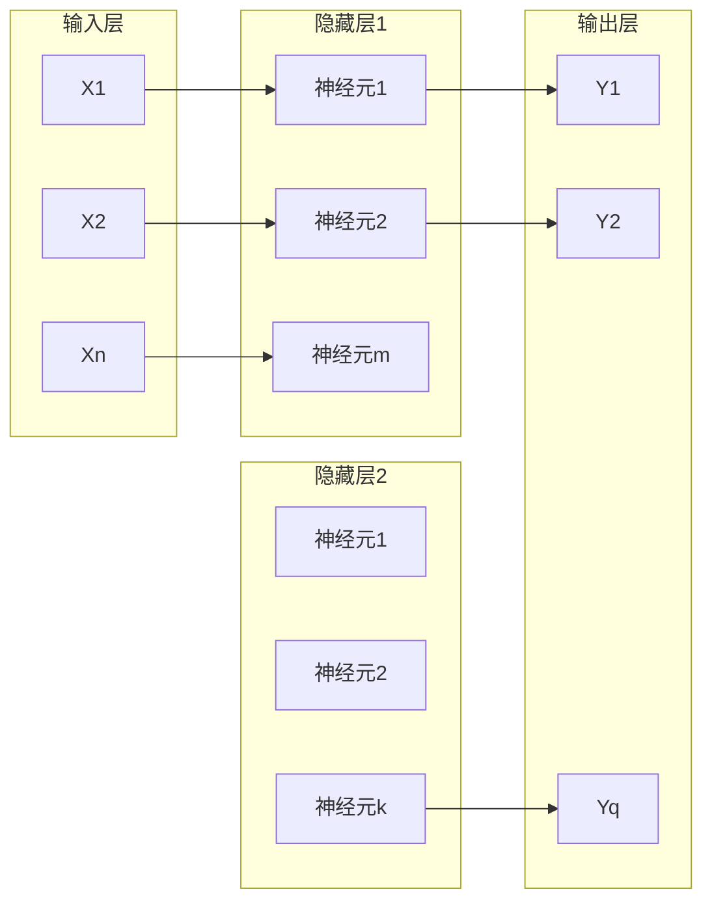

**图表来源**
- [02-forward-propagation.md:99-114](file://book/part1-deep-learning/chapter-02/02-forward-propagation.md#L99-L114)

### Deeplearning4j框架架构

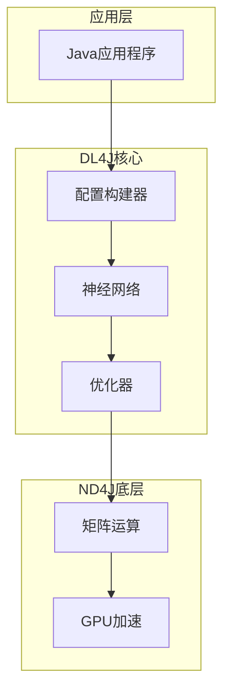

**图表来源**
- [04-first-neural-network-dl4j.md:5-15](file://book/part1-deep-learning/chapter-02/04-first-neural-network-dl4j.md#L5-L15)

**章节来源**
- [04-first-neural-network-dl4j.md:5-15](file://book/part1-deep-learning/chapter-02/04-first-neural-network-dl4j.md#L5-L15)

## 详细组件分析

### 前向传播算法详解

前向传播是神经网络数据流动的核心过程，包含三个关键步骤：

#### 单个神经元的计算流程

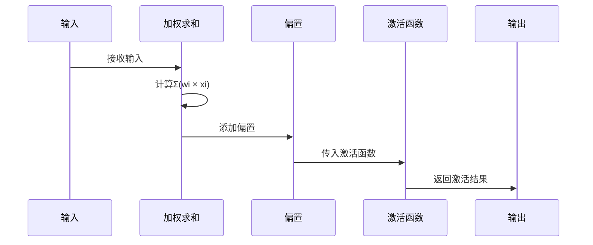

**图表来源**
- [02-forward-propagation.md:37-61](file://book/part1-deep-learning/chapter-02/02-forward-propagation.md#L37-L61)

#### 向量化计算的优势

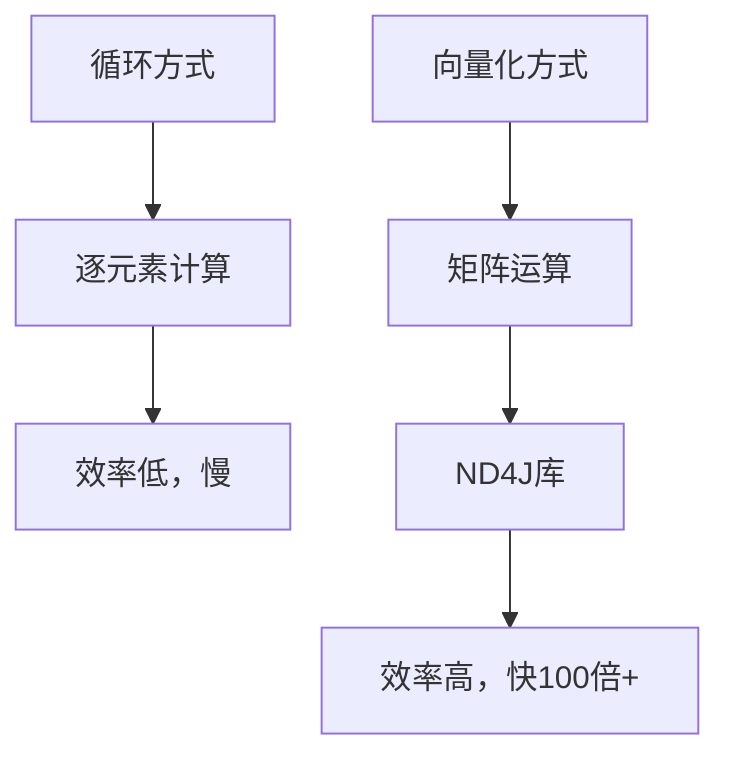

**图表来源**
- [02-forward-propagation.md:68-86](file://book/part1-deep-learning/chapter-02/02-forward-propagation.md#L68-L86)

**章节来源**
- [02-forward-propagation.md:25-86](file://book/part1-deep-learning/chapter-02/02-forward-propagation.md#L25-L86)

### 反向传播算法详解

反向传播是神经网络学习的核心机制，基于链式法则计算梯度。

#### 四个核心公式

```mermaid
flowchart LR
subgraph "输出层"
L1[损失函数 L]
G1[δ^L = ∂L/∂a^L ⊙ f'(z^L)]
end
subgraph "隐藏层"
G2[δ^l = ((W^(l+1))^T · δ^(l+1)) ⊙ f'(z^l)]
end
subgraph "参数更新"
G3[∂L/∂W^l = δ^l · (a^(l-1))^T]
G4[∂L/∂b^l = δ^l]
end
L1 --> G1
G1 --> G2
G2 --> G3
G2 --> G4
```

**图表来源**
- [03-backpropagation.md:88-108](file://book/part1-deep-learning/chapter-02/03-backpropagation.md#L88-L108)

#### 梯度下降优化器

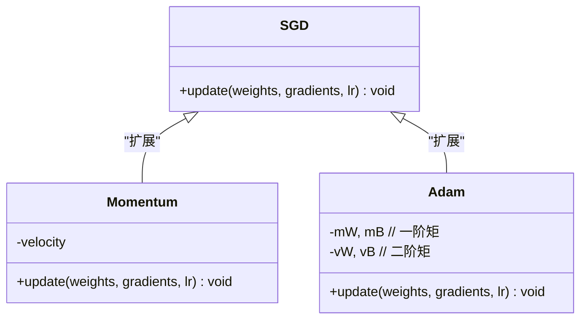

**图表来源**
- [03-backpropagation.md:216-284](file://book/part1-deep-learning/chapter-02/03-backpropagation.md#L216-L284)

**章节来源**
- [03-backpropagation.md:75-183](file://book/part1-deep-learning/chapter-02/03-backpropagation.md#L75-L183)

### Deeplearning4j实现示例

#### 基础神经网络实现

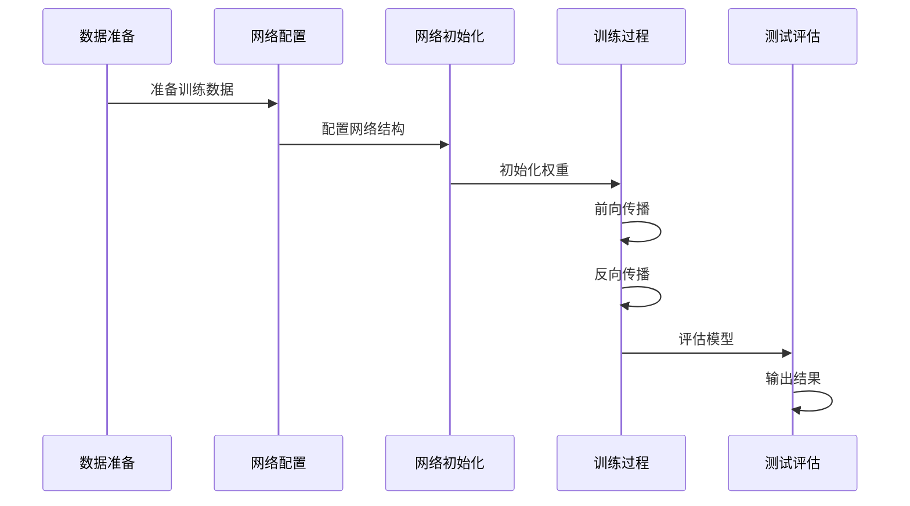

**图表来源**
- [03-first-ai-environment.md:259-343](file://book/part1-deep-learning/chapter-01/03-first-ai-environment.md#L259-L343)

**章节来源**
- [03-first-ai-environment.md:259-343](file://book/part1-deep-learning/chapter-01/03-first-ai-environment.md#L259-L343)

## 依赖关系分析

### 技术栈依赖关系

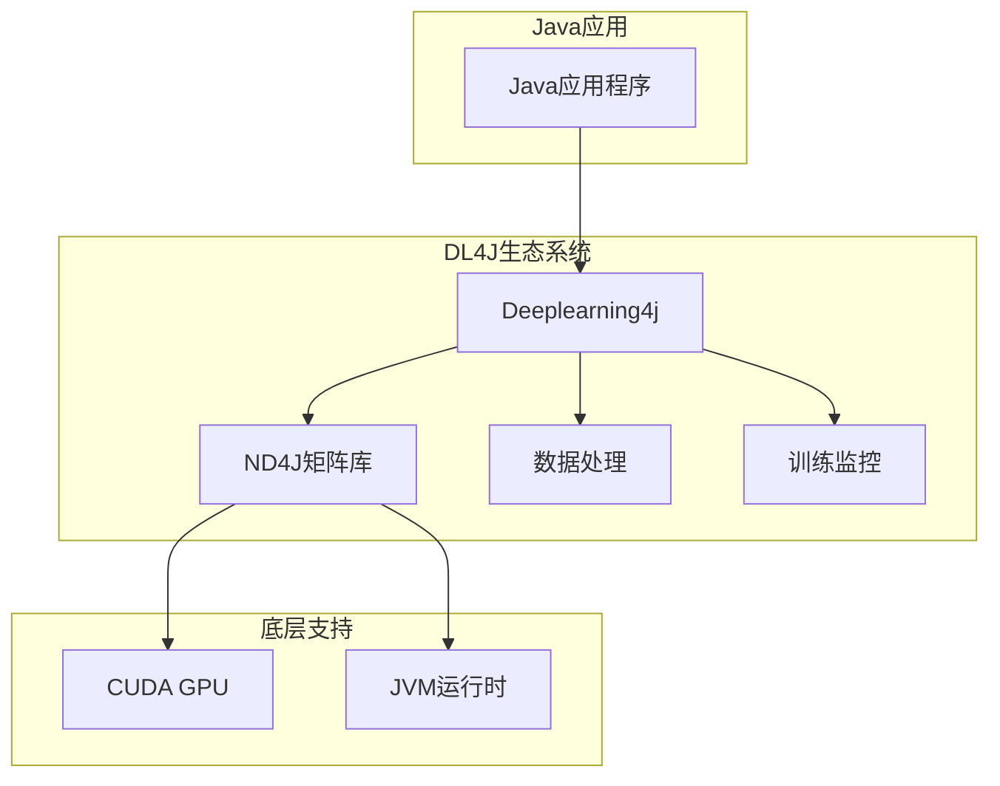

**图表来源**
- [04-first-neural-network-dl4j.md:22-53](file://book/part1-deep-learning/chapter-02/04-first-neural-network-dl4j.md#L22-L53)

### Maven依赖配置

| 依赖项 | 版本 | 用途 |
|--------|------|------|
| deeplearning4j-core | 1.0.0-M2.1 | 核心深度学习功能 |
| nd4j-native-platform | 1.0.0-M2.1 | 矩阵运算库 |
| datavec-data-image | 1.0.0-M2.1 | 图像数据处理 |
| langchain4j | 0.35.0 | 大语言模型集成 |

**章节来源**
- [04-first-neural-network-dl4j.md:22-53](file://book/part1-deep-learning/chapter-02/04-first-neural-network-dl4j.md#L22-L53)

## 性能考量

### 计算效率优化

深度学习训练涉及大量的矩阵运算，性能优化至关重要：

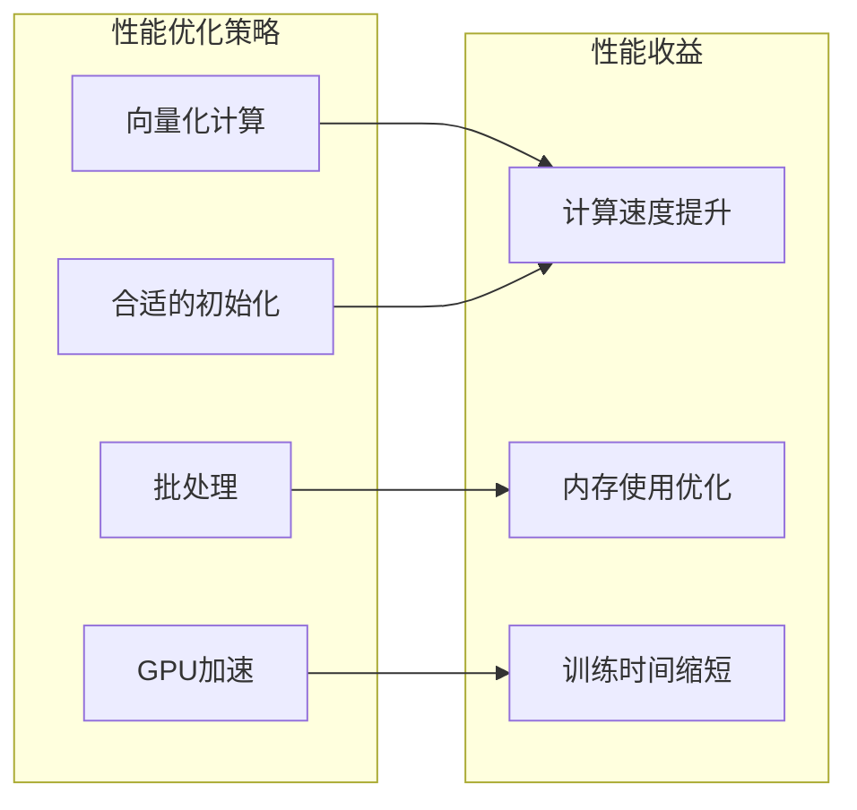

### 深度网络的权衡

| 特性 | 深网络 | 宽网络 |
|------|--------|--------|
| 参数效率 | 高 | 低 |
| 抽象能力 | 强 | 弱 |
| 训练难度 | 高 | 低 |
| 硬件利用 | 一般 | 好 |

**章节来源**
- [05-why-deep-learning-needs-depth.md:381-406](file://book/part1-deep-learning/chapter-02/05-why-deep-learning-needs-depth.md#L381-L406)

## 故障排除指南

### 常见问题及解决方案

#### 内存不足问题

```java
// 设置内存限制
System.setProperty("org.bytedeco.javacpp.maxbytes", "4G");
System.setProperty("org.bytedeco.javacpp.maxphysicalbytes", "8G");
```

#### 训练缓慢问题

1. **检查GPU配置**：确保CUDA版本兼容
2. **调整批大小**：根据GPU内存调整
3. **优化学习率**：使用Adam优化器
4. **启用混合精度**：减少内存占用

#### 梯度消失问题

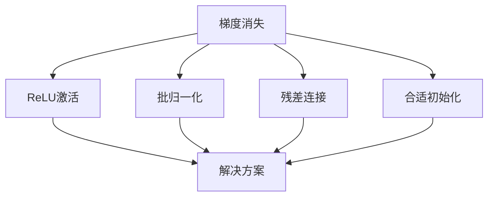

**图表来源**
- [05-why-deep-learning-needs-depth.md:164-202](file://book/part1-deep-learning/chapter-02/05-why-deep-learning-needs-depth.md#L164-L202)

**章节来源**
- [03-first-ai-environment.md:385-407](file://book/part1-deep-learning/chapter-01/03-first-ai-environment.md#L385-L407)

## 结论

通过本教程，您已经掌握了神经网络的基础知识和实践技能：

1. **概念理解**：用Java思维理解神经网络的各个组成部分
2. **算法掌握**：深入理解前向传播和反向传播的工作原理
3. **实践应用**：使用Deeplearning4j框架实现第一个神经网络
4. **性能优化**：掌握深度学习训练的性能优化技巧

神经网络的核心在于"从数据中自动发现规律"，而深度学习的"深度"代表了更强的抽象能力和表示学习能力。随着学习的深入，您将能够构建更复杂的神经网络模型，解决实际的工程问题。

## 附录

### 学习路径建议

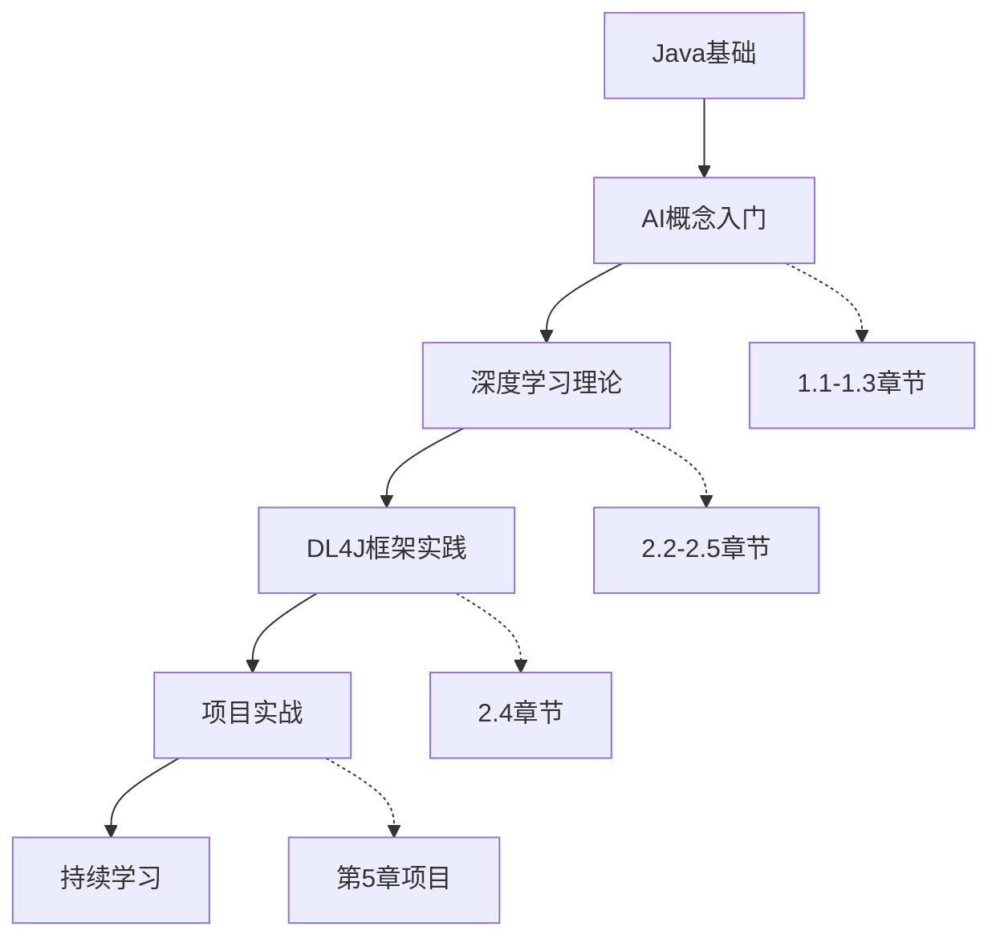

### 进一步学习资源

- **理论学习**：《深度学习》Ian Goodfellow
- **实践项目**：MNIST手写数字识别
- **社区资源**：Deeplearning4j官方文档和论坛
- **竞赛平台**：Kaggle机器学习竞赛

**章节来源**
- [01-why-java-ai.md:81-109](file://book/part1-deep-learning/chapter-01/01-why-java-ai.md#L81-L109)