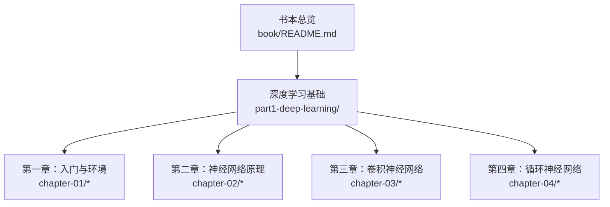
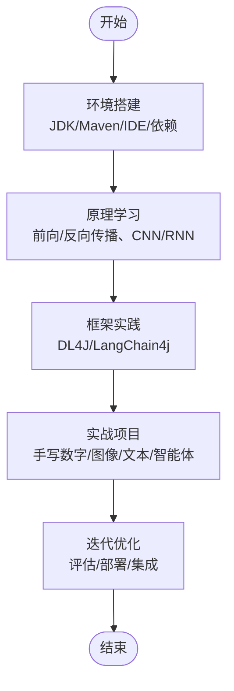
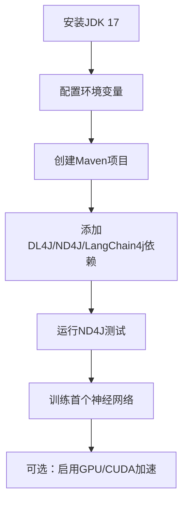
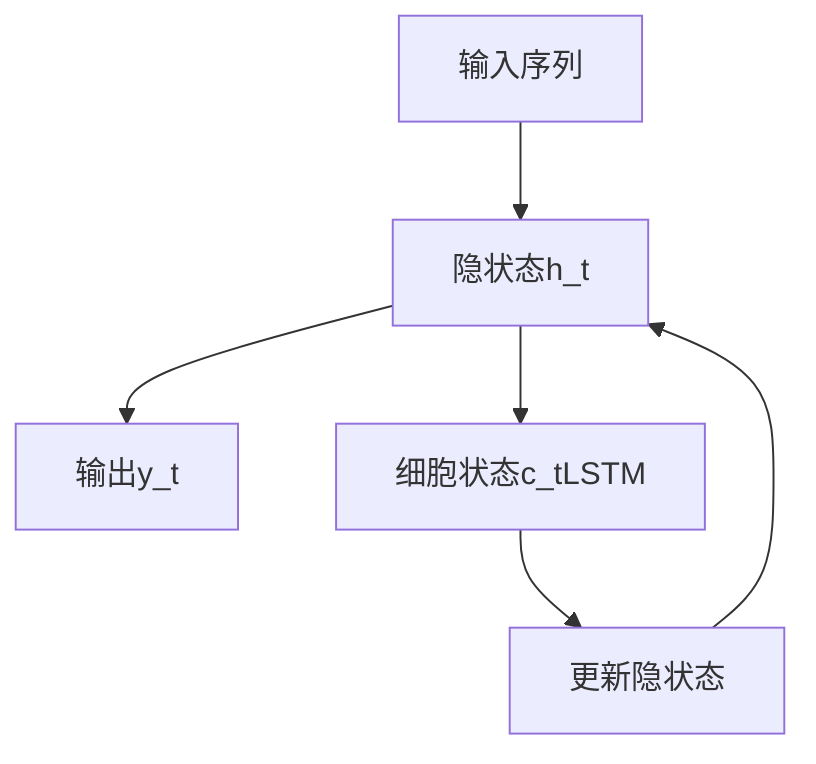
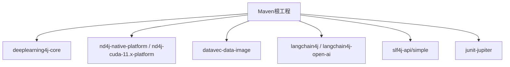

# 附录资料

<cite>
**本文引用的文件**
- [book/README.md](file://book/README.md)
- [part1-deep-learning/chapter-01/01-why-java-ai.md](file://part1-deep-learning/chapter-01/01-why-java-ai.md)
- [part1-deep-learning/chapter-01/02-what-is-deep-learning.md](file://part1-deep-learning/chapter-01/02-what-is-deep-learning.md)
- [part1-deep-learning/chapter-01/03-first-ai-environment.md](file://part1-deep-learning/chapter-01/03-first-ai-environment.md)
- [part1-deep-learning/chapter-02/02-forward-propagation.md](file://part1-deep-learning/chapter-02/02-forward-propagation.md)
- [part1-deep-learning/chapter-02/03-backpropagation.md](file://part1-deep-learning/chapter-02/03-backpropagation.md)
- [part1-deep-learning/chapter-02/04-first-neural-network-dl4j.md](file://part1-deep-learning/chapter-02/04-first-neural-network-dl4j.md)
- [part1-deep-learning/chapter-02/05-why-deep-learning-needs-depth.md](file://part1-deep-learning/chapter-02/05-why-deep-learning-needs-depth.md)
- [part1-deep-learning/chapter-03/01-image-recognition-problem.md](file://part1-deep-learning/chapter-03/01-image-recognition-problem.md)
- [part1-deep-learning/chapter-03/04-classic-cnn-architectures.md](file://part1-deep-learning/chapter-03/04-classic-cnn-architectures.md)
- [part1-deep-learning/chapter-04/01-sequence-data-challenge.md](file://part1-deep-learning/chapter-04/01-sequence-data-challenge.md)
- [part1-deep-learning/chapter-04/03-lstm-and-gru.md](file://part1-deep-learning/chapter-04/03-lstm-and-gru.md)
</cite>

## 目录
1. [引言](#引言)
2. [项目结构](#项目结构)
3. [核心组件](#核心组件)
4. [架构总览](#架构总览)
5. [详细组件分析](#详细组件分析)
6. [依赖分析](#依赖分析)
7. [性能考量](#性能考量)
8. [故障排查指南](#故障排查指南)
9. [结论](#结论)
10. [附录](#附录)

## 引言
本附录旨在为《Java程序员的AI之路》提供实用的辅助资料，覆盖工具环境配置、术语表与参考资料，帮助Java开发者快速搭建AI开发环境、理解AI与机器学习专业词汇，并持续深入学习。

## 项目结构
该仓库围绕“深度学习基础—大语言模型—智能体”三大主题组织内容，配套章节包含环境搭建、神经网络原理、CNN与RNN实践等，便于循序渐进地建立工程化落地能力。



图表来源
- [book/README.md:30-187](file://book/README.md#L30-L187)

章节来源
- [book/README.md:30-187](file://book/README.md#L30-L187)

## 核心组件
- 神经网络基础：前向传播、反向传播、损失函数与优化器
- 卷积神经网络：卷积、池化、经典架构与迁移学习
- 循环神经网络：RNN、LSTM/GRU与序列建模
- 实战项目：手写数字识别、图像分类、文本生成与智能体

章节来源
- [part1-deep-learning/chapter-02/02-forward-propagation.md:1-538](file://part1-deep-learning/chapter-02/02-forward-propagation.md#L1-L538)
- [part1-deep-learning/chapter-02/03-backpropagation.md:1-537](file://part1-deep-learning/chapter-02/03-backpropagation.md#L1-L537)
- [part1-deep-learning/chapter-03/04-classic-cnn-architectures.md:1-449](file://part1-deep-learning/chapter-03/04-classic-cnn-architectures.md#L1-L449)
- [part1-deep-learning/chapter-04/03-lstm-and-gru.md:1-365](file://part1-deep-learning/chapter-04/03-lstm-and-gru.md#L1-L365)

## 架构总览
从“环境—原理—框架—项目”的路径组织学习，形成“理论指导实践，实践验证理论”的闭环。



图表来源
- [part1-deep-learning/chapter-01/03-first-ai-environment.md:17-426](file://part1-deep-learning/chapter-01/03-first-ai-environment.md#L17-L426)
- [part1-deep-learning/chapter-02/02-forward-propagation.md:1-538](file://part1-deep-learning/chapter-02/02-forward-propagation.md#L1-L538)
- [part1-deep-learning/chapter-03/04-classic-cnn-architectures.md:1-449](file://part1-deep-learning/chapter-03/04-classic-cnn-architectures.md#L1-L449)
- [part1-deep-learning/chapter-04/03-lstm-and-gru.md:1-365](file://part1-deep-learning/chapter-04/03-lstm-and-gru.md#L1-L365)

## 详细组件分析

### 环境配置指南
- JDK与IDE：推荐使用Java 17 LTS与IntelliJ IDEA；Windows/macOS/Linux分别提供环境变量配置与验证命令。
- 构建工具：Maven项目结构清晰，pom.xml包含DL4J、ND4J、DataVec、LangChain4j等依赖。
- 验证步骤：ND4J矩阵运算测试与首个神经网络（XOR）训练，确保依赖与运行环境可用。
- 可选加速：GPU CUDA版本依赖替换与内存参数设置。



图表来源
- [part1-deep-learning/chapter-01/03-first-ai-environment.md:17-426](file://part1-deep-learning/chapter-01/03-first-ai-environment.md#L17-L426)

章节来源
- [part1-deep-learning/chapter-01/03-first-ai-environment.md:17-426](file://part1-deep-learning/chapter-01/03-first-ai-environment.md#L17-L426)

### 神经网络原理（前向/反向传播）
- 前向传播：线性变换+激活函数，支持向量化与批处理，强调ReLU等激活函数的选择与softmax输出层。
- 反向传播：链式法则推导，四类核心公式；结合梯度下降与Adam等优化器；交叉熵与MSE损失函数对比。
- 手写实现：从两层网络到完整训练循环，便于理解梯度计算与参数更新。

```mermaid
sequenceDiagram
participant Train as "训练循环"
participant Fwd as "前向传播"
participant Loss as "损失计算"
participant Bwd as "反向传播"
participant Opt as "优化器更新"
Train->>Fwd : 输入数据
Fwd-->>Train : 预测输出
Train->>Loss : 计算损失
Loss-->>Train : 损失值
Train->>Bwd : 反向传播
Bwd-->>Train : 梯度
Train->>Opt : 更新权重与偏置
Opt-->>Train : 新参数
```

图表来源
- [part1-deep-learning/chapter-02/03-backpropagation.md:327-370](file://part1-deep-learning/chapter-02/03-backpropagation.md#L327-L370)

章节来源
- [part1-deep-learning/chapter-02/02-forward-propagation.md:95-538](file://part1-deep-learning/chapter-02/02-forward-propagation.md#L95-L538)
- [part1-deep-learning/chapter-02/03-backpropagation.md:75-370](file://part1-deep-learning/chapter-02/03-backpropagation.md#L75-L370)

### 卷积神经网络（CNN）
- 问题定义：从像素到语义的鸿沟，传统方法的局限与深度学习的优势。
- 经典架构：LeNet、AlexNet、ResNet的设计要点与演进原则；残差连接、批归一化、瓶颈结构等。
- 实践：DL4J构建CNN，使用预训练模型进行迁移学习。


图表来源
- [part1-deep-learning/chapter-03/04-classic-cnn-architectures.md:5-449](file://part1-deep-learning/chapter-03/04-classic-cnn-architectures.md#L5-L449)

章节来源
- [part1-deep-learning/chapter-03/01-image-recognition-problem.md:1-368](file://part1-deep-learning/chapter-03/01-image-recognition-problem.md#L1-L368)
- [part1-deep-learning/chapter-03/04-classic-cnn-architectures.md:17-449](file://part1-deep-learning/chapter-03/04-classic-cnn-architectures.md#L17-L449)

### 循环神经网络（RNN/LSTM/GRU）
- 序列挑战：顺序性、变长性与时序依赖；传统网络无法处理长期依赖。
- LSTM/GRU：门控机制实现选择性记忆与遗忘；GRU在保持表达能力的同时降低复杂度。
- 实战：DL4J构建LSTM文本分类网络，LastTimeStep取末状态。



图表来源
- [part1-deep-learning/chapter-04/03-lstm-and-gru.md:40-133](file://part1-deep-learning/chapter-04/03-lstm-and-gru.md#L40-L133)

章节来源
- [part1-deep-learning/chapter-04/01-sequence-data-challenge.md:1-350](file://part1-deep-learning/chapter-04/01-sequence-data-challenge.md#L1-L350)
- [part1-deep-learning/chapter-04/03-lstm-and-gru.md:1-365](file://part1-deep-learning/chapter-04/03-lstm-and-gru.md#L1-L365)

## 依赖分析
- 技术栈与版本：Java 17+、Maven、DL4J、ND4J、DataVec、LangChain4j、SLF4J、JUnit。
- 依赖关系：DL4J核心+ND4J平台/ CUDA平台、数据处理（DataVec）、LLM集成（LangChain4j）与日志/测试支撑。



图表来源
- [part1-deep-learning/chapter-01/03-first-ai-environment.md:112-189](file://part1-deep-learning/chapter-01/03-first-ai-environment.md#L112-L189)

章节来源
- [part1-deep-learning/chapter-01/03-first-ai-environment.md:112-189](file://part1-deep-learning/chapter-01/03-first-ai-environment.md#L112-L189)

## 性能考量
- 向量化与批处理：矩阵运算显著优于循环，批处理提升吞吐。
- 激活函数选择：ReLU缓解梯度消失，Softmax用于多分类输出。
- 优化器：Adam自适应学习率，收敛更快更稳。
- 深度网络：残差连接、批归一化、合适的初始化与正则化，缓解梯度消失与过拟合。
- GPU加速：CUDA平台依赖与内存参数设置，提升大规模训练效率。

章节来源
- [part1-deep-learning/chapter-02/02-forward-propagation.md:326-380](file://part1-deep-learning/chapter-02/02-forward-propagation.md#L326-L380)
- [part1-deep-learning/chapter-02/03-backpropagation.md:205-291](file://part1-deep-learning/chapter-02/03-backpropagation.md#L205-L291)
- [part1-deep-learning/chapter-02/05-why-deep-learning-needs-depth.md:259-314](file://part1-deep-learning/chapter-02/05-why-deep-learning-needs-depth.md#L259-L314)
- [part1-deep-learning/chapter-01/03-first-ai-environment.md:372-407](file://part1-deep-learning/chapter-01/03-first-ai-environment.md#L372-L407)

## 故障排查指南
- 内存不足：设置系统属性提升内存上限。
- 本地库缺失：使用Maven依赖解析确保下载完整。
- 训练缓慢：确认是否使用GPU版本、适当调整batch大小与学习率。
- 梯度异常：检查激活函数与初始化策略，必要时引入残差连接与批归一化。

章节来源
- [part1-deep-learning/chapter-01/03-first-ai-environment.md:385-407](file://part1-deep-learning/chapter-01/03-first-ai-environment.md#L385-L407)

## 结论
通过环境搭建、原理学习与框架实践，结合实战项目，Java开发者可在企业级工程中落地AI能力。建议以“环境—原理—框架—项目”的路径推进，并持续关注性能优化与故障排查。

## 附录

### 术语表（AI与机器学习）
- 神经网络：由多层节点组成的计算结构，通过训练学习输入到输出的映射。
- 前向传播：输入数据沿网络逐层计算得到输出的过程。
- 反向传播：基于损失函数对权重进行梯度回传并更新的算法。
- 激活函数：引入非线性的函数，如Sigmoid、Tanh、ReLU、Softmax。
- 损失函数：衡量预测值与真实值差异的函数，如MSE、交叉熵。
- 优化器：更新参数的策略，如SGD、Adam。
- 卷积层：通过卷积核提取局部特征的层。
- 池化层：对特征进行降采样，减少参数与计算量。
- LSTM/GRU：具有门控机制的循环层，擅长建模长期依赖。
- 迁移学习：使用预训练模型在新任务上进行微调。
- 数据增强：通过对训练样本进行变换扩充数据集。
- 批归一化：对每层输入进行归一化以稳定训练。
- 残差连接：将输入直接加到层输出，缓解梯度消失。

章节来源
- [part1-deep-learning/chapter-02/02-forward-propagation.md:214-325](file://part1-deep-learning/chapter-02/02-forward-propagation.md#L214-L325)
- [part1-deep-learning/chapter-02/03-backpropagation.md:292-326](file://part1-deep-learning/chapter-02/03-backpropagation.md#L292-L326)
- [part1-deep-learning/chapter-03/04-classic-cnn-architectures.md:339-378](file://part1-deep-learning/chapter-03/04-classic-cnn-architectures.md#L339-L378)
- [part1-deep-learning/chapter-04/03-lstm-and-gru.md:146-225](file://part1-deep-learning/chapter-04/03-lstm-and-gru.md#L146-L225)

### 参考资料
- 书籍
  - 《深度学习》（Ian Goodfellow等著）
  - 《动手学深度学习》（李沐等著）
  - 《Python深度学习》（François Chollet）
- 在线资源
  - CS231n课程（Stanford）：CNN与视觉识别
  - Fast.ai：实用深度学习课程
  - deeplearning4j官方文档与示例
- 学术论文
  - “Very Deep Convolutional Networks for Large-Scale Image Recognition”
  - “Long Short-Term Memory”
  - “Adam: A Method for Stochastic Optimization”
- 技术博客
  - Towards Data Science、Medium上的深度学习专栏
  - DL4J社区博客与最佳实践

章节来源
- [book/README.md:170-187](file://book/README.md#L170-L187)