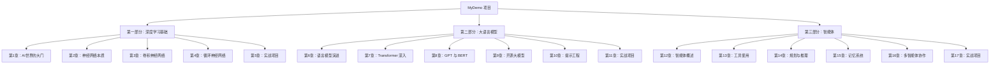
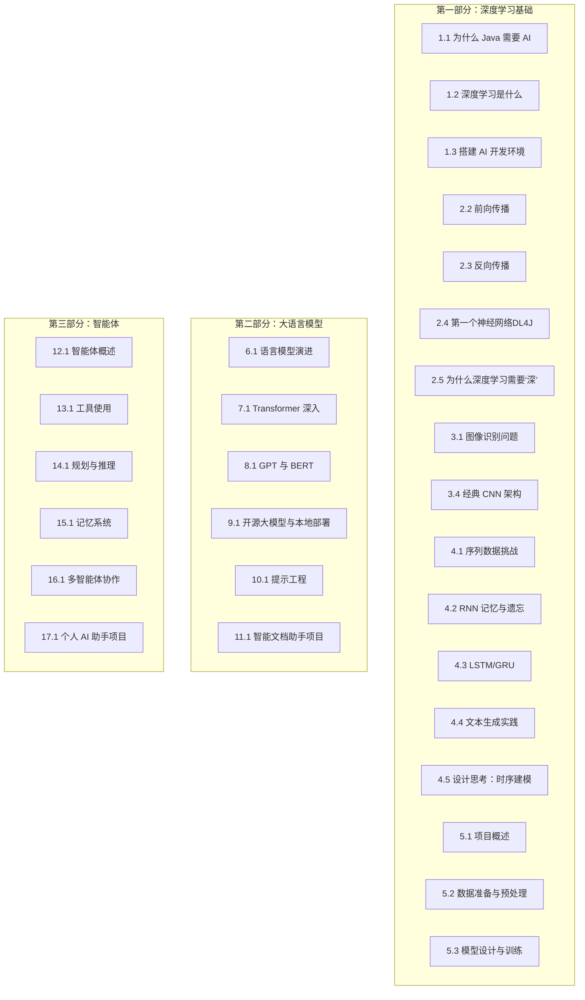
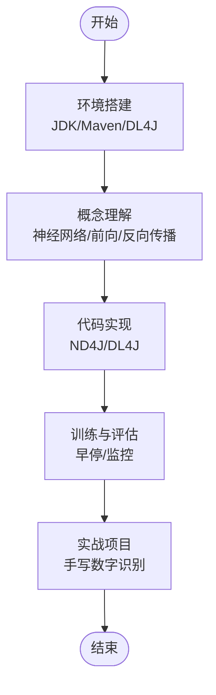
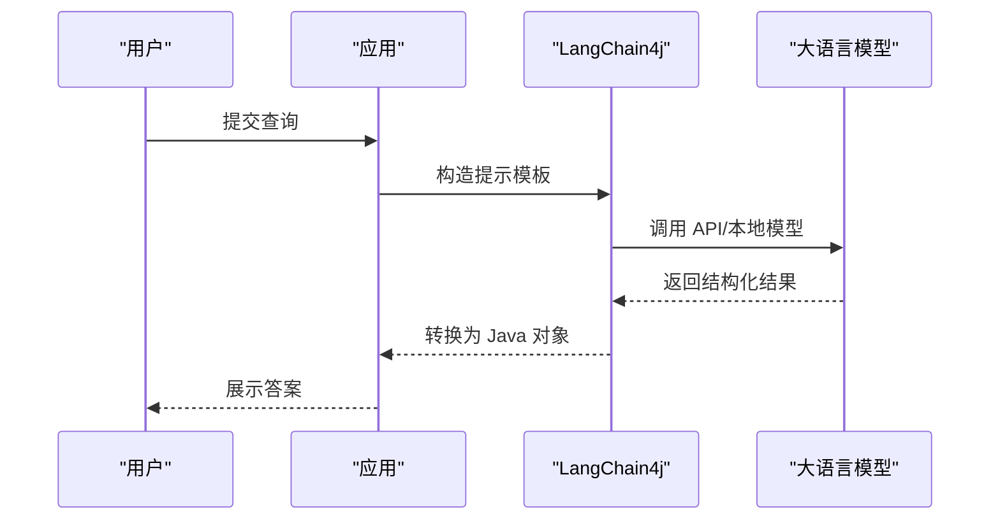
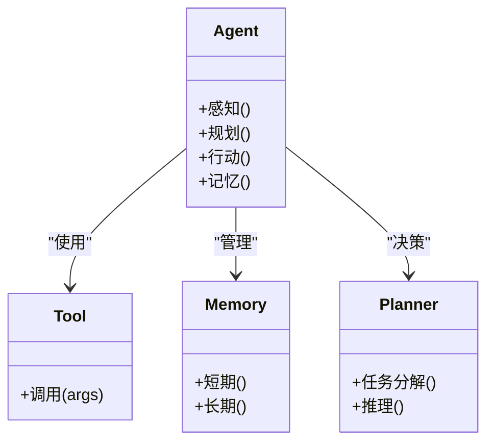
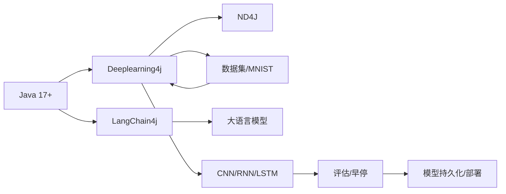

# 项目概述

<cite>
**本文档引用的文件**
- [book/README.md](file://book/README.md)
- [book/part1-deep-learning/chapter-01/01-why-java-ai.md](file://book/part1-deep-learning/chapter-01/01-why-java-ai.md)
- [book/part1-deep-learning/chapter-01/02-what-is-deep-learning.md](file://book/part1-deep-learning/chapter-01/02-what-is-deep-learning.md)
- [book/part1-deep-learning/chapter-01/03-first-ai-environment.md](file://book/part1-deep-learning/chapter-01/03-first-ai-environment.md)
- [book/part1-deep-learning/chapter-02/02-forward-propagation.md](file://book/part1-deep-learning/chapter-02/02-forward-propagation.md)
- [book/part1-deep-learning/chapter-02/03-backpropagation.md](file://book/part1-deep-learning/chapter-02/03-backpropagation.md)
- [book/part1-deep-learning/chapter-02/04-first-neural-network-dl4j.md](file://book/part1-deep-learning/chapter-02/04-first-neural-network-dl4j.md)
- [book/part1-deep-learning/chapter-02/05-why-deep-learning-needs-depth.md](file://book/part1-deep-learning/chapter-02/05-why-deep-learning-needs-depth.md)
- [book/part1-deep-learning/chapter-03/01-image-recognition-problem.md](file://book/part1-deep-learning/chapter-03/01-image-recognition-problem.md)
- [book/part1-deep-learning/chapter-03/04-classic-cnn-architectures.md](file://book/part1-deep-learning/chapter-03/04-classic-cnn-architectures.md)
- [book/part1-deep-learning/chapter-04/01-sequence-data-challenge.md](file://book/part1-deep-learning/chapter-04/01-sequence-data-challenge.md)
- [book/part1-deep-learning/chapter-04/02-rnn-memory-and-forgetting.md](file://book/part1-deep-learning/chapter-04/02-rnn-memory-and-forgetting.md)
- [book/part1-deep-learning/chapter-04/03-lstm-and-gru.md](file://book/part1-deep-learning/chapter-04/03-lstm-and-gru.md)
- [book/part1-deep-learning/chapter-04/04-text-generation-practice.md](file://book/part1-deep-learning/chapter-04/04-text-generation-practice.md)
- [book/part1-deep-learning/chapter-04/05-design-thinking-sequential-modeling.md](file://book/part1-deep-learning/chapter-04/05-design-thinking-sequential-modeling.md)
- [book/part1-deep-learning/chapter-05/01-project-overview.md](file://book/part1-deep-learning/chapter-05/01-project-overview.md)
- [book/part1-deep-learning/chapter-05/02-data-preparation.md](file://book/part1-deep-learning/chapter-05/02-data-preparation.md)
- [book/part1-deep-learning/chapter-05/03-model-design-training.md](file://book/part1-deep-learning/chapter-05/03-model-design-training.md)
</cite>

## 目录
1. [项目简介](#项目简介)
2. [项目结构](#项目结构)
3. [核心组件](#核心组件)
4. [架构总览](#架构总览)
5. [详细组件分析](#详细组件分析)
6. [依赖关系分析](#依赖关系分析)
7. [性能考量](#性能考量)
8. [故障排查指南](#故障排查指南)
9. [结论](#结论)
10. [附录](#附录)

## 项目简介
MyDemo 是一套专为 Java 程序员设计的 AI 学习指南，目标是帮助具备 Java 基础但对 AI 一无所知的开发者，用 Java 生态体系理解并实践人工智能。项目强调“用 Java 思维理解 AI”，通过“环境搭建—概念理解—代码实践—工程落地”的渐进式路径，覆盖深度学习、大语言模型（LLM）与智能体（Agent）三大主题，并提供可运行的 Java 示例与实战项目。

- **目标读者**：有 Java 基础、希望转型 AI 或在 Java 项目中集成 AI 的开发者
- **项目特色**：通俗易懂、实操为主、深入浅出、Java 视角
- **价值主张**：让 Java 程序员不必放弃熟悉的语言与生态，也能在 AI 领域高效落地

**章节来源**
- [book/README.md:1-187](file://book/README.md#L1-L187)

## 项目结构
项目采用“分册—章节—小节”的组织方式，分为三大部分：
- **第一部分：深度学习基础**（涵盖神经网络、前向/反向传播、CNN、RNN/LSTM/GRU、实战项目）
- **第二部分：大语言模型**（语言模型演进、Transformer、GPT/BERT、本地部署、提示工程、实战项目）
- **第三部分：智能体**（智能体概述、工具使用、规划推理、记忆系统、多智能体协作、实战项目）

**图表来源**
- [book/README.md:30-154](file://book/README.md#L30-L154)

**章节来源**
- [book/README.md:30-154](file://book/README.md#L30-L154)

## 核心组件
- **环境与工具链**：JDK 17+、Maven、Deeplearning4j、LangChain4j、ND4J、数据集（MNIST、OpenCV）
- **学习路径**：以“Java 思维”贯穿始终，从概念到代码再到工程化落地
- **实践导向**：每章提供可运行的 Java 示例，配套练习与思考题
- **工程化能力**：强调企业级部署、日志、监控、早停、模型持久化等工程实践

**章节来源**
- [book/README.md:161-177](file://book/README.md#L161-L177)
- [book/part1-deep-learning/chapter-01/03-first-ai-environment.md:1-426](file://book/part1-deep-learning/chapter-01/03-first-ai-environment.md#L1-L426)

## 架构总览
MyDemo 的学习体系遵循“从基础到应用”的递进结构，第一部分打牢深度学习基础，第二部分深入 LLM 原理与实践，第三部分拓展到智能体与工程化落地。每部分内部又细分为若干主题章节，形成“概念—实现—项目”的闭环。

**图表来源**
- [book/README.md:30-154](file://book/README.md#L30-L154)

## 详细组件分析

### 深度学习基础（神经网络、CNN、RNN）
- **为什么 Java 需要 AI**：阐述 AI 对程序员的价值与 Java 在企业级落地的优势
- **深度学习本质**：用 Java 类比理解神经网络、权重、激活函数、训练过程
- **环境搭建**：JDK 17、Maven、DL4J、ND4J、LangChain4j 的配置与验证
- **前向传播**：线性变换、激活函数、向量化、批处理
- **反向传播**：链式法则、梯度下降、优化器（SGD、Adam）、损失函数
- **CNN 架构**：LeNet、AlexNet、ResNet 的设计思想与实现要点
- **RNN/LSTM/GRU**：记忆与遗忘、长期依赖、双向/深层 RNN
- **实战项目**：手写数字识别系统（数据准备、模型设计、训练与评估）

**图表来源**
- [book/part1-deep-learning/chapter-01/03-first-ai-environment.md:191-426](file://book/part1-deep-learning/chapter-01/03-first-ai-environment.md#L191-L426)
- [book/part1-deep-learning/chapter-02/02-forward-propagation.md:118-538](file://book/part1-deep-learning/chapter-02/02-forward-propagation.md#L118-L538)
- [book/part1-deep-learning/chapter-02/03-backpropagation.md:110-537](file://book/part1-deep-learning/chapter-02/03-backpropagation.md#L110-L537)
- [book/part1-deep-learning/chapter-03/04-classic-cnn-architectures.md:41-449](file://book/part1-deep-learning/chapter-03/04-classic-cnn-architectures.md#L41-L449)
- [book/part1-deep-learning/chapter-04/03-lstm-and-gru.md:40-365](file://book/part1-deep-learning/chapter-04/03-lstm-and-gru.md#L40-L365)
- [book/part1-deep-learning/chapter-05/01-project-overview.md:1-222](file://book/part1-deep-learning/chapter-05/01-project-overview.md#L1-L222)

**章节来源**
- [book/part1-deep-learning/chapter-01/01-why-java-ai.md:1-161](file://book/part1-deep-learning/chapter-01/01-why-java-ai.md#L1-L161)
- [book/part1-deep-learning/chapter-01/02-what-is-deep-learning.md:1-404](file://book/part1-deep-learning/chapter-01/02-what-is-deep-learning.md#L1-L404)
- [book/part1-deep-learning/chapter-01/03-first-ai-environment.md:1-426](file://book/part1-deep-learning/chapter-01/03-first-ai-environment.md#L1-L426)
- [book/part1-deep-learning/chapter-02/02-forward-propagation.md:1-538](file://book/part1-deep-learning/chapter-02/02-forward-propagation.md#L1-L538)
- [book/part1-deep-learning/chapter-02/03-backpropagation.md:1-537](file://book/part1-deep-learning/chapter-02/03-backpropagation.md#L1-L537)
- [book/part1-deep-learning/chapter-02/04-first-neural-network-dl4j.md:1-498](file://book/part1-deep-learning/chapter-02/04-first-neural-network-dl4j.md#L1-L498)
- [book/part1-deep-learning/chapter-02/05-why-deep-learning-needs-depth.md:1-448](file://book/part1-deep-learning/chapter-02/05-why-deep-learning-needs-depth.md#L1-L448)
- [book/part1-deep-learning/chapter-03/01-image-recognition-problem.md:1-368](file://book/part1-deep-learning/chapter-03/01-image-recognition-problem.md#L1-L368)
- [book/part1-deep-learning/chapter-03/04-classic-cnn-architectures.md:1-449](file://book/part1-deep-learning/chapter-03/04-classic-cnn-architectures.md#L1-L449)
- [book/part1-deep-learning/chapter-04/01-sequence-data-challenge.md:1-350](file://book/part1-deep-learning/chapter-04/01-sequence-data-challenge.md#L1-L350)
- [book/part1-deep-learning/chapter-04/02-rnn-memory-and-forgetting.md:1-375](file://book/part1-deep-learning/chapter-04/02-rnn-memory-and-forgetting.md#L1-L375)
- [book/part1-deep-learning/chapter-04/03-lstm-and-gru.md:1-365](file://book/part1-deep-learning/chapter-04/03-lstm-and-gru.md#L1-L365)
- [book/part1-deep-learning/chapter-04/04-text-generation-practice.md:1-533](file://book/part1-deep-learning/chapter-04/04-text-generation-practice.md#L1-L533)
- [book/part1-deep-learning/chapter-04/05-design-thinking-sequential-modeling.md:1-290](file://book/part1-deep-learning/chapter-04/05-design-thinking-sequential-modeling.md#L1-L290)
- [book/part1-deep-learning/chapter-05/01-project-overview.md:1-222](file://book/part1-deep-learning/chapter-05/01-project-overview.md#L1-L222)
- [book/part1-deep-learning/chapter-05/02-data-preparation.md:1-332](file://book/part1-deep-learning/chapter-05/02-data-preparation.md#L1-L332)
- [book/part1-deep-learning/chapter-05/03-model-design-training.md:1-393](file://book/part1-deep-learning/chapter-05/03-model-design-training.md#L1-L393)

### 大语言模型（LLM）与提示工程
- **语言模型演进**：从 N-gram 到 Word2Vec，再到 Transformer
- **Transformer 深入**：自注意力、多头注意力、位置编码、编码器-解码器
- **GPT 与 BERT**：生成式与理解式两大流派，预训练与微调
- **本地部署与实践**：开源 LLM 生态、模型量化、LangChain4j 集成
- **提示工程**：提示模式、结构化输出、与 Java 对象映射
- **实战项目**：智能文档助手（解析、向量化、RAG、对话系统）

**图表来源**
- [book/README.md:69-111](file://book/README.md#L69-L111)

**章节来源**
- [book/README.md:69-111](file://book/README.md#L69-L111)

### 智能体（Agent）与工程化
- **智能体概述**：感知、规划、行动，与 LLM 的关系
- **工具使用**：Function Calling、工具注册、Java 自定义工具
- **规划与推理**：任务分解、ReAct、思维链/树
- **记忆系统**：短期/长期记忆、对话记忆、向量数据库
- **多智能体协作**：角色定义、通信协议、Agent 团队
- **实战项目**：个人 AI 助手（核心能力、工具集成、UI/交互、部署）

**图表来源**
- [book/README.md:112-154](file://book/README.md#L112-L154)

**章节来源**
- [book/README.md:112-154](file://book/README.md#L112-L154)

## 依赖关系分析
- **技术栈依赖**：Java 17+、Maven、Deeplearning4j、ND4J、LangChain4j、向量数据库（Milvus/Pinecone/Chroma）
- **学习路径依赖**：第一部分为后续奠定理论基础；第二部分承接深度学习与工程实践；第三部分将 LLM 与智能体工程化落地
- **模块耦合**：数据管道（加载、预处理、增强）与模型训练解耦；服务层（识别、训练、图像处理）与表现层（Web/API）解耦

**图表来源**
- [book/README.md:170-177](file://book/README.md#L170-L177)

**章节来源**
- [book/README.md:170-177](file://book/README.md#L170-L177)

## 性能考量
- **计算效率**：向量化、批处理、GPU 加速（可选 CUDA）
- **训练稳定性**：梯度下降、Adam 优化器、学习率调度、早停、正则化（Dropout、L2）
- **模型容量与复杂度**：深度 vs 宽度权衡、残差连接、批归一化
- **工程化指标**：准确率、响应时间、资源占用、可维护性

**章节来源**
- [book/part1-deep-learning/chapter-02/02-forward-propagation.md:326-379](file://book/part1-deep-learning/chapter-02/02-forward-propagation.md#L326-L379)
- [book/part1-deep-learning/chapter-02/03-backpropagation.md:205-291](file://book/part1-deep-learning/chapter-02/03-backpropagation.md#L205-L291)
- [book/part1-deep-learning/chapter-02/05-why-deep-learning-needs-depth.md:162-258](file://book/part1-deep-learning/chapter-02/05-why-deep-learning-needs-depth.md#L162-L258)
- [book/part1-deep-learning/chapter-05/03-model-design-training.md:244-295](file://book/part1-deep-learning/chapter-05/03-model-design-training.md#L244-L295)

## 故障排查指南
- **环境问题**：JDK 版本、Maven 依赖、本地库缺失、内存不足
- **训练问题**：梯度消失、收敛慢、过拟合、学习率不当
- **部署问题**：模型加载失败、GPU/CUDA 配置、服务启动异常

常见问题与建议：
- 内存不足：设置 JVM 参数，减小批大小，使用更小模型
- 找不到本地库：清理并重新下载依赖，确认平台匹配
- 训练慢：启用 GPU、增大批大小、调整学习率、使用更高效优化器

**章节来源**
- [book/part1-deep-learning/chapter-01/03-first-ai-environment.md:385-426](file://book/part1-deep-learning/chapter-01/03-first-ai-environment.md#L385-L426)
- [book/part1-deep-learning/chapter-02/03-backpropagation.md:372-395](file://book/part1-deep-learning/chapter-02/03-backpropagation.md#L372-L395)
- [book/part1-deep-learning/chapter-05/03-model-design-training.md:296-321](file://book/part1-deep-learning/chapter-05/03-model-design-training.md#L296-L321)

## 结论
MyDemo 以“Java 思维”为主线，系统化地构建了从深度学习基础到 LLM 与智能体的完整学习路径。通过可运行的 Java 示例、工程化的训练与部署流程，以及实战项目，帮助 Java 程序员在不放弃原有技术栈的前提下，掌握 AI 的核心原理与实践能力，实现从“使用者”到“掌控者”的跃迁。

## 附录
- **使用建议**：建议按顺序阅读，每章配套练习与思考题；优先完成环境搭建与基础示例
- **术语表与参考资料**：参见附录章节
- **工具环境配置指南**：参见附录章节

**章节来源**
- [book/README.md:155-187](file://book/README.md#L155-L187)